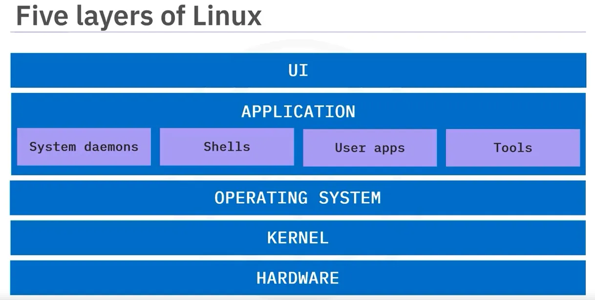

# Day 02 – Linux Architecture, Processes, and systemd
- Today’s goal is to understand how Linux works under the hood.

# Q-> The core components of Linux (kernel, user space, init/systemd)

# Core Components of Linux

Linux is organized in layers that work together to run the system efficiently. Understanding these layers is essential for DevOps, Cloud, and system administration. The three core components are **Kernel**, **User Space**, and **Init/systemd**.

---

## 1. Kernel

The **kernel** is the heart of the Linux operating system. It interacts directly with hardware and provides essential services to the rest of the system.

### Key Responsibilities:
- **Process Management**: Handles creation, scheduling, and termination of processes.
- **Memory Management**: Allocates RAM to processes and manages virtual memory.
- **Device Drivers**: Communicates with hardware devices like disks, network cards, and GPUs.
- **File System Management**: Reads/writes data to disks and supports multiple file systems (ext4, xfs, btrfs).
- **Networking**: Implements protocols like TCP/IP and manages sockets.
- **Security**: Enforces permissions and security policies, supports SELinux or AppArmor.

> **Importance for DevOps/Cloud:**  
> Kernel features like namespaces and cgroups enable containers and virtualization. Kernel tuning improves performance and reliability in cloud environments.

---

## 2. User Space

**User space** is the environment where users and applications run. It sits above the kernel and interacts with it through system calls.

### Key Components:
- **Applications**: Programs like Nginx, Docker, Jenkins, and Python scripts.
- **Shells / CLI**: Bash, Zsh, etc., provide an interface to the system.
- **Libraries**: Shared code like glibc for common functions.
- **Daemons / Services**: Background processes that provide functionality (cron, sshd).

> **Importance for DevOps/Cloud:**  
> All deployed applications, containers, and monitoring tools run in user space. Understanding it helps in troubleshooting, performance optimization, and service management.

---

## 3. Init / systemd

**Init/systemd** is the **first process started by the kernel** (PID 1). It manages the **boot process, system services, and the lifecycle of processes**.

### Responsibilities:
- **Boot Initialization**: Starts essential services and mounts filesystems.
- **Service Management**: Start, stop, restart, and monitor services via unit files.
- **Process Monitoring**: Automatically restarts failed services if configured.
- **Logging**: Centralized logs through `journald`.
- **Timers & Scheduling**: Runs scheduled tasks via systemd timers.

> **Importance for DevOps/Cloud:**  
> Systemd ensures services (like web servers, monitoring agents, or CI/CD tools) start reliably on boot, restart on failure, and log centrally. It’s essential for managing containers, cloud services, and production workloads.

---

## Q-> How processes are created and managed

- What is a Process?

 A process is:A running instance of a program.

 Program → file on disk (e.g., /bin/ls)

 Process → program loaded into memory and executing
 
 example -> ls (is a program ) when executed becomes a process 

- Each process has:

   - PID (Process ID)

   - Parent PID (PPID)

   - Memory space

   - CPU context

   - Open files

   - Environment variables

## Process Creation – Big Picture Flow

    systemd (PID 1)
   └── bash
        └── ls
        └── vim

    Every process is created by another process

- How a Process Is Created (Linux Internals)

Step 1: fork()

    Parent process creates a child process

      Child gets:

            Same code

            Same memory (Copy-on-Write)

            Same environment

            Only difference initially → PID

Step 2: exec()

   Child replaces its memory with new program

   Old program gone, new program starts

  example ->  exec("/bin/ls");
- fork + exec = new process running a new program

Step 3: wait()

    Parent waits for child to finish

    Prevents zombie processes

## Daemons & Services

   Daemon → background system process

     Examples:

         sshd

         crond

         systemd

Services managed using 
   systemctl start sshd
   systemctl stop sshd
   systemctl status sshd
        

## Q-> Linux Process States — Explained Clearly

A process state tells what a process is doing right now in the OS.
  
  we can see the status using these commands : 
        ps aux 
        top 
1) R – Running / Runnable

    Meaning

      Process is currently executing on CPU

      OR ready to run and waiting for CPU time

2) S – Sleeping (Interruptible Sleep)
    
    Meaning

        Process is waiting for an event

        Can be woken up by signals
- Why most processes are in S?

    Because they’re waiting, not wasting CPU.

3) D – Uninterruptible Sleep (I/O Wait)
    
    Meaning

        Waiting for I/O operation

        Cannot be killed

        Kernel won’t interrupt it

4) T – Stopped / Traced

    Meaning

        Process is paused

        Usually by:

        Ctrl + Z

        Debugger

        SIGSTOP

5) Z – Zombie (Defunct)

    Meaning

        Process finished execution

        Parent did not collect exit status

        Process remains in process table
        
    Important

        Uses no CPU

        Uses no memory

        Only PID entry remains
    example - ps aux | grep z

## Q-> What systemd Does and Why It Matters

- What is systemd? (Simple Definition)

    systemd is the init system and service manager in modern Linux.

   First userspace process started by kernel

        PID = 1

            Responsible for:

                Starting the system

                Managing services

                Handling crashes

                Logging

                Resource control
What Happens at Boot (High Level)
        BIOS/UEFI
            → Bootloader (GRUB)
            → Kernel
            → systemd (PID 1)
            → Services
            → Login prompt
If systemd fails → system does not boot

Why systemd REALLY Matters (Admin View)
        - Without systemd:

                    No controlled boot

                    No service dependency handling

                    No auto recovery

                    Hard debugging

                    Poor resource control

        - With systemd:

                    Stable systems

                    Faster recovery

                    Predictable behavior

                    Production-ready Linux

## Q-> List 5 Linux command that you would use daily 
1) systemctl -> for mnanaging the services as it is used to stop/start service ,check failure , enable at boot 
2) ps -> process visibility -> we must know what is running , used to identify HUNG processes and Check zombie/D-state processes
3) top -> Live system monitoring -> first command during performance issue , it shows CPU usages , Memory usages , Load average , Running processes
4) grep -> to search the particular pattern 
5) df – Disk usage -> : Disk full = services crash, df -h -> used to mmonitor filesystem usages , prevent outage

----------Done for the Day ------------------

