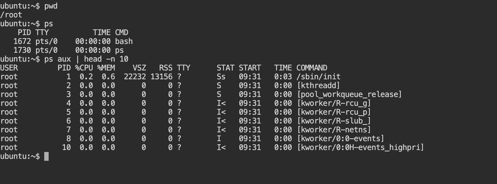
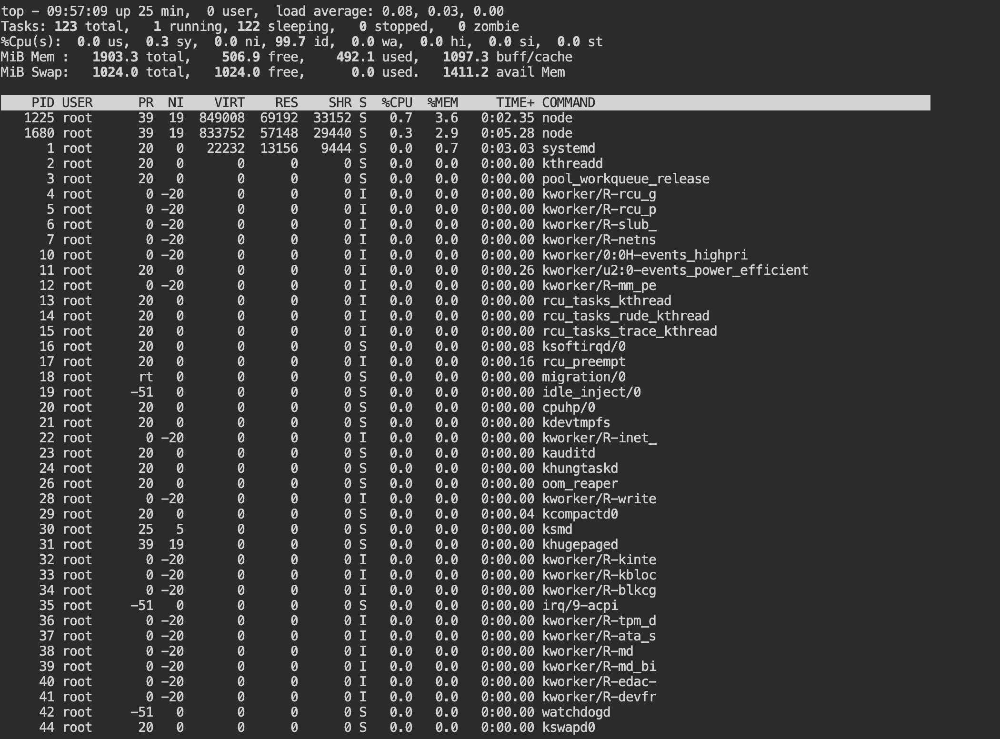
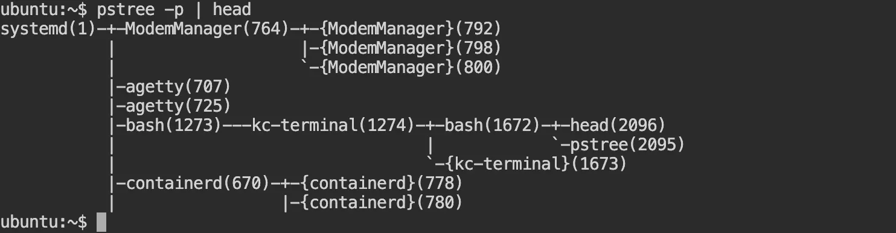
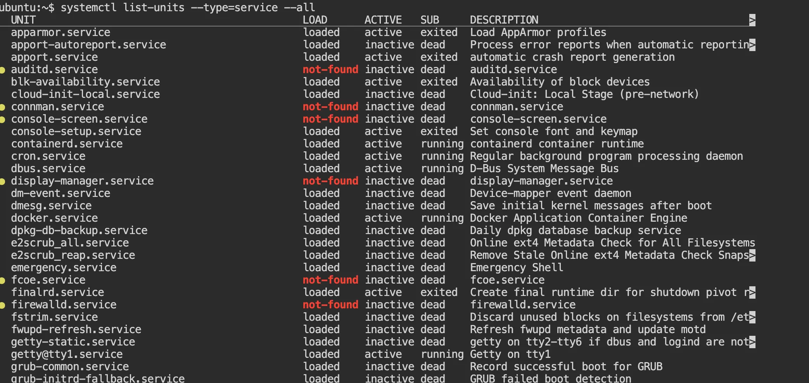
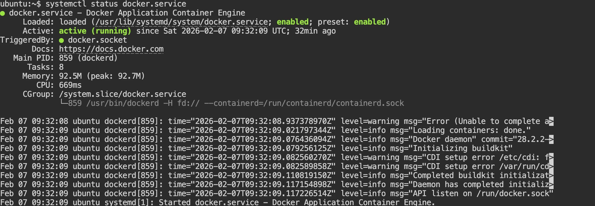
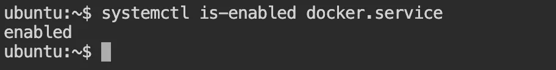
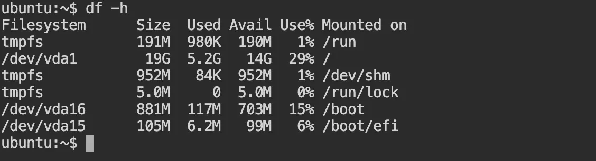
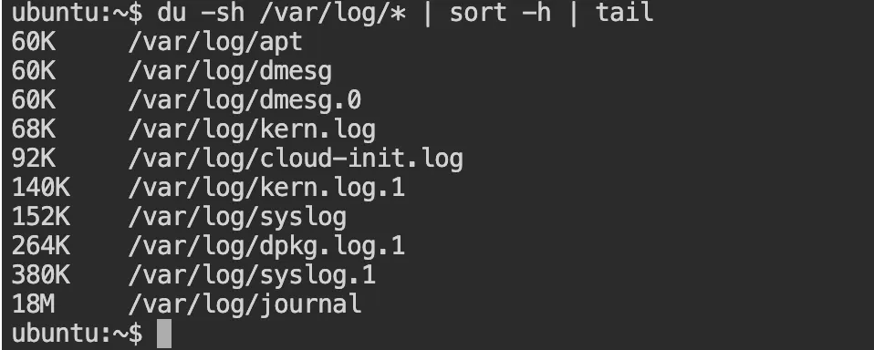
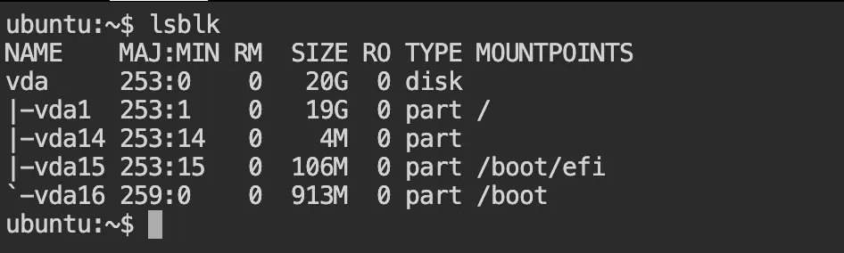
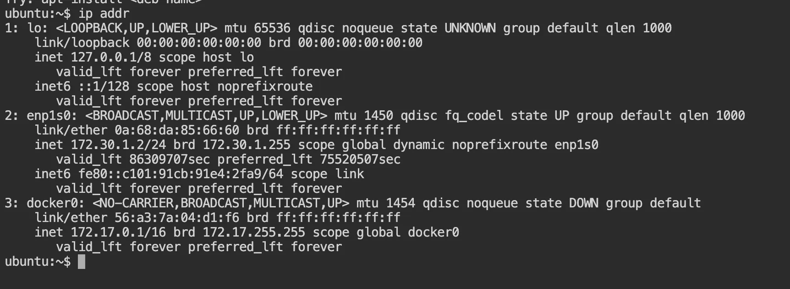

# Goal -> Practice Real linux admin workflow using core command 
# Focus: Processes, systemd services, logs, filesystem, networking
# Mindset: “What would I actually run on a production system?”

## Process checks (CPU, memory, state)

- ps aux | head -n 10 -> Quick snapshot of running processes

    

    Used to : 
        Identify heavy CPU/memory users
        Check process states (R, S, D, Z)

- top or htop -> Live System monitoring 
    
    

    Key things observed:

            Load average -> 0.08 

            %CPU usage -> 0.0 to 1.3%
 
            Memory usage -> 285M/1.8G

            Which process is consuming resources -> 

- pstree -p | head ->  Visualize process hierarchy 

    

    Helps us to understand parent child relationship 

## Service checks (systemd fundamentals)

- systemctl list-units --type=service --all -> This will list all the servocees running in that particular server 

    

- systemctl status docker.service -> It will tell you the status of the particular service that is active ot    inactive  
        
        

        confirms -> service health , PID , Startup behaviour 
- systemctl is-enabled docker.service -> Check if service starts at boot

## File system & disk checks
 
 - df -h -> check disk space usage
   
 
  Disk Full = service failure 

-  du -shx -> It shows how much disk space files/directories use.
    
    Flags:

            -s → summary

                 Don’t list every file inside, just the total per argument

            -h → human-readable

                Shows sizes like K, M, G instead of raw bytes

            -x → stay on one filesystem

                Don’t cross into other mounted filesystems (important on servers)

- du -sh /var/log/* | sort -h | tail ->  Shows the size of each directory or file inside /var/log /Find large log files

    

- lsblk -> View block devices and mount points -> Essential for storage and SAN/NFS debugging.
          

- mount | grep nfs -> Check NFS mounts (if any) 
    Important for detecting storage-related hangs (D state).

## Networking quick checks (fundamental)

- ip addr -> Check IP addresses and interfaces -> first step if network services fail.
     
- ping -c 3 8.8.8.8 -> Verify basic network connectivity-> checing if the ggole server is reachable or not 
  

