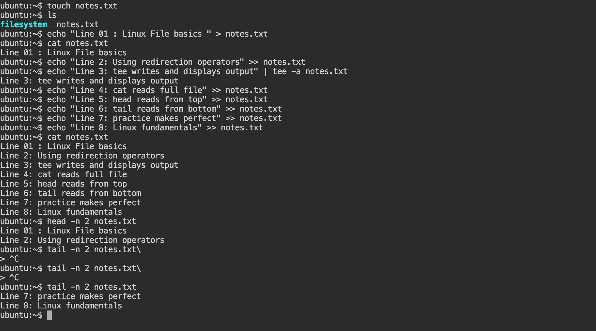

# Day 05 – Basic File Read/Write Practice

## Goal
Practice creating a file, writing data, appending data, and reading it back using **fundamental Linux commands only**.

---

## Step 1: Create the file

```bash
touch notes.txt
````

**Observation:**
An empty file named `notes.txt` is created.

---

## Step 2: Write first line (overwrite)

```bash
echo "Line 1: Linux file basics" > notes.txt
```

**Observation:**
This writes the first line to the file and overwrites existing content if any.

---

## Step 3: Append second line

```bash
echo "Line 2: Using redirection operators" >> notes.txt
```

**Observation:**
Second line is appended without deleting previous content.

---

## Step 4: Append third line using tee

```bash
echo "Line 3: tee writes and displays output" | tee -a notes.txt
```

**Observation:**
Text is displayed on the screen and appended to the file at the same time.

---

## Step 5: Append more lines (8 lines total)

```bash
echo "Line 4: cat reads full file" >> notes.txt
echo "Line 5: head reads from top" >> notes.txt
echo "Line 6: tail reads from bottom" >> notes.txt
echo "Line 7: practice makes perfect" >> notes.txt
echo "Line 8: Linux fundamentals" >> notes.txt
```

---

## Step 6: Read the full file

```bash
cat notes.txt
```

**Observation:**
Displays the complete contents of the file.

---

## Step 7: Read first 2 lines

```bash
head -n 2 notes.txt
```

**Observation:**
Useful for checking file headers or configuration beginnings.

---

## Step 8: Read last 2 lines

```bash
tail -n 2 notes.txt
```

**Observation:**
Commonly used to view recent log entries.

---



## Key Takeaways

* `>` overwrites a file
* `>>` appends to a file
* `tee` writes to file and displays output
* `cat`, `head`, and `tail` are essential file-reading commands

```

---


