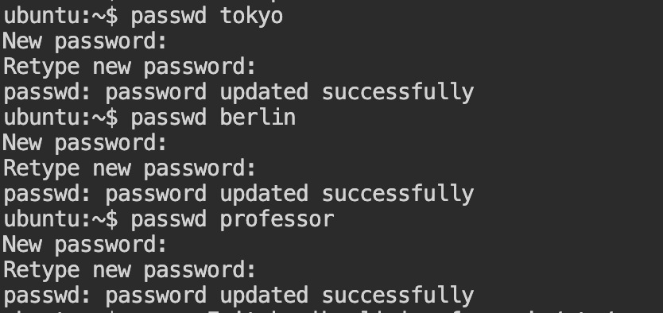
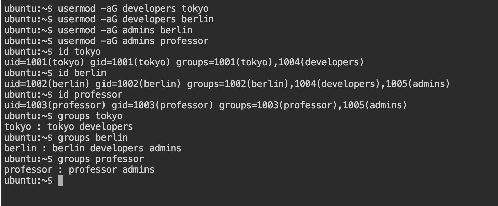
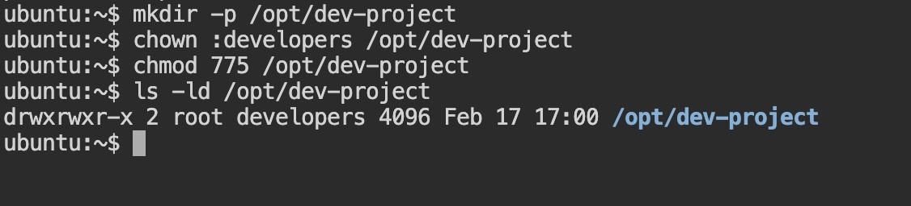
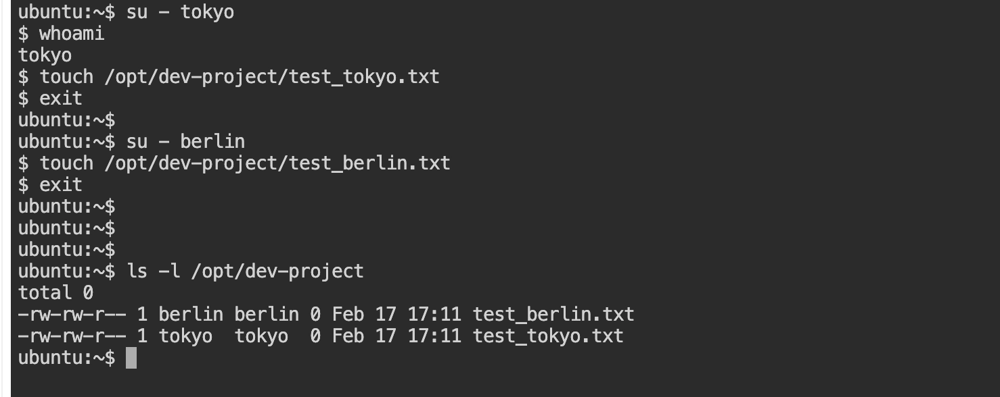
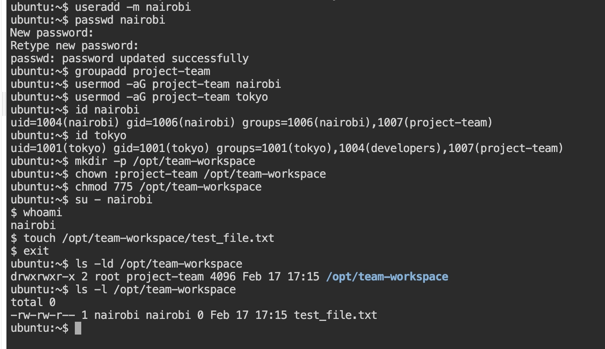

# What Is a User in Linux? 
In Linux, everything runs as a user.

UID -> User Identity number 

GID -> Group Identity number 

A user is:

        An identity

        With a UID (User ID)

        With permissions

        Associated with a home directory

        Assigned a login shell

        Linux does not trust names — it trusts UID numbers.
# Important User Files (VERY IMPORTANT)
```bash
1. /etc/passwd
```
- Stores basic user info.

Format:
```bash
 username:x:UID:GID:comment:home:shell
 example : 

 tokyo:x:1001:1001::/home/tokyo:/bin/bash
```
```bash
2. /etc/shadow
```
- Stores encrypted passwords. Only root can read.
- contains Password hash and Password expiry info

```bash 
3. /etc/group
```
- Stores group information.

Format:
```
groupname:x:GID:user1,user2
```


Q -> How does Linux manage users internally?

- Linux stores user metadata in **/etc/passwd**, passwords in **/etc/shadow**, and group membership in **/etc/group**. Permissions are enforced based on UID and GID. User creation updates these files and optionally creates a home directory and shell environment.

## TASK 01 -> Create User 
 i. Create users with home directories
 ```bash 
 useradd -m tokyo
 useradd -m berlin
 useradd -m professor
 ```
 
ii. Set passwords
```bash
passwd tokyo
passwd berlin
passwd professor
```


iii. Verify users exist
```bash 
grep -E 'tokyo|berlin|professor' /etc/passwd
```


## TASK 02 -> Create Groups

i. Create groups
```bash 
groupadd developers
groupadd admins
```
ii. Verify
```bash
grep -E 'developers|admins' /etc/group
```


## Task 3: Assign Users to Groups
i. Assign tokyo → developers
```bash 
usermod -aG developers tokyo
```
ii. Assign berlin → developers + admins
```bash 
usermod -aG developers berlin
usermod -aG admins berlin
```
iii. Assign professor → admins
```bash 
usermod -aG admins professor
```
iv. Verify group membership
```bash 
id tokyo
id berlin
id professor
OR 
groups tokyo
groups berlin
groups professor
```


## Task 4: Shared Directory

i. Create directory
```bash
mkdir -p /opt/dev-project
```
ii. Change group owner
```bash
chown :devlopers /opt/dev-project
```
iii. Set permissions 775
```bash
chmod 755 /opt/dev-project
```
iv. Verify
```bash
ls -ld /opt/dev-project
```


v. Test File Creation
- Switch to tokyo:
  ```bash 
    su - tokyo
    touch /opt/dev-project/test_tokyo.txt
    exit
   ```
- Switch to berlin:
  ```bash
    su - berlin
    touch /opt/dev-project/test_berlin.txt
    exit
  ```

- Verify files
  ```bash 
    ls -l /opt/dev-project
  ```
  

## Task 5: Team Workspace

i. Create user
 ```bash
  useradd -m nairobi
  passwd nairobi
 ``` 
ii. Create group
```bash 
groupadd project-team
```
iii. Add users to group
```bash
usermod -aG project-team nairobi
usermod -aG project-team tokyo
```
iv. Verify
```bash
id nairobi
id tokyo
```
v. Create directory
```bash
mkdir -p /opt/team-workspace
```
vi. Change group
```bash
chown :project-team /opt/team-workspace
```
vii. Set permissions 775
```bash
chmod 755 /opt/team-workspace
```
viii. Test as nairobi
```bash
su - nairobi
touch /opt/team-workspace/test_file.txt
exit
```
ix. Final verification
```bash 
ls -ld opt/team-workspace/
ls -l opt/team-workspace
```


# Pro Tip (Very Important)

- To ensure new files inherit the group automatically, use:
```bash 
chmod g+s /opt/dev-project
chmod g+s /opt/team-workspace
```
- This sets the setgid bit on the directory.