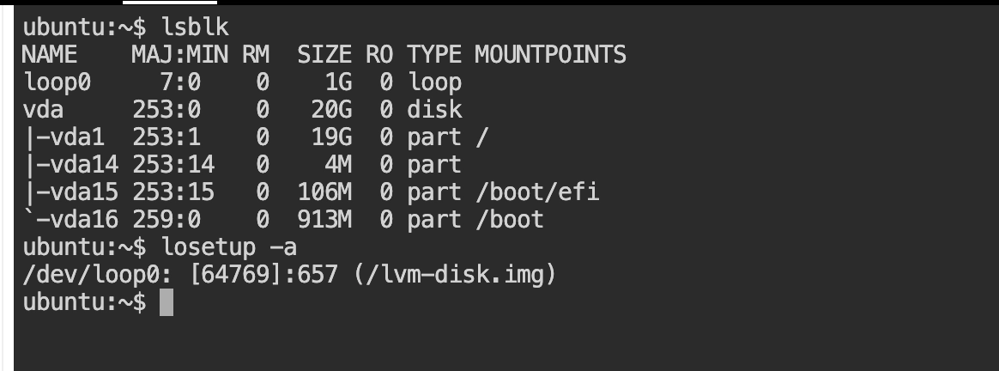
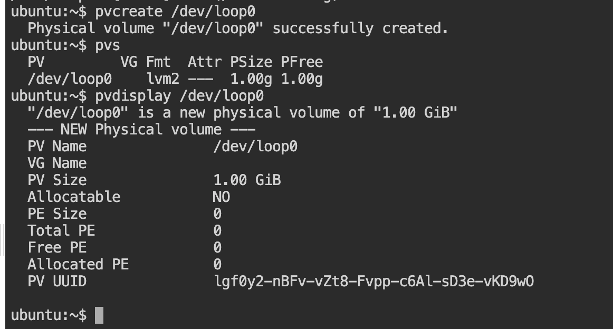
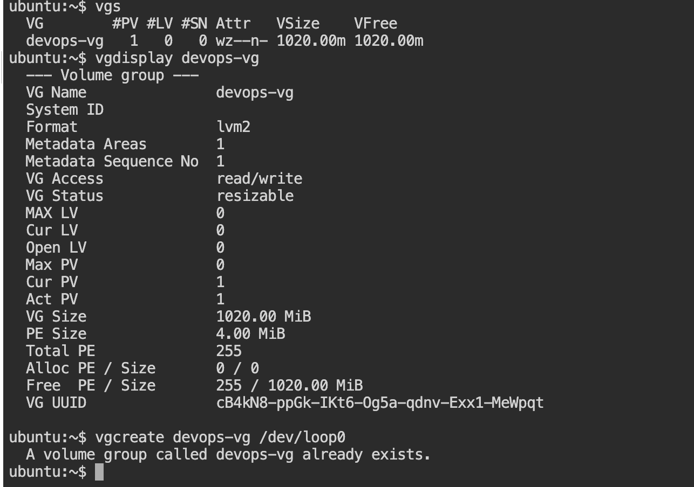
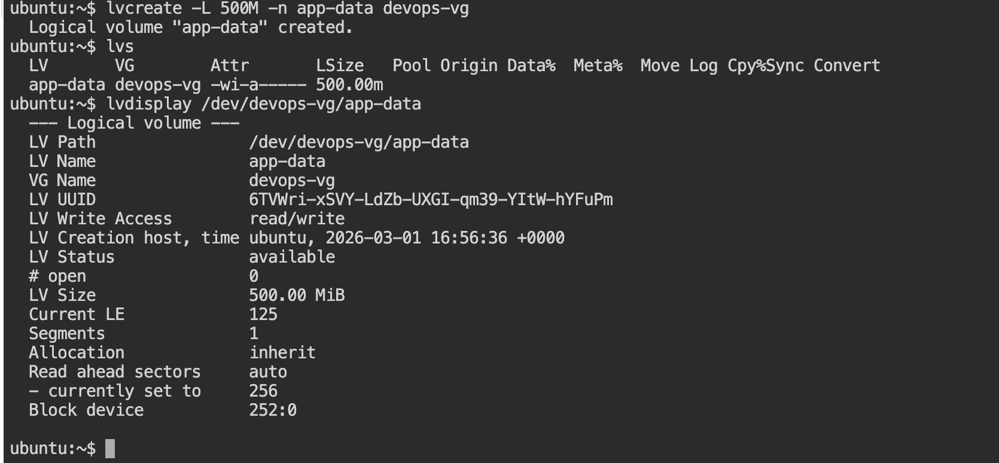
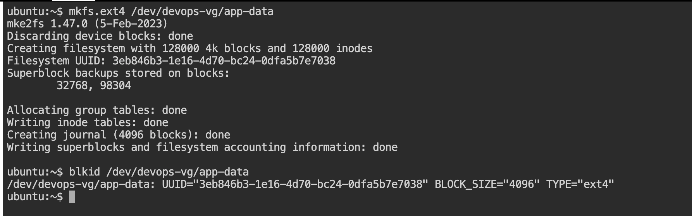
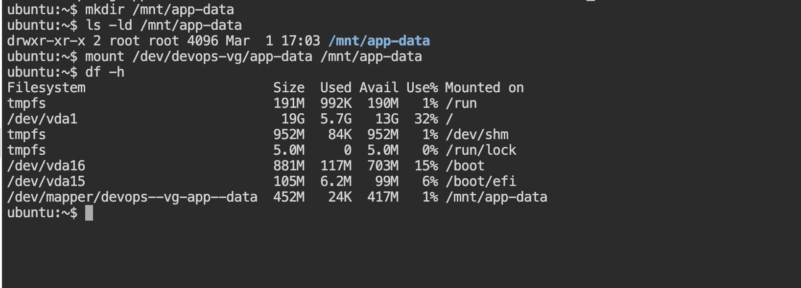
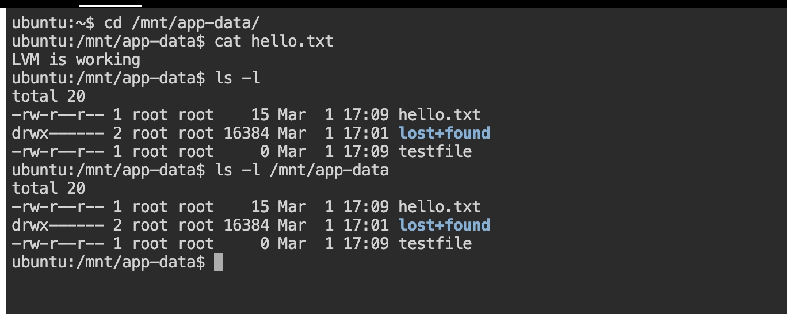
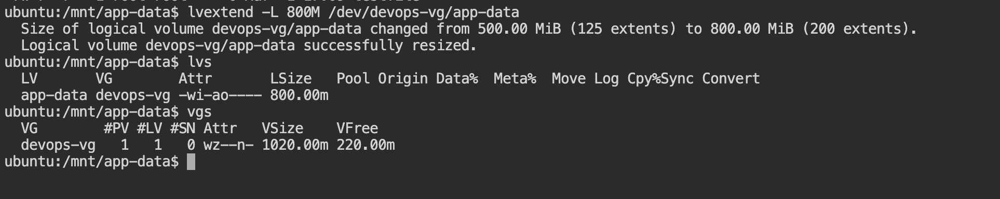
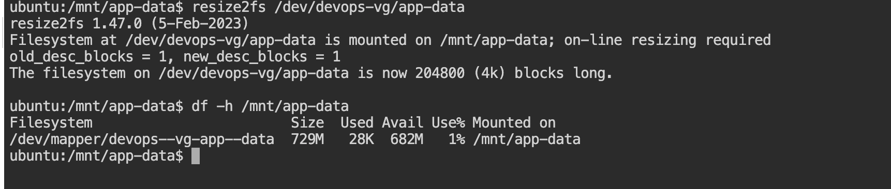

# Q-> What is Linux Colume Management 
- Linux Volume Management refers to how storage (hard drives, SSDs, partitions) is organized, allocated, and managed in a Linux system. It allows you to control disk space more flexibly than traditional fixed partitions.
- The most common system used in Linux for this is Logical Volume Manager (LVM).

## Basic Storage Without Volume Management
Traditionally:
 - A disk (e.g., /dev/sda)

 - Is divided into fixed partitions (/dev/sda1, /dev/sda2)
 - Each partition has a filesystem (ext4, xfs, etc.)
 - Sizes are set at creation and are hard to change later

Problem : 
  - If one partition fills up, you can’t easily resize it.

  - Adding new disks requires manual reconfiguration.

## With Linux Volume Management (LVM)
LVM adds a layer of abstraction between physical disks and filesystems.

Instead of:

- Disk → Partition → Filesystem

You get:

- Disk → Physical Volume → Volume Group → Logical Volume → Filesystem

Key LVM Components
1️⃣ Physical Volume (PV)

- A physical disk or partition prepared for LVM

- Example: **/dev/sdb**

2️⃣ Volume Group (VG)

- A pool of storage created from one or more PVs

 - Think of it as a big storage container

3️⃣ Logical Volume (LV)

- Virtual partitions created from the VG

- These are what you actually format and mount

- Can be resized easily

# Before WE Start

No spare disk? Create a virtual one: 
NOTE : If /tem has less space than what you required create eith /export path 
```bash 
dd if=/dev/zero of=/tmp/disk1.img bs=1M count=1024

losetup -fP /tmp/disk1.img

losetup -a   # Note the device name (e.g., /dev/loop0)
```
After this when you lsblk you should see the **/dev/loop0** as a virtually created device 



## TASK 1 -> Create Physical Volume (PV)
```bash 
pvcreate /dev/loop0 # this is for creating the physical volume 
```
Verify :
```bash 
pvs
pvdisplay /dev/loop0 # this will list the details info about the created PV
```
Example Output :


What Happened : 

- Created a Physical Volume on **/dev/loop0**

- Verified using pvs and pvdisplay

- Initially not part of any Volume Group

## Task 2 – Create Volume Group (VG)
```bash 
vgcreate devops-vg /dev/loop0
```
verify :
```bash 
vgs
vgdisplay devops-vg
```
Exmaple Output : 


What Happened

- Created VG named devops-vg

- Default PE size = 4MB

- Total usable size = 1020MB (after metadata reservation)

## Task 3 – Create Logical Volume (LV)
```bash 
lvcreate -L 500M -n app-data devops-vg
```
Verify : 
```bash 
lvs
lvdisplay /dev/devops-vg/app-data
```
Example Output : 


What Happened

- Created 500MB Logical Volume

- 125 extents allocated (125 × 4MB = 500MB)

- Verified LV is available and active

## Task 4 – Create Filesystem
```bash 
mkfs.ext4 /dev/devops-vg/app-data
```
verify :
```bash 
blkid /dev/devops-vg/app-data
```
Example output : 


What Happened

- Formatted LV with ext4

- Block size automatically selected as 1K (because filesystem is small)

- Filesystem successfully created

## Task 5 – Mount Logical Volume
```bash 
mkdir /mnt/app-data # this will create the  mount directory first 
mount /dev/devops-vg/app-data /mnt/app-data. # it mount the lv to the mount point 
```
verify : 
```bash 
df -h #it will list the mount directory 
```
Example output:
 

What Happened

- Mounted LV to /mnt/app-data

- Usable size shows ~474MB (metadata + reserved blocks used)


## Task 6 – Test File Creation
```bash 
echo "LVM is working" > /mnt/app-data/hello.txt
touch /mnt/app-data/testfile
```
verify : 
```bash 
ls -l /mnt/app-data
```
Example output: 

What Happened

- Verified write operations

- Filesystem functioning correctly

## Task 7 – Extend Logical Volume (Online)
```bash 
lvextend -L 800M /dev/devops-vg/app-data
```
verify : 
```bash 
lvs
vgs
```
Example Output: 

What Happened

- Extended LV from 500MB → 800MB

- Performed while filesystem was mounted (no downtime)

- VG free space reduced accordingly

## Task 8 – Resize Filesystem Online

```bash 
resize2fs /dev/devops-vg/app-data
```
verify : 
```bash 
df -h /mnt/app-data
```
Example output : 


What Happened

- Resized ext4 filesystem online

- Filesystem grew to match 800MB LV

- No unmount required

Final Architecture

```bash 
File (1GB)
   ↓
/dev/loop0
   ↓
Physical Volume
   ↓
Volume Group (devops-vg)
   ↓
Logical Volume (app-data - 800MB)
   ↓
ext4 Filesystem
   ↓
Mounted at /mnt/app-data

```