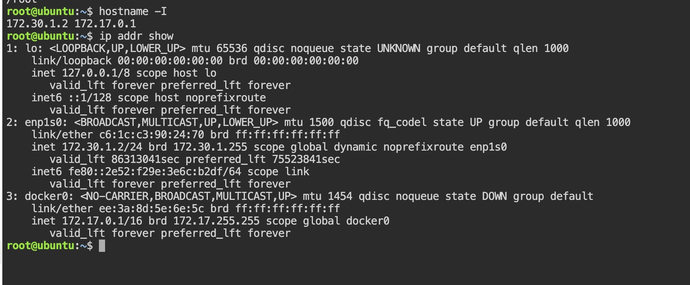
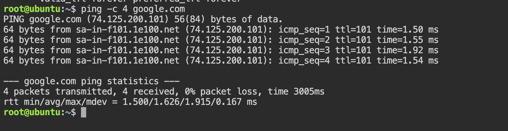
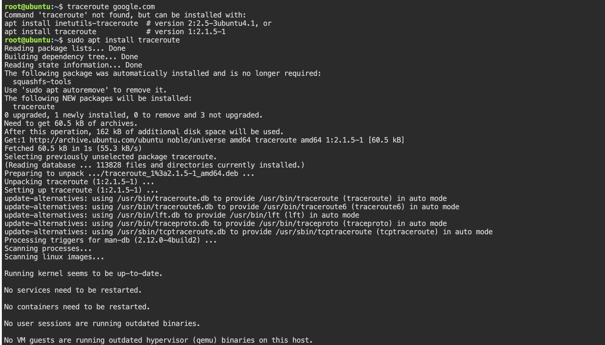
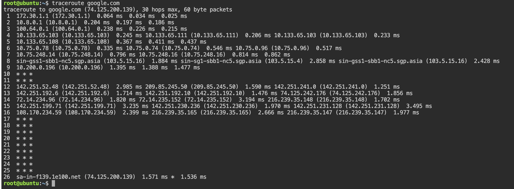
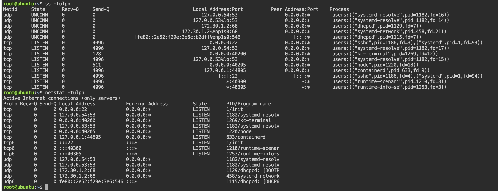
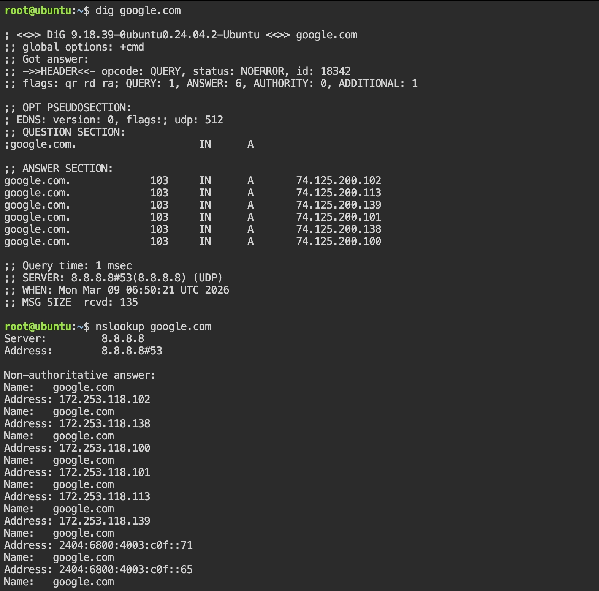
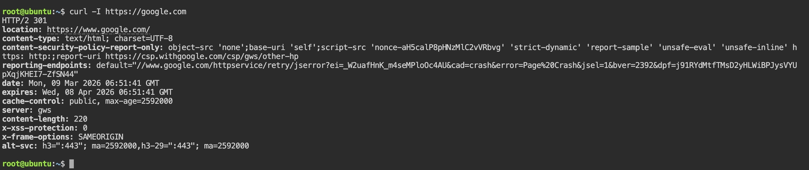
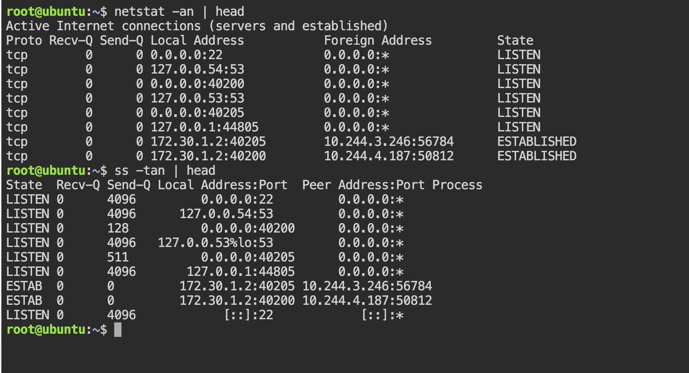

# Q - > What is OSI Model ? 
-The OSI model (Open Systems Interconnection Model) is a 7-layer conceptual framework that explains how data moves from one computer to another over a network.

It was developed by the International Organization for Standardization (ISO). 

#### Seven Layers of OSI (Top to Bottom)

7. Application – User-facing network services (HTTP, FTP, SMTP) , Devices -> Gateway, Proxy server , Application firewall

6. Presentation – Data formatting, encryption, compression

5. Session – Session management between devices

4. Transport – (TCP and UDP )Reliable data transfer (ports, segmentation), Devices -> Firewall and load Balancers 

3. Network – Routing (IP addressing), Devices -> Router and Layer 3 Switch 

2. Data Link – MAC addressing, switching, Devices-> Switch , Bridge and NIC (Network Interface Card )

1. Physical – Cables, signals, hardware transmission,  Devices-> Hub , Repeater ,cables (fiber and ethernet )

# What is the TCP/IP Model?

- The TCP/IP model is a 4-layer practical networking model used on the internet.

- It was developed by the United States Department of Defense.

📚 4 Layers of TCP/IP

1. Application Layer – Combines OSI’s Application, Presentation, and Session

2. Transport Layer – TCP, UDP

3. Internet Layer – IP addressing and routing

4. Network Access Layer – Physical + Data Link functions

Visual Summary: 

```bash 
OSI Model (7 Layers)        TCP/IP Model (4 Layers)

Application  ┐
Presentation ├──► Application
Session      ┘

Transport  ───────────────► Transport

Network    ───────────────► Internet

Data Link  ┐
Physical   ┘──────────────► Network Access
```

## Real Example

Command 
```bash 
curl https://example.com
```
What Actually Happens:

1. DNS (Application layer) resolves example.com → IP

2. TCP (Transport layer) establishes connection (3-way handshake)

3. IP (Internet layer) routes packets

4. HTTPS (Application layer over TCP) sends encrypted HTTP request

5. Data travels over Ethernet/Wi-Fi (Link layer)


## Hands-on Checklist (run these; add 1–2 line observations)
1. 
```bash 
hostname -I  # It will list all the IP address assignes to that particular host 
ip addr show # Detailed status of all network interfaces
```


Key Observation : 

- 172.30.1.2 172.17.0.1 -> Hostname -I is showing that host has two IPv4 assigned 

- Primary system IP: 

    - 172.30.1.2/24 on interface enp1s0

    - This is your main network interface connected to the network.

    - IP range 172.16.0.0 – 172.31.255.255 is a private RFC1918 range, meaning your system is behind NAT.

- Docker network

  - 172.17.0.1 on interface docker0

  - This is the Docker bridge network created when Docker is installed.

  - Containers typically get IPs like 172.17.0.x.

 - Loopback interface

    - 127.0.0.1 on lo

    - Used for local communication within the machine.

- IPv6

  - Your system also has IPv6 enabled

  - Example: fe80::2e52:f29e:3e6c:b2df

  - This is a link-local IPv6 address.

  Summary : 
  - My system has the primary IP 172.30.1.2 on interface enp1s0, which is a private IP behind NAT. Docker created another network interface (docker0) with IP 172.17.0.1 used for container networking.

 2. 
 
 ```bash 
 ping -c 4 www.google.com 
```


Key Observation : 
 - First DNS resolution Happened -> Before pinging, your system resolved google.com → 74.125.200.101.
- This means : 
  - DNS is working correctly.
  - My system contacted a DNS server to resolve the domain.
Example from output:
    ```bash 
     PING google.com (74.125.200.101)
    ```

 - Network Reachability:
       
         4 packets transmitted, 4 received, 0% packet loss

    Meaning : 
     - Our machine successfully reached Google servers
     - No packets were dropped
     - Network connection is stable.

  - Latency (Response Time)
        
        min/avg/max = 1.500 / 1.626 / 1.915 ms
    This is very low latency, which suggests:
      
      - we are hitting a nearby Google edge server/CDN
      - Likely located in India region
  
  - TTL Value
         
         ttl=101
    
    TTL decreases every router hop.

    Typical starting TTL values:
      - Linux servers: 64

      - Windows: 128

     - Since the reply TTL is 101, it likely started near 128, meaning roughly ~27 hops maximum possible, but actual hops will be seen in traceroute.

Summary : 
- The ping test to google.com resolved the IP 74.125.200.101 and returned 0% packet loss. The average latency was 1.62 ms, indicating a fast and stable connection to a nearby Google edge server.

3. 
Now we will see how packets travel through routers to reach Google.
```bash 
traceroute google.com
```
if command  not found 
```bash 
sudo apt install traceroute
```


 

 Key Observation : 
 
  - i. First Hop — our Local Gateway
            
            1  172.30.1.1


     This is our local router / default gateway.
    
    Flow so far:
    
        Your machine (172.30.1.2)
            ↓
        Gateway (172.30.1.1)
    
- ii. Internal Network / Private Routing
     Next hops:

            2  10.8.0.1.      (Private network)
            3  100.64.0.1.     (Carrier-grade NAT (CGNAT))
            4–7  10.x.x.x networks


   These are private networks used inside:

    - ISP networks

    - cloud infrastructure

    - NAT environments

So traffic is moving through internal routing infrastructure before reaching the public internet.

- iii. First Public Internet Hop

      8 sin-gss1-sbb1-nc5.sgp.asia (103.5.15.16)

   This is the first public router visible.
   Key point:

     - sin usually means Singapore network node

    - sgp.asia indicates Asia backbone routing

   My traffic is entering a regional internet backbone.

- iV. Google Network Entry
   
   Around hops 12–16:

        142.251.x.x
        209.85.x.x
        72.14.x.x
        108.170.x.x
        216.239.x.x

   These IP ranges belong to Google infrastructure.

- v. Timeouts (* * *)
Example : 
    
        10 * * *
        11 * * *
        17 * * *
   This happens because:

    - Some routers block ICMP responses

    - Security policies prevent traceroute replies

     This is normal behavior.

-vi.  Final Destination: 

        26 sa-in-f139.1e100.net (74.125.200.139)

This is a Google server.

Interesting detail:
     
     1e100.net


This is Google’s domain for infrastructure servers.
Summary : 

- The traceroute to google.com passed through multiple private network hops before reaching the public internet backbone. Around hop 8 the traffic entered a regional internet router in Asia. Later hops showed Google-owned IP ranges (142.x.x.x, 216.x.x.x), indicating entry into Google's internal network before reaching the final server.

Simplified Packet Journey: 
```bash 
Your VM
  ↓
Local Gateway (172.30.1.1)
  ↓
Internal Network (10.x.x.x)
  ↓
ISP / CGNAT (100.64.x.x)
  ↓
Asia Backbone Router (Singapore)
  ↓
Google Edge Router
  ↓
Google Internal Network
  ↓
Google Server
```

4. Open Ports / Listening Services

Now we check what services are running on our machine.

These commands show which services are listening for network connections

Run : 
```bash
ss -tulpn
```
If not available:
```bash 
netstat -tulpn
```
Output : 


From Output : 

i. SSH Service (For Remote access)

```bash 
tcp LISTEN 0.0.0.0:22 users:(("sshd",pid=1186))
```
Meaning : 
- Port: 22
- Protocol: TCP
- Service: SSH (sshd)
- Purpose: Remote login to the system

Important detail:
        
        0.0.0.0:22
This means SSH is accessible from any network interface.

Observation:

The system allows remote SSH connections on port 22.

ii. DNS Resolver Service

Example :
```bash 
127.0.0.53:53
127.0.0.54:53
```
Service:
```bash 
systemd-resolve
```
Meaning:

- Port: 53

- Protocol: TCP/UDP

- Purpose: DNS resolution

The system uses systemd-resolved for local DNS caching and name resolution.

iii. Docker / Container Runtime
Example : 
```bash 
127.0.0.1:44805 containerd
```
Meaning:
- Docker container runtime communication
- Local-only service

Observation:

Container runtime (containerd) exposes a local port for container management.

Summary : 
- The system has several listening services including SSH on port 22, DNS resolver on port 53, and a Node.js application on port 40205. SSH is accessible from all interfaces, while DNS and container services run locally.

Networking Layer Mapping (Important Concept)
Example stack for SSH:
```bash 
Application Layer → SSH
Transport Layer → TCP
Internet Layer → IP (Network layer)
Link Layer → Ethernet. (physical layer )
```

5. DNS Resolution

Command used : 
```bash 
dig google.com
```
and 

```bash 
nslookup google.com
```


Form Output : 
i. DNS server Used 
   
     SERVER: 8.8.8.8#53

This means your system is using    
- 8.8.8.8 → Google Public DNS Server
- Port: 53
- Protocol: UDP

Observation : 

The system sends DNS queries to Google's public DNS server (8.8.8.8).

ii. Multiple IP Addresses Returned

Form **dig** :
```bash 
74.125.200.102
74.125.200.113
74.125.200.139
74.125.200.101
74.125.200.138
74.125.200.100
````

This happens because google.com is load balanced.

Google returns multiple IP addresses for load balancing and high availability.
Meaning:
```bash 
Client request
      ↓
DNS returns multiple servers
      ↓
Client connects to nearest/fastest server
```

iii. IPv6 Addresses (from nslookup)
Example : 

```bash 
2404:6800:4003:c0f::71
```
These are IPv6 addresses for Google servers.

Meaning Google supports dual stack networking:
```bash 
IPv4 + IPv6
```
Summary : 
- The DNS query for google.com was resolved by Google's DNS server (8.8.8.8). Multiple IPv4 and IPv6 addresses were returned, indicating load balancing across several Google servers. The query time was 1 ms, showing a fast DNS response.


6. HTTP Check

Now we test web communication using curl.

Run: 
```bash 
curl -I https://google.com
```
-I = fetch only HTTP headers.
This sends a HTTP request and returns only headers.

Output: 



From Output : 

i. HTTP Status Code
 
        HTTP/2 301

Meaning:

- 301 = Permanent Redirect

The server is redirecting:
```bash 
https://google.com
      ↓
https://www.google.com
```
Header showing this:
```bash 
location: https://www.google.com/
```
Observation:

- Google redirects the root domain to www.google.com
 using HTTP 301.
 
 ii. Protocol Used

        HTTP/2

This means:

- The connection used HTTP/2

- HTTP/2 improves performance with:

   - multiplexing

    - header compression

    - faster loading

iii. Server Identification

From header:
        
        server: gws

This means the request was handled by Google Web Server.

Server belongs to Google infrastructure.

summary : 

-  The curl request to https://google.com
 returned HTTP/2 301, indicating a permanent redirect to https://www.google.com
. The response included several security headers and showed that the server supports modern protocols like HTTP/2 and HTTP/3.


7. Connection Snapshot

Here we check active network connections 

RUN : 
```bash 
netstat -an | head
```

OR 

```bash
ss -tan | head
```
Example :




These commands show current TCP connections and listening ports.

i. Listening Services (Waiting for Connections)
Examples from our output:

        0.0.0.0:22        LISTEN
        0.0.0.0:40200     LISTEN
        0.0.0.0:40205     LISTEN
        127.0.0.53:53     LISTEN
        127.0.0.1:44805   LISTEN


Meaning:

        Port	Service	  Purpose
        22	     SSH	  Remote login
        53	     DNS	  Local DNS resolver

Observation:
 
 Several services are listening on the system including SSH, DNS resolver, and application services.


 ii. Established Connections

Example:

```bash 
172.30.1.2:40205 → 10.244.3.246:56784  ESTABLISHED
172.30.1.2:40200 → 10.244.4.187:50812  ESTABLISHED

```
Meaning:

 - Your machine has active TCP sessions

 - They are communicating with internal cluster/container network IPs


 Observation:

- Two active TCP connections are established between the host and internal cluster network nodes.

Summary : 
- The system shows multiple listening services including SSH and DNS. Two TCP connections were in the ESTABLISHED state, communicating with internal cluster network addresses (10.244.x.x), indicating active application communication.


## Reflection (Till Now )
Q1. Which command gives you the fastest signal when something is broken?
- The fastest command is ping because it quickly checks basic network reachability using ICMP packets. If ping fails, it immediately indicates a connectivity issue such as network outage, routing problem, or firewall blocking ICMP.

Example : 
```bash 
ping -c 4 google.com
```
Observation: If packets are lost or there is no response, the network path or connectivity may be broken.

Q2. What layer would you inspect next If DNS Fails?
  
  IF DNS FAils : 
- I would inspect the Application Layer (OSI Layer 7) or Application layer in the TCP/IP model, because DNS is an application-level protocol that resolves domain names to IP addresses.

Checks Might includes : 
```bash 
dig google.com
cat /etc/resolv.conf
```

IF HTTP 500 appears : 
- A 500 error means the request reached the server but the server failed internally. I would inspect the Application Layer (OSI Layer 7) because the issue is likely in the web server or application logic.

Checks might include:

- Web server logs (Nginx/Apache)

- Application logs

- Backend service status

Q3. List Two Follow up Checks you will do in a real incident 

i. Service Status Check: 
```bash 
systemctl status ssh
```
OR 

```bash 
systemctl status nginx
```

ii. Port Listening Check

Verify that the service is listening on the expected port.
```bash 
ss -tulpn
```
This confirms whether the application is actively accepting network connections.


