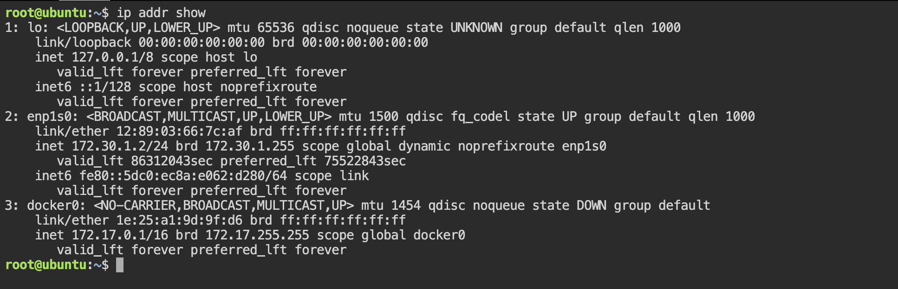

# Task 1: DNS – How Names Become IPs

## Q -> What happens when you enter “google.com”?


Pre - Requisites 

Q -> What is a WebPage ?

- Before getting started, I want to first explain what a webpage is. A webpage is basically a text file formatted a certain way so that your browser (ie. Chrome, Firefox, Safari, etc) can understand it; this format is called HyperText Markup Language (HTML). These files are located in computers that provide the service of storing said files and waiting for someone to need them to deliver them. They are called servers because they serve the content that they hold to whoever needs it.

 ###  Servers
 - servers can vary in classes, the most common and the one that we'll be talking about in the main portion of this article is a web server, the one that serves web pages. We can also find application servers, which are the ones that hold an application base code that will then be used to interact with a web browser or other applications. Database servers are also out there, which are the ones that hold a database that can be updated and consulted when needed.

 ### IP Addresses
- These servers in order to deliver their content, much like in physical courier services, need to have an address so that the person needing to be said content can make a "letter" requesting the delivery; the person requesting the content in turn also has an address where the server can deliver the content to. These addresses are called IP (Internet Protocol) Addresses, a set of 4 numbers that range from 0 to 255 (one byte) separated by periods (ie. 127.0.0.1).

## Protocols for Delivery

Another concept that is important to know is that the courier service traffic for the delivery can be one of two: Transmission Control Protocol (TCP) and User Datagram Protocol (UDP). Each one determines the way the content of a server is served or delivered.

   - TCP
   
     - TCP is usually used to deliver static websites such as Wikipedia or Google and also email services and to download files to your computer because TCP makes sure that all the content that is needed gets delivered. It accomplishes this by sending the file in small packets of data and along with each packet a confirmation to know that the packet was delivered; that's why if you are ever downloading something and your internet connection suddenly drops when it comes back up you don't have to start over because the server would know exactly how many packets you have and how many you still need to receive. The downside to TCP is that because it has to confirm whether you got the packet or not before sending the next, it tends to be slower.
- UDP
   
   - UDP, on the other hand, is usually used to serve live videos or online games. This is because UDP is a lot faster than TCP since UDP does not check if the information was received or not; it is not important. The only thing UDP cares about is sending the information. That is the reason why if you've ever watched a live video and if either your internet connection or the host's drops, you would just stop seeing the content; and when the connection comes back up you will only see the current stream of the broadcast and what was missed is forever lost. This is also true for online videogames (if you've played them you know exactly what this means)


## What Actually happens

So back to the main question of what happens when you type www.google.com or any other URL (Uniform Resource Locator) in your web browser and press Enter. 

- So the first thing that happens is that your browser looks up in its cache to see if that website was visited before and the IP address is known. 
- If it can't find the IP address for the URL requested then it asks your operating system to locate the website. The first place your operating system is going to check for the address of the URL you specified is in the host file. If the URL is not found inside this file, then the OS will make a DNS request to find the IP Address of the web page.
- The first step is to ask the Resolver (or Internet Service Provider) server to look up its cache to see if it knows the IP Address, if the Resolver does not know then it asks the root server to ask the .COM TLD (Top Level Domain) server - if your URL ends in .net then the TLD server would be .NET and so on - the TLD server will again check in its cache to see if the requested IP Address is there. 
- If not, then it will have at least one of the authoritative name servers associated with that URL, and after going to the Name Server, it will return the IP Address associated with your URL. All this was done in a matter of milliseconds WOW!
After the OS has the IP Address and gives it to the browser, it then makes a GET (a type of HTTP Method) to said IP Address. When the request is made the browser again makes the request to the OS which then, in turn, packs the request in the TCP traffic protocol we discussed earlier, and it is sent to the IP Address. 

- On its way, it is checked by both the OS' and the server's firewall to make sure that there are no security violations. And upon receiving the request the server (usually a load balancer that directs traffic to all available servers for that website) sends a response with the IP Address of the chosen server along with the SSL (Secure Sockets Layer) certificate to initiate a secure session (HTTPS). 

- Finally, the chosen server then sends the HTML, CSS, and Javascript files (If any) back to the OS who in turn gives it to the browser to interpret it. And then you get your website as you know it.


## Q->  What are these record types? Write one line each:
DNS Record Types : 

- A -> Maps a Domain name to an IPv4 Address(ex: google.com -> 8.8.8.8)
- AAAA -> Maps a Domain name to an IPv6 Address
- CNAME record -> Points one domain to another domain name (alias) instead of an IP
- MX record -> Specifies the mail server responsible for receiving emails for a domain
- NS record ->  Defines the authoritative name servers for a domain


### Q-> Run: dig google.com — identify the A record and TTL from the output

Output : 
```bash 

; <<>> DiG 9.11.36-RedHat-9.11.36-16.el8_10.4 <<>> google.com
;; global options: +cmd
;; Got answer:
;; ->>HEADER<<- opcode: QUERY, status: NOERROR, id: 32727
;; flags: qr rd ra; QUERY: 1, ANSWER: 6, AUTHORITY: 4, ADDITIONAL: 9

;; OPT PSEUDOSECTION:
; EDNS: version: 0, flags:; udp: 4096
;; QUESTION SECTION:
;google.com.			IN	A

;; ANSWER SECTION:
google.com.		221	IN	A	64.233.170.102
google.com.		221	IN	A	64.233.170.139
google.com.		221	IN	A	64.233.170.100
google.com.		221	IN	A	64.233.170.113
google.com.		221	IN	A	64.233.170.138
google.com.		221	IN	A	64.233.170.101

;; AUTHORITY SECTION:
google.com.		105106	IN	NS	ns1.google.com.
google.com.		105106	IN	NS	ns4.google.com.
google.com.		105106	IN	NS	ns3.google.com.
google.com.		105106	IN	NS	ns2.google.com.

;; ADDITIONAL SECTION:
ns1.google.com.		80852	IN	AAAA	2001:4860:4802:32::a
ns2.google.com.		77643	IN	AAAA	2001:4860:4802:34::a
ns3.google.com.		758	IN	AAAA	2001:4860:4802:36::a
ns4.google.com.		131256	IN	AAAA	2001:4860:4802:38::a
ns1.google.com.		221030	IN	A	216.239.32.10
ns2.google.com.		77643	IN	A	216.239.34.10
ns3.google.com.		758	IN	A	216.239.36.10
ns4.google.com.		131256	IN	A	216.239.38.10

;; Query time: 0 msec
;; SERVER: ::1#53(::1)
;; WHEN: Thu Mar 19 14:29:31 UTC 2026
;; MSG SIZE  rcvd: 635

```
Observations : 

i) A Record (IPv4 mapping)
From output :
```bash 
google.com. 221 IN A 64.233.170.102
```
Meaning:

 - A record maps domain → IPv4 address
 - we got multiple A records
 - This is load balancing by Google

ii) AAAA Record (IPv6 mapping)
From output :
```bash 
ns1.google.com. IN AAAA 2001:4860:4802:32::a
```
Meaning:

 - AAAA record maps domain → IPv6 address
 - Google supports IPv6
 - These are for name servers


iii) NS Record (Name Servers)
From output : 
```bash 
google.com. IN NS ns1.google.com.
```
Meaning:

- NS record tells which servers are authoritative for the domain
- google has multiple NS servers
- Helps with redundancy & high availability

Summary : 
- The dig output shows multiple A records for google.com, indicating load balancing. NS records define authoritative name servers, and AAAA records provide IPv6 addresses for those servers. CNAME and MX records are not shown because the query was specifically for A records.


# Task 2: IP Addressing
Q-> What is an IPv4 address? How is it structured? (e.g., 192.168.1.10)
- An IPv4 address is a unique identifier assigned to a device on a network, used to identify and communicate with it over IP networks (like the internet).

Structure of an IPv4 Address

Example:
```bash 
192.168.1.10

[192].[168].[1].[10]
```
Format

 - Written in dotted decimal notation

- Consists of 4 octets (numbers)

- Each octet ranges from 0 to 255

Binary Representation:
 - Each octet = 8 bits
 
 So total:
```bash 
32 bits (8 × 4)

example:

192 → 11000000
168 → 10101000
1   → 00000001
10  → 00001010

```

Network vs Host Part: 

 - An IPv4 address is divided into:
 ```bash 
 [ Network Portion ] [ Host Portion ]
 
 Example with subnet 
 192.168.1.10/24

 ```

/24 → first 24 bits = network

Remaining 8 bits = host
 
 Meaning:

- Network: 192.168.1

 - Host: 10


Summary : 
- An IPv4 address is a 32-bit numerical label written in dotted decimal format, divided into four octets, used to identify devices on a network and split into network and host portions.


Q2 -> Difference between public and private IPs — give one example of each

Public IP Address: 
   - A public IP is globally unique and accessible over the internet

   - Assigned by ISP and used for communication between networks worldwide

   - Can be reached from anywhere on the internet 

Example:
```bash 
8.8.8.8 (Google DNS server )
```

Private IP Address: 
- A private IP is used by a local  network (LAN)
- Not directly accessible from the internet
- Used for internal communication (home, office, cloud VPC)
Common ranges:
```bash 
10.0.0.0 – 10.255.255.255
172.16.0.0 – 172.31.255.255
192.168.0.0 – 192.168.255.255
```

summery : 
- Public IP is internet-facing and globally reachable, while private IP is internal and used within a local network only.

Q3-> What are the private IP ranges?

10.x.x.x, 172.16.x.x – 172.31.x.x, 192.168.x.x

These IP ranges are reserved for internal (private) networks:
```bash
10.0.0.0 – 10.255.255.255 → (10/8 range)

172.16.0.0 – 172.31.255.255 → (172.16/12 range)

192.168.0.0 – 192.168.255.255 → (192.168/16 range)

```
- Private IP ranges are 10/8, 172.16/12, and 192.168/16, used for internal networks and not routable on the public internet.

### Quick Trick to Identify Private vs Public IP: 

 Step01 -> Look at the FIRST numbers
 - if it start  with **10.** It is Private Ip 
 - If it starts with **192.168.** It is private IP 
 - If it starts with **172.16 - 172.31.** It is private IP 
 - Anything else usually public 
 
 Super Fast Mental Rule

 ```bash 
 10 → always private  
192.168 → always private  
172 → check (16–31 only private)
```
Summary : 
- Check the first octet: 10.x.x.x and 192.168.x.x are always private, and 172.x.x.x is private only if it falls between 172.16 and 172.31.


Q4 ->RUN :  ip addr show — identify which of your IPs are private

Output : 



Command: 
```bash 
ip addr show
```
ANALYSIS : 

i. Loopback Interface (lo)    
  ```bash 
            127.0.0.1
   ```
- Type : loopback 
- Used for: communication within the same machine
- Not public, not private (special reserved)

ii. Main Network Interface (enp1s0)
```bash 
172.30.1.2/24
```
- Type: Private IP
- Why? Falls in range: 172.16.0.0 – 172.31.255.255
- So this is your primary private IP
- This is what your system uses to communicate inside your network.

iii. Docker Interface (docker0)
```bash 
172.17.0.1/16
```
- Type: Private IP
- Why? Falls in the range -> 172.16 – 172.31 range


- Used by Docker containers

- Acts as a bridge network

iv. IPv6 Address
```bash 
fe80::5dc0:ec8a:e062:d280
```
- Type: Link-local IPv6

- Scope: only within local network

Summary : 
- My system has two private IPs: 172.30.1.2 on the main interface and 172.17.0.1 used by Docker. Both fall within the 172.16–31 private range. Additionally, 127.0.0.1 is a loopback address used for local communication.

# Task 3 : CIDR & Subnetting

### Q -> What does /24 mean in 192.168.1.0/24?
- In 192.168.1.0/24 , the /24 is CIDR Notation 

- It tells you how many bits are used for the network part of the IP.
- BreakDown 
  
   - IPv4 address = 32 bits total 
   - /24 means : 
       
       - first 24 bits = network 
       - Remaining 8 bits = host

 - CONVERT /24 to subnet mask

    ```bash 
           /24 -> 255.255.255.0      
    ```

    - What range does it give?
       
       - for 192.168.1.0/24 -> network address is 192.168.1.0 usable ips is 192.168.1.1 → 192.168.1.254

       - TOTAL HOSTS : 
        ```bash 
             2^(32 - 24) = 256 IPs
               Usable = 254
        ```
           
           
        - Simple way to remember is /24 = last octet is for hosts so 192.168.1.X  (X = 1–254 usable)

        - REAL WORLD Meaning 
          
          When you see: -> 172.30.1.2/24
    
          It means your machine is in: -> Network: 172.30.1.0/24

          And can directly talk to: 172.30.1.1 – 172.30.1.254
### Q -> How many usable hosts in a /24? A /16? A /28?

 CIDR QUICK MASTERY 
 
 i. **/16** -> Large Network 
  
   ``` bash 
                Example: 172.16.0.0/16

                Subnet mask: 255.255.0.0

                Network bits: 16

                Host bits: 16      
```
 - Range : 172.16.0.1 → 172.16.255.254
  - Total IPs: 2^16 = 65,536
 - Use case: Big corporate networks

ii. **/24** : Most Common (YOU WILL SEE THIS EVERYWHERE)

```bash 
Example: 192.168.1.0/24

Subnet mask: 255.255.255.0

Host bits: 8

```
- Range: 192.168.1.1 → 192.168.1.254

- Total: 256 IPs (254 usable)

- Use case: Office LAN , VM networks , Kubernetes node networks


iii. **/32** -> Single IP (VERY IMPORTANT)
```bash 
Example: 10.0.0.5/32

Subnet mask: 255.255.255.255

Host bits: 0
```
 - Only ONE IP : 10.0.0.5
 - Use case:
   - Firewall rules

    - Allow/deny specific host

    - Routing (loopback, VIPs)


iv. **/28** : CIDR Range 

```bash 
Example: 192.168.1.0/28


Total bits = 32

Network bits = 28

Host bits = 4

```


Summary : 
```bash 
/16 → 65K IPs
/24 → 256 IPs
/32 → 1 IP
```
- Subnet Mask : /28 → 255.255.255.240

Total IPs
```bash 
2^(32 - 28) = 2^4 = 16 IPs
```
Usable:
```bash 
16 - 2 = 14 usable IPs
```
- we have subtracted 2 here because 2 IP addresses are reserved for network and broadcast and cannot be assigned to hosts


### Q-> Explain in your own words: why do we subnet?
- Subnetting is used to divide a large network into smaller, secure, and efficient segments for better management, performance, and control. 

Why do we subnet? (Concise)

- Organize networks into smaller segments (Dev, Prod, DB)

- Improve security by isolating traffic

- Reduce congestion (limit broadcast traffic)

- Use IPs efficiently

- Easier troubleshooting

One-line: Subnetting divides a network into smaller, secure, and manageable parts


### Quick exercise — fill in:
```bash 

CIDR	Subnet  Mask	 Total IPs	   Usable Hosts
/24	     255.255.255.0	    256	          254
/16	     255.255.0.0	   65,536	    65,534
/28	     255.255.255.240	  16	      14
```

Quick trick to remember

Total IPs = 2^(32 - CIDR)

Usable = Total - 2


STEPS For FAST Mental Math :

Step: 01: Remember this 


IPV4 = 32 bits 

fromula : 
```bash 
Total IPs = 2^(32 - CIDR)
Usable = Total - 2
```

Step 2: Memorize these powers (very important)
```bash 
Power	Value
2⁴	    16
2⁸   	256
2¹⁰	   1024 (~1K)
2¹⁶	   65,536 (~65K)

```
