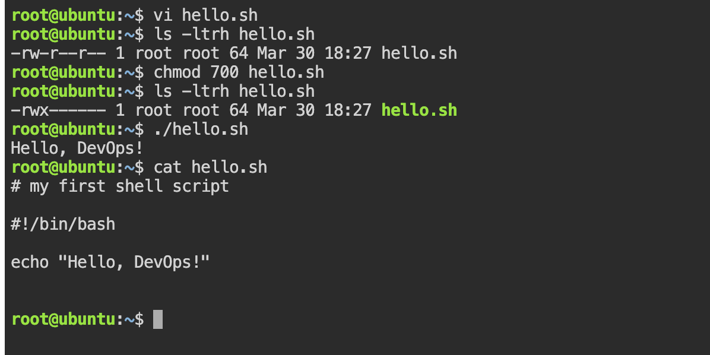
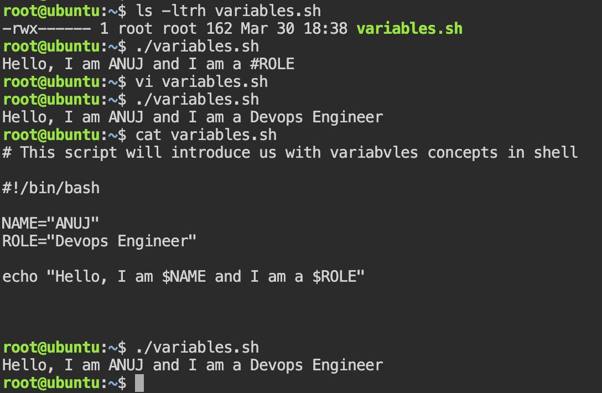
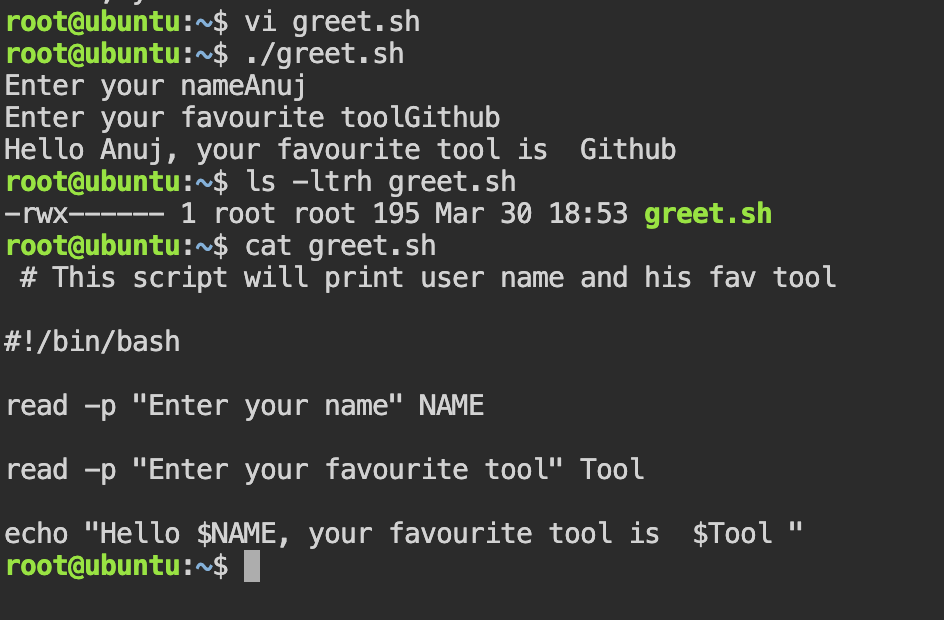
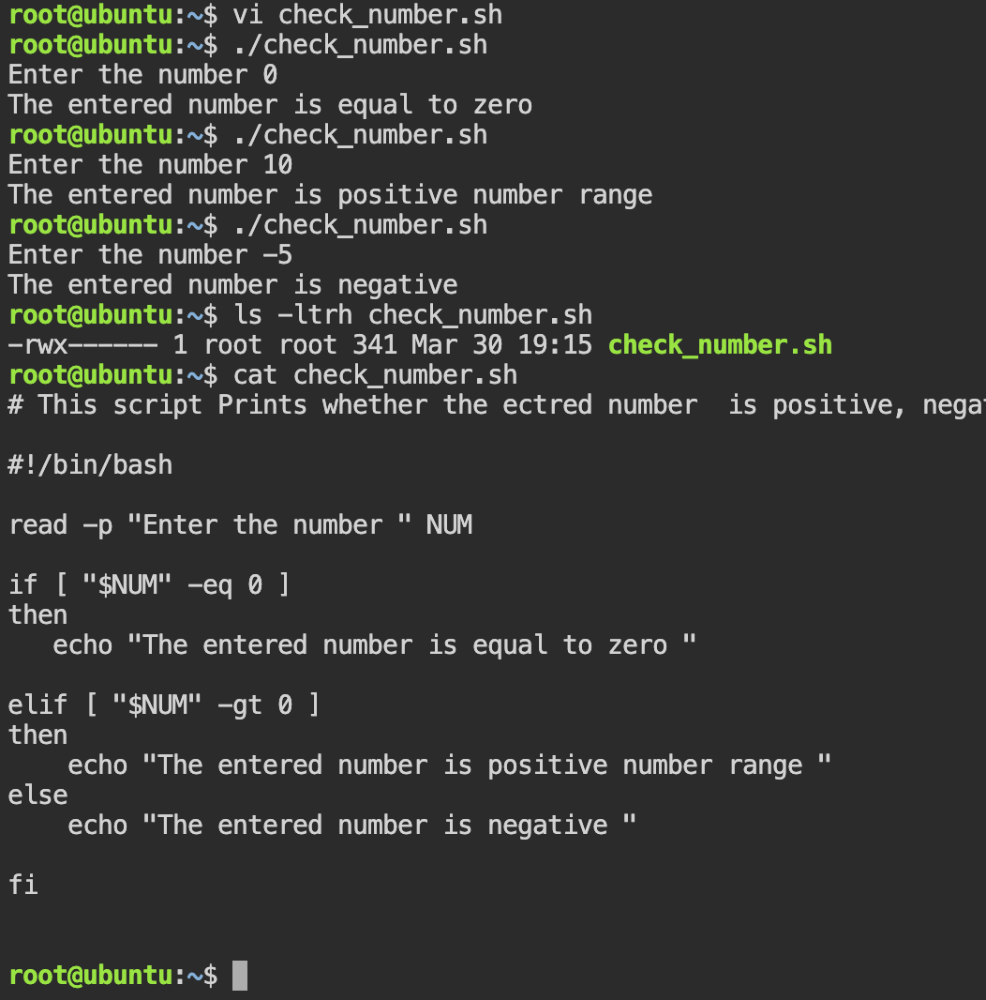
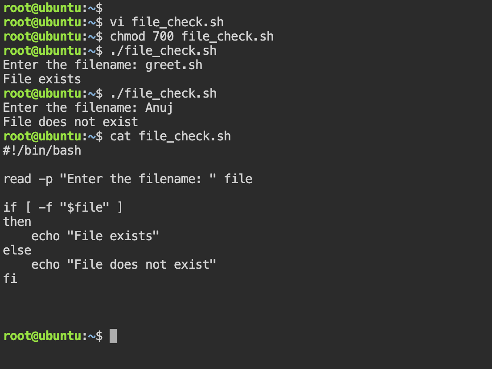

# Task 1: Your First Script

- Create a file called hello.sh 
- in vi editor  termimal we wrote the command echo "hello Devops!"
- i make it executable using chmod 700 file_name command 
- and run it using ./hello.sh

Below is the output 
```bash 
#!/bin/bash 

echo "Hello, DevOps!""
```
Result: 



Q -> What happens if you remove the shebang line?
- Without a shebang, the script may run with the wrong shell, causing unexpected errors or inconsistent behavior.


# Task 2: Variables

- created a variables.sh file and made it executable for users 

Below is the output/ result  :




Q-> Try using single quotes vs double quotes — what's the difference?

- Single Quotes ' ' vs Double Quotes " " in Shell
   
   - i ) Single Quotes ' '
       -  Treat everything literally

        - No variable expansion, no command substitution 

        ```bash 
        name="Anuj"
        echo 'Hello $name'
        ```
        output :
        ```bash 
        Hello $name

        ```

   - ii) Double Quotes " "
       
       - Allow variable expansion and command substitution
       ```bash 
       name="Anuj"
       echo "Hello $name"
       ```
       ouput:
       ```bash 
       Hello Anuj
       ```
- Single quotes = literal text, Double quotes = interpret variables and commands.


# Task 3: User Input with read

- Created file with name greet.sh 
- wrote the required script and given the execute permission 
- run the script by giving the asked user input 
Below is the Output of the script 



# Task 4: If-Else Conditions

i. Script For checking  The entered numbver is positive , negative or zero  




ii.  Script for checking if file exists or not 




