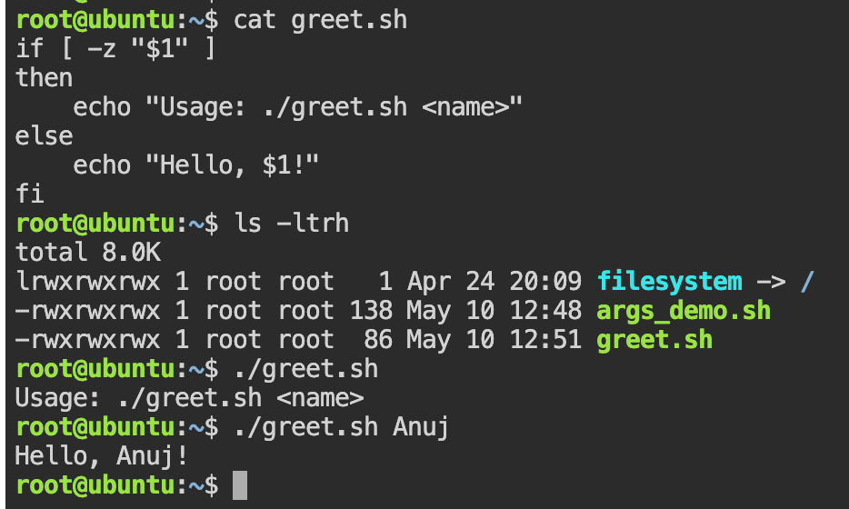
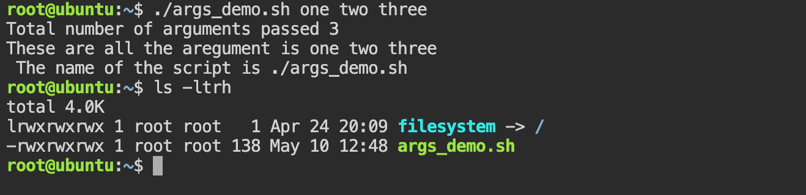
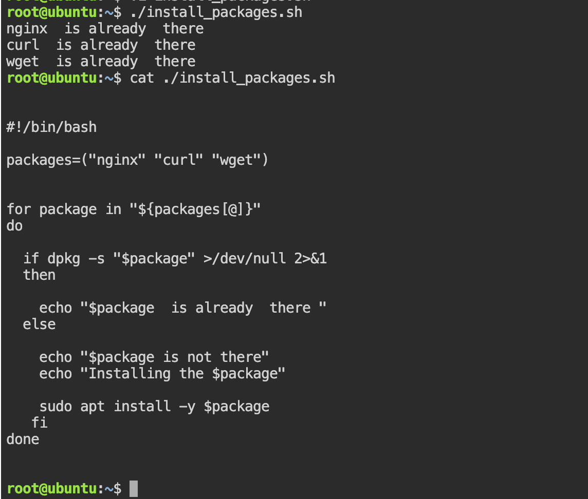
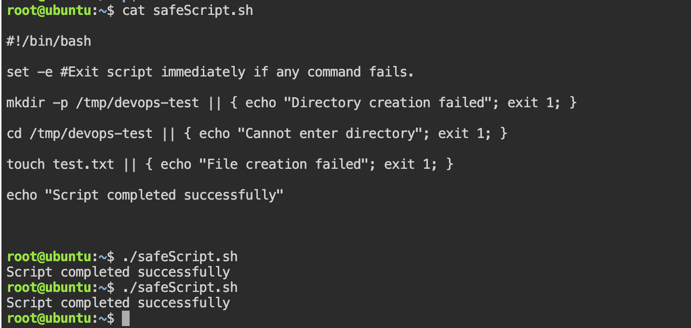

# Task 1: For Loop: 

1. First do Vi For_loop.sh so that it will create that file and open vi terminal for you to write the script 

```bash 

#!/bin/bash

fruits=("apple" "banana" "orange" "mango" "papaya")

echo "All elements: ${fruits[@]}"
echo "Length of array: ${#fruits[@]}"

for fruit in "${fruits[@]}"
do
   echo "$fruit"
done

```

2. DO Vi count.sh it will open vi terminal for you to write the script 

```bash 

#!/bin/bash

for i in {1..10}
do
  echo "$i"
done

#Alternate method for of a c-type style 

#!/bin/bash

for (( i=1; i<=10; i++ ))
do
  echo "$i"
done

```
# Task 2: While Loop

```bash 
#!/bin/bash

read -p "Enter the number for countdown: " num

while [ $num -gt 0 ]
do
    echo "$num"
    num=$((num - 1))
done

echo "Done!"
```
### Q-> Interview type Quesion : 
Disk Usage Alert Script

👉 Write a script that:

Checks disk usage of /

If usage > 80%, print:

High Disk Usage

Else print:

Disk is OK

Solution : 
```bash 
#!/bin/bash

usage=$(df -h / | awk 'NR==2 {print $5}' | cut -d '%' -f1)

if [ $usage -gt 80 ]
then
    echo "High Disk Usage"
else
    echo "Disk is OK"
fi
```


# Task 3: Command-Line Arguments
1) 
```bash 
#!/bin/bash

if [ -z "$1" ]
then
    echo "Usage: ./greet.sh <name>"
else
    echo "Hello, $1!"
fi

```
Example Output: 


2) 
```bash 

#!/bin/bash

echo "Total number of arguments: $#"
echo "All arguments: $@"
echo "Script name: $0"

```
Example output: 



# Task 4: Install Packages via Script

```bash 
#!/bin/bash

# Check if script is run as root (Task 5 suggetion)
if [ "$EUID" -ne 0 ]
then
    echo "Please run this script as root"
    exit 1
fi

packages=("nginx" "curl" "wget")

for package in "${packages[@]}"
do
    if dpkg -s "$package" &> /dev/null
    then
        echo "$package is already installed"
    else
        echo "$package is not installed"
        echo "Installing $package..."

        sudo apt install -y "$package"
    fi
done

```
- dpkg -s  -> This will check if the package is already present or not 
- &> /dev/null -> This will send the out to null device so that we will not get the output 
- $EUID -> Stores current user ID -> Root user -> 0 and non-root user -> non-zero 
- Interview Type question -> Since package installation requires elevated(root) privileges, I first check whether the script is executed as root using $EUID. If not, the script exits safely with an error message.


Example output : 



# Task 5: Error Handling

safe_script.sh 
```bash 

#!/bin/bash

set -e #Exit script immediately if any command fails.

mkdir -p /tmp/devops-test || { echo "Directory creation failed"; exit 1; }

cd /tmp/devops-test || { echo "Cannot enter directory"; exit 1; }

touch test.txt || { echo "File creation failed"; exit 1; }

echo "Script completed successfully"

```

Exmple output: 



