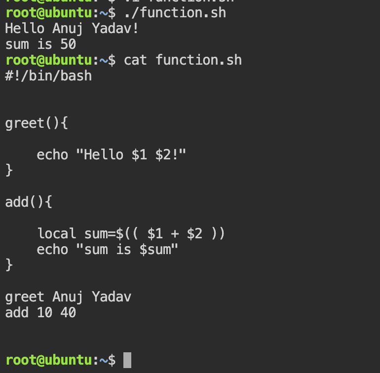
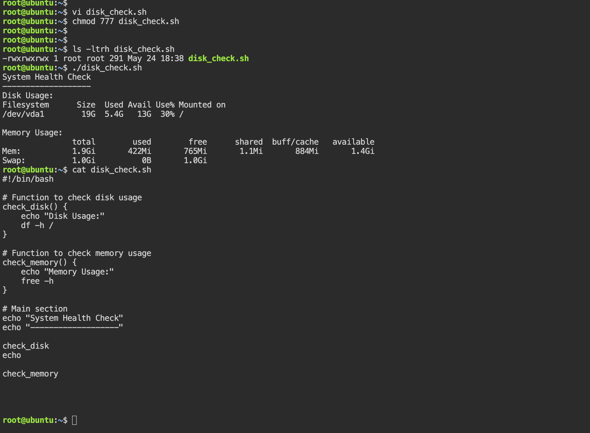
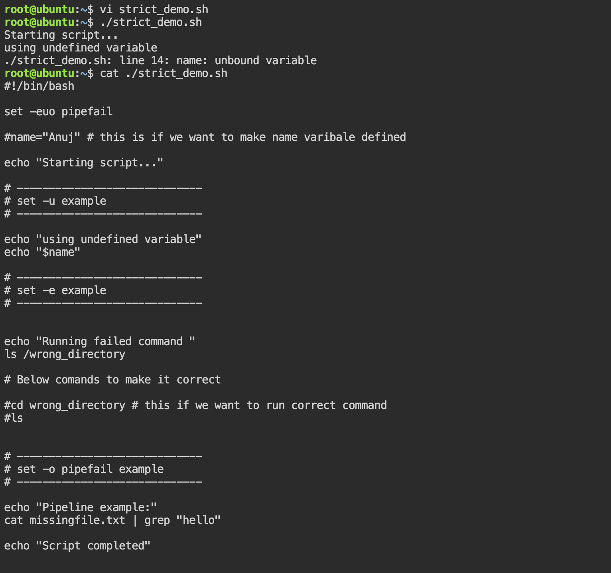
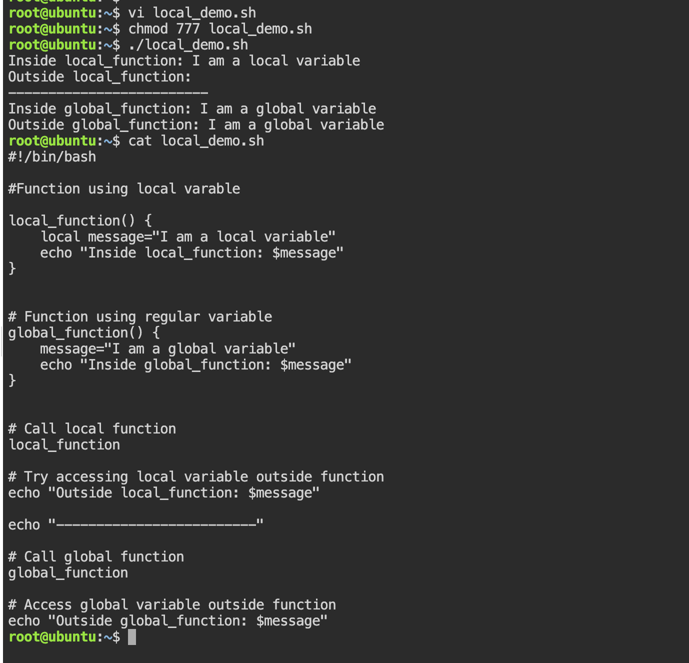

# Task 1: Basic Functions

```bash
#!/bin/bash 


greet(){

    echo "Hello $1!"
}

add(){

    local sum=$(( $1 + $2 ))
    echo "sum is $sum"
}

greet Anuj Yadav
add 10 40 
```
Example output: 



# Task 2: Functions with Return Values

```bash 
#!/bin/bash

# Function to check disk usage
check_disk() {
    echo "Disk Usage:"
    df -h /
}

# Function to check memory usage
check_memory() {
    echo "Memory Usage:"
    free -h
}

# Main section
echo "System Health Check"
echo "-------------------"

check_disk
echo

check_memory

```
Example output : 



Task 3: Strict Mode — set -euo pipefail

```bash 
#!/bin/bash

set -euo pipefail

echo "Starting script..."

# -----------------------------
# set -u example
# -----------------------------
echo "Using undefined variable:"
echo "$name"

# -----------------------------
# set -e example
# -----------------------------
echo "Running failed command:"
ls /wrong-directory

# -----------------------------
# set -o pipefail example
# -----------------------------
echo "Pipeline example:"
cat missingfile.txt | grep "hello"

echo "Script completed"
```
Example output: 


Definations: 

- set -e -> Exit script immediately if any command fails.Used for safer automation , CI/CD pipelines , production scripts

- set -u -> Treat undefined variables as errors.
prevents typos , unexpected empty variables

- set -o pipefail -> Makes pipeline fail if any command inside pipeline fails.

Q -> Why use strict mode?
- Strict mode helps fail fast, prevents hidden bugs, and makes automation scripts more reliable in production


# Task 4: Local Variables
```bash 

#!/bin/bash

# Function using local variable
local_function() {
    local message="I am a local variable"
    echo "Inside local_function: $message"
}

# Function using regular variable
global_function() {
    message="I am a global variable"
    echo "Inside global_function: $message"
}

# Call local function
local_function

# Try accessing local variable outside function
echo "Outside local_function: $message"

echo "-------------------------"

# Call global function
global_function

# Access global variable outside function
echo "Outside global_function: $message"

```
Example output: 


- The local keyword limits variable scope to the function itself.
This prevents accidental modification of global variables and makes scripts more modular and safer


# Task 5: Build a Script — System Info Reporter

```bash 
#!/bin/bash

set -euo pipefail

# -----------------------------------
# Function: Hostname and OS Info
# -----------------------------------
system_info() {
    echo "========== SYSTEM INFORMATION =========="
    echo "Hostname : $(hostname)"
    echo "OS       : $(uname -o)"
    echo "Kernel   : $(uname -r)"
    echo
}

# -----------------------------------
# Function: Uptime
# -----------------------------------
uptime_info() {
    echo "========== UPTIME =========="
    uptime
    echo
}

# -----------------------------------
# Function: Disk Usage
# -----------------------------------
disk_usage() {
    echo "========== TOP 5 DISK USAGE =========="
    df -h | sort -rk5 | head -5
    echo
}

# -----------------------------------
# Function: Memory Usage
# -----------------------------------
memory_usage() {
    echo "========== MEMORY USAGE =========="
    free -h
    echo
}

# -----------------------------------
# Function: Top CPU Processes
# -----------------------------------
cpu_usage() {
    echo "========== TOP 5 CPU PROCESSES =========="
    ps -eo pid,ppid,cmd,%mem,%cpu --sort=-%cpu | head -6
    echo
}

# -----------------------------------
# Main Function
# -----------------------------------
main() {
    system_info
    uptime_info
    disk_usage
    memory_usage
    cpu_usage
}

# Run Main Function
main

```
