# Task 1: Understanding Branches

Q1-> What is a branch in Git?
- A **Branch** in a git is a independent line of devlopment that let you work on a changes without affecting the main codebase. 
- Think of it as creating a separate workspace where you can experiment, add features, or fix bugs safely.

Visual Example: 
```
main
  |
  A --- B --- C

feature-login
          \
           D --- E
```
- main is the primary branch.
- feature-login is a separate branch created from main
- Changes on **feature-login** do not affect main until you merge them

## View Branches
```bash 
git branch
```
Example:
```
* main
  feature-login
  
```
- *indicates the current branch.


Q2-> Why do we use branches instead of committing everything to main?

- We use branches so that developers can work on new features, bug fixes, or experiments without affecting the stable main branch.

- If everyone committed directly to main, the codebase could become unstable, broken, or difficult to manage.

Example Scenario: 

Imagine your application is running in production

Current state:
```
main
 |
 A --- B --- C
 
 ```
 - Now you need to build a login feature.
 
 Bad Approach: Commit Directly to main
```
main
 |
 A --- B --- C --- D --- E --- F
 ```
 Problems:
 - The feature may be incomplete.
 - Other developers see unfinished code.
 - Production deployments can break.
 - Rolling back becomes harder.

 Better Approach: Use a Branch
 ```
 main
 |
 A --- B --- C
              \
               D --- E --- F
                 feature-login
```
Benefits:
- main remains stable.
- we can test safely 
- Other developers can continue working.
- The feature can be reviewed before merging

When ready:
```bash 
git merge feature-login
```
### Team Collaboration Example
- Suppose three developers are working:
```bash 
main
├── feature-login
├── feature-payment
└── bugfix-auth
```
- Each developer works independently.

Without branches:
```bash 
main
├── login changes
├── payment changes
├── bug fixes
├── experimental code
└── incomplete work

```
- The repository quickly becomes messy and unstable.

DevOps Perspective

In professional environments:
```
main      -> Production-ready code
develop   -> Integration branch
feature/* -> New features
hotfix/*  -> Production fixes
release/* -> Release preparation
```
This branching strategy enables:
- Code reviews
- CI/CD testing
- Safe deployments
- Controlled releases

Summary: 
- Branches allow developers to work on features, bug fixes, and experiments in isolation without affecting the stable main branch. They enable parallel development, safer testing, code reviews, and easier collaboration. Once changes are tested and approved, they can be merged into main

Q3 -> What is HEAD in Git?
- HEAD is a special pointer that tells Git where you are currently working.

- In most cases, HEAD points to the latest commit on your current branch.

Example: 

Suppose your repository looks like this:
```
A --- B --- C  (main)
              ^
            HEAD
```
Here:
- main points to commit C
- HEAD points to main
- Any new commit will be added after C

How to See HEAD
Run:
```bash 
cat .git/HEAD
```
Output:
```
ref: refs/heads/main
```
This means:
```bash
HEAD --> main --> latest commit
```
What Happens When You Commit?

Before:
```
A --- B --- C  (HEAD -> main)
```
After:
```
A --- B --- C --- D  (HEAD -> main)
```
- When you create commit D, both main and HEAD move forward.

Switching Branches: 

Suppose you create a branch:
```bash 
git checkout -b feature-login
```
Now:
```bash 
A --- B --- C  (main)
              \
               D  (HEAD -> feature-login)
```
- HEAD now points to feature-login because that is your current branch.

Useful command: 
```bash 
git rev-parse HEAD
```
- Outputs the commit hash that HEAD currently points to.

Summary: 
- HEAD is a special pointer that identifies the current branch and commit that Git is working on. Normally, it points to the latest commit of the active branch. When new commits are created, HEAD moves forward with the branch. In a detached HEAD state, it points directly to a specific commit instead of a branch.

Q4-> What happens to your files when you switch branches?

- When you switch branches, Git changes the files in your working directory to match the state of the branch you're switching to

Example

Suppose you have two branches:

main:
```
app.py
README.md

```

feature-login:
```
app.py
README.md
login.py
```

When you're on main:
```bash 
git checkout main
ls
```
Output:
```
app.py
README.md
```

Now switch to feature-login:

```bash 
git checkout feature-login
```
Output:
```
app.py
README.md
login.py
```
- Git automatically updates your files so your working directory matches that branch.

What If Files Are Different?

main:
```
config.txt
Version 1
```

feature-login:

```
config.txt
Version 2
```
When you switch branches:

```bash 
git checkout feature-login
```
- Git replaces Version 1 with Version 2.


Summary:
- When you switch branches, Git updates the working directory and staging area to match the state of the target branch. Files that exist only on that branch appear, modified files are updated to that branch's version, and files not present on the target branch may disappear. If uncommitted changes would be overwritten, Git prevents the branch switch until the changes are committed, stashed, or discarded.


# Task 2: Branching Commands — Hands-On

Created A **devops-git-practice** repo for practice : 

i. List all Branches on The repo : 

```bash 
git branch 
```
Example output:
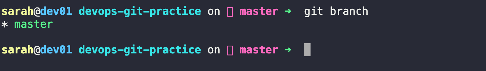

ii. Create a New Branch Called **feature-1**

```bash 
git branch -b feature-1
```
Verify:
```bash 
git branch 
```

Output:
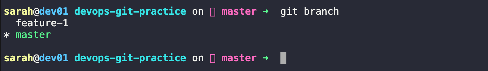

iii. Switch to feature-1
```bash 
git checkout feature-1
```
Verify:
```bash 
git branch 
```
Outout : 
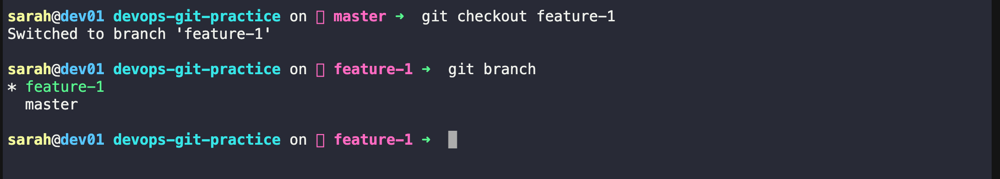

iv. Create and Switch to feature-2 in One Command
Using checkout: 

```bash 
git checkout -b feature-2
```
Or using the modern command:
```bash 
git switch -c feature-2
```
Verify:
```bash 
git branch 
```
output: 

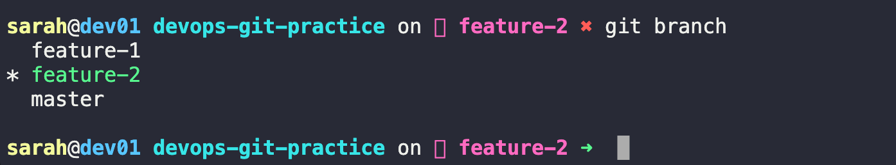

v. Try git switch
Move back to feature-1:
```bash 
git switch feature-1
```

Move to main:
```bash 
git switch main
```
Output : 
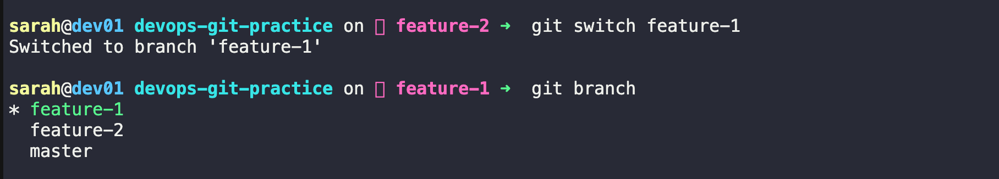
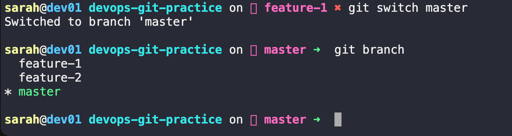

### Difference Between git switch and git checkout


- **git checkout** -> Used for switching branches and restoring files

- **git switch**  -> Used only for switching branches (simpler and safer)

vi. Make a Commit on feature-1
Switch to feature-1:
```bash 
git switch feature-1
```
Add a text file 


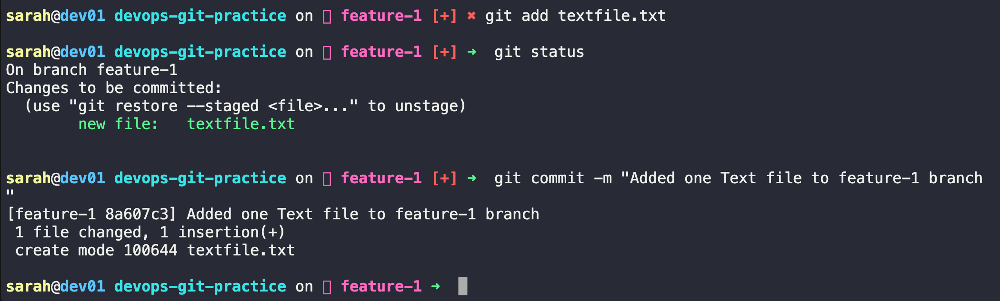

vii. Verify the Commit Exists on feature-1
```bash 
git log --oneline
```
Output: 
```bash 
sarah@dev01 devops-git-practice on  feature-1 ➜  git log --oneline
8a607c3 (HEAD -> feature-1) Added one Text file to feature-1 branch
4842ab8 (master, feature-2) Initial commit

sarah@dev01 devops-git-practice on  feature-1 ➜  

```


viii. Switch Back to main
```bash 
git switch main or master 
git checkout main or master 
```
check history: 
```bash 
git log 
```

Output: 

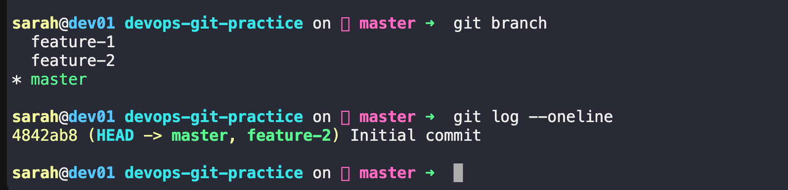
- This proves the commit exists only on feature-1.

iX. Delete a Branch You No Longer Need

Switch to main first:
```bash 
git checkout main/master 
```
Delete feature-2:
```bash 
git branch -d feature-2
```
List branches:
```bash
git branch 
```
Output: 
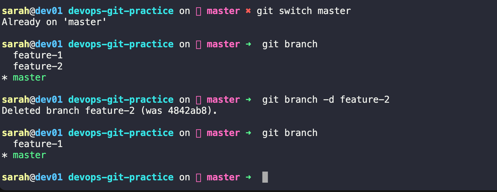


x. Add Branching Commands to git-commands.md


# Task 3: Push to GitHub

Step01 -> Create a Repository on GitHub

i. Go to GitHub

ii.  Click New Repository

iii. Repository name: devops-git-practice

iv. Select Public or Private

v. Do NOT check:

   - Add README
   - Add .gitignore
   - Add License

vi. Click Create Repository


Step 2: Connect Local Repository to GitHub

Copy the repository URL from GitHub.

Add it as a remote:
```bash 
git remote add origin https://github.com/<username>/devops-git-practice.git
```
Verify:
```bash 
git remote -v
```
Example:
```
origin  https://github.com/anujrai/devops-git-practice.git (fetch)
origin  https://github.com/anujrai/devops-git-practice.git (push)
```

Step 3: Push Main Branch
Make sure you're on main:

```bash 
git switch main
```
Push:
```bash 
git push -u origin main
```
- The -u flag sets the upstream tracking branch.

After this, future pushes can be done with:
```bash 
git push 
```
Step 4: Push feature-1 Branch
Switch to feature-1:

```bash 
git checkout feature-1
    OR 
git switch feature-1
```

Push:
```bash 
git push -u origin feature-1
```
Step 5: Verify Branches on GitHub

Check local branches:

```bash 
git branch
```
Check remote branches:
```bash 
git branch -r
```
Example:
```
origin/main
origin/feature-1
```
- Now refresh your GitHub repository page and open the branch selector.

You should see:
```
main
feature-1
```

Q -> Difference Between Origin and Upstream

Origin: 
- **origin** is the default name given to the remote repository that you cloned from or push your changes to.

Example:

```bash 
git remote -v
```
Output:
```
origin https://github.com/yourusername/devops-git-practice.git
```
- Most developers push and pull from origin


Upstream: 
- upstream usually refers to the original repository from which a fork was created.

Example:
```
upstream -> original project repository 

origin -> your fork
```
- Common in open-source projects:
```
Open Source Repo
  ^ 
  | 
 upstream 
   | 
Your Fork 
   ^ 
   |
origin

```
You can add an upstream remote:
```
git remote add upstream https://github.com/original-owner/project.git
```
Verify:
```bash 
git remote -v
```

Output:
```
origin https://github.com/yourusername/project.git 

upstream https://github.com/original-owner/project.git
```

- **origin** is the default remote repository that you clone from and push to. **upstream** is typically the original repository from which a fork was created. Developers pull updates from **upstream** and push their own changes to **origin**

# Task 4: Pull from GitHub

Step 1: Make a Change Directly on GitHub

i. Open your repository on GitHub.
ii. Open git-commands.md.
iii. Click the Edit (✏️) button.
iv. Add a line such as:
```
## GitHub Notes
This line was added directly on GitHub.
```
v. Scroll down and commit the change directly to the main branch.

Step 2: Verify Local Repository is Behind

In your local repository:
```bash 
git status
```
Then check the remote:
```bash 
git fetch 
```
See the difference:
```bash 
git log --oneline --all --graph --decorate
```
You should notice that origin/main is ahead of your local main
Output: 
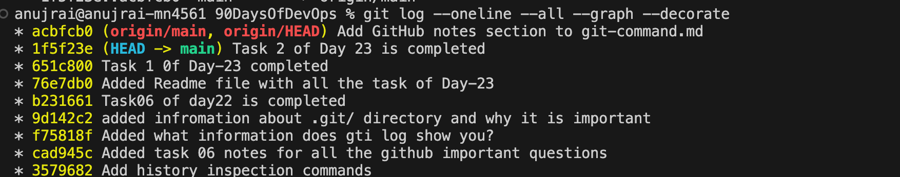

Step 3: Pull the Change

Switch to main:
```bash 
git switch main
```
Pull the latest changes:
```bash 
git pull origin main
```
Expected output:
```
Updating abc123..def456
Fast-forward
 git-commands.md | 2 ++

 ```

 Step 4: Verify the Change

 View the file:

```bash 
cat git-commands.md

```
Or check the latest commit:
```bash
git log --oneline -1
```
Output: 
```
anujrai@anujrai-mn4561 90DaysOfDevOps % git log --oneline -1
acbfcb0 (HEAD -> main, origin/main, origin/HEAD) Add GitHub notes section to git-command.md
anujrai@anujrai-mn4561 90DaysOfDevOps % 

```
- You should see the commit that was created on GitHub.


## Difference Between git fetch and git pull

### git fetch

**What it does:**
Downloads new commits, branches, and tags from the remote repository but does NOT modify your working branch.

Example:

```bash
git fetch origin
```

After fetching:

```text
Local main      -> unchanged
origin/main     -> updated
```

You can inspect changes before applying them.

---

### git pull

**What it does:**
Downloads changes from the remote repository and immediately integrates them into your current branch.

Example:

```bash
git pull origin main
```

This is equivalent to:

```bash
git fetch origin
git merge origin/main
```

(or fetch + rebase if configured).

---

### Example

Suppose GitHub has a new commit:

```text
main
A --- B --- C
              \
               D (origin/main)
```

#### After git fetch

```text
main
A --- B --- C

origin/main
A --- B --- C --- D
```

Your branch is unchanged.

#### After git pull

```text
main
A --- B --- C --- D
```

Your branch is updated automatically.

---

### Summary

| Command   | Downloads Changes | Updates Local Branch |
| --------- | ----------------- | -------------------- |
| git fetch | Yes               | No                   |
| git pull  | Yes               | Yes                  |

---

### Best Practice

Use `git fetch` when you want to inspect changes before applying them.

Use `git pull` when you're ready to update your local branch immediately.


- git fetch downloads changes from the remote repository but does not modify the current branch. git pull downloads the changes and immediately merges (or rebases) them into the current branch. Therefore, git pull is essentially git fetch followed by git merge (or rebase).

# Task 5: Clone vs Fork

Part 1: Clone a Public Repository

Copy the repository URL and run:
```bash 
git clone https://github.com/github/gitignore.git
```

Verify:
```bash 
 cd gitignore
 git remote -v 
 ```
 Output: 
 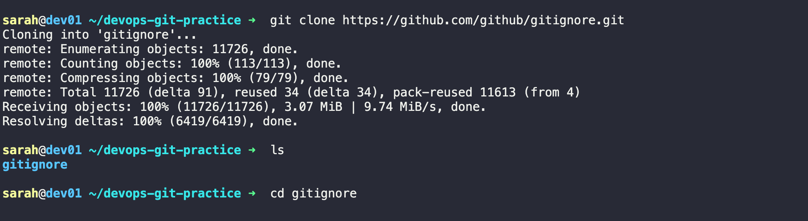


Part 2: Fork the Repository

i. Open the repository on GitHub.
ii. Click Fork.
iii. GitHub creates a copy under your account.
Example:
```
Original:
github.com/github/gitignore.git

Fork:
github.com/<your-username>/gitignore.git
```

Part 3: Clone Your Fork

Copy the URL of your fork and clone it:
```bash 
git clone https://github.com/<your-username>/gitignore.git
```

Verify:
```bash 
cd gitignore
git remote -v 
```
Output:
```bash 
origin  https://github.com/<your-username>/gitignore.git

```

Part 4: Add Upstream Remote

The original repository should be added as upstream.
```bash 
git remote add upstream https://github.com/github/gitignore.git
```
Verify:
```bash 
git remote -v
```
Example:
```bash 
origin    https://github.com/<your-username>/gitignore.git
upstream  https://github.com/github/gitignore.git
```

Notes: 

# Clone vs Fork

## What is Clone?

A clone creates a local copy of a Git repository on your computer.

Example:

```bash
git clone https://github.com/user/project.git
```

After cloning:

```text
GitHub Repository
        |
        v
Local Repository
```

The remote is usually called `origin`.

---

## What is Fork?

A fork creates a copy of someone else's repository under your own GitHub account.

Example:

```text
Original Repository
        |
      Fork
        |
        v
Your GitHub Repository
```

You can freely modify your fork without affecting the original project.

---

## Difference Between Clone and Fork

| Clone                                 | Fork                                             |
| ------------------------------------- | ------------------------------------------------ |
| Creates a local copy                  | Creates a GitHub copy                            |
| Exists on your machine                | Exists on GitHub                                 |
| Used to work locally                  | Used to contribute to other projects             |
| No separate GitHub repository created | Creates a separate repository under your account |

---

## When Would You Clone?

Use clone when:

* You own the repository.
* You have direct write access.
* You simply want a local copy.

Example:

```bash
git clone https://github.com/mycompany/project.git
```

---

## When Would You Fork?

Use fork when:

* Contributing to open-source projects.
* You do not have write access to the original repository.
* You want your own copy on GitHub.

Workflow:

```text
Original Repo
      |
    Fork
      |
   Clone
      |
   Make Changes
      |
 Push to Fork
      |
 Pull Request
```

---

## How to Keep a Fork in Sync?

### Add the Original Repository as Upstream

```bash
git remote add upstream https://github.com/original-owner/project.git
```

### Fetch Latest Changes

```bash
git fetch upstream
```

### Update Your Local Main Branch

```bash
git checkout main
git merge upstream/main
```

Or:

```bash
git rebase upstream/main
```

### Push Updates to Your Fork

```bash
git push origin main
```

---

## Typical Open Source Setup

```text
upstream -> Original Repository
origin   -> Your Fork
local    -> Your Computer
```

You fetch from `upstream` and push to `origin`.


Sumamry: 
- A clone creates a local copy of a repository on your machine. A fork creates a copy of a repository under your own GitHub account.

When would you clone vs fork?
- Clone when you have access to the repository and just need a local copy.

- Fork when contributing to someone else's project and you need your own GitHub copy.