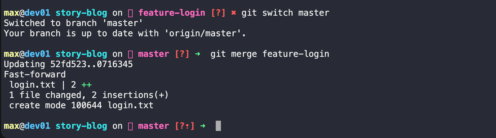
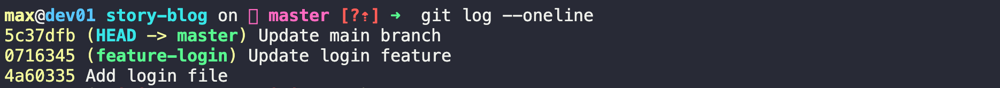
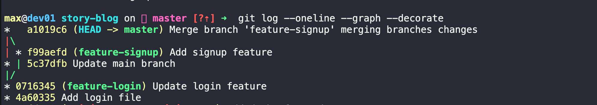
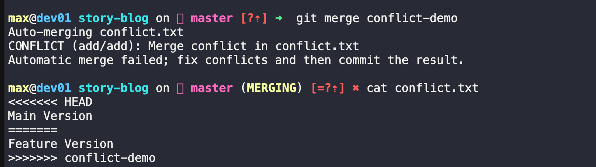
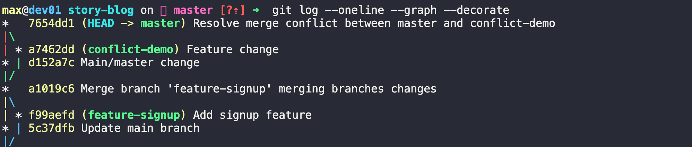
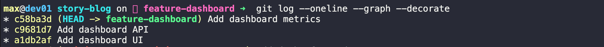
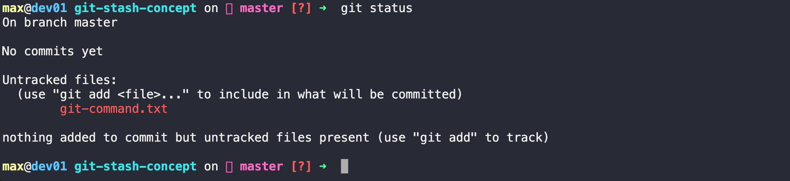

# Task 1: Git Merge — Hands-On
### Create a new branch feature-login from main and add a couple of commits
Make sure you're on main:
```bash 
git switch main
```

Create and switch to the branch:
```bash 
git switch -c feature-login
```
Create a file:
```bash 
echo "Login Feature - Step 1" > login.txt
git add login.txt
git commit -m "Add login file"
```
Add another change:
```bash 
echo "Login Feature - Step 2 and version2 with more security" >> login.txt
git add login.txt
git commit -m "Update login feature"
```
Verify:
```bash 
git log --oneline
```
Output: 


### Switch back to main and merge feature-login into main

```bash 
git switch main 
```

Merge:
```bash 
git merge feature-login
```

### Observe the merge — did Git do a fast-forward merge or a merge commit?
Check:
```bash 
git log --oneline --graph --decorate
```
You should see:



Git will most likely show:
```
Fast-forward
```
- because no new commits were made on main after creating feature-login

### Create another branch feature-signup, add commits to it — but also add a commit to main before merging

Create branch:
```bash 
git switch -c feature-signup
```
Create file:
```bash 
echo "Signup Feature" > signup.txt
git add signup.txt
git commit -m "Add signup feature"
```
Switch back to main:
```bash 
git switch master/main 
     OR 
git checkout master 
```
Make a new commit on main/ master:
```bash 
echo "Main branch update" > main.txt
git add main.txt
git commit -m "Update main branch"
```
Output Log : 


### Merge feature-signup into main — what happens this time?

Run:
```bash 
git merge feature-signup
```
Now check:
```bash 
git log --oneline --graph --decorate
```
OUTPUT: 

- So Git cannot fast-forward.It creates a new commit: a1019c6 ->which combines both histories.
- Git created a merge commit (a1019c6) because both master and feature-signup contained new commits after they diverged.


# Git Merge Notes

## What is a Fast-Forward Merge?

A fast-forward merge happens when the target branch has not changed since the feature branch was created.

Example:

```text
main
A---B

feature-login
     \
      C---D
```

After merge:

```text
A---B---C---D
```

Git simply moves the `main` pointer forward and does not create a merge commit.

---

## When Does Git Create a Merge Commit Instead?

Git creates a merge commit when both branches contain new commits after they diverged.

Example:

```text
A---B---F (main)
     \
      C---D (feature-signup)
```

After merge:

```text
      C---D
     /     \
A---B---F---M
```

`M` is the merge commit.

---

## What is a Merge Conflict?

A merge conflict occurs when Git cannot automatically decide which changes to keep.

This usually happens when the same line of the same file is modified in two different branches.

Example:

```text
<<<<<<< HEAD
Main branch version
=======
Feature branch version
>>>>>>> feature-branch
```

The developer must manually edit the file, resolve the conflict, and commit the resolution.


### Bonus: Create an Intentional Merge Conflict
```bash 
git switch -c conflict-demo
echo "Feature Version" > conflict.txt
git add conflict.txt
git commit -m "Feature change"

git switch main
echo "Main Version" > conflict.txt
git add conflict.txt
git commit -m "Main change"

git merge conflict-demo
```
- Git will stop with a conflict and ask you to resolve it manually. This demonstrates exactly what a merge conflict looks like in practice.

Output: 


Let's Resolve this merge conflict now 

Step 1: Check the Conflicted File

Open the file:
```bash 
cat conflict.txt
```
You'll see something like:

```
<<<<<<< HEAD
Main Version
=======
Feature Version
>>>>>>> conflict-demo
```

Meaning
```
<<<<<<< HEAD
```
- Current branch (master) version

```
=======

```
- Separator

```
>>>>>>> conflict-demo
```

- Version from conflict-demo

Step 2: Decide What You Want

Option A: Keep Both

Edit conflict.txt:
```
Main Version
Feature Version
```

Option B: Keep Main Only

```
Main Version
```

Option C: Keep Feature Only

```
Feature Version
```

Step 3: Mark Conflict as Resolved

After editing the file:
```bash 
git add conflict.txt
```

Check status:
```bash 
git status
```
You should see:
```
All conflicts fixed but you are still merging.
```
Step 4: Complete the Merge
```bash 
git commit -m "Resolve merge conflict between master and conflict-demo"
```
- Git creates a merge commit.

Step 5: Verify
```bash 
git log --oneline --graph --decorate
```
You'll see something like:
```
* abc1234 Resolve merge conflict between master and conflict-demo
|\
| * def5678 Feature change
* | ghi9012 Main change
|/
```


Output:



# Task 2: Git Rebase — Hands-On


### Create a branch feature-dashboard from main/master  and add 2–3 commits

Switch to main/master:

```bash 
git checkout master/main  
    OR 
git switch main/master 
```

Create branch:
```bash 
git switch -c feature-dashboard
```
Commit #1
```bash 
echo "Dashboard UI" > dashboard.txt
git add dashboard.txt
git commit -m "Add dashboard UI"
```

Commit #2
```bash 
echo "Dashboard API" >> dashboard.txt
git add dashboard.txt
git commit -m "Add dashboard API"
```
Commit #3
```bash 
echo "Dashboard metrics" >> dashboard.txt
git add dashboard.txt
git commit -m "Add dashboard metrics"
```
Verify:
```bash 
git log --oneline --graph --decorate
```
OUTPUT: 



### While on main, add a new commit
Switch back:
```bash 
git switch main/master 
     OR 
git checkout main/master 
```

Create a new commit:
```bash 
echo "Main branch update" > main-update.txt
git add main-update.txt
git commit -m "Update main branch"
```
Now history looks like:
```

          D---E---F (feature-dashboard)
         /
A---B---C---G (main)

```
Where:
 - D,E,F = dashboard commits
 - G = new main commit

### Switch to feature-dashboard and rebase it onto main

Switch:
```bash 
git switch feature-dashboard
```
Run rebase:
```bash 
git rebase main
```

Expected output:
```
Successfully rebased and updated refs/heads/feature-dashboard.
```

### Observe history

Run:
```bash 
git log --oneline --graph --decorate --all
```

After rebase:
```
A---B---C---G---D'---E'---F'
```
Notice:

- No merge commit
- Dashboard commits appear after G
- Git created new commit IDs (D', E', F')

This is why rebase creates a cleaner history.

## Compare Merge vs Rebase

Merge: 
```
          D---E---F
         /         \
A---B---C---G-------M
```

Creates:
```
M = Merge Commit
```
- History branches and joins.

Rebase: 
```
A---B---C---G---D'---E'---F'
```
- Single straight line.
- No merge commit.

### Add These Answers to Your Notes

# Git Rebase Notes

## What does rebase actually do to your commits?

Rebase takes the commits from one branch and replays them on top of another branch.

Example:

Before:

A---B---C (main)
     \
      D---E (feature)

After:

A---B---C---D'---E'

Git creates new versions of D and E with new commit hashes.

---

## How is the history different from a merge?

Merge history:

      D---E
     /     \
A---B---C---M

A merge commit (M) is created.

Rebase history:

A---B---C---D'---E'

The history becomes linear and easier to read.

---

## Why should you never rebase commits that have been pushed and shared with others?

Rebase rewrites commit history and creates new commit hashes.

If other developers already have the old commits, rebasing can cause:
- Confusing histories
- Duplicate commits
- Push/pull conflicts
- Collaboration problems

Therefore, only rebase local commits that have not been shared.

---

## When would you use rebase vs merge?

Use Rebase:
- Before merging a feature branch
- To keep history clean and linear
- For local, unpublished commits

Use Merge:
- For shared branches
- When preserving exact history is important
- When working in teams on public branches


# Task 3: Squash Commit vs Merge Commit

### Create a branch feature-profile, add 4–5 small commits

Switch to main:
```bash 
git switch main/master 
```

Create branch:
```bash 
git switch -c feature-profile
```

Commit #1
```bash 
echo "Profile Page" > profile.txt
git add profile.txt
git commit -m "Add profile page"
```

Commit #2

```bash 
echo "Add profile image section" >> profile.txt
git add profile.txt
git commit -m "Add profile image section"
```
Commit #3
```bash 
echo "Fix typo in profile page" >> profile.txt
git add profile.txt
git commit -m "Fix typo"
```

Commit #4
```bash 
echo "Improve formatting" >> profile.txt
git add profile.txt
git commit -m "Improve formatting"
```

Commit #5
```bash 
echo "Update profile styling" >> profile.txt
git add profile.txt
git commit -m "Update profile styling"
```

Verify:
```bash 
git log --oneline
```
- we should see 5 commits on feature-profile.

### Merge it into main using --squash

Switch to main:
```bash 
git switch main
```
Run squash merge:
```bash 
git merge --squash feature-profile
```

Output:
```bash 
Squash commit -- not updating HEAD
```

- Git combines all changes into one staged change.
Check status:
```bash 
git status
```

Now create a single commit:
```bash 
git commit -m "Add complete profile feature"
```
### Check git log — how many commits were added to main?
```bash 
git log --oneline --graph --decorate
```

Result:
```
abc123 Add complete profile feature
xyz456 Previous main commit
```
- Only ONE commit was added to main.
- Even though feature-profile had 5 commits.

### Create another branch feature-settings

Create branch:
```bash 
git switch -c feature-settings
```

Commit #1
```bash 
echo "Settings Page" > settings.txt
git add settings.txt
git commit -m "Add settings page"
```

Commit #2
```bash 
echo "Notification settings" >> settings.txt
git add settings.txt
git commit -m "Add notification settings"
```
Commit #3
```bash 
echo "Privacy settings" >> settings.txt
git add settings.txt
git commit -m "Add privacy settings"
```

### Merge it into main WITHOUT --squash
Switch back:

```bash 
git switch main/master
```
Merge:
```bash 
git merge feature-settings
```
Check history:

```bash 
git log --oneline --graph --decorate
```
You will see:
```bash 
Add privacy settings
Add notification settings
Add settings page
Add complete profile feature
```
- All individual commits are preserved.


### All individual commits are preserved.

# Squash Merge vs Regular Merge

## What does squash merging do?

Squash merging combines all commits from a feature branch into a single commit before adding them to the target branch.

Example:

Feature Branch:

A --- B --- C --- D --- E

After squash merge:

A --- S

S = Single Squashed Commit

The individual commits are not preserved in the target branch.

---

## When would you use squash merge vs regular merge?

### Use Squash Merge

- Small feature branches
- Many tiny commits
- Typo fixes
- Formatting changes
- Keeping history clean

Example:

"Fix typo"
"Fix another typo"
"Update spacing"

can become:

"Complete profile feature"

### Use Regular Merge

- Team projects
- When commit history is important
- When you want to preserve development steps
- For debugging and auditing

---

## What is the trade-off of squashing?

Advantages:
- Cleaner commit history
- Easier to read logs
- One commit per feature

Disadvantages:
- Original commit history is lost
- Harder to see how the feature was developed
- Less detailed debugging information

Example:

Before squash:

Add profile page
Fix typo
Update styling
Improve formatting

After squash:

Add complete profile feature


Key Difference
Squash Merge
Feature:
```
A---B---C---D

Main:
M---N---S

```
Only S is added.

Regular Merge

```
      A---B---C---D
     /             \
M---N---------------R
```
- All commits are preserved and Git may create a merge commit R.


# Task 4: Git Stash — Hands-On

- **Git stash** is used when you have uncommitted work but need to temporarily switch branches without committing incomplete code.

### Start Making Changes to a File but Do Not Commit

Switch to your repository:
```bash 
git switch main/master 
```

Edit a file:

```bash 
echo "Work in progress change" >> git-commands.md
```

Check status:
```bash 
git status 
```

Output:



```
Changes not staged for commit:
  modified: git-commands.md
  ```
  - At this point, you have uncommitted changes.

### Imagine You Need to Urgently Switch Branches

Try switching:
```bash 
git switch feature-login
```
What Happens?

Case 1: Git allows the switch if your changes don't conflict.

Case 2: Git blocks the switch:
```
error: Your local changes to the following files would be overwritten by checkout:
    git-commands.md
Please commit your changes or stash them before you switch branches.
```
- This is where git stash helps.

### Use git stash to Save Work-in-Progress

Run:
```bash 
git stash 
```
Output:
```bash
Saved working directory and index state WIP on main
```
Check status:

```bash 
git status
```
- Your changes are safely stored away.

### Switch to Another Branch, Do Some Work, Switch Back

Switch branches:
```bash
git switch feature-login
```
Make a change:
```bash 
echo "Login enhancement" >> login.txt
git add login.txt
git commit -m "Enhance login feature"
```


Switch back:
```bash 
git switch master/main 
```

### Apply Your Stashed Changes Using git stash pop
See available stashes:
```bash 
git stash list 
```
Example:
```
stash@{0}: WIP on main: abc123 Add branching commands
```

Restore and remove the stash:
```bash 
git stash pop
```
Output:
```bash 
Dropped refs/stash@{0}
```

Verify:
```bash 
git status
```
- Your earlier changes should be back.

### Try Stashing Multiple Times

Create first stash:
```bash 
echo "First stash" >> notes.txt
git stash
```

Create second stash:
```bash 
echo "Second stash" >> notes.txt
git stash
```

Create third stash:
```bash 
echo "Third stash" >> notes.txt
git stash
```

List all stashes:
```bash 
git stash list 
```

Example:
```bash 
stash@{0}: WIP on main: Third stash
stash@{1}: WIP on main: Second stash
stash@{2}: WIP on main: First stash
```
- Newest stash is always stash@{0}.

Apply a Specific Stash

View stashes:
```bash 
git stash list 
```
Apply a specific stash:
```bash 
git stash apply stash@{1}
```
Example:
```bash 
git stash apply stash@{2}
```
Notice:
```bash 
- Changes are restored
- Stash remains in the stash list
```
Verify:
```bash 
git stash list
```
- The stash list still exists.

### Add These Answers to Your Notes

# Git Stash Notes

## What is the difference between git stash pop and git stash apply?

### git stash pop

Restores the most recent stash and removes it from the stash list.

Example:

```bash
git stash pop
```

Behavior:

Restore changes ✅
Delete stash ✅


#### git stash apply
- Restore the stash but keep it in the stash list 

Example: 
```bash 
git stash apply stash@{1}
```
Behavior:
Restore changes -> yes  ✅
Delete stash -> No  ❌

```
| Command         | Restores Changes | Removes Stash |
| --------------- | ---------------- | ------------- |
| git stash pop   | Yes              | Yes           |
| git stash apply | Yes              | No            |

````


### Add These Answers to Your Notes

# Git Stash Notes

## What is the difference between git stash pop and git stash apply?

### git stash pop

Restores the most recent stash and removes it from the stash list.

Example:

```bash
git stash pop
```
Before:
```bash
stash@{0}: WIP on main
```

After:
```bash 
Stash restored
stash@{0} removed
```
- Use when you're sure you no longer need the backup.

git stash apply
- Restores the stashed changes.
- Keeps the stash in the stash list.

Example:
```bash 
git stash apply stash@{0}
```
Before:
```
stash@{0}: WIP on main
```

After:
```bash 
Changes restored
stash@{0} still exists
```
- Use when you may want to reuse the same stash again.


### Q -> When would you use stash in a real-world workflow?

git stash is used when you have uncommitted work but need to temporarily switch context 

Example 1: Production Incident

You are working on a new feature:
```bash 
git switch feature-dashboard
```
you have modified files but haven't commited them. 
suddenly a production issue occurs.
instead of creating a temporary commit: 
```bash 
git stash 
git switch hotfix-production
```
- Fix the issue.


Then return:
```bash 
git switch feature-dashboard
git stash  pop
```
- Your unfinished work is restored.

Example 2: Pulling Latest Changes

You are working locally and receive a message:
- please pull the latest changes from main/master

But you have unfinished work 
```bash 
git stash
git pull origin main
git stash pop
```

Key TakeAway : 

Git stash acts like a tenmporary shelf for uncommitted work.

Instead of: 
```bash 
git commit -m "temporary work"
```

you can safely save unfinished changes:

```bahs 
git stash 
```
and restore them later: 
```bash 
git stash pop 
```


# Task 5: Cherry Picking

- Cherry-pick allows you to copy a specific commit from one branch and apply it to another branch without merging the entire branch.

### Create a branch feature-hotfix

First switch to main/master 
```bash 
git switch master/main 
```
create branch 
```bash 
git switch -c feature-hotfix
```
### Make 3 Different Commits

Commit #1
```bash 
echo "Hotfix 1" > hotfix.txt
git add hotfix.txt
git commit -m "Add hotfix file"
```

Commit #2
```bash 
echo "Critical bug fix" >> hotfix.txt
git add hotfix.txt
git commit -m "Fix critical authentication bug"
```
Commit #3
```bash 
echo "Additional cleanup" >> hotfix.txt
git add hotfix.txt
git commit -m "Cleanup hotfix code"
```

### View the Commit History
```bash 
git log --oneline 
```
Example:
```
c3d4e5f Cleanup hotfix code
b2c3d4e Fix critical authentication bug
a1b2c3d Add hotfix file
```

NOW Copy the hash of the SECOND commit
In this example:
```
b2c3d4e
```

### Switch Back to Main/master 

```bash 
git switch main/master 
```

Check history:
```bash 
git log --oneline
```
- Notice that none of the hotfix commits exist on main.

### Cherry-Pick Only the Second Commit

```bash 
git cherry-pick b2c3d4e
```
- Replace b2c3d4e with your actual commit hash

Expected output:
```
[main 9f8e7d6] Fix critical authentication bug
 1 file changed, 1 insertion(+)
 ```

 ### Verify Only That Commit Was Applied

Run:
```bash 
git log --oneline --graph --decorate
```
Example:
```bash 
9f8e7d6 Fix critical authentication bug
previous-main-commit
```
Notice:

✅ Commit #2 exists

❌ Commit #1 does not exist

❌ Commit #3 does not exist


Visual Understanding

Before Cherry-Pick
```
main
A --- B

feature-hotfix
A --- B --- C --- D --- E
```
Where:

- C = Add hotfix file
- D = Fix critical authentication bug
- E = Cleanup hotfix code

After Cherry-Pick D
```
main
A --- B --- D'

feature-hotfix
A --- B --- C --- D --- E
```
- Git creates a new copy of commit D on main.

Notice:
```bash 
D ≠ D'
```
- The commit message is the same, but the commit hash is different.

### Add These Answers to Your Notes

# Git Cherry-Pick Notes

## What does cherry-pick do?

Cherry-pick copies a specific commit from one branch and applies it to another branch.

Example:

```bash
git cherry-pick <commit-hash>
```

Instead of merging an entire branch, Git applies only the selected commit.

---

## When would you use cherry-pick in a real project?

### Example 1: Urgent Production Fix

A feature branch contains:

- New dashboard feature
- New reports feature
- Critical security fix

Production only needs the security fix.

Instead of merging the whole branch:

```bash
git cherry-pick <security-fix-commit>
```

---

### Example 2: Applying Bug Fixes Across Branches

Suppose:

```text
main
release-v1.0
release-v2.0
```

A bug fix exists in:

```text
main
```

You can cherry-pick it into:

```text
release-v1.0
release-v2.0
```

without merging unrelated changes.

---

### Example 3: Accidentally Committed to Wrong Branch

You committed on:

```text
feature-login
```

but the commit belongs on:

```text
feature-dashboard
```

Use:

```bash
git cherry-pick <commit-hash>
```

to move the change.

---

## What can go wrong with cherry-picking?

### 1. Merge Conflicts

The target branch may have different code.

Example:

```text
CONFLICT (content)
```

Manual conflict resolution may be required.

---

### 2. Duplicate Commits

Cherry-picking creates a new commit with a new hash.

This can lead to:

- Duplicate history
- Confusing logs

---

### 3. Missing Dependencies

A commit may depend on earlier commits.

Example:

Commit B uses code added in Commit A.

If you cherry-pick only B:

```text
A -> B
```

without A, the application may break.

---

## Summary

| Operation | Purpose |
|------------|----------|
| git merge | Bring entire branch |
| git rebase | Replay commits on another base |
| git cherry-pick | Copy a specific commit |

Cherry-pick is useful when you need only one or a few commits from another branch instead of the entire branch.

