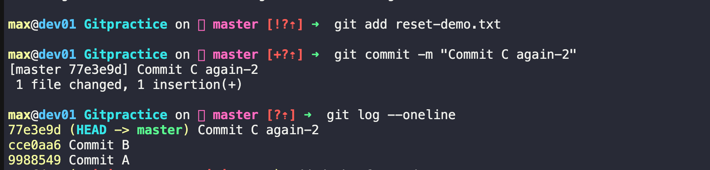

# Task 1: Git Reset — Hands-On

### Make 3 Commits (A, B, C)
Switch to your practice repository:
```bash 
git switch master/main 
```

Commit A
```bash 
echo "Commit A" > reset-demo.txt
git add reset-demo.txt
git commit -m "Commit A"
```

Commit B
```bash 
echo "Commit B" >> reset-demo.txt
git add reset-demo.txt
git commit -m "Commit B"
```
Commit C
```bash 
echo "Commit C" >> reset-demo.txt
git add reset-demo.txt
git commit -m "Commit C"
```

Verify:
```bash
git log --oneline --graph --decorate
```
Output: 
```
c3c3c3c Commit C
b2b2b2b Commit B
a1a1a1a Commit A
```


### Use git reset --soft to Go Back One Commit

Run:
```bash 
git reset --soft HEAD~1
```
History becomes:
```
b2b2b2b Commit B
a1a1a1a Commit A
```
Output:
 

Check status:
```bash 
git status 
```
Output:
```
Changes to be committed:
  modified: reset-demo.txt
  ```
  Output: 
  

  What Happened?
  - Commit C wad Removed from the history 
  - The changes from Commit C are still present 
  - The changes remain staged. 

Think of it as 
```
Commit removed ✅
Changes kept ✅
Staging kept ✅
```
###  Re-Commit
```bash 
git commit -m "Commit C again"
```
Output: 


### Use git reset --mixed
Run:

```bash 
git reset --mixed HEAD~1
```
(or simply)
```bash 
git reset HEAD~1
```
Check status:
```bash
git status 
```
Output:
```
Changes not staged for commit:
  modified: reset-demo.txt
```


What Happened?
- Commit C removed.
- Changes still exist.
- Changes are no longer staged.

Think of it as
```
Commit removed ✅
Changes kept ✅
Staging removed ✅
```
### Re-Commit Again
```bash 
git add reset-demo.txt
git commit -m "Commit C again-2"
```
Output: 


### Use git reset --hard
Run:
```bash 
git reset --hard HEAD~1
```
Output:
```
HEAD is now at b2b2b2b Commit B
```
Outout: 


Check:
```bash 
git status 
```
Output:
```
nothing to commit, working tree clean
```
Open file:
```bash 
cat reset-demo.txt
```
Output: 


What Happened?
- Commit C removed.
- Changes removed.
- Staging removed.

Everything from Commit C is gone.

Everything from Commit C is gone.
```
Commit removed ✅
Changes removed ✅
Staging removed ✅
```

### Visual Comparison
Suppose:
```bash 
A --- B --- C (HEAD)
```

```bash 
git reset --soft HEAD~1
```
```
A --- B (HEAD)
```
Changes from C:
```
staged
```
---
```bash 
git reset --mixed HEAD~1
```

```
A --- B (HEAD)
```
Changes from C:
```
Unstaged
```
---

```bash 
git reset --hard HEAD~1
```
```
A --- B (HEAD)
```
Changes from C:
```
Deleted
```

### Answer in Your Notes

# Git Reset Notes

## What is the difference between --soft, --mixed, and --hard?

### git reset --soft

Moves HEAD backward but keeps all changes staged.

Example:

```bash
git reset --soft HEAD~1
```

Result:

- Commit removed
- Changes preserved
- Changes staged

---

### git reset --mixed

Moves HEAD backward and unstages changes.

Example:

```bash
git reset --mixed HEAD~1
```

Result:

- Commit removed
- Changes preserved
- Changes unstaged

---

### git reset --hard

Moves HEAD backward and deletes changes.

Example:

```bash
git reset --hard HEAD~1
```

Result:

- Commit removed
- Changes deleted
- Staging cleared

---

## Which one is destructive and why?

### git reset --hard

This is destructive because it permanently removes:

- Commits
- Staged changes
- Working directory changes

If the commits are not recoverable through the reflog, the work may be lost.

---

## When would you use each one?

### Use --soft

When:

- Commit message is wrong
- Need to combine commits
- Want to recommit immediately

Example:

```bash
git reset --soft HEAD~1
```

Edit and recommit.

---

### Use --mixed

When:

- Want to keep changes
- Need to reorganize staging
- Need to review files before committing again

Example:

```bash
git reset HEAD~1
```

---

### Use --hard

When:

- Need to discard unwanted work
- Want repository to exactly match a previous commit

Example:

```bash
git reset --hard HEAD~1
```

Use with caution.

---

## Should you ever use git reset on commits that are already pushed?

Generally, no.

Why?

Because reset rewrites commit history.

If other developers have already pulled those commits:

- Their history will differ
- Future pushes may fail
- Merge conflicts may occur
- Team collaboration becomes difficult

Safe Rule:

Use reset freely on local commits.

Avoid resetting pushed commits unless you fully understand the impact and coordinate with the team.

# Task 2: Git Revert — Hands-On

- Ulike **git reset** , git revert does not remove commits. Instead it creates a new commit that undoes the changes made by previous commit .

### Make 3 Commits (X, Y, Z)

- switch to main 
```bash
git switch main/master 
```

Create a file:

Commit X
```bash 
echo "Feature X" > revert-demo.txt
git add revert-demo.txt
git commit -m "Commit X"
```

Commit Y
```bash 
echo "Feature Y" >> revert-demo.txt
git add revert-demo.txt
git commit -m "Commit Y"
```
Commit Z
```bash 
echo "Feature Z" >> revert-demo.txt
git add revert-demo.txt
git commit -m "Commit Z"
```

Check history:
```bash 
git log --oneline
```

Example:
```
c3c3c3c Commit Z
b2b2b2b Commit Y
a1a1a1a Commit X
```
OUTPUT: 


### Revert Commit Y (the Middle Commit)
Copy the hash of Commit Y.

Example:
```
b2b2b2b
```

Run:
```bash 
git revert b2b2b2b
```
- Git may open an editor for the commit message.
- Save and exit.

Or use:
```bash 
git revert --no-edit b2b2b2b
```

### What Happens?
- Git creates a new commit that reverses the changes introduced by Commit Y.

Before:
```bash 
X --- Y --- Z
```

After:
```bash 
X --- Y --- Z --- R
```
Where:
```bash 
R = Revert "Commit Y"
```
- No commits are deleted.

### Check Git Log

Run:
```bash 
git log --oneline 
```
Example:
```
d4d4d4d Revert "Commit Y"
c3c3c3c Commit Z
b2b2b2b Commit Y
a1a1a1a Commit X
```
### Is Commit Y Still in History?
- YES -> commit Y still exists 
- Git simply add another commit that undoes it . 

### Verify the File
view file contents: 
```bash 
cat revert-demo.txt
```
Expected: 
```bash 
Feature X
Feature Z
```
- The changes from Y have been undone, But Y is still visible in History 

### Answer in Your Notes

# Git Revert Notes

## How is git revert different from git reset?

### git reset

Moves the branch pointer backward and can remove commits from history.

Example:

```bash
git reset --hard HEAD~1
```

Result:

```text
X --- Y --- Z
```

becomes

```text
X --- Y
```

Commit Z disappears from branch history.

---

### git revert

Creates a new commit that undoes a previous commit.

Example:

```bash
git revert <commit-hash>
```

Result:

```text
X --- Y --- Z --- R
```

R = Revert commit

Original commits remain in history.

---

## Why is revert considered safer than reset for shared branches?

Revert does not rewrite history.

It simply adds a new commit.

Benefits:

- Safe for team collaboration
- No force push required
- Other developers' histories remain unchanged
- Easy to track what was reverted

Reset changes commit history and can break collaboration if commits were already pushed.

---

## When would you use revert vs reset?

### Use Revert

- On shared branches
- On production branches
- When commits are already pushed
- When you want a complete audit trail

Example:

```bash
git revert <commit-hash>
```

---

### Use Reset

- For local commits
- Before pushing
- When cleaning up commit history
- When you want to remove commits completely

Example:

```bash
git reset --soft HEAD~1
```

or

```bash
git reset --hard HEAD~1
```

---

## Summary

| Feature | git reset | git revert |
|----------|------------|------------|
| Removes commits from branch history | Yes | No |
| Creates a new commit | No | Yes |
| Rewrites history | Yes | No |
| Safe for shared branches | No | Yes |
| Requires force push after push | Often Yes | No |

---

### Golden Rule

If the commit has already been pushed and shared:

✅ Use `git revert`

If the commit is local and not shared:

✅ Use `git reset`

Q -> Why is git revert safer than git reset?
- git revert preserves history by creating a new commit that undoes a previous commit, making it safe for shared branches. git reset rewrites history by moving branch pointers and potentially removing commits, which can cause problems for other developers who have already pulled those commits.


# Task 3: Reset vs Revert — Summary

Create a comparison in your notes:

# Git Reset vs Git Revert

| Feature | git reset | git revert |
|----------|------------|------------|
| What it does | Moves the branch pointer to a previous commit and can remove commits from the current branch history | Creates a new commit that undoes the changes made by a previous commit |
| Removes commit from history? | Yes | No |
| Safe for shared/pushed branches? | No | Yes |
| Rewrites history? | Yes | No |
| Creates a new commit? | No | Yes |
| When to use | For local commits that have not been pushed, cleaning up history, fixing recent mistakes | For undoing changes on shared or pushed branches while preserving history |

---

## Example: git reset

Before:

```text
A --- B --- C
```

Command:

```bash
git reset --hard HEAD~1
```

After:

```text
A --- B
```

Commit C is removed from the branch history.

---

## Example: git revert

Before:

```text
A --- B --- C
```

Command:

```bash
git revert <hash-of-B>
```

After:

```text
A --- B --- C --- R
```

Where:

```text
R = Revert "B"
```

Commit B still exists in history, but its changes are undone.

---

## Rule of Thumb

### Use git reset when:

- The commit is local
- The commit has not been pushed
- You want to rewrite history
- You made a mistake in recent commits

Example:

```bash
git reset --soft HEAD~1
```

---

### Use git revert when:

- The commit has already been pushed
- Other developers may have pulled it
- You want a safe way to undo changes
- You need a complete audit trail

Example:

```bash
git revert <commit-hash>
```

---

## Interview Answer

**Q: When should you use reset vs revert?**

**Answer:**  
Use `git reset` for local, unpublished commits when you need to modify or remove commit history. Use `git revert` for pushed or shared commits because it safely undoes changes by creating a new commit without rewriting history.

# Task 4: Branching Strategies


## 1. GitFlow

### How it Works

GitFlow uses multiple long-lived branches:

- `main` → Production-ready code
- `develop` → Integration branch for ongoing development
- `feature/*` → New features
- `release/*` → Prepare releases
- `hotfix/*` → Emergency production fixes

It is designed around scheduled releases.

### Diagram

```text
main ------------------------->

         hotfix
            |
            v

develop ---------------------->

   |      |       |
   v      v       v

feature feature feature

          |
          v

       release
```

### When/Where It's Used

- Enterprise applications
- Banking projects
- Large teams
- Products with scheduled releases
- Software that ships monthly or quarterly

### Pros

- Clear structure
- Easy release management
- Separate release and development work
- Good for large teams

### Cons

- Complex workflow
- Many branches to manage
- More merge overhead
- Slower delivery for fast-moving teams

---

## 2. GitHub Flow

### How it Works

GitHub Flow is simple:

1. Create a branch from `main`
2. Make changes
3. Open a Pull Request
4. Review code
5. Merge into `main`
6. Deploy

Only one permanent branch exists: `main`.

### Diagram

```text
main ---------------------------->

      \
       feature-login
              \
               Pull Request
                \
                 Merge
                  \
main ---------------------------->
```

### When/Where It's Used

- SaaS products
- Startups
- Continuous deployment environments
- Open-source projects

### Pros

- Very simple
- Easy to learn
- Fast releases
- Works well with CI/CD

### Cons

- Less structured
- Harder to manage multiple release versions
- Not ideal for complex release schedules

---

## 3. Trunk-Based Development (TBD)

### How it Works

Everyone integrates code frequently into a single branch called the **trunk** (usually `main`).

Branches are short-lived and merged quickly.

### Diagram

```text
main ---------------------------->

   \  /
    \/
    /\

   /  \

main ---------------------------->
```

### When/Where It's Used

- High-performing DevOps teams
- Continuous Delivery
- Cloud-native applications
- Organizations deploying multiple times per day

### Pros

- Fastest delivery speed
- Fewer merge conflicts
- Encourages Continuous Integration
- Cleaner workflow

### Cons

- Requires strong automated testing
- Requires mature CI/CD pipelines
- Can be risky without automation

---

# Comparison Table

| Strategy | Complexity | Release Speed | Best For |
|-----------|-----------|--------------|----------|
| GitFlow | High | Slow-Medium | Large enterprises |
| GitHub Flow | Low | Fast | Startups, Open Source |
| Trunk-Based Development | Medium | Very Fast | DevOps & Continuous Delivery |

---

# Answers

## Which strategy would you use for a startup shipping fast?

### GitHub Flow

Reason:

- Fast releases
- Minimal process overhead
- Easy to manage with small teams
- Supports Continuous Deployment

---

## Which strategy would you use for a large team with scheduled releases?

### GitFlow

Reason:

- Separate development and release branches
- Better release planning
- Easier coordination among many developers
- Supports hotfix and release management

---

## Which one does your favorite open-source project use?

### Kubernetes

Repository:
https://github.com/kubernetes/kubernetes

Kubernetes primarily follows a workflow closest to **GitHub Flow**:

- Feature branches
- Pull Requests
- Code Reviews
- Merge into main development branches

It does not use a permanent `develop` branch like GitFlow.

---

# Interview Summary

## Which branching strategy is most popular today?

For modern DevOps and cloud-native teams:

- GitHub Flow
- Trunk-Based Development

are the most common because they support:

- Continuous Integration (CI)
- Continuous Delivery (CD)
- Faster releases

GitFlow is still popular in organizations with structured release cycles and formal release management.