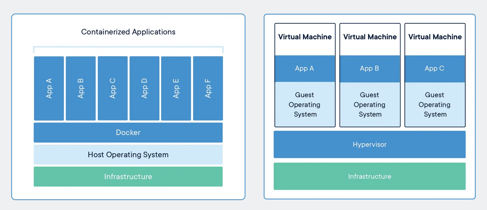

# Task 1: What is Docker?

### Q1 -> What is a Container and Why Do We Need Them?
A container is a lightweight, standalone package that contains everything an application needs to run:

- Application code 
- Runtime 
- System libraries 
- Dependencies
- Configuration files

Containers share the host operarting system's kernal , making them much lighter than virtual machines.

### Why do we need containers?

Before containers, developers often faced the "It works on my machine" problem because applications behaved differently across environments.

Containers solve this by:

- Providing the same environment everywhere (development, testing, production)
- Eliminating dependency conflicts
- Starting in seconds
- Using fewer system resources
- Making deployment faster and more reliable
- Scaling applications easily

Example:

- Imagine developing a Python application on your laptop. Instead of asking others to install Python, libraries, and dependencies manually, you package everything into a Docker container. Anyone with Docker can run it with a single command.

### Q2 -> 2. Containers vs Virtual Machines

```
| Feature        | Containers           | Virtual Machines       |
| -------------- | -------------------- | ---------------------- |
| OS             | Share host OS kernel | Each VM has its own OS |

| Size           | MBs                  | GBs                    |

| Startup Time   | Seconds              | Minutes                |

| Performance    | Near native          | Slight overhead        |

| Resource Usage | Low                  | High                   |

| Isolation      | Process-level        | Hardware-level         |

| Portability    | Very High            | Moderate               |

```

```text 
1. Resource Utilization: Containers share the host operating system kernel, making them lighter and faster than VMs. VMs have a full-fledged OS and hypervisor, making them more resource-intensive.

2. Portability: Containers are designed to be portable and can run on any system with a compatible host operating system. VMs are less portable as they need a compatible hypervisor to run.

3. Security: VMs provide a higher level of security as each VM has its own operating system and can be isolated from the host and other VMs. Containers provide less isolation, as they share the host operating system.

```



- Containers share the same operating system kernel, making them lightweight and fast.
- Each VM has its own operating system, consuming more CPU, RAM, and storage.

### Q3-> Docker Architecture

Docker follows a client-server architecture.

It consists of five main components:

i. Docker Client

- The Docker Client is the command-line interface (CLI) that users interact with.

Example commands:
```bash 
docker run ngnix 
docker build . 
docker pull ubuntu 
```
- The client sends request to Docker Daemon 

ii. Docker Daemon (`dockerd`)

The Docker Daemon is the background service responsible for:

- Building images
- Running containers
- Managing networks
- Managing volumes
- Communicating with registries

It listens for Docker API requests from the client.

iii. Docker Images

A Docker Image is a read-only template used to create containers.

- Think of an image like a blueprint or recipe.

Examples:

- Ubuntu image
- Nginx image
- Python image

Images contain:

- Base operating system
- Application
- Dependencies
- Libraries

Images are immutable (they don't change after creation).

iv. Docker Containers

A container is a running instance of an image.

Example:

```
Image
   ↓
docker run
   ↓
Container
```
- One image can create many containers.

Example:

```
Ubuntu Image
     ↓
------------------------
Container 1
Container 2
Container 3
```

v. Docker Registry

A registry stores Docker images.

The default public registry is Docker Hub

You can:
```
Pull images
Push your own images
Store private images
```

Examples:
```
Docker Hub
Private Registry
Cloud registries (such as those provided by major cloud platforms)
```

### Q4 -> Docker Architecture (In My Own Words)

Imagine Docker as an online food delivery system.

```
                USER
                  |
          docker run nginx
                  |
                  ▼
          Docker Client (CLI)
                  |
          Sends API Request
                  |
                  ▼
        Docker Daemon (dockerd)
                  |
      -------------------------
      |           |           |
      ▼           ▼           ▼
  Docker      Docker      Docker
  Images    Containers   Networks
                  |
                  ▼
          Pull image if missing
                  |
                  ▼
         Docker Registry (Docker Hub)

```

Explanation:

1. The user types a command like:

```bash 
docker run ngnix 
```
2. The Docker Client sends this request to the Docker Daemon.
3. The Docker Daemon checks whether the Nginx image exists locally.
4. If the image isn't available, the daemon downloads it from the Docker Registry (Docker Hub).
5. The daemon creates a container from the image.
6. The application starts running inside the container
