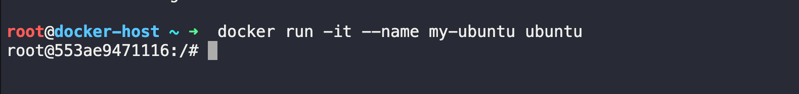
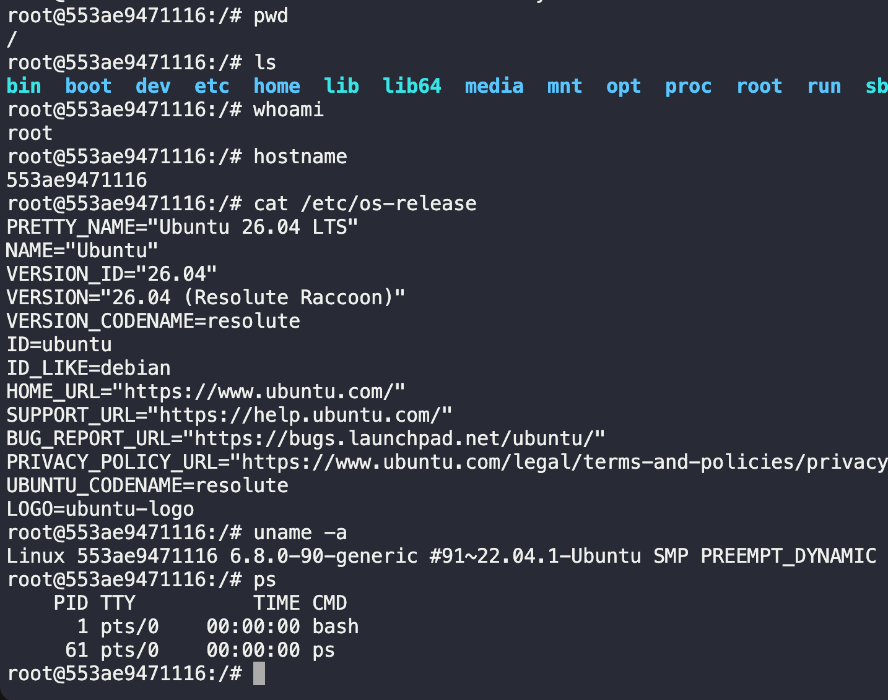
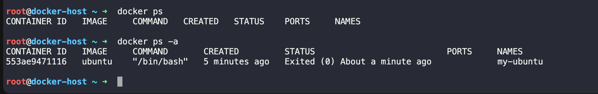
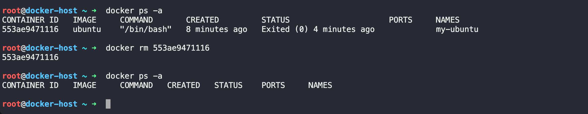
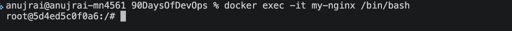

# Task 1: What is Docker?

### Q1 -> What is a Container and Why Do We Need Them?
A container is a lightweight, standalone package that contains everything an application needs to run:

- Application code 
- Runtime 
- System libraries 
- Dependencies
- Configuration files

Containers share the host operarting system's kernal , making them much lighter than virtual machines.

### Why do we need containers?

Before containers, developers often faced the "It works on my machine" problem because applications behaved differently across environments.

Containers solve this by:

- Providing the same environment everywhere (development, testing, production)
- Eliminating dependency conflicts
- Starting in seconds
- Using fewer system resources
- Making deployment faster and more reliable
- Scaling applications easily

Example:

- Imagine developing a Python application on your laptop. Instead of asking others to install Python, libraries, and dependencies manually, you package everything into a Docker container. Anyone with Docker can run it with a single command.

### Q2 -> 2. Containers vs Virtual Machines

```
| Feature        | Containers           | Virtual Machines       |
| -------------- | -------------------- | ---------------------- |
| OS             | Share host OS kernel | Each VM has its own OS |

| Size           | MBs                  | GBs                    |

| Startup Time   | Seconds              | Minutes                |

| Performance    | Near native          | Slight overhead        |

| Resource Usage | Low                  | High                   |

| Isolation      | Process-level        | Hardware-level         |

| Portability    | Very High            | Moderate               |

```

```text 
1. Resource Utilization: Containers share the host operating system kernel, making them lighter and faster than VMs. VMs have a full-fledged OS and hypervisor, making them more resource-intensive.

2. Portability: Containers are designed to be portable and can run on any system with a compatible host operating system. VMs are less portable as they need a compatible hypervisor to run.

3. Security: VMs provide a higher level of security as each VM has its own operating system and can be isolated from the host and other VMs. Containers provide less isolation, as they share the host operating system.

```


- Containers share the same operating system kernel, making them lightweight and fast.
- Each VM has its own operating system, consuming more CPU, RAM, and storage.

### Q3-> Docker Architecture

Docker follows a client-server architecture.

It consists of five main components:

i. Docker Client

- The Docker Client is the command-line interface (CLI) that users interact with.

Example commands:
```bash 
docker run ngnix 
docker build . 
docker pull ubuntu 
```
- The client sends request to Docker Daemon 

ii. Docker Daemon (`dockerd`)

The Docker Daemon is the background service responsible for:

- Building images
- Running containers
- Managing networks
- Managing volumes
- Communicating with registries

It listens for Docker API requests from the client.

iii. Docker Images

A Docker Image is a read-only template used to create containers.

- Think of an image like a blueprint or recipe.

Examples:

- Ubuntu image
- Nginx image
- Python image

Images contain:

- Base operating system
- Application
- Dependencies
- Libraries

Images are immutable (they don't change after creation).

iv. Docker Containers

A container is a running instance of an image.

Example:

```
Image
   ↓
docker run
   ↓
Container
```
- One image can create many containers.

Example:

```
Ubuntu Image
     ↓
------------------------
Container 1
Container 2
Container 3
```

v. Docker Registry

A registry stores Docker images.

The default public registry is Docker Hub

You can:
```
Pull images
Push your own images
Store private images
```

Examples:
```
Docker Hub
Private Registry
Cloud registries (such as those provided by major cloud platforms)
```

### Q4 -> Docker Architecture (In My Own Words)

Imagine Docker as an online food delivery system.

```
                USER
                  |
          docker run nginx
                  |
                  ▼
          Docker Client (CLI)
                  |
          Sends API Request
                  |
                  ▼
        Docker Daemon (dockerd)
                  |
      -------------------------
      |           |           |
      ▼           ▼           ▼
  Docker      Docker      Docker
  Images    Containers   Networks
                  |
                  ▼
          Pull image if missing
                  |
                  ▼
         Docker Registry (Docker Hub)

```

Explanation:

1. The user types a command like:

```bash 
docker run ngnix 
```
2. The Docker Client sends this request to the Docker Daemon.
3. The Docker Daemon checks whether the Nginx image exists locally.
4. If the image isn't available, the daemon downloads it from the Docker Registry (Docker Hub).
5. The daemon creates a container from the image.
6. The application starts running inside the container


# Task 2: Install Docker

### Step 1: Install Docker Desktop

-  Go to the official Docker website.
- Download Docker Desktop for Mac (choose the version for your Mac: Apple Silicon or Intel).
- Install it by dragging Docker.app into the Applications folder.
- Launch Docker Desktop.
- Wait until Docker starts. You'll see the whale icon in the menu bar and a message like:

```text 
Docker Desktop is running
```

### Step 2: Verify the Installation
Open Terminal and run:
```bash 
docker --version
```

Example output:
```bash 
anujrai@anujrai-mn4561 90DaysOfDevOps % docker --version 
Docker version 29.2.1, build a5c7197
anujrai@anujrai-mn4561 90DaysOfDevOps % 
```

Now check whether Docker is running:
```bash 
docker info 
```
Output: 
```
Client
Server
Containers
Images
Storage Driver
CPUs
Memory

Client:
 Version:    29.2.1
 Context:    desktop-linux
 Debug Mode: false
 Plugins:
  agent: create or run AI agents (Docker Inc.)
    Version:  v1.27.1
    Path:     /Users/anujrai/.docker/cli-plugins/docker-agent


Server:
 Containers: 8
  Running: 5
  Paused: 0
  Stopped: 3
 Images: 11
 Server Version: 29.2.1
 Storage Driver: overlayfs
  driver-type: io.containerd.snapshotter.v1
 Logging Driver: json-file
 Cgroup Driver: cgroupfs
 Cgroup Version: 2
 Plugins:
  Volume: local
  Network: bridge host ipvlan macvlan null overlay
  Log: awslogs fluentd gcplogs gelf journald json-file local splunk syslog
 CDI spec directories:
  /etc/cdi
  /var/run/cdi
 Discovered Devices:
  cdi: docker.com/gpu=webgpu
 Swarm: inactive
 Runtimes: io.containerd.runc.v2 runc
 Default Runtime: runc
 Init Binary: docker-init
 containerd version: dea7da592f5d1d2b7755e3a161be07f43fad8f75
 runc version: v1.3.4-0-gd6d73eb8
 init version: de40ad0
 Security Options:
  seccomp
   Profile: builtin
  cgroupns
 Kernel Version: 6.12.72-linuxkit
 Operating System: Docker Desktop
 OSType: linux
 Architecture: aarch64
 CPUs: 12
 Total Memory: 7.652GiB
 Name: docker-desktop
 ID: 442fccd1-683e-4f3e-a921-c3453db7153b
 Docker Root Dir: /var/lib/docker
 Debug Mode: false
 HTTP Proxy: http.docker.internal:3128
 HTTPS Proxy: http.docker.internal:3128
 No Proxy: hubproxy.docker.internal
 Labels:
  com.docker.desktop.address=unix:///Users/anujrai/Library/Containers/com.docker.docker/Data/docker-cli.sock
 Experimental: false
 Insecure Registries:
  hubproxy.docker.internal:5555
  ::1/128
  127.0.0.0/8
 Live Restore Enabled: false
 Firewall Backend: iptables

````


### Step 3: Run Your First Container

Run:

```bash 
docker run hello-world
```
- The first time, Docker downloads the image because it isn't available locally.

Example output:
```
Unable to find image 'hello-world:latest' locally
latest: Pulling from library/hello-world
Status: Downloaded newer image for hello-world:latest
...
Hello from Docker!
This message shows that your installation appears to be working correctly.
...
```

### Step 4: Understand What Happened

When we executed:

```bash 
docker run hello-world 
```
Docker performed these steps:

i. Docker Client Received the Command
```bash 
docker run hello-world 
```
- The Docker Client sent this request to the Docker Daemon.

ii. Docker Daemon Looked for the Image

- Docker checked whether the hello-world image already existed on your computer.

- Since this was your first run, the image wasn't found.

iii. Docker Pulled the Image
- Docker automatically downloaded the hello-world image from Docker Hub, the default Docker registry.

iv. Docker Created a Container
- After downloading the image, Docker created a new container from it.

Think of it like this:
```
Image
   ↓
docker run
   ↓
Container
```

v. The Container Executed

The hello-world program inside the container printed the message:
```
Hello from Docker!
```
This confirms that Docker is working correctly.

vi. The Container Stopped
- The hello-world application completed its task and exited.

- Since the container had nothing else to do, it stopped automatically.

### Step 5: Verify the Container

Run: 
```bash 
docker ps -a 
```

```
anujrai@anujrai-mn4561 90DaysOfDevOps % docker ps -a
CONTAINER ID   IMAGE                       COMMAND                  CREATED          STATUS                      PORTS                                 NAMES
f6d4f939f30e   hello-world                 "/hello"                 17 seconds ago   Exited (0) 16 seconds ago                 
```
Exited (0) means:
- The program completed successfully.
- No errors occurred.


### Step 6: Check Downloaded Images

List local images:
```bash 
docker images 
```

Example output:
```
REPOSITORY    TAG       IMAGE ID
hello-world   latest    abc12345
```


- This confirms the image has been downloaded and stored locally.


## Flow of What Happened

```
You type:
docker run hello-world
        │
        ▼
Docker Client
        │
        ▼
Docker Daemon
        │
        ▼
Checks for image locally
        │
        ├── Found? → Create container
        │
        └── Not found
                │
                ▼
        Download image from Docker Hub
                │
                ▼
        Create container
                │
                ▼
        Run application
                │
                ▼
        Print "Hello from Docker!"
                │
                ▼
        Container exits
   
```


# Task 3: Run Real Containers

### 1. Run an Nginx Container

Start an Nginx container:
```bash 
docker run -d --name my-nginx -p 8080:80 nginx
```
What each option means

| Option            | Meaning                                                       |
| ----------------- | ------------------------------------------------------------- |
| `docker run`      | Create and start a container                                  |
| `-d`              | Run in detached (background) mode                             |
| `--name my-nginx` | Give the container a custom name                              |
| `-p 8080:80`      | Map port 8080 on your machine to port 80 inside the container |
| `nginx`           | Docker image to use                                           |

Verify It's Running
```bash
docker ps 
```
Example output:

```
CONTAINER ID   IMAGE    STATUS         PORTS
abc12345       nginx    Up 2 minutes   0.0.0.0:8080->80/tcp
```

Access Nginx in Your Browser

Open:
```
http://localhost:8080
```
- You should see the default Welcome to nginx! page.

This confirms:
- Docker container is running.
- Port mapping works.
- Nginx is serving web pages.


### 2.Run an Ubuntu Container in Interactive Mode
Start Ubuntu:

```bash
docke run -it --name my-ubuntu ubuntu 
```
Docker may first download the Ubuntu image if it isn't already available.

The prompt changes to something like:
```
root@4d8c7e:/#
```
OUTPUT:


- You're now inside the Ubuntu container.

Explore the Ubuntu Container
Try these commands:
```bash 
pwd
ls 
whoami 
hostname
cat /etc/os-release
uname -a
ps

```
OUTPUT 



Exit the Container
```
exit
```
- The container stops after you exit because its main process has ended.

### 3. List Running Containers

### 4. List All Containers

```bash 
docker ps # This shows only containers that are currently running. 
   OR
docker ps -a # This includes both running and stopped containers.
```
Example:
```
CONTAINER ID   IMAGE   STATUS
abc123         nginx   Up 5 minutes
```
OUTPUT: 


- This shows only containers that are currently running. 

### 5. Stop a Container

Stop the ubuntu container:
```bash 
docker stop ubuntu 
```
Verify:
```bash 
docker ps 
```
- The Ubuntu container should no longer appear because it's stopped.


### 6. Remove a Container

Remove the stopped/exited ubuntu container:

```bash 
docker rm my-ubuntu
    OR 
docker rm 553ae9471116
```
Verify:
```bash 
docker ps -a
```
OUTPUT: 



- The removed containers will no longer be listed


How It Works
```
docker run
      │
      ▼
Docker checks if the image exists locally
      │
      ├── Yes → Use local image
      └── No  → Download image from Docker Hub
                    │
                    ▼
             Create a new container
                    │
                    ▼
              Start the container
                    │
                    ▼
         Application runs inside it

```

# Task 4: Working with Running Containers

### Step 1: Run an Nginx Container in Detached Mode

Run the following command:
```bash 
docker run -d  --name my-nginx -p 8080:80 nginx
```
Explanation

| Option            | Meaning                                                |
| ----------------- | ------------------------------------------------------ |
| `docker run`      | Create and start a container                           |
| `-d`              | Detached mode (runs in the background)                 |
| `--name my-nginx` | Assign a name to the container                         |
| `-p 8080:80`      | Map port 8080 on your host to port 80 in the container |
| `nginx`           | Docker image to run                                    |

Verify it's running:
```bash 
docker ps
```
Example output:
```
CONTAINER ID   IMAGE   STATUS      PORTS
8c9f4d5a2a1b   nginx   Up 2 mins   0.0.0.0:8080->80/tcp
```
OUTPUT : 
```

anujrai@anujrai-mn4561 90DaysOfDevOps % docker run -d  --name my-nginx -p 8080:80 nginx
5d4ed5c0f0a6a14a3642fd7bb292e8646e8556f606bb8788d6b9f941bb224516


anujrai@anujrai-mn4561 90DaysOfDevOps % docker ps 
CONTAINER ID   IMAGE                  COMMAND                  CREATED          STATUS         PORTS                                     NAMES
5d4ed5c0f0a6   nginx                  "/docker-entrypoint.…"   10 seconds ago   Up 9 seconds   0.0.0.0:8080->80/tcp, [::]:8080->80/tcp   my-nginx
```


### Step 2: View Container Logs
Every container writes logs to standard output (`stdout`) and standard error (`stderr`).

View the logs:
```bash 
docker logs my-nginx
```
Example output:
```
/docker-entrypoint.sh: Configuration complete; ready for start up
```
- You may also see HTTP access logs after opening http://localhost:8080 in your browser.

### Step 3: View Logs in Real Time (Follow Mode)
To continuously watch the logs:
```bash 
docker logs -f my-nginx
```
Now visit:
```bash 
http://localhost:8080
```
- You'll see new log entries appear immediately, for example:

```
192.168.65.1 - - [05/Jul/2026:09:06:21 +0000] "GET / HTTP/1.1" 304 0 "-" "Mozilla/5.0 (Macintosh; Intel Mac OS X 10_15_7) AppleWebKit/537.36 (KHTML, like Gecko) Chrome/148.0.0.0 Safari/537.36" "-"
^C%                                                                
```

Stop following the logs with:
```
ctl + c 
```
- Tip: `docker logs -f` works like the Linux `tail -f` command.

### Step 4: Enter the Running Container

Open an interactive shell inside the container:

```bash 
docker exec -it my-nginx  /bin/bash 
```
OUTPUT: 
Your prompt changes to something like:


- You're now inside the container.


### Step 5: Explore the Filesystem

Try these commands:
```bash 
pwd 
ls 
ls /

cd /usr/share/nginx/html
pwd

ls -l 

#View the default web page:

cat index.html

#Check the operating system:
cat etc/os-release

# Find the Nginx binary:

which nginx

# List running processes:
ps aux 

# Exit the shell:
exit 
```
OUTPUT: 

```
root@5d4ed5c0f0a6:/# pwd 
/
root@5d4ed5c0f0a6:/# ls 
bin   dev                  docker-entrypoint.sh  home  media  opt   root  sbin  sys  usr
boot  docker-entrypoint.d  etc                   lib   mnt    proc  run   srv   tmp  var
root@5d4ed5c0f0a6:/# ls /
bin   dev                  docker-entrypoint.sh  home  media  opt   root  sbin  sys  usr
boot  docker-entrypoint.d  etc                   lib   mnt    proc  run   srv   tmp  var
root@5d4ed5c0f0a6:/# 
root@5d4ed5c0f0a6:/# cd /usr/share/nginx/html
root@5d4ed5c0f0a6:/usr/share/nginx/html# pwd 
/usr/share/nginx/html
root@5d4ed5c0f0a6:/usr/share/nginx/html# ls 
50x.html  index.html
root@5d4ed5c0f0a6:/usr/share/nginx/html# ls -l
total 8
-rw-r--r-- 1 root root 497 Jun 17 14:40 50x.html
-rw-r--r-- 1 root root 896 Jun 17 14:40 index.html
root@5d4ed5c0f0a6:/usr/share/nginx/html# cat index.html
<!DOCTYPE html>
<html>
<head>
<title>Welcome to nginx!</title>
<style>
html { color-scheme: light dark; }
body { width: 35em; margin: 0 auto;
font-family: Tahoma, Verdana, Arial, sans-serif; }
</style>
</head>
<body>
<h1>Welcome to nginx!</h1>
<p>If you see this page, nginx is successfully installed and working.
Further configuration is required for the web server, reverse proxy, 
API gateway, load balancer, content cache, or other features.</p>

<p>For online documentation and support please refer to
<a href="https://nginx.org/">nginx.org</a>.<br/>
To engage with the community please visit
<a href="https://community.nginx.org/">community.nginx.org</a>.<br/>
For enterprise grade support, professional services, additional 
security features and capabilities please refer to
<a href="https://f5.com/nginx">f5.com/nginx</a>.</p>

<p><em>Thank you for using nginx.</em></p>
</body>
</html>
root@5d4ed5c0f0a6:/usr/share/nginx/html# cat /etc/os-release
PRETTY_NAME="Debian GNU/Linux 13 (trixie)"
NAME="Debian GNU/Linux"
VERSION_ID="13"
VERSION="13 (trixie)"
VERSION_CODENAME=trixie
DEBIAN_VERSION_FULL=13.5
ID=debian
HOME_URL="https://www.debian.org/"
SUPPORT_URL="https://www.debian.org/support"
BUG_REPORT_URL="https://bugs.debian.org/"
root@5d4ed5c0f0a6:/usr/share/nginx/html# which nginx
/usr/sbin/nginx
root@5d4ed5c0f0a6:/usr/share/nginx/html# ps aux 
bash: ps: command not found
root@5d4ed5c0f0a6:/usr/share/nginx/html# 

```

### Step 6: Run a Single Command Without Entering the Container

- You don't always need an interactive shell.

Run a command directly:

```bash 
docker exec my-nginx ls /
```
output: 
```
anujrai@anujrai-mn4561 90DaysOfDevOps % docker exec my-nginx ls -l /
total 64
lrwxrwxrwx   1 root root    7 May  8 16:10 bin -> usr/bin
drwxr-xr-x   2 root root 4096 May  8 16:10 boot
drwxr-xr-x   5 root root  340 Jul  5 08:59 dev
drwxr-xr-x   1 root root 4096 Jun 24 01:22 docker-entrypoint.d
-rwxr-xr-x   1 root root 1620 Jun 24 01:22 docker-entrypoint.sh
drwxr-xr-x   1 root root 4096 Jul  5 08:59 etc
drwxr-xr-x   2 root root 4096 May  8 16:10 home
lrwxrwxrwx   1 root root    7 May  8 16:10 lib -> usr/lib
drwxr-xr-x   2 root root 4096 Jun 23 00:00 media
drwxr-xr-x   2 root root 4096 Jun 23 00:00 mnt
drwxr-xr-x   2 root root 4096 Jun 23 00:00 opt
dr-xr-xr-x 320 root root    0 Jul  5 08:59 proc
drwx------   1 root root 4096 Jul  5 09:41 root
drwxr-xr-x   1 root root 4096 Jul  5 08:59 run
lrwxrwxrwx   1 root root    8 May  8 16:10 sbin -> usr/sbin
drwxr-xr-x   2 root root 4096 Jun 23 00:00 srv
dr-xr-xr-x  11 root root    0 Jul  5 08:59 sys
drwxrwxrwt   2 root root 4096 Jun 23 00:00 tmp
drwxr-xr-x   1 root root 4096 Jun 23 00:00 usr
drwxr-xr-x   1 root root 4096 Jun 23 00:00 var
anujrai@anujrai-mn4561 90DaysOfDevOps % 
```

Check the hostname:
```bash 
dokcer exac my-nginx hostname
```
Output : 
```
anujrai@anujrai-mn4561 90DaysOfDevOps % docker exec my-nginx hostname
5d4ed5c0f0a6
anujrai@anujrai-mn4561 90DaysOfDevOps % 
```
Display the Nginx version:
```bash 
docker exec my-nginx nginx -v
```
OUTPUT:
```bash 
anujrai@anujrai-mn4561 90DaysOfDevOps % docker exec my-nginx nginx -v
nginx version: nginx/1.31.2
anujrai@anujrai-mn4561 90DaysOfDevOps % 
```
Display the current user:
```bash 
docker exec my-nginx whoami
```
OUTPUT: 
```
anujrai@anujrai-mn4561 90DaysOfDevOps % docker exec my-nginx whoami
root
anujrai@anujrai-mn4561 90DaysOfDevOps % 
```
- Each command runs inside the container and then exits.


### Step 7: Inspect the Container

Use:
```bash 
docker inspect my-nginx
```
- This returns a large JSON document containing detailed information about the container.


Find the IP Address

```bash 
docker inspect -f '{{range.NetworkSettings.Networks}}{{.IPAddress}}{{end}}' my-nginx
```
Example:
```
anujrai@anujrai-mn4561 90DaysOfDevOps % docker inspect -f '{{range.NetworkSettings.Networks}}{{.IPAddress}}{{end}}' my-nginx
172.17.0.3

anujrai@anujrai-mn4561 90DaysOfDevOps % 
```

Find Port Mappings

```bash 
docker port my-nginx
```
Example:

```
anujrai@anujrai-mn4561 90DaysOfDevOps % docker port my-nginx
80/tcp -> 0.0.0.0:8080
80/tcp -> [::]:8080

anujrai@anujrai-mn4561 90DaysOfDevOps % 
```
Or view it in the inspection output:
```
docker inspect my-nginx
```

Look for:

```
 "NetworkMode": "bridge",
            "PortBindings": {
                "80/tcp": [
                    {
                        "HostIp": "",
                        "HostPort": "8080"
                    }
                ]
            },
```

Find Mounted Volumes from that JSON Output: 

```
"Mounts": []
```
- Since no volume was mounted, the array is empty.


Commonly Used Commands

| Task                    | Command                                                                                |
| ----------------------- | -------------------------------------------------------------------------------------- |
| Run Nginx               | `docker run -d --name my-nginx -p 8080:80 nginx`                                       |
| List running containers | `docker ps`                                                                            |
| View logs               | `docker logs my-nginx`                                                                 |
| Follow logs             | `docker logs -f my-nginx`                                                              |
| Open shell              | `docker exec -it my-nginx /bin/bash`                                                   |
| Run one command         | `docker exec my-nginx hostname`                                                        |
| Inspect container       | `docker inspect my-nginx`                                                              |
| Show IP                 | `docker inspect -f '{{range.NetworkSettings.Networks}}{{.IPAddress}}{{end}}' my-nginx` |
| Show port mapping       | `docker port my-nginx`                                                                 |


Visual Workflow: 

```
                docker run
                     │
                     ▼
            Running Nginx Container
                     │
      ┌──────────────┼──────────────┐
      │              │              │
      ▼              ▼              ▼
docker logs     docker exec    docker inspect
      │              │              │
      ▼              ▼              ▼
 View logs      Enter container   View metadata
                     │
                     ▼
             Explore filesystem
                     │
                     ▼
            Run Linux commands
```


