# Task 1: Docker Images

Docker Images are Read-only templates used to create containers. Think of an image as a blueprint, and a container as the running instance bult from the blueprint.

### Step 1: Pull Images from Docker Hub
Download the required images.

Pull Nginx
```bash 
docer pull nginx
```
Example output:
```
Using default tag: latest
latest: Pulling from library/nginx
Digest: sha256:...
Status: Downloaded newer image for nginx:latest
docker.io/library/nginx:latest
```
OUTPUT: 
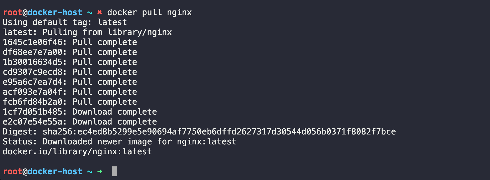


Pull Ubuntu:

```bash 
docker pull ubuntu 
```
OUTPUT: 
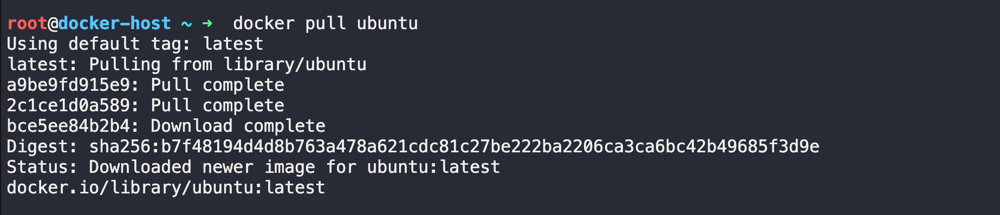

Pull Alpine:

```bash 
docker pull alpine 
```
OUTPUT: 
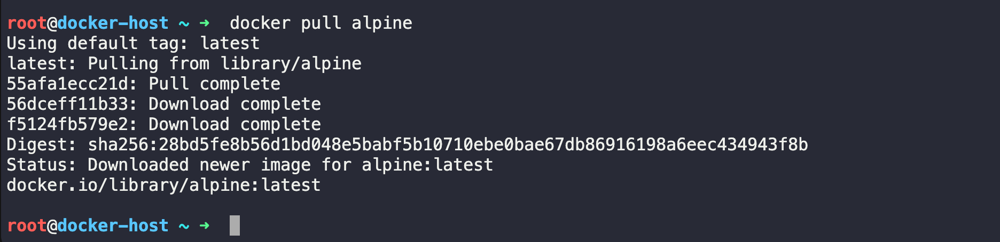

Verify the Downloads:

List the images:

```bash 
docker images 
```
OR 

```bash
docker image ls  
```
OUTPUT: 
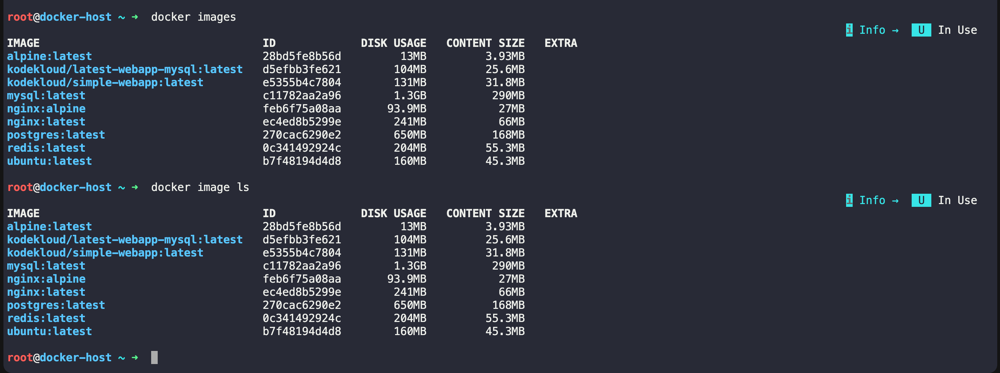

- Note: The exact image sizes may vary depending on the image version.

### Step 2: Compare the Image Sizes

| Image  | Approximate Size | Purpose                            |
| ------ | ---------------: | ---------------------------------- |
| Nginx  |           ~66 MB | Web server                         |
| Ubuntu |           ~45 MB | General-purpose Linux distribution |
| Alpine |            ~4 MB | Minimal Linux distribution         |


### Step 3: Why is Alpine Much Smaller?

Ubuntu: 

Ubuntu includes:
- Many system utilities
- Package Manager (`apt`)
- Documantaion
- Locales
- common linux tools 
- Additional libraries

It is designed as a general-purpose operating system.

Alpine: 

Alpine Linux is built specifically to be:
- Small 
- Fast 
- Secure

It includes only the essentials 
- minimal shell 
- BusyBox utilities
- Small C library (`musl`)
- `apk` package manager 

It removes many packages  ubuntu includes by default;

Comparison: 

| Ubuntu                  | Alpine                           |
| ----------------------- | -------------------------------- |
| Full Linux distribution | Minimal Linux distribution       |
| Uses `apt`              | Uses `apk`                       |
| Larger image            | Very small image                 |
| Easier for beginners    | Better for production containers |
| Includes many utilities | Only essential utilities         |

#### Why Use Alpine?

Advantages:

- Faster Downloads 
- Faster deployments
- Less disk usage
- Lower memory footprint
- Smaller attack surface

Disadvantages:
- Fewer built-in tools
- Some applications require extra configuration
- Slightly steeper learning curve

### Step 4: Inspect an Image
Inspect the Nginx image:

```bash 
docker image inspect nginx
```
OR
```bash 
docker inspect nginx
```
- This returns a JSON document with detailed metadata.

```
root@docker-host ~ ➜  docker inspect nginx
[
    {
        "Id": "sha256:ec4ed8b5299e5e90694af7750eb6dffd2627317d30544d056b0371f8082f7bce",
        "RepoTags": [
            "nginx:latest"
        ],
        "RepoDigests": [
            "nginx@sha256:ec4ed8b5299e5e90694af7750eb6dffd2627317d30544d056b0371f8082f7bce"
        ],
        "Comment": "buildkit.dockerfile.v0",
        "Created": "2026-06-24T01:21:58.377973076Z",
        "Config": {
            "ExposedPorts": {
                "80/tcp": {}
            },
            "Env": [
                "PATH=/usr/local/sbin:/usr/local/bin:/usr/sbin:/usr/bin:/sbin:/bin",
                "NGINX_VERSION=1.31.2",
                "NJS_VERSION=0.9.9",
                "NJS_RELEASE=1~trixie",
                "ACME_VERSION=0.4.1",
                "PKG_RELEASE=1~trixie",
                "DYNPKG_RELEASE=1~trixie"
            ],
            "Entrypoint": [
                "/docker-entrypoint.sh"
            ],
            "Cmd": [
                "nginx",
                "-g",
                "daemon off;"
            ],
            "Labels": {
                "maintainer": "NGINX Docker Maintainers <docker-maint@nginx.com>"
            },
            "StopSignal": "SIGQUIT"
        },
        "Architecture": "amd64",
        "Os": "linux",
        "Size": 63132621,
        "RootFS": {
            "Type": "layers",
            "Layers": [
                "sha256:3edb2192497af6e965b9b7e57dc6dbdce1f3ea721d14a98110419d4ded523298",
                "sha256:fcf6aab8bf4a29699bde607fc21ee39e7e1df2884122b053799359a1665eff8a",
                "sha256:2794799fb83d3e03f69652d5c4fc3a854bd5ed9660d1c134204610943884ab97",
                "sha256:f26790bea8ca1115a2a83d2b101a6351e317b3214cd4336e3d68d0410470d618",
                "sha256:24460d3f0d75ae79324ce00c5e066215cbf2e56de3fc6e2ee651ced7746471e0",
                "sha256:35209d7a0ceb10c48d5b3fb1e4c99cd1c6e79e1cdb2d6f9b67f5a9cc65efc308",
                "sha256:e2a57e9f9993940dfc59e79e137eaae9099af5518b57247276dc5e7c58b554a5"
            ]
        },
        "Metadata": {
            "LastTagTime": "2026-07-06T19:10:11.171354662Z"
        },
        "Descriptor": {
            "mediaType": "application/vnd.oci.image.index.v1+json",
            "digest": "sha256:ec4ed8b5299e5e90694af7750eb6dffd2627317d30544d056b0371f8082f7bce",
            "size": 10229
        },
        "Identity": {
            "Pull": [
                {
                    "Repository": "docker.io/library/nginx"
                }
            ]
        }
    }
]

```

Useful Information we Can Find: 

Image ID
```
"Id": "sha256:ec4ed8b5299e5e90694af7750eb6dffd2627317d30544d056b0371f8082f7bce",
```
- A unique identifier for the image.

Creation Date

```
"Created": "2026-06-24T01:21:58.377973076Z",
```
- Shows when the image was built.

Operating System: 

```
 "Os": "linux",
 ```

CPU Architecture: 
```
"Architecture": "amd64",
```
- depending on your machine

Default Command
```bash 
"Cmd": [
                "nginx",
                "-g",
                "daemon off;"
            ],
```
- This is the command that runs when a container starts from the image.

Environment Variables

```
 "Env": [
                "PATH=/usr/local/sbin:/usr/local/bin:/usr/sbin:/usr/bin:/sbin:/bin",
                "NGINX_VERSION=1.31.2",
                "NJS_VERSION=0.9.9",
                "NJS_RELEASE=1~trixie",
                "ACME_VERSION=0.4.1",
                "PKG_RELEASE=1~trixie",
                "DYNPKG_RELEASE=1~trixie"
            ],
```

Exposed Ports

```
 "ExposedPorts": {
                "80/tcp": {}
            },
```
- This tells you that the image is configured to expose port 80.

#### Image Layers: 

The image consists of multiple read-only layers.

Each Dockerfile instruction (such as RUN, COPY, or ADD) typically creates a new layer.


#### Step 5: Remove an Image

- Remove an image you no longer need:
```bash 
docker rmi alpine 
```
or 
```bash 
docker image rm alpine 
```
- If the image is still being used by a container, you'll see an error like:
```
Error response from daemon:
conflict: unable to remove repository reference
```
In that case:
- Stop the container.
- Remove the container.
- Remove the image.
Example:
```bash 
docker stop my-container

docker rm my-container

docker rmi alpine

```
Verify the Image Was Removed
```bash 
docker images 
```
- The removed image should no longer appear in the list.

OUTOUT: 
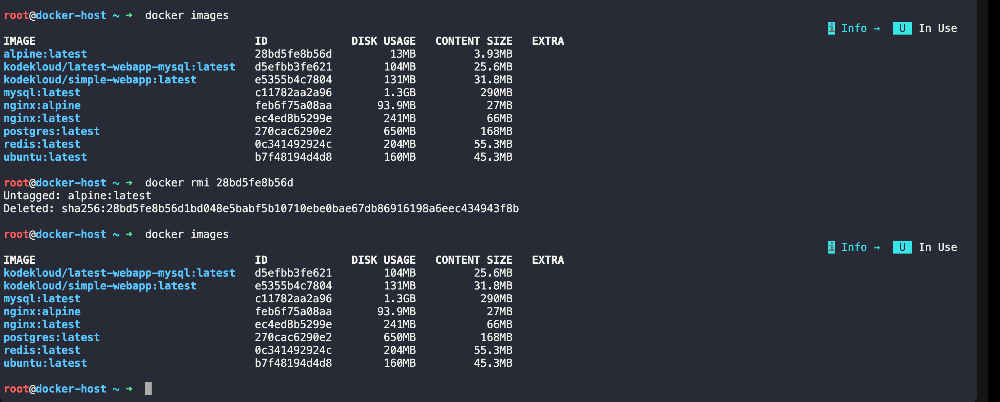


Summary of Commands: 

| Task             | Command                      |
| ---------------- | ---------------------------- |
| Pull Nginx       | `docker pull nginx`          |
| Pull Ubuntu      | `docker pull ubuntu`         |
| Pull Alpine      | `docker pull alpine`         |
| List images      | `docker images`              |
| Inspect an image | `docker image inspect nginx` |
| Remove an image  | `docker rmi alpine`          |


Workflow Diagram

```
Docker Hub
     │
     ▼
docker pull nginx
     │
     ▼
Local Docker Images
     │
     ├───────────────┐
     ▼               ▼
docker images   docker inspect
     │               │
     ▼               ▼
 View images    View metadata
     │
     ▼
docker rmi alpine
     │
     ▼
Image removed
```

#### Q -> Why do many production Docker images use Alpine?

- Alpine provides a much smaller footprint, leading to faster downloads, lower storage and bandwidth usage, reduced memory consumption, and a smaller attack surface, though it may require installing additional packages for some applications


# Task 2: Docker Image Layers

Docker images are built using layers. Understanding layers is one of the most important Docker concepts because it explains why Docker images are efficient, fast, and reusable.

### Step 1: View the Image History

```bash
docker image history nginx
```
OR

```bash
docker history nginx
```
Example output:

```
IMAGE          CREATED        CREATED BY                                      SIZE
6f5b...        2 weeks ago    CMD ["nginx" "-g" "daemon off;"]                0B
<missing>      2 weeks ago    EXPOSE 80                                       0B
<missing>      2 weeks ago    STOPSIGNAL SIGQUIT                              0B
<missing>      2 weeks ago    COPY docker-entrypoint.sh                       4KB
<missing>      2 weeks ago    RUN apt-get update && apt-get install nginx     65MB
<missing>      2 weeks ago    FROM debian:bookworm                            80MB

```

- Note: The exact output varies depending on the Nginx image version.

### Step 2: What Do You/we See?

The output contains several columns:

| Column     | Meaning                                       |
| ---------- | --------------------------------------------- |
| IMAGE      | Image ID for each layer                       |
| CREATED    | When the layer was created                    |
| CREATED BY | Dockerfile instruction that created the layer |
| SIZE       | Size added by that layer                      |

- Each row represents one layer of the image.


### Step 3: Why Do Some Layers Show 0B?

You'll notice that some layers have a size of 0B.

Example:

```
CMD ["nginx" "-g" "daemon off;"]     0B
EXPOSE 80                            0B
WORKDIR /app                         0B
ENV PATH=/usr/local/bin              0B

```
- These instructions only change image metadata. They don't add or modify files, so they don't increase the image size.

Examples of metadata-only instructions:
`CMD`
`ENTRYPOINT`
`EXPOSE`
`ENV`
`LABEL`
`WORKDIR`
`STOPSIGNAL`

Layers with a non-zero size are created by instructions that add or modify files, such as:

```
RUN apt-get install nginx
COPY index.html /usr/share/nginx/html
ADD app.tar.gz /

```
- These instructions create new filesystem changes, so they consume disk space.

### Step 4: What Are Docker Layers?

A Docker Layer is a read-only filesystem layer created by each instruction in a Docker file. 

For example: consider this Dockerfile : 

```dockerfile
FROM ubuntu

RUN apt update

RUN apt install nginx -y

COPY index.html /usr/share/nginx/html

CMD ["nginx", "-g", "daemon off;"]
```
Docker creates the following layers:

```
Layer 5 → CMD
Layer 4 → COPY index.html
Layer 3 → RUN apt install nginx
Layer 2 → RUN apt update
Layer 1 → FROM ubuntu
```
Each new instruction adds a new layer on top of the previous one.

#### Visual Representation

```
--------------------------
Layer 5  CMD
--------------------------
Layer 4  COPY index.html
--------------------------
Layer 3  RUN apt install nginx
--------------------------
Layer 2  RUN apt update
--------------------------
Layer 1  Ubuntu Base Image
--------------------------
Host Operating System

```

When we run a container, Docker adds one more **writable layer** above these read-only image layers.

```

--------------------------
Writable Container Layer
--------------------------
CMD
--------------------------
COPY
--------------------------
RUN apt install
--------------------------
RUN apt update
--------------------------
Ubuntu Base Image
--------------------------

```

### Step 5: Why Does Docker Use Layers?

Docker uses layers for several important reasons.

i. Faster Builds

Docker caches layers.

Suppose your Dockerfile is:

```dockerfile 
FROM ubuntu 
RUN apt update 
RUN apt install nginx -y 
COPY app.py /app/
```
if we change only `app.py ` , Docker reuses the first three cached layers and rebuilds only the `COPY` layer 

This makes the image build much faster.

ii. Saves Disk Space

Images can share common layers.

For example:

```
Image A
Ubuntu
+ Python

Image B
Ubuntu
+ Java

```


Both images share the same Ubuntu base layer instead of storing it twice.

```
          Ubuntu Layer
          /          \
     Python Layer   Java Layer

     ```


Task 1: What is Docker?
Research and write short notes on:

What is a container and why do we need them?
Containers vs Virtual Machines — what's the real difference?
What is the Docker architecture? (daemon, client, images, containers, registry)
Draw or describe the Docker architecture in your own words.

Task 1: What is Docker?
1. What is a Container and Why Do We Need Them?
A container is a lightweight, standalone package that contains everything an application needs to run:

Application code

Runtime

System libraries

Dependencies

Configuration files

Containers share the host operating system's kernel, making them much lighter than virtual machines.

Why do we need containers?
Before containers, developers often faced the "It works on my machine" problem because applications behaved differently across environments.

Containers solve this by:

Providing the same environment everywhere (development, testing, production)

Eliminating dependency conflicts

Starting in seconds

Using fewer system resources

Making deployment faster and more reliable

Scaling applications easily

Example:
Imagine developing a Python application on your laptop. Instead of asking others to install Python, libraries, and dependencies manually, you package everything into a Docker container. Anyone with Docker can run it with a single command.

2. Containers vs Virtual Machines
Feature	Containers	Virtual Machines
OS	Share host OS kernel	Each VM has its own OS
Size	MBs	GBs
Startup Time	Seconds	Minutes
Performance	Near native	Slight overhead
Resource Usage	Low	High
Isolation	Process-level	Hardware-level
Portability	Very High	Moderate
Virtual Machine Architecture
Application
Application
Application
--------------------
Guest OS
Guest OS
Guest OS
--------------------
Hypervisor
--------------------
Host Operating System
--------------------
Physical Hardware
Each VM has its own operating system, consuming more CPU, RAM, and storage.

Container Architecture
Application
Application
Application
--------------------
Container Runtime (Docker)
--------------------
Host Operating System
--------------------
Physical Hardware
Containers share the same operating system kernel, making them lightweight and fast.

Key Difference
Virtual Machine

Includes a complete operating system.

More secure isolation.

Slower startup.

Higher resource usage.

Container

Shares the host OS.

Lightweight.

Starts almost instantly.

Better resource efficiency.

3. Docker Architecture
Docker follows a client-server architecture.

It consists of five main components:

1. Docker Client
The Docker Client is the command-line interface (CLI) that users interact with.

Example commands:

docker run nginx
docker build .
docker pull ubuntu
The client sends requests to the Docker Daemon.

2. Docker Daemon (dockerd)
The Docker Daemon is the background service responsible for:

Building images

Running containers

Managing networks

Managing volumes

Communicating with registries

It listens for Docker API requests from the client.

3. Docker Images
A Docker Image is a read-only template used to create containers.

Think of an image like a blueprint or recipe.

Examples:

Ubuntu image

Nginx image

Python image

Images contain:

Base operating system

Application

Dependencies

Libraries

Images are immutable (they don't change after creation).

4. Docker Containers
A container is a running instance of an image.

Example:

Image
   ↓
docker run
   ↓
Container
One image can create many containers.

Example:

Ubuntu Image
     ↓
------------------------
Container 1
Container 2
Container 3
5. Docker Registry
A registry stores Docker images.

The default public registry is Docker Hub.

You can:

Pull images

Push your own images

Store private images

Examples:

Docker Hub

Private Registry

Cloud registries (such as those provided by major cloud platforms)

4. Docker Architecture (In My Own Words)
Imagine Docker as an online food delivery system.

                USER
                  |
          docker run nginx
                  |
                  ▼
          Docker Client (CLI)
                  |
          Sends API Request
                  |
                  ▼
        Docker Daemon (dockerd)
                  |
      -------------------------
      |           |           |
      ▼           ▼           ▼
  Docker      Docker      Docker
  Images    Containers   Networks
                  |
                  ▼
          Pull image if missing
                  |
                  ▼
         Docker Registry (Docker Hub)
Explanation
The user types a command like:

docker run nginx
The Docker Client sends this request to the Docker Daemon.

The Docker Daemon checks whether the Nginx image exists locally.

If the image isn't available, the daemon downloads it from the Docker Registry (Docker Hub).

The daemon creates a container from the image.

The application starts running inside the container.

Quick Summary
Container: Lightweight package containing an application and all its dependencies.

Why Containers? Consistent environments, portability, faster deployment, and efficient resource usage.

Containers vs VMs: Containers share the host OS kernel and are lightweight; VMs include a full guest OS and use more resources.

Docker Client: Accepts user commands.

Docker Daemon: Performs Docker operations and manages resources.

Docker Image: Immutable template used to create containers.

Docker Container: Running instance of an image.

Docker Registry: Repository for storing and distributing Docker images.


Task 2: Install Docker
Install Docker on your machine (or use a cloud instance)
Verify the installation
Run the hello-world container
Read the output carefully — it explains what just happened

Task 2: Install Docker
Since you're using macOS (from our previous conversations), here's how to complete the task.

Step 1: Install Docker Desktop
Go to the official Docker website.

Download Docker Desktop for Mac (choose the version for your Mac: Apple Silicon or Intel).

Install it by dragging Docker.app into the Applications folder.

Launch Docker Desktop.

Wait until Docker starts. You'll see the whale icon in the menu bar and a message like:

Docker Desktop is running
Step 2: Verify the Installation
Open Terminal and run:

docker --version
Example output:

Docker version 28.3.2, build xxxxxxx
Now check whether Docker is running:

docker info
You should see information about:

Client

Server

Containers

Images

Storage Driver

CPUs

Memory

Step 3: Run Your First Container
Run:

docker run hello-world
The first time, Docker downloads the image because it isn't available locally.

Example output:

Unable to find image 'hello-world:latest' locally
latest: Pulling from library/hello-world
...
Hello from Docker!
This message shows that your installation appears to be working correctly.
...
Step 4: Understand What Happened
When you executed:

docker run hello-world
Docker performed these steps:

1. Docker Client Received the Command
You typed:

docker run hello-world
The Docker Client sent this request to the Docker Daemon.

2. Docker Daemon Looked for the Image
Docker checked whether the hello-world image already existed on your computer.

Since this was your first run, the image wasn't found.

3. Docker Pulled the Image
Docker automatically downloaded the hello-world image from Docker Hub, the default Docker registry.

4. Docker Created a Container
After downloading the image, Docker created a new container from it.

Think of it like this:

Image
   ↓
docker run
   ↓
Container
5. The Container Executed
The hello-world program inside the container printed the message:

Hello from Docker!
This confirms that Docker is working correctly.

6. The Container Stopped
The hello-world application completed its task and exited.

Since the container had nothing else to do, it stopped automatically.

Step 5: Verify the Container
List all containers (including stopped ones):

docker ps -a
Example output:

CONTAINER ID   IMAGE         STATUS
8f4d7b...      hello-world   Exited (0)
Exited (0) means:

The program completed successfully.

No errors occurred.

Step 6: Check Downloaded Images
List local images:

docker images
Example output:

REPOSITORY    TAG       IMAGE ID
hello-world   latest    abc12345
This confirms the image has been downloaded and stored locally.

Flow of What Happened
You type:
docker run hello-world
        │
        ▼
Docker Client
        │
        ▼
Docker Daemon
        │
        ▼
Checks for image locally
        │
        ├── Found? → Create container
        │
        └── Not found
                │
                ▼
        Download image from Docker Hub
                │
                ▼
        Create container
                │
                ▼
        Run application
                │
                ▼
        Print "Hello from Docker!"
                │
                ▼
        Container exits
Expected Outcome
By the end of this task, you should have:

✅ Installed Docker Desktop.

✅ Verified the installation using docker --version and docker info.

✅ Successfully run the hello-world container.

✅ Understood that Docker downloaded the image (if needed), created a container from it, ran the application inside it, displayed the success message, and then stopped the container.

Next step: After completing this, you'll typically move on to working with Docker images and containers using commands such as docker pull, docker run, docker ps, docker stop, docker start, and docker rm.


Task 3: Run Real Containers
Run an Nginx container and access it in your browser
Run an Ubuntu container in interactive mode — explore it like a mini Linux machine
List all running containers
List all containers (including stopped ones)
Stop and remove a container

Task 3: Run Real Containers
In this task, you'll run two real containers:

Nginx (a web server)

Ubuntu (a Linux environment)

You'll also learn basic container management commands.

1. Run an Nginx Container
Start an Nginx container:

docker run -d --name my-nginx -p 8080:80 nginx
What each option means
Option	Meaning
docker run	Create and start a container
-d	Run in detached (background) mode
--name my-nginx	Give the container a custom name
-p 8080:80	Map port 8080 on your machine to port 80 inside the container
nginx	Docker image to use
Verify It's Running
docker ps
Example output:

CONTAINER ID   IMAGE    STATUS         PORTS
abc12345       nginx    Up 2 minutes   0.0.0.0:8080->80/tcp
Access Nginx in Your Browser
Open:

http://localhost:8080
You should see the default Welcome to nginx! page.

This confirms:

Docker container is running.

Port mapping works.

Nginx is serving web pages.

2. Run an Ubuntu Container in Interactive Mode
Start Ubuntu:

docker run -it --name my-ubuntu ubuntu
Docker may first download the Ubuntu image if it isn't already available.

The prompt changes to something like:

root@4d8c7e:/#
You're now inside the Ubuntu container.

Explore the Ubuntu Container
Try these commands:

pwd
ls
whoami
hostname
cat /etc/os-release
uname -a
ps
Exit the Container
exit
The container stops after you exit because its main process has ended.

3. List Running Containers
docker ps
Example:

CONTAINER ID   IMAGE   STATUS
abc123         nginx   Up 5 minutes
This shows only containers that are currently running.

4. List All Containers
docker ps -a
Example:

CONTAINER ID   IMAGE         STATUS
abc123         nginx         Up 5 minutes
xyz987         ubuntu        Exited (0)
aaa555         hello-world   Exited (0)
This includes both running and stopped containers.

5. Stop a Container
Stop the Nginx container:

docker stop my-nginx
Verify:

docker ps
The Nginx container should no longer appear because it's stopped.

6. Remove a Container
Remove the stopped Nginx container:

docker rm my-nginx
Remove the Ubuntu container (if it's stopped):

docker rm my-ubuntu
Verify:

docker ps -a
The removed containers will no longer be listed.

Quick Reference
Task	Command
Run Nginx	docker run -d --name my-nginx -p 8080:80 nginx
Open Nginx	http://localhost:8080
Run Ubuntu interactively	docker run -it --name my-ubuntu ubuntu
Exit Ubuntu	exit
List running containers	docker ps
List all containers	docker ps -a
Stop a container	docker stop <container-name>
Remove a container	docker rm <container-name>
How It Works
docker run
      │
      ▼
Docker checks if the image exists locally
      │
      ├── Yes → Use local image
      └── No  → Download image from Docker Hub
                    │
                    ▼
             Create a new container
                    │
                    ▼
              Start the container
                    │
                    ▼
         Application runs inside it
Expected Outcome
After completing this task, you should be able to:

✅ Run an Nginx web server inside a Docker container.

✅ Access the Nginx welcome page in your browser at http://localhost:8080.

✅ Launch an Ubuntu container and interact with it like a small Linux machine.

✅ View running containers with docker ps.

✅ View all containers with docker ps -a.

✅ Stop containers using docker stop.

✅ Remove stopped containers using docker rm.

These are the fundamental Docker operations you'll use frequently in day-to-day development and DevOps work.


Task 4: Working with Running Containers
Run an Nginx container in detached mode
View its logs
View real-time logs (follow mode)
Exec into the container and look around the filesystem
Run a single command inside the container without entering it
Inspect the container — find its IP address, port mappings, and mounts

Task 4: Working with Running Containers
In this task, you'll learn how to interact with a running container. These are commands you'll use almost daily as a DevOps or SRE engineer.

Step 1: Run an Nginx Container in Detached Mode
Run the following command:

docker run -d --name my-nginx -p 8080:80 nginx
Explanation
Option	Meaning
docker run	Create and start a container
-d	Detached mode (runs in the background)
--name my-nginx	Assign a name to the container
-p 8080:80	Map port 8080 on your host to port 80 in the container
nginx	Docker image to run
Verify it's running:

docker ps
Example output:

CONTAINER ID   IMAGE   STATUS      PORTS
8c9f4d5a2a1b   nginx   Up 2 mins   0.0.0.0:8080->80/tcp
Step 2: View Container Logs
Every container writes logs to standard output (stdout) and standard error (stderr).

View the logs:

docker logs my-nginx
Example output:

/docker-entrypoint.sh: Configuration complete; ready for start up
You may also see HTTP access logs after opening http://localhost:8080 in your browser.

Step 3: View Logs in Real Time (Follow Mode)
To continuously watch the logs:

docker logs -f my-nginx
Now visit:

http://localhost:8080
You'll see new log entries appear immediately, for example:

172.17.0.1 - - [03/Jul/2026:10:15:30 +0000] "GET / HTTP/1.1" 200 615 "-" "Mozilla/5.0"
Stop following the logs with:

Ctrl + C
Tip: docker logs -f works like the Linux tail -f command.

Step 4: Enter the Running Container
Open an interactive shell inside the container:

docker exec -it my-nginx /bin/bash
If Bash isn't available:

docker exec -it my-nginx /bin/sh
Your prompt changes to something like:

root@8c9f4d5a2a1b:/#
You're now inside the container.

Step 5: Explore the Filesystem
Try these commands:

pwd
ls
ls /
cd /usr/share/nginx/html
pwd
ls -l
View the default web page:

cat index.html
Check the operating system:

cat /etc/os-release
Find the Nginx binary:

which nginx
List running processes:

ps aux
Exit the shell:

exit
Step 6: Run a Single Command Without Entering the Container
You don't always need an interactive shell.

Run a command directly:

docker exec my-nginx ls /
Check the hostname:

docker exec my-nginx hostname
Display the Nginx version:

docker exec my-nginx nginx -v
Display the current user:

docker exec my-nginx whoami
Each command runs inside the container and then exits.

Step 7: Inspect the Container
Use:

docker inspect my-nginx
This returns a large JSON document containing detailed information about the container.

Find the IP Address
You can extract just the IP address:

docker inspect -f '{{range.NetworkSettings.Networks}}{{.IPAddress}}{{end}}' my-nginx
Example:

172.17.0.2
Find Port Mappings
docker port my-nginx
Example:

80/tcp -> 0.0.0.0:8080
Or view it in the inspection output:

docker inspect my-nginx
Look for:

"PortBindings": {
    "80/tcp": [
        {
            "HostPort": "8080"
        }
    ]
}
Find Mounted Volumes
Inspect the mounts:

docker inspect my-nginx
Search for:

"Mounts": []
Since no volume was mounted, the array is empty.

If you had started the container with:

docker run -d \
--name my-nginx \
-v ~/website:/usr/share/nginx/html \
-p 8080:80 nginx
The inspection output would include something like:

"Mounts": [
    {
        "Source": "/Users/anuj/website",
        "Destination": "/usr/share/nginx/html"
    }
]
Commonly Used Commands
Task	Command
Run Nginx	docker run -d --name my-nginx -p 8080:80 nginx
List running containers	docker ps
View logs	docker logs my-nginx
Follow logs	docker logs -f my-nginx
Open shell	docker exec -it my-nginx /bin/bash
Run one command	docker exec my-nginx hostname
Inspect container	docker inspect my-nginx
Show IP	docker inspect -f '{{range.NetworkSettings.Networks}}{{.IPAddress}}{{end}}' my-nginx
Show port mapping	docker port my-nginx
Visual Workflow
                docker run
                     │
                     ▼
            Running Nginx Container
                     │
      ┌──────────────┼──────────────┐
      │              │              │
      ▼              ▼              ▼
docker logs     docker exec    docker inspect
      │              │              │
      ▼              ▼              ▼
 View logs      Enter container   View metadata
                     │
                     ▼
             Explore filesystem
                     │
                     ▼
            Run Linux commands
What You Learned
By completing this task, you can now:

✅ Run containers in detached (background) mode.

✅ View container logs and monitor them in real time.

✅ Enter a running container with docker exec -it.

✅ Explore the container's filesystem and processes.

✅ Execute a single command inside a container without opening an interactive shell.

✅ Inspect a container to retrieve its configuration, including its IP address, port mappings, and mounted volumes.

These commands form the foundation for debugging, troubleshooting, and managing containers in real-world DevOps and SRE environments.


Task 5: Cleanup
Stop all running containers in one command
Remove all stopped containers in one command
Remove unused images
Check how much disk space Docker is using

Task 5: Docker Cleanup
As you work with Docker, unused containers, images, networks, and volumes accumulate and consume disk space. Docker provides commands to clean them up efficiently.

Step 1: Stop All Running Containers
Stop every running container with a single command:

docker stop $(docker ps -q)
How it works
docker ps -q lists the IDs of all running containers.

$(...) passes those IDs to docker stop.

Example:

$ docker ps
CONTAINER ID   IMAGE
abc123         nginx
def456         ubuntu

$ docker stop $(docker ps -q)

abc123
def456
Verify that no containers are running:

docker ps
Expected output:

CONTAINER ID   IMAGE   COMMAND   CREATED   STATUS   PORTS   NAMES
Step 2: Remove All Stopped Containers
Remove every stopped container:

docker container prune
Docker will ask for confirmation:

WARNING! This will remove all stopped containers.
Are you sure you want to continue? [y/N]
Type:

y
Without Confirmation
docker container prune -f
Alternatively, you can remove all stopped containers with:

docker rm $(docker ps -aq)
Note: This works only if all containers are already stopped.

Step 3: Remove Unused Images
Delete images that are no longer used by any container:

docker image prune
Confirm with:

y
Skip the confirmation prompt:

docker image prune -f
Remove All Unused Images
To remove all images not referenced by any container (including older tagged images):

docker image prune -a
Or:

docker image prune -a -f
⚠️ Be aware that -a may remove images you'll need to download again later.

Step 4: Check Docker Disk Usage
Display Docker's disk usage:

docker system df
Example output:

TYPE            TOTAL     ACTIVE    SIZE      RECLAIMABLE
Images          5         1         1.2GB     900MB
Containers      3         1         25MB      20MB
Local Volumes   2         1         300MB     150MB
Build Cache     6         0         500MB     500MB
What It Means
Field	Description
Images	Docker images stored locally
Containers	Running and stopped containers
Local Volumes	Persistent data volumes
Build Cache	Cache created during image builds
Reclaimable	Space that can be safely freed
For more detailed information:

docker system df -v
Bonus: Clean Everything Unused
Remove all unused containers, networks, dangling images, and build cache:

docker system prune
Skip confirmation:

docker system prune -f
Remove Everything (Including Unused Images)
docker system prune -a
Or:

docker system prune -a -f
⚠️ This is a powerful cleanup command. It removes:

Stopped containers

Unused networks

Unused images

Build cache

Common Cleanup Commands
Task	Command
Stop all running containers	docker stop $(docker ps -q)
Remove stopped containers	docker container prune -f
Remove unused images	docker image prune -f
Remove all unused images	docker image prune -a -f
Check Docker disk usage	docker system df
Detailed disk usage	docker system df -v
Remove all unused Docker resources	docker system prune -a -f
Cleanup Workflow
Running Containers
        │
        ▼
docker stop $(docker ps -q)
        │
        ▼
Stopped Containers
        │
        ▼
docker container prune
        │
        ▼
Unused Images
        │
        ▼
docker image prune -a
        │
        ▼
Check Remaining Space
        │
        ▼
docker system df
What You Learned
After completing this task, you should be able to:

✅ Stop all running containers with a single command.

✅ Remove all stopped containers.

✅ Delete unused Docker images to reclaim storage.

✅ Check how much disk space Docker is using.

✅ Use docker system prune to perform a comprehensive cleanup when needed.

These cleanup commands are commonly used by DevOps engineers to keep Docker environments tidy and avoid unnecessary disk usage.


Task 4: Explore
Run a container in detached mode — what's different?
Give a container a custom name
Map a port from the container to your host
Check logs of a running container
Run a command inside a running container

Task 4: Explore Docker
This task introduces some of the most commonly used Docker options. You'll run containers in the background, assign custom names, map ports, inspect logs, and execute commands inside a running container.

1. Run a Container in Detached Mode
Run an Nginx container:

docker run -d nginx
What does -d mean?
The -d flag stands for detached mode.

Without -d:

docker run nginx
Runs in the foreground.

Your terminal is attached to the container.

You see the container's logs directly.

Pressing Ctrl + C stops the container.

With -d:

docker run -d nginx
Runs in the background.

Returns the container ID immediately.

Your terminal remains free for other commands.

The container continues running until you stop it.

Example output:

6b8d4c9f0d6f1b2e9f4a...
Verify it's running:

docker ps
2. Give a Container a Custom Name
Instead of letting Docker generate a random name, assign one yourself:

docker run -d --name my-nginx nginx
Now you can use the container name instead of its ID.

For example:

docker stop my-nginx
instead of:

docker stop 6b8d4c9f0d6f
List containers:

docker ps
Example:

CONTAINER ID   IMAGE   STATUS      NAMES
6b8d4c9f0d6f   nginx   Up 2 mins   my-nginx
3. Map a Port from the Container to Your Host
By default, services inside a container aren't accessible from your computer.

Map port 8080 on your host to port 80 in the container:

docker run -d --name my-nginx -p 8080:80 nginx
Understanding -p 8080:80
Host Port : Container Port
   8080   :       80
8080 → Port on your computer.

80 → Port where Nginx listens inside the container.

Open your browser:

http://localhost:8080
You should see the Welcome to nginx! page.

Verify the mapping:

docker port my-nginx
Example output:

80/tcp -> 0.0.0.0:8080
4. Check Logs of a Running Container
View the container logs:

docker logs my-nginx
Example output:

/docker-entrypoint.sh: Configuration complete; ready for start up
To follow logs in real time:

docker logs -f my-nginx
Open http://localhost:8080 in your browser and you'll see access logs appear, such as:

172.17.0.1 - - [07/Jul/2026:12:34:56 +0000] "GET / HTTP/1.1" 200 615
Stop following the logs with:

Ctrl + C
5. Run a Command Inside a Running Container
Run a single command without opening an interactive shell:

docker exec my-nginx hostname
Check the current user:

docker exec my-nginx whoami
List the root directory:

docker exec my-nginx ls /
Display the Nginx version:

docker exec my-nginx nginx -v
If you want an interactive shell instead:

docker exec -it my-nginx /bin/bash
If Bash isn't available:

docker exec -it my-nginx /bin/sh
Exit the shell:

exit
Summary Table
Task	Command
Run in detached mode	docker run -d nginx
Run with a custom name	docker run -d --name my-nginx nginx
Map host port 8080 to container port 80	docker run -d --name my-nginx -p 8080:80 nginx
List running containers	docker ps
View logs	docker logs my-nginx
Follow logs	docker logs -f my-nginx
Run a command inside a container	docker exec my-nginx hostname
Open an interactive shell	docker exec -it my-nginx /bin/bash
Command Flow
docker run -d --name my-nginx -p 8080:80 nginx
                 │
                 ▼
        Container starts in background
                 │
      ┌──────────┼──────────┐
      ▼          ▼          ▼
docker ps   docker logs  docker exec
      │          │          │
      ▼          ▼          ▼
 View status   View logs   Run commands
What You Learned
After completing this task, you should be able to:

✅ Run containers in detached (background) mode using -d.

✅ Assign meaningful names to containers with --name.

✅ Expose container services to your host using -p hostPort:containerPort.

✅ Inspect application output with docker logs and monitor it live with docker logs -f.

✅ Execute one-off commands or open an interactive shell in a running container using docker exec.

These are foundational Docker skills that you'll use frequently in development, DevOps, and SRE workflows.


Task 1: Docker Images
Pull the nginx, ubuntu, and alpine images from Docker Hub
List all images on your machine — note the sizes
Compare ubuntu vs alpine — why is one much smaller?
Inspect an image — what information can you see?
Remove an image you no longer need

Task 1: Docker Images
Docker images are read-only templates used to create containers. Think of an image as a blueprint, and a container as the running instance built from that blueprint.

Step 1: Pull Images from Docker Hub
Download the required images.

Pull Nginx
docker pull nginx
Example output:

Using default tag: latest
latest: Pulling from library/nginx
Digest: sha256:...
Status: Downloaded newer image for nginx:latest
Pull Ubuntu
docker pull ubuntu
Pull Alpine
docker pull alpine
Verify the Downloads
List the images:

docker images
or

docker image ls
Example:

REPOSITORY   TAG       IMAGE ID       CREATED       SIZE
nginx        latest    6f5b...        2 weeks ago   192MB
ubuntu       latest    a04d...        3 weeks ago   79MB
alpine       latest    9c6f...        2 months ago  8MB
Note: The exact image sizes may vary depending on the image version.

Step 2: Compare the Image Sizes
Image	Approximate Size	Purpose
Nginx	~190 MB	Web server
Ubuntu	~80 MB	General-purpose Linux distribution
Alpine	~8 MB	Minimal Linux distribution
Step 3: Why is Alpine Much Smaller?
Ubuntu
Ubuntu includes:

Many system utilities

Package manager (apt)

Documentation

Locales

Common Linux tools

Additional libraries

It is designed as a general-purpose operating system.

Alpine
Alpine Linux is built specifically to be:

Small

Fast

Secure

It includes only the essentials:

Minimal shell

BusyBox utilities

Small C library (musl)

apk package manager

It removes many packages that Ubuntu includes by default.

Comparison
Ubuntu	Alpine
Full Linux distribution	Minimal Linux distribution
Uses apt	Uses apk
Larger image	Very small image
Easier for beginners	Better for production containers
Includes many utilities	Only essential utilities
Why Use Alpine?
Advantages:

Faster downloads

Faster deployments

Less disk usage

Lower memory footprint

Smaller attack surface

Disadvantages:

Fewer built-in tools

Some applications require extra configuration

Slightly steeper learning curve

Step 4: Inspect an Image
Inspect the Nginx image:

docker image inspect nginx
or

docker inspect nginx
This returns a JSON document with detailed metadata.

Useful Information You Can Find
Image ID
"Id": "sha256:..."
A unique identifier for the image.

Creation Date
"Created": "2026-06-25T..."
Shows when the image was built.

Operating System
"Os": "linux"
CPU Architecture
"Architecture": "amd64"
or

arm64
depending on your machine.

Default Command
"Cmd": [
    "nginx",
    "-g",
    "daemon off;"
]
This is the command that runs when a container starts from the image.

Environment Variables
"Env": [
    "PATH=..."
]
Working Directory
"WorkingDir": ""
Exposed Ports
"ExposedPorts": {
    "80/tcp": {}
}
This tells you that the image is configured to expose port 80.

Image Layers
The image consists of multiple read-only layers.

Each Dockerfile instruction (such as RUN, COPY, or ADD) typically creates a new layer.

Step 5: Remove an Image
Remove an image you no longer need:

docker rmi alpine
or

docker image rm alpine
If the image is still being used by a container, you'll see an error like:

Error response from daemon:
conflict: unable to remove repository reference
In that case:

Stop the container.

Remove the container.

Remove the image.

Example:

docker stop my-container
docker rm my-container
docker rmi alpine
Verify the Image Was Removed
Run:

docker images
The removed image should no longer appear in the list.

Summary of Commands
Task	Command
Pull Nginx	docker pull nginx
Pull Ubuntu	docker pull ubuntu
Pull Alpine	docker pull alpine
List images	docker images
Inspect an image	docker image inspect nginx
Remove an image	docker rmi alpine
Workflow Diagram
Docker Hub
     │
     ▼
docker pull nginx
     │
     ▼
Local Docker Images
     │
     ├───────────────┐
     ▼               ▼
docker images   docker inspect
     │               │
     ▼               ▼
 View images    View metadata
     │
     ▼
docker rmi alpine
     │
     ▼
Image removed
What You Learned
By completing this task, you should be able to:

✅ Pull images (nginx, ubuntu, and alpine) from Docker Hub.

✅ List all locally stored Docker images and compare their sizes.

✅ Explain why Alpine is much smaller than Ubuntu (minimal design, BusyBox, musl, and fewer packages).

✅ Inspect an image to view metadata such as its ID, creation date, architecture, environment variables, default command, exposed ports, and layers.

✅ Remove images that are no longer needed using docker rmi.

Interview Tip: A common question is "Why do many production Docker images use Alpine?" A strong answer is that Alpine provides a much smaller footprint, leading to faster downloads, lower storage and bandwidth usage, reduced memory consumption, and a smaller attack surface, though it may require installing additional packages for some applications.


Task 2: Image Layers
Run docker image history nginx — what do you see?
Each line is a layer. Note how some layers show sizes and some show 0B
Write in your notes: What are layers and why does Docker use them?

Task 2: Docker Image Layers
Docker images are built using layers. Understanding layers is one of the most important Docker concepts because it explains why Docker images are efficient, fast, and reusable.

Step 1: View the Image History
Run the following command:

docker image history nginx
or

docker history nginx
Example output:

IMAGE          CREATED        CREATED BY                                      SIZE
6f5b...        2 weeks ago    CMD ["nginx" "-g" "daemon off;"]                0B
<missing>      2 weeks ago    EXPOSE 80                                       0B
<missing>      2 weeks ago    STOPSIGNAL SIGQUIT                              0B
<missing>      2 weeks ago    COPY docker-entrypoint.sh                       4KB
<missing>      2 weeks ago    RUN apt-get update && apt-get install nginx     65MB
<missing>      2 weeks ago    FROM debian:bookworm                            80MB
Note: The exact output varies depending on the Nginx image version.

Step 2: What Do You See?
The output contains several columns:

Column	Meaning
IMAGE	Image ID for each layer
CREATED	When the layer was created
CREATED BY	Dockerfile instruction that created the layer
SIZE	Size added by that layer
Each row represents one layer of the image.

Step 3: Why Do Some Layers Show 0B?
You'll notice that some layers have a size of 0B.

Example:

CMD ["nginx" "-g" "daemon off;"]     0B
EXPOSE 80                            0B
WORKDIR /app                         0B
ENV PATH=/usr/local/bin              0B
These instructions only change image metadata. They don't add or modify files, so they don't increase the image size.

Examples of metadata-only instructions:

CMD

ENTRYPOINT

EXPOSE

ENV

LABEL

WORKDIR

STOPSIGNAL

Layers with a non-zero size are created by instructions that add or modify files, such as:

RUN apt-get install nginx
COPY index.html /usr/share/nginx/html
ADD app.tar.gz /
These instructions create new filesystem changes, so they consume disk space.

Step 4: What Are Docker Layers?
A Docker layer is a read-only filesystem layer created by each instruction in a Dockerfile.

For example, consider this Dockerfile:

FROM ubuntu

RUN apt update

RUN apt install nginx -y

COPY index.html /usr/share/nginx/html

CMD ["nginx", "-g", "daemon off;"]
Docker creates the following layers:

Layer 5 → CMD
Layer 4 → COPY index.html
Layer 3 → RUN apt install nginx
Layer 2 → RUN apt update
Layer 1 → FROM ubuntu
Each new instruction adds a new layer on top of the previous one.

Visual Representation
--------------------------
Layer 5  CMD
--------------------------
Layer 4  COPY index.html
--------------------------
Layer 3  RUN apt install nginx
--------------------------
Layer 2  RUN apt update
--------------------------
Layer 1  Ubuntu Base Image
--------------------------
Host Operating System
When you run a container, Docker adds one more writable layer above these read-only image layers.

--------------------------
Writable Container Layer
--------------------------
CMD
--------------------------
COPY
--------------------------
RUN apt install
--------------------------
RUN apt update
--------------------------
Ubuntu Base Image
--------------------------
Step 5: Why Does Docker Use Layers?
Docker uses layers for several important reasons.

1. Faster Builds
Docker caches layers.

Suppose your Dockerfile is:

FROM ubuntu
RUN apt update
RUN apt install nginx -y
COPY app.py /app/
If you change only app.py, Docker reuses the first three cached layers and rebuilds only the COPY layer.

This makes image builds much faster.

2. Saves Disk Space
Images can share common layers.

For example:

Image A
Ubuntu
+ Python

Image B
Ubuntu
+ Java
Both images share the same Ubuntu base layer instead of storing it twice.

          Ubuntu Layer
          /          \
     Python Layer   Java Layer
```


This significantly reduces disk usage.

iii. Faster Downloads

When pulling an updated image, Docker downloads only the layers that have changed.

Example:

Version 1:

```
Layer A
Layer B
Layer C
```
Version 2:

```
Layer A
Layer B
Layer D

```

Docker downloads only Layer D, since Layers A and B already exist locally.

iv. Better Reusability

Many official images use the same base images.

Example: 

```
python
node
golang
nginx
```

They may all share a common Debian or Alpine base layer.

This makes Docker storage highly efficient.

Common Commands: 

| Task                            | Command                      |
| ------------------------------- | ---------------------------- |
| View image history              | `docker history nginx`       |
| View detailed image information | `docker image inspect nginx` |
| List images                     | `docker images`              |
| Pull an image                   | `docker pull nginx`          |


Summary Notes: 

#### Q-> What are Docker Layers?
- A Docker image is made up of multiple read-only layers.
- Each Dockerfile instruction usually creates a new layer.
- Layers are stacked together to form the complete image.
- When a container starts, Docker adds a thin writable layer on top of the image layers for runtime changes.


#### Q-> Why Does Docker Use Layers?
Docker uses layers because they:

- Improve build speed through layer caching.
- Save disk space by allowing images to share common layers.
- Reduce download time by transferring only changed layers.
- Make image distribution and versioning more efficient.
- Enable easy reuse of common base images across multiple applications.


### IMP Q->  Why are Docker images built in layers?

- Docker images use layers to improve efficiency. Each Dockerfile instruction creates a read-only layer that can be cached and reused. This speeds up image builds, reduces disk usage by sharing common layers across images, and minimizes network transfers because only changed layers need to be downloaded when an image is updated.


# Task 3: Container Lifecycle

This Taks helps us to understand the lifecycle of a Docker container. A container moves through different states such as Created , Running , Paused , Exited, and finally Removed. 

### Step 1: Create a Container (Without Starting It)

Create a container from the Ubuntu image:

```bash 
dokcer create --name my-ubuntu ubuntu
```
Example output:

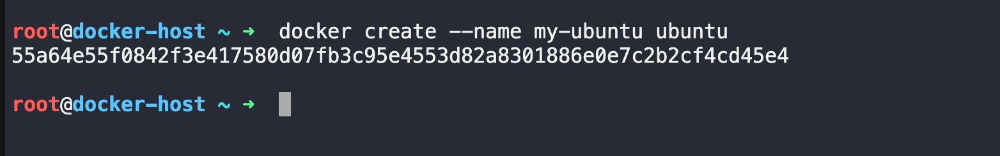

Check its status:
```bash 
docker ps -a 
```
Output: 
```
root@docker-host ~ ➜  docker ps -a 
CONTAINER ID   IMAGE     COMMAND       CREATED          STATUS    PORTS     NAMES
55a64e55f084   ubuntu    "/bin/bash"   38 seconds ago   Created             my-ubuntu

```
- State: ✅ Created
- `docker create` creates the container but does not start it.

### Step 2: Start the Container

Start the container:
```bash 
docker start my-ubuntu
```
Check the status:
```bash 
docker ps -a 
```
- If the container's default process exits immediately (which happens with a plain Ubuntu image), you'll likely see:
```
STATUS
Exited (0)
```
#### To keep a container running for lifecycle practice

Create it with a long-running command:
```bash 
docker create --name my-ubuntu ubuntu sleep infinity 
```
Then star it 
```bash 
docker start my-ubuntu
```
Now: 
```bash 
docker ps -a 
```
OUTPUT: 
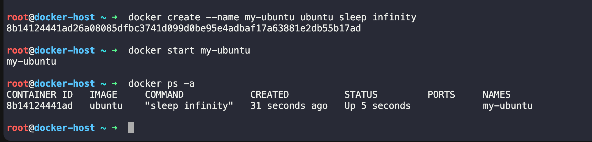

- STATUS -> Up 10 seconds
- State: ✅ Running

### Step 3: Pause the Container
Pause all processes inside the container:

```bash 
docker pause my-ubuntu
```
Check:
```bash 
docker ps -a 
```
OUTPUT: 
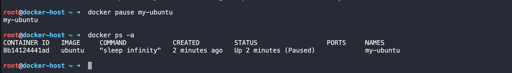

- STATUs -> Up 1 minute (Paused)
- State: ✅ Paused

### Step 4: Unpause the Container
Resume the container:

```bash
docker unpause my-ubuntu
```
Verify:
```bash 
docker ps -a 
```
OUTPUT: 
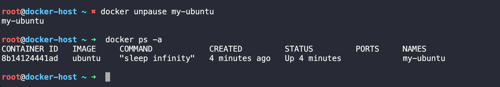

- STATUS -> Up 2 minutes
- State: ✅ Running

### Step 5: Stop the Container

Stop it gracefully:
```bash 
docker stop my-ubuntu 
```
Verify:

```bash 
docker ps -a 
```
OUTPUT: 
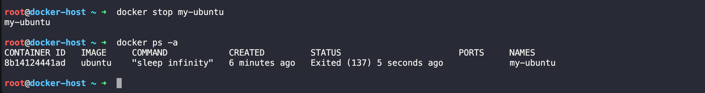

- STATUS -> Exited (0) 5 seconds ago
- State: ✅ Exited

### Step 6: Restart the Container

Restart it:

```bash 
docekr restart my-ubuntu
```
verify: 
```bash 
docker ps -a 
```
OUTPUT: 
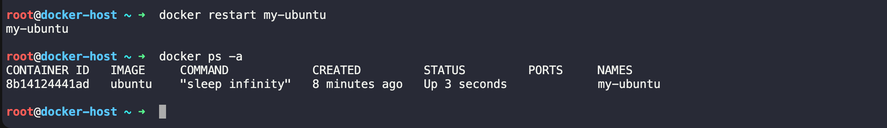

- STATUS -> Up 3 seconds
- State: ✅ Running

### Step 7: Kill the Container

Forcefully stop the container:

```bash 
docker kill my-ubuntu
```
Verify:
```bash 
docker ps -a 
```
OUTPUT:
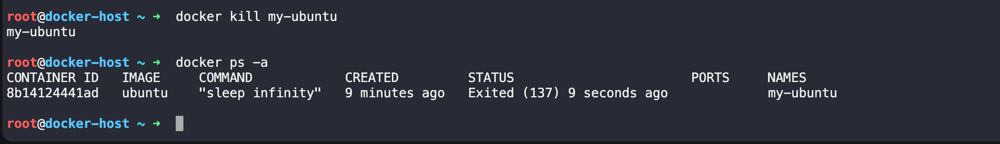

- STATUS -> Exited (137)
- State: ✅ Exited

`docker kill` immediately sends the `SIGKILL` signal, while `docker stop` first sends `SIGTERM` and allows the application to shut down gracefully.

### Step 8: Remove the Container
Delete the container:

```bash 
docker rm my-ubuntu
```
Verify:

```bash 
docker ps -a 
```
The container should no longer appear.
State: ✅ Removed


# Container State Transitions

```
           docker create
                 │
                 ▼
             Created
                 │
          docker start
                 │
                 ▼
             Running
          ┌──────┴──────┐
          │             │
 docker pause      docker stop
          │             │
          ▼             ▼
       Paused        Exited
          │             ▲
docker unpause     docker restart
          │             │
          └──────► Running
                        │
                  docker kill
                        │
                        ▼
                     Exited
                        │
                   docker rm
                        │
                        ▼
                     Removed
```
Complete Command Sequence: 

```bash 
# Create (without starting)
docker create --name my-ubuntu ubuntu sleep infinity

# Check status
docker ps -a

# Start
docker start my-ubuntu
docker ps -a

# Pause
docker pause my-ubuntu
docker ps -a

# Unpause
docker unpause my-ubuntu
docker ps -a

# Stop
docker stop my-ubuntu
docker ps -a

# Restart
docker restart my-ubuntu
docker ps -a

# Kill
docker kill my-ubuntu
docker ps -a

# Remove
docker rm my-ubuntu
docker ps -a
```

### Q-> What is the difference between docker stop and docker kill?

- `docker stop` sends a `SIGTERM` signal, allowing the application to shut down gracefully. If it doesn't exit within the timeout period, Docker sends `SIGKILL`.
- `docker kill` sends `SIGKILL` immediately, forcefully terminating the container without giving the application a chance to clean up.


# Task 4: Working with Running Containers

### Step 1: Run an Nginx Container in Detached Mode

Run the following command:
```bash 
docker run -d  --name my-nginx -p 8080:80 nginx
```
Explanation

| Option            | Meaning                                                |
| ----------------- | ------------------------------------------------------ |
| `docker run`      | Create and start a container                           |
| `-d`              | Detached mode (runs in the background)                 |
| `--name my-nginx` | Assign a name to the container                         |
| `-p 8080:80`      | Map port 8080 on your host to port 80 in the container |
| `nginx`           | Docker image to run                                    |

Verify it's running:
```bash 
docker ps
```
Example output:
```
CONTAINER ID   IMAGE   STATUS      PORTS
8c9f4d5a2a1b   nginx   Up 2 mins   0.0.0.0:8080->80/tcp
```
OUTPUT : 
```

anujrai@anujrai-mn4561 90DaysOfDevOps % docker run -d  --name my-nginx -p 8080:80 nginx
5d4ed5c0f0a6a14a3642fd7bb292e8646e8556f606bb8788d6b9f941bb224516


anujrai@anujrai-mn4561 90DaysOfDevOps % docker ps 
CONTAINER ID   IMAGE                  COMMAND                  CREATED          STATUS         PORTS                                     NAMES
5d4ed5c0f0a6   nginx                  "/docker-entrypoint.…"   10 seconds ago   Up 9 seconds   0.0.0.0:8080->80/tcp, [::]:8080->80/tcp   my-nginx
```


### Step 2: View Container Logs
Every container writes logs to standard output (`stdout`) and standard error (`stderr`).

View the logs:
```bash 
docker logs my-nginx
```
Example output:
```
/docker-entrypoint.sh: Configuration complete; ready for start up
```
- You may also see HTTP access logs after opening http://localhost:8080 in your browser.

### Step 3: View Logs in Real Time (Follow Mode)
To continuously watch the logs:
```bash 
docker logs -f my-nginx
```
Now visit:
```bash 
http://localhost:8080
```
- You'll see new log entries appear immediately, for example:

```
192.168.65.1 - - [05/Jul/2026:09:06:21 +0000] "GET / HTTP/1.1" 304 0 "-" "Mozilla/5.0 (Macintosh; Intel Mac OS X 10_15_7) AppleWebKit/537.36 (KHTML, like Gecko) Chrome/148.0.0.0 Safari/537.36" "-"
^C%                                                                
```

Stop following the logs with:
```
ctl + c 
```
- Tip: `docker logs -f` works like the Linux `tail -f` command.

### Step 4: Enter the Running Container

Open an interactive shell inside the container:

```bash 
docker exec -it my-nginx  /bin/bash 
```
OUTPUT: 
Your prompt changes to something like:


- You're now inside the container.


### Step 5: Explore the Filesystem

Try these commands:
```bash 
pwd 
ls 
ls /

cd /usr/share/nginx/html
pwd

ls -l 

#View the default web page:

cat index.html

#Check the operating system:
cat etc/os-release

# Find the Nginx binary:

which nginx

# List running processes:
ps aux 

# Exit the shell:
exit 
```
OUTPUT: 

```
root@5d4ed5c0f0a6:/# pwd 
/
root@5d4ed5c0f0a6:/# ls 
bin   dev                  docker-entrypoint.sh  home  media  opt   root  sbin  sys  usr
boot  docker-entrypoint.d  etc                   lib   mnt    proc  run   srv   tmp  var
root@5d4ed5c0f0a6:/# ls /
bin   dev                  docker-entrypoint.sh  home  media  opt   root  sbin  sys  usr
boot  docker-entrypoint.d  etc                   lib   mnt    proc  run   srv   tmp  var
root@5d4ed5c0f0a6:/# 
root@5d4ed5c0f0a6:/# cd /usr/share/nginx/html
root@5d4ed5c0f0a6:/usr/share/nginx/html# pwd 
/usr/share/nginx/html
root@5d4ed5c0f0a6:/usr/share/nginx/html# ls 
50x.html  index.html
root@5d4ed5c0f0a6:/usr/share/nginx/html# ls -l
total 8
-rw-r--r-- 1 root root 497 Jun 17 14:40 50x.html
-rw-r--r-- 1 root root 896 Jun 17 14:40 index.html
root@5d4ed5c0f0a6:/usr/share/nginx/html# cat index.html
<!DOCTYPE html>
<html>
<head>
<title>Welcome to nginx!</title>
<style>
html { color-scheme: light dark; }
body { width: 35em; margin: 0 auto;
font-family: Tahoma, Verdana, Arial, sans-serif; }
</style>
</head>
<body>
<h1>Welcome to nginx!</h1>
<p>If you see this page, nginx is successfully installed and working.
Further configuration is required for the web server, reverse proxy, 
API gateway, load balancer, content cache, or other features.</p>

<p>For online documentation and support please refer to
<a href="https://nginx.org/">nginx.org</a>.<br/>
To engage with the community please visit
<a href="https://community.nginx.org/">community.nginx.org</a>.<br/>
For enterprise grade support, professional services, additional 
security features and capabilities please refer to
<a href="https://f5.com/nginx">f5.com/nginx</a>.</p>

<p><em>Thank you for using nginx.</em></p>
</body>
</html>
root@5d4ed5c0f0a6:/usr/share/nginx/html# cat /etc/os-release
PRETTY_NAME="Debian GNU/Linux 13 (trixie)"
NAME="Debian GNU/Linux"
VERSION_ID="13"
VERSION="13 (trixie)"
VERSION_CODENAME=trixie
DEBIAN_VERSION_FULL=13.5
ID=debian
HOME_URL="https://www.debian.org/"
SUPPORT_URL="https://www.debian.org/support"
BUG_REPORT_URL="https://bugs.debian.org/"
root@5d4ed5c0f0a6:/usr/share/nginx/html# which nginx
/usr/sbin/nginx
root@5d4ed5c0f0a6:/usr/share/nginx/html# ps aux 
bash: ps: command not found
root@5d4ed5c0f0a6:/usr/share/nginx/html# 

```

### Step 6: Run a Single Command Without Entering the Container

- You don't always need an interactive shell.

Run a command directly:

```bash 
docker exec my-nginx ls /
```
output: 
```
anujrai@anujrai-mn4561 90DaysOfDevOps % docker exec my-nginx ls -l /
total 64
lrwxrwxrwx   1 root root    7 May  8 16:10 bin -> usr/bin
drwxr-xr-x   2 root root 4096 May  8 16:10 boot
drwxr-xr-x   5 root root  340 Jul  5 08:59 dev
drwxr-xr-x   1 root root 4096 Jun 24 01:22 docker-entrypoint.d
-rwxr-xr-x   1 root root 1620 Jun 24 01:22 docker-entrypoint.sh
drwxr-xr-x   1 root root 4096 Jul  5 08:59 etc
drwxr-xr-x   2 root root 4096 May  8 16:10 home
lrwxrwxrwx   1 root root    7 May  8 16:10 lib -> usr/lib
drwxr-xr-x   2 root root 4096 Jun 23 00:00 media
drwxr-xr-x   2 root root 4096 Jun 23 00:00 mnt
drwxr-xr-x   2 root root 4096 Jun 23 00:00 opt
dr-xr-xr-x 320 root root    0 Jul  5 08:59 proc
drwx------   1 root root 4096 Jul  5 09:41 root
drwxr-xr-x   1 root root 4096 Jul  5 08:59 run
lrwxrwxrwx   1 root root    8 May  8 16:10 sbin -> usr/sbin
drwxr-xr-x   2 root root 4096 Jun 23 00:00 srv
dr-xr-xr-x  11 root root    0 Jul  5 08:59 sys
drwxrwxrwt   2 root root 4096 Jun 23 00:00 tmp
drwxr-xr-x   1 root root 4096 Jun 23 00:00 usr
drwxr-xr-x   1 root root 4096 Jun 23 00:00 var
anujrai@anujrai-mn4561 90DaysOfDevOps % 
```

Check the hostname:
```bash 
dokcer exac my-nginx hostname
```
Output : 
```
anujrai@anujrai-mn4561 90DaysOfDevOps % docker exec my-nginx hostname
5d4ed5c0f0a6
anujrai@anujrai-mn4561 90DaysOfDevOps % 
```
Display the Nginx version:
```bash 
docker exec my-nginx nginx -v
```
OUTPUT:
```bash 
anujrai@anujrai-mn4561 90DaysOfDevOps % docker exec my-nginx nginx -v
nginx version: nginx/1.31.2
anujrai@anujrai-mn4561 90DaysOfDevOps % 
```
Display the current user:
```bash 
docker exec my-nginx whoami
```
OUTPUT: 
```
anujrai@anujrai-mn4561 90DaysOfDevOps % docker exec my-nginx whoami
root
anujrai@anujrai-mn4561 90DaysOfDevOps % 
```
- Each command runs inside the container and then exits.


### Step 7: Inspect the Container

Use:
```bash 
docker inspect my-nginx
```
- This returns a large JSON document containing detailed information about the container.


Find the IP Address

```bash 
docker inspect -f '{{range.NetworkSettings.Networks}}{{.IPAddress}}{{end}}' my-nginx
```
Example:
```
anujrai@anujrai-mn4561 90DaysOfDevOps % docker inspect -f '{{range.NetworkSettings.Networks}}{{.IPAddress}}{{end}}' my-nginx
172.17.0.3

anujrai@anujrai-mn4561 90DaysOfDevOps % 
```

Find Port Mappings

```bash 
docker port my-nginx
```
Example:

```
anujrai@anujrai-mn4561 90DaysOfDevOps % docker port my-nginx
80/tcp -> 0.0.0.0:8080
80/tcp -> [::]:8080

anujrai@anujrai-mn4561 90DaysOfDevOps % 
```
Or view it in the inspection output:
```
docker inspect my-nginx
```

Look for:

```
 "NetworkMode": "bridge",
            "PortBindings": {
                "80/tcp": [
                    {
                        "HostIp": "",
                        "HostPort": "8080"
                    }
                ]
            },
```

Find Mounted Volumes from that JSON Output: 

```
"Mounts": []
```
- Since no volume was mounted, the array is empty.


Commonly Used Commands

| Task                    | Command                                                                                |
| ----------------------- | -------------------------------------------------------------------------------------- |
| Run Nginx               | `docker run -d --name my-nginx -p 8080:80 nginx`                                       |
| List running containers | `docker ps`                                                                            |
| View logs               | `docker logs my-nginx`                                                                 |
| Follow logs             | `docker logs -f my-nginx`                                                              |
| Open shell              | `docker exec -it my-nginx /bin/bash`                                                   |
| Run one command         | `docker exec my-nginx hostname`                                                        |
| Inspect container       | `docker inspect my-nginx`                                                              |
| Show IP                 | `docker inspect -f '{{range.NetworkSettings.Networks}}{{.IPAddress}}{{end}}' my-nginx` |
| Show port mapping       | `docker port my-nginx`                                                                 |


Visual Workflow: 

```
                docker run
                     │
                     ▼
            Running Nginx Container
                     │
      ┌──────────────┼──────────────┐
      │              │              │
      ▼              ▼              ▼
docker logs     docker exec    docker inspect
      │              │              │
      ▼              ▼              ▼
 View logs      Enter container   View metadata
                     │
                     ▼
             Explore filesystem
                     │
                     ▼
            Run Linux commands
```


# Task 5: Cleanup

As you work with Docker, unused containers, images, networks, and volumes accumulate and consume disk space. Docker provides commands to clean them up efficiently.

### Step 1: Stop All Running Containers
Stop every running container with a single command:

```bash
dokcer stop $(docker ps -q)
```
How it works

- docker ps -q lists the IDs of all running containers.
- $(...) passes those IDs to docker stop.

Example:

```
$ docker ps

CONTAINER ID   IMAGE
abc123         nginx
def456         ubuntu

$ docker stop $(docker ps -q)

abc123
def456

```
- Verify that no containers are running:

```bash 
docker ps
```
Expected output:
```
CONTAINER ID   IMAGE   COMMAND   CREATED   STATUS   PORTS   NAMES
```

Step 2: Remove All Stopped Containers

Remove every stopped container:

```bash
docker container prune
```
Docker will ask for confirmation:
```
WARNING! This will remove all stopped containers.
Are you sure you want to continue? [y/N]
```
Type:
```
y
```
Without Confirmation

```bash 
docker container prune -f
```
Alternatively, you can remove all stopped containers with:

```bash 
docker rm $(docker ps -aq)
```
- Note: This works only if all containers are already stopped.

### Step 3: Remove Unused Images

Delete images that are no longer used by any container:

```bash 
docker image prune
```
confirm with: 
```
y 
```
Skip the confirmation prompt:
```bash 
docker image prune -f 
```
Remove All Unused Images

- To remove all images not referenced by any container (including older tagged images):
```bash 
docker image prune -a 
```
OR: 
```bash 
docker image prune -a -f 
```
- Be aware that `-a` may remove images you'll need to download again later.


Task 1: What is Docker?
Research and write short notes on:

What is a container and why do we need them?
Containers vs Virtual Machines — what's the real difference?
What is the Docker architecture? (daemon, client, images, containers, registry)
Draw or describe the Docker architecture in your own words.

Task 1: What is Docker?
1. What is a Container and Why Do We Need Them?
A container is a lightweight, standalone package that contains everything an application needs to run:

Application code

Runtime

System libraries

Dependencies

Configuration files

Containers share the host operating system's kernel, making them much lighter than virtual machines.

Why do we need containers?
Before containers, developers often faced the "It works on my machine" problem because applications behaved differently across environments.

Containers solve this by:

Providing the same environment everywhere (development, testing, production)

Eliminating dependency conflicts

Starting in seconds

Using fewer system resources

Making deployment faster and more reliable

Scaling applications easily

Example:
Imagine developing a Python application on your laptop. Instead of asking others to install Python, libraries, and dependencies manually, you package everything into a Docker container. Anyone with Docker can run it with a single command.

2. Containers vs Virtual Machines
Feature	Containers	Virtual Machines
OS	Share host OS kernel	Each VM has its own OS
Size	MBs	GBs
Startup Time	Seconds	Minutes
Performance	Near native	Slight overhead
Resource Usage	Low	High
Isolation	Process-level	Hardware-level
Portability	Very High	Moderate
Virtual Machine Architecture
Application
Application
Application
--------------------
Guest OS
Guest OS
Guest OS
--------------------
Hypervisor
--------------------
Host Operating System
--------------------
Physical Hardware
Each VM has its own operating system, consuming more CPU, RAM, and storage.

Container Architecture
Application
Application
Application
--------------------
Container Runtime (Docker)
--------------------
Host Operating System
--------------------
Physical Hardware
Containers share the same operating system kernel, making them lightweight and fast.

Key Difference
Virtual Machine

Includes a complete operating system.

More secure isolation.

Slower startup.

Higher resource usage.

Container

Shares the host OS.

Lightweight.

Starts almost instantly.

Better resource efficiency.

3. Docker Architecture
Docker follows a client-server architecture.

It consists of five main components:

1. Docker Client
The Docker Client is the command-line interface (CLI) that users interact with.

Example commands:

docker run nginx
docker build .
docker pull ubuntu
The client sends requests to the Docker Daemon.

2. Docker Daemon (dockerd)
The Docker Daemon is the background service responsible for:

Building images

Running containers

Managing networks

Managing volumes

Communicating with registries

It listens for Docker API requests from the client.

3. Docker Images
A Docker Image is a read-only template used to create containers.

Think of an image like a blueprint or recipe.

Examples:

Ubuntu image

Nginx image

Python image

Images contain:

Base operating system

Application

Dependencies

Libraries

Images are immutable (they don't change after creation).

4. Docker Containers
A container is a running instance of an image.

Example:

Image
   ↓
docker run
   ↓
Container
One image can create many containers.

Example:

Ubuntu Image
     ↓
------------------------
Container 1
Container 2
Container 3
5. Docker Registry
A registry stores Docker images.

The default public registry is Docker Hub.

You can:

Pull images

Push your own images

Store private images

Examples:

Docker Hub

Private Registry

Cloud registries (such as those provided by major cloud platforms)

4. Docker Architecture (In My Own Words)
Imagine Docker as an online food delivery system.

                USER
                  |
          docker run nginx
                  |
                  ▼
          Docker Client (CLI)
                  |
          Sends API Request
                  |
                  ▼
        Docker Daemon (dockerd)
                  |
      -------------------------
      |           |           |
      ▼           ▼           ▼
  Docker      Docker      Docker
  Images    Containers   Networks
                  |
                  ▼
          Pull image if missing
                  |
                  ▼
         Docker Registry (Docker Hub)
Explanation
The user types a command like:

docker run nginx
The Docker Client sends this request to the Docker Daemon.

The Docker Daemon checks whether the Nginx image exists locally.

If the image isn't available, the daemon downloads it from the Docker Registry (Docker Hub).

The daemon creates a container from the image.

The application starts running inside the container.

Quick Summary
Container: Lightweight package containing an application and all its dependencies.

Why Containers? Consistent environments, portability, faster deployment, and efficient resource usage.

Containers vs VMs: Containers share the host OS kernel and are lightweight; VMs include a full guest OS and use more resources.

Docker Client: Accepts user commands.

Docker Daemon: Performs Docker operations and manages resources.

Docker Image: Immutable template used to create containers.

Docker Container: Running instance of an image.

Docker Registry: Repository for storing and distributing Docker images.


Task 2: Install Docker
Install Docker on your machine (or use a cloud instance)
Verify the installation
Run the hello-world container
Read the output carefully — it explains what just happened

Task 2: Install Docker
Since you're using macOS (from our previous conversations), here's how to complete the task.

Step 1: Install Docker Desktop
Go to the official Docker website.

Download Docker Desktop for Mac (choose the version for your Mac: Apple Silicon or Intel).

Install it by dragging Docker.app into the Applications folder.

Launch Docker Desktop.

Wait until Docker starts. You'll see the whale icon in the menu bar and a message like:

Docker Desktop is running
Step 2: Verify the Installation
Open Terminal and run:

docker --version
Example output:

Docker version 28.3.2, build xxxxxxx
Now check whether Docker is running:

docker info
You should see information about:

Client

Server

Containers

Images

Storage Driver

CPUs

Memory

Step 3: Run Your First Container
Run:

docker run hello-world
The first time, Docker downloads the image because it isn't available locally.

Example output:

Unable to find image 'hello-world:latest' locally
latest: Pulling from library/hello-world
...
Hello from Docker!
This message shows that your installation appears to be working correctly.
...
Step 4: Understand What Happened
When you executed:

docker run hello-world
Docker performed these steps:

1. Docker Client Received the Command
You typed:

docker run hello-world
The Docker Client sent this request to the Docker Daemon.

2. Docker Daemon Looked for the Image
Docker checked whether the hello-world image already existed on your computer.

Since this was your first run, the image wasn't found.

3. Docker Pulled the Image
Docker automatically downloaded the hello-world image from Docker Hub, the default Docker registry.

4. Docker Created a Container
After downloading the image, Docker created a new container from it.

Think of it like this:

Image
   ↓
docker run
   ↓
Container
5. The Container Executed
The hello-world program inside the container printed the message:

Hello from Docker!
This confirms that Docker is working correctly.

6. The Container Stopped
The hello-world application completed its task and exited.

Since the container had nothing else to do, it stopped automatically.

Step 5: Verify the Container
List all containers (including stopped ones):

docker ps -a
Example output:

CONTAINER ID   IMAGE         STATUS
8f4d7b...      hello-world   Exited (0)
Exited (0) means:

The program completed successfully.

No errors occurred.

Step 6: Check Downloaded Images
List local images:

docker images
Example output:

REPOSITORY    TAG       IMAGE ID
hello-world   latest    abc12345
This confirms the image has been downloaded and stored locally.

Flow of What Happened
You type:
docker run hello-world
        │
        ▼
Docker Client
        │
        ▼
Docker Daemon
        │
        ▼
Checks for image locally
        │
        ├── Found? → Create container
        │
        └── Not found
                │
                ▼
        Download image from Docker Hub
                │
                ▼
        Create container
                │
                ▼
        Run application
                │
                ▼
        Print "Hello from Docker!"
                │
                ▼
        Container exits
Expected Outcome
By the end of this task, you should have:

✅ Installed Docker Desktop.

✅ Verified the installation using docker --version and docker info.

✅ Successfully run the hello-world container.

✅ Understood that Docker downloaded the image (if needed), created a container from it, ran the application inside it, displayed the success message, and then stopped the container.

Next step: After completing this, you'll typically move on to working with Docker images and containers using commands such as docker pull, docker run, docker ps, docker stop, docker start, and docker rm.


Task 3: Run Real Containers
Run an Nginx container and access it in your browser
Run an Ubuntu container in interactive mode — explore it like a mini Linux machine
List all running containers
List all containers (including stopped ones)
Stop and remove a container

Task 3: Run Real Containers
In this task, you'll run two real containers:

Nginx (a web server)

Ubuntu (a Linux environment)

You'll also learn basic container management commands.

1. Run an Nginx Container
Start an Nginx container:

docker run -d --name my-nginx -p 8080:80 nginx
What each option means
Option	Meaning
docker run	Create and start a container
-d	Run in detached (background) mode
--name my-nginx	Give the container a custom name
-p 8080:80	Map port 8080 on your machine to port 80 inside the container
nginx	Docker image to use
Verify It's Running
docker ps
Example output:

CONTAINER ID   IMAGE    STATUS         PORTS
abc12345       nginx    Up 2 minutes   0.0.0.0:8080->80/tcp
Access Nginx in Your Browser
Open:

http://localhost:8080
You should see the default Welcome to nginx! page.

This confirms:

Docker container is running.

Port mapping works.

Nginx is serving web pages.

2. Run an Ubuntu Container in Interactive Mode
Start Ubuntu:

docker run -it --name my-ubuntu ubuntu
Docker may first download the Ubuntu image if it isn't already available.

The prompt changes to something like:

root@4d8c7e:/#
You're now inside the Ubuntu container.

Explore the Ubuntu Container
Try these commands:

pwd
ls
whoami
hostname
cat /etc/os-release
uname -a
ps
Exit the Container
exit
The container stops after you exit because its main process has ended.

3. List Running Containers
docker ps
Example:

CONTAINER ID   IMAGE   STATUS
abc123         nginx   Up 5 minutes
This shows only containers that are currently running.

4. List All Containers
docker ps -a
Example:

CONTAINER ID   IMAGE         STATUS
abc123         nginx         Up 5 minutes
xyz987         ubuntu        Exited (0)
aaa555         hello-world   Exited (0)
This includes both running and stopped containers.

5. Stop a Container
Stop the Nginx container:

docker stop my-nginx
Verify:

docker ps
The Nginx container should no longer appear because it's stopped.

6. Remove a Container
Remove the stopped Nginx container:

docker rm my-nginx
Remove the Ubuntu container (if it's stopped):

docker rm my-ubuntu
Verify:

docker ps -a
The removed containers will no longer be listed.

Quick Reference
Task	Command
Run Nginx	docker run -d --name my-nginx -p 8080:80 nginx
Open Nginx	http://localhost:8080
Run Ubuntu interactively	docker run -it --name my-ubuntu ubuntu
Exit Ubuntu	exit
List running containers	docker ps
List all containers	docker ps -a
Stop a container	docker stop <container-name>
Remove a container	docker rm <container-name>
How It Works
docker run
      │
      ▼
Docker checks if the image exists locally
      │
      ├── Yes → Use local image
      └── No  → Download image from Docker Hub
                    │
                    ▼
             Create a new container
                    │
                    ▼
              Start the container
                    │
                    ▼
         Application runs inside it
Expected Outcome
After completing this task, you should be able to:

✅ Run an Nginx web server inside a Docker container.

✅ Access the Nginx welcome page in your browser at http://localhost:8080.

✅ Launch an Ubuntu container and interact with it like a small Linux machine.

✅ View running containers with docker ps.

✅ View all containers with docker ps -a.

✅ Stop containers using docker stop.

✅ Remove stopped containers using docker rm.

These are the fundamental Docker operations you'll use frequently in day-to-day development and DevOps work.


Task 4: Working with Running Containers
Run an Nginx container in detached mode
View its logs
View real-time logs (follow mode)
Exec into the container and look around the filesystem
Run a single command inside the container without entering it
Inspect the container — find its IP address, port mappings, and mounts

Task 4: Working with Running Containers
In this task, you'll learn how to interact with a running container. These are commands you'll use almost daily as a DevOps or SRE engineer.

Step 1: Run an Nginx Container in Detached Mode
Run the following command:

docker run -d --name my-nginx -p 8080:80 nginx
Explanation
Option	Meaning
docker run	Create and start a container
-d	Detached mode (runs in the background)
--name my-nginx	Assign a name to the container
-p 8080:80	Map port 8080 on your host to port 80 in the container
nginx	Docker image to run
Verify it's running:

docker ps
Example output:

CONTAINER ID   IMAGE   STATUS      PORTS
8c9f4d5a2a1b   nginx   Up 2 mins   0.0.0.0:8080->80/tcp
Step 2: View Container Logs
Every container writes logs to standard output (stdout) and standard error (stderr).

View the logs:

docker logs my-nginx
Example output:

/docker-entrypoint.sh: Configuration complete; ready for start up
You may also see HTTP access logs after opening http://localhost:8080 in your browser.

Step 3: View Logs in Real Time (Follow Mode)
To continuously watch the logs:

docker logs -f my-nginx
Now visit:

http://localhost:8080
You'll see new log entries appear immediately, for example:

172.17.0.1 - - [03/Jul/2026:10:15:30 +0000] "GET / HTTP/1.1" 200 615 "-" "Mozilla/5.0"
Stop following the logs with:

Ctrl + C
Tip: docker logs -f works like the Linux tail -f command.

Step 4: Enter the Running Container
Open an interactive shell inside the container:

docker exec -it my-nginx /bin/bash
If Bash isn't available:

docker exec -it my-nginx /bin/sh
Your prompt changes to something like:

root@8c9f4d5a2a1b:/#
You're now inside the container.

Step 5: Explore the Filesystem
Try these commands:

pwd
ls
ls /
cd /usr/share/nginx/html
pwd
ls -l
View the default web page:

cat index.html
Check the operating system:

cat /etc/os-release
Find the Nginx binary:

which nginx
List running processes:

ps aux
Exit the shell:

exit
Step 6: Run a Single Command Without Entering the Container
You don't always need an interactive shell.

Run a command directly:

docker exec my-nginx ls /
Check the hostname:

docker exec my-nginx hostname
Display the Nginx version:

docker exec my-nginx nginx -v
Display the current user:

docker exec my-nginx whoami
Each command runs inside the container and then exits.

Step 7: Inspect the Container
Use:

docker inspect my-nginx
This returns a large JSON document containing detailed information about the container.

Find the IP Address
You can extract just the IP address:

docker inspect -f '{{range.NetworkSettings.Networks}}{{.IPAddress}}{{end}}' my-nginx
Example:

172.17.0.2
Find Port Mappings
docker port my-nginx
Example:

80/tcp -> 0.0.0.0:8080
Or view it in the inspection output:

docker inspect my-nginx
Look for:

"PortBindings": {
    "80/tcp": [
        {
            "HostPort": "8080"
        }
    ]
}
Find Mounted Volumes
Inspect the mounts:

docker inspect my-nginx
Search for:

"Mounts": []
Since no volume was mounted, the array is empty.

If you had started the container with:

docker run -d \
--name my-nginx \
-v ~/website:/usr/share/nginx/html \
-p 8080:80 nginx
The inspection output would include something like:

"Mounts": [
    {
        "Source": "/Users/anuj/website",
        "Destination": "/usr/share/nginx/html"
    }
]
Commonly Used Commands
Task	Command
Run Nginx	docker run -d --name my-nginx -p 8080:80 nginx
List running containers	docker ps
View logs	docker logs my-nginx
Follow logs	docker logs -f my-nginx
Open shell	docker exec -it my-nginx /bin/bash
Run one command	docker exec my-nginx hostname
Inspect container	docker inspect my-nginx
Show IP	docker inspect -f '{{range.NetworkSettings.Networks}}{{.IPAddress}}{{end}}' my-nginx
Show port mapping	docker port my-nginx
Visual Workflow
                docker run
                     │
                     ▼
            Running Nginx Container
                     │
      ┌──────────────┼──────────────┐
      │              │              │
      ▼              ▼              ▼
docker logs     docker exec    docker inspect
      │              │              │
      ▼              ▼              ▼
 View logs      Enter container   View metadata
                     │
                     ▼
             Explore filesystem
                     │
                     ▼
            Run Linux commands
What You Learned
By completing this task, you can now:

✅ Run containers in detached (background) mode.

✅ View container logs and monitor them in real time.

✅ Enter a running container with docker exec -it.

✅ Explore the container's filesystem and processes.

✅ Execute a single command inside a container without opening an interactive shell.

✅ Inspect a container to retrieve its configuration, including its IP address, port mappings, and mounted volumes.

These commands form the foundation for debugging, troubleshooting, and managing containers in real-world DevOps and SRE environments.


Task 5: Cleanup
Stop all running containers in one command
Remove all stopped containers in one command
Remove unused images
Check how much disk space Docker is using

Task 5: Docker Cleanup
As you work with Docker, unused containers, images, networks, and volumes accumulate and consume disk space. Docker provides commands to clean them up efficiently.

Step 1: Stop All Running Containers
Stop every running container with a single command:

docker stop $(docker ps -q)
How it works
docker ps -q lists the IDs of all running containers.

$(...) passes those IDs to docker stop.

Example:

$ docker ps
CONTAINER ID   IMAGE
abc123         nginx
def456         ubuntu

$ docker stop $(docker ps -q)

abc123
def456
Verify that no containers are running:

docker ps
Expected output:

CONTAINER ID   IMAGE   COMMAND   CREATED   STATUS   PORTS   NAMES
Step 2: Remove All Stopped Containers
Remove every stopped container:

docker container prune
Docker will ask for confirmation:

WARNING! This will remove all stopped containers.
Are you sure you want to continue? [y/N]
Type:

y
Without Confirmation
docker container prune -f
Alternatively, you can remove all stopped containers with:

docker rm $(docker ps -aq)
Note: This works only if all containers are already stopped.

Step 3: Remove Unused Images
Delete images that are no longer used by any container:

docker image prune
Confirm with:

y
Skip the confirmation prompt:

docker image prune -f
Remove All Unused Images
To remove all images not referenced by any container (including older tagged images):

docker image prune -a
Or:

docker image prune -a -f
⚠️ Be aware that -a may remove images you'll need to download again later.

### Step 4: Check Docker Disk Usage

Display Docker's disk usage:

```bash 
docker system df 
```
Example output:

```
anujrai@anujrai-mn4561 90DaysOfDevOps % docker system df 
TYPE            TOTAL     ACTIVE    SIZE      RECLAIMABLE
Images          12        5         17.04GB   14.38GB (84%)
Containers      8         5         4.538MB   114.7kB (2%)
Local Volumes   9         6         5.17GB    301.8MB (5%)
Build Cache     40        0         3.987GB   2.075GB
anujrai@anujrai-mn4561 90DaysOfDevOps % 

```
What It Means

| Field         | Description                       |
| ------------- | --------------------------------- |
| Images        | Docker images stored locally      |
| Containers    | Running and stopped containers    |
| Local Volumes | Persistent data volumes           |
| Build Cache   | Cache created during image builds |
| Reclaimable   | Space that can be safely freed    |


For more detailed information:
```bash 
docker system df -v
```


### Bonus: Clean Everything Unused

- Remove all unused containers, networks, dangling images, and build cache:

```bash 
docker system prune
```
Skip confirmation:
```bash 
docke system prune -f 
```
Remove Everything (Including Unused Images)
```bash 
docker system prune -a
```
Or: 
```bash
docker system prune -a -f 
```

Common Cleanup Commands

| Task                               | Command                       |
| ---------------------------------- | ----------------------------- |
| Stop all running containers        | `docker stop $(docker ps -q)` |
| Remove stopped containers          | `docker container prune -f`   |
| Remove unused images               | `docker image prune -f`       |
| Remove all unused images           | `docker image prune -a -f`    |
| Check Docker disk usage            | `docker system df`            |
| Detailed disk usage                | `docker system df -v`         |
| Remove all unused Docker resources | `docker system prune -a -f`   |

