# Task 1: Your First Dockerfile

### Step 1: Create a Project Directory

Create a new Folder 

```bash 
mkdir my-first-image
```

Move into it : 
```bash 
cd my-first-image
```
Verify your location 
```bash 
pwd 
```
OUTPUT: 
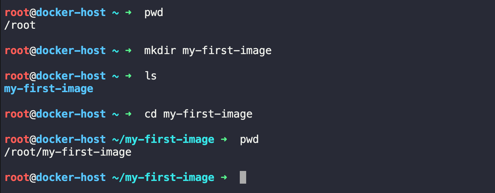

### Step 2: Create a Dockerfile
Create a file name Dockerfile By vi into it 
```bash 
vi Dockerfile # it will create a file name called Dockerfile and vi into it 
```

### Step 3: Add the Following Content
```dockerfile
# use ubuntu as a base image 
FROM ubuntu:latest

#update the package list and install curl 
RUN apt-get update && apt-get install -y curl 

#Default Command 
CMD ["echo" , "Hello from my custom image!"]

```

### Understanding Each Instruction

`FROM`
```dockerfile 
FROM ubuntu:latest
```
- specifies the base image 
- Every Dockerfile starts with a `FROM` image
- Here , we are using the latest Ubuntu image.


`RUN`


```dockerfile 
RUN apt-get update && apt-get install -y curl 
```
- Executes the Command while buikding the image 
- Updates package metadata 
- Installs the curl package 
- The `-y` option automatically ans   `yes` to installation prompts. 

`CMD`

```dockerfile 
CMD ["echo", "Hello from my custom image!"]
```
- Defines the defaults command executed when a container starts. 
- When the container runs, it prints : 

```
Hello from my custom image!
```
### Step 4: Verify the Dockerfile

```bash 
cat Dockerfile 
```
OUTPUT:
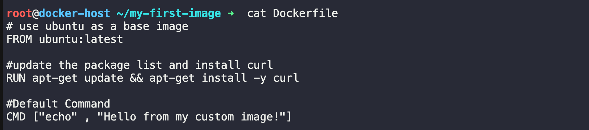

### Step 5: Build the Image

```bash 
docker build -t my-ubuntu:v1 . 
```
What does this command mean?

| Part           | Meaning                                        |
| -------------- | ---------------------------------------------- |
| `docker build` | Build an image                                 |
| `-t`           | Assign a tag                                   |
| `my-ubuntu:v1` | Image name and version                         |
| `.`            | Use the current directory as the build context |

OUTPUT: 
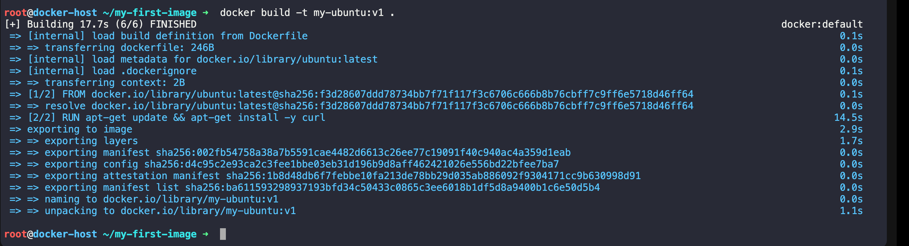

### Step 6: Verify the Image

List all images:
```bash 
docker images 
```
OUTPUT: 
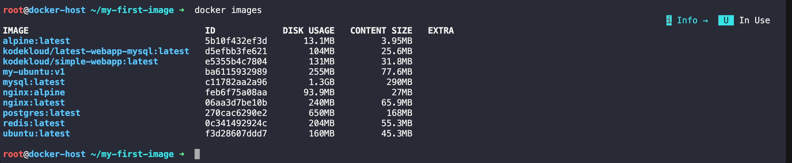

### Step 7: Run the Container

Run your image:
```bash 
docker run my-ubuntu:v1
```
Expected output:

```bash
Hello from my custom image!
```
- After printing the message, the container exits because the echo command has finished.

### Step 8: Verify the Container
```bash 
docker ps -a 
```
OUTPUT: 
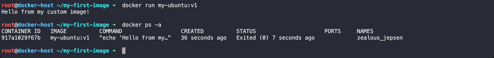

Build Workflow
```
Dockerfile
     │
     ▼
docker build -t my-ubuntu:v1 .
     │
     ▼
Custom Docker Image
     │
     ▼
docker run my-ubuntu:v1
     │
     ▼
Hello from my custom image!

```
Commands Used

| Task              | Command                          |
| ----------------- | -------------------------------- |
| Create directory  | `mkdir my-first-image`           |
| Enter directory   | `cd my-first-image`              |
| Create Dockerfile | `touch Dockerfile`               |
| Build image       | `docker build -t my-ubuntu:v1 .` |
| List images       | `docker images`                  |
| Run image         | `docker run my-ubuntu:v1`        |
| List containers   | `docker ps -a`                   |


### IMPT Q-> Q: What is the difference between RUN and CMD in a Dockerfile?

- `RUN` executes commands during the image build process and creates a new image layer (e.g., installing packages like curl).

- `CMD` specifies the default command that runs when a container starts from the image. It does not execute during the build and can be overridden when you run the container.


# Task 2: Dockerfile Instructions

#### Project Structure

```bash 
mkdir dockerfile-demo
cd dockerfile-demo
```
Create the following files:
```
dockerfile-demo/
│
├── Dockerfile
├── app.py
└── requirements.txt
```

### Step 1: Create app.py

```python 
from http.server import HTTPServer, BaseHTTPRequestHandler

class App(BaseHTTPRequestHandler):

    def do_GET(self):
        self.send_response(200)
        self.end_headers()
        self.wfile.write(b"Hello from my Docker Container!")

server = HTTPServer(("0.0.0.0", 8000), App)

print("Server started on port 8000")

server.serve_forever()
```
- This creates a very small web server.

### Step 2: Create requirements.txt

- For this example we don't actually need any packages.
Create an empty file.
```
#empty 
```
Later you'll install packages here like:
```
flask
requests
boto3
```
### Step 3: Create the Dockerfile

```dockerfile 
# 1. Base Image
FROM python:3.12-slim

# 2. Metadata
LABEL maintainer="Anuj"

# 3. Working Directory
WORKDIR /app

# 4. Copy dependency file
COPY requirements.txt .

# 5. Install dependencies
RUN pip install --no-cache-dir -r requirements.txt

# 6. Copy application
COPY app.py .

# 7. Document the application port
EXPOSE 8000

# 8. Default command
CMD ["python", "app.py"]
```
### Understanding Every Instruction

1. `FROM`

```dockerfile 
FROM python:3.12-slim
```
- Every Dockerfile starts with a base image.

2. `LABEL`

```dockerfile
LABEL maintainer="Anuj"
```
Adds metadata.
Useful for:

- ownership
- version
- project
- maintainer

Example:
```dockerfile 
LABEL project="Inventory API"
LABEL team="DevOps"
LABEL version="1.0"
```
3. `WORKDIR`

```docekerfile 
WORKDIR /app
```
- Creates the directory if it doesn't exist.
- Every following instructions runs from 
```
/app
```
without it you would need 
```dockerfile  
RUN makdir /app
RUN cd /app
```
Docker simplifies this 

4. `COPY`

```dockerfile 
COPY requirements.txt .
```
This will copy From hots machine to container 

COPY Host Machine TO 

↓

Container

Result will be like :

Host Machine
```
requirements.txt
```
↓

Container 
```
/app/requirements.txt
```

5. `RUN`

```dokcerfile 
RUN pip install --no-cache-dir -r requirements.txt
```
- RUNs during build time 

- This installs packages into the image.
- Once buils this command never buils again 

6. COPY Again
```dockerfile 
COPY app.py . 
```
- Copies your application into container /app

7. EXPOSE

```dockerfile 
EXPOSE 8000
```
- This Doesn't actually publish the port 
- It documents that the appplication listen on port :
```
8000
```
To access it from our machine we will still use 
```bash 
docker run -p 8000:8000
```
8. `CMD`
```dockerfile
CMD ["python","app.py"]
```
- This is executed everytime the container starts 
- It launches the application 

### Build the Image
```bash 
docker build -t python-web:v1 . 
```

### Verify Image
```bash 
docker images 
```

OUTPUT: 
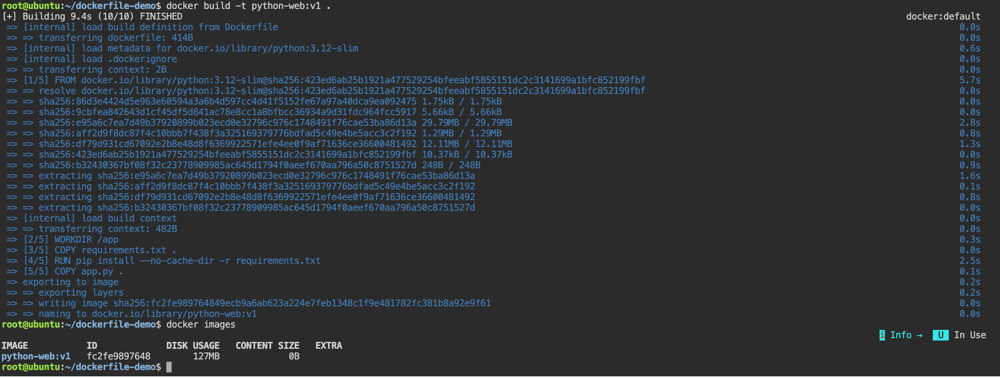


### Run the Container

```bash 
docker run -d --name python-container -p 8000:8000 python-web:v1
```
check: 
```bash 
docker ps -a
```
OUTPUT: 
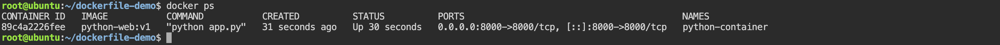

Open Browser: 
visit 

```
http://localhost:8000
```
Output
```
Hello from my Docker Container!

```
OUTPUT: 
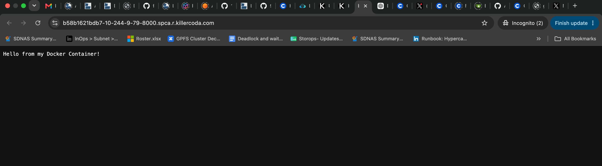

Check Logs
```bash 
docker log python-container
```
OUTPUT : 
```
Server started on port 8000
```


### Complete Flow

```
app.py
requirements.txt
Dockerfile
        │
        ▼
docker build
        │
        ▼
Custom Image
        │
        ▼
docker run
        │
        ▼
Running Container
        │
        ├──────────────┐
        ▼              ▼
docker logs      docker exec
        │              │
        ▼              ▼
 Application     Explore Container

 ```


# Task 3: CMD vs ENTRYPOINT
- Understanding the difference between CMD and ENTRYPOINT is essential because they control what happens when a container starts.

Part 1: Using `CMD`

Step 1: Create a New Project
```bash 
mkdir cmd-demo 
cd cmd-demo 
```
Create a file called **DockerFile**

#### Dockerfile

```dockerfile 
vi Dockerfile

FROM ubuntu:latest

CMD ["echo", "hello Anuj!!"]
```

#### Build the Image

```bash 
docker build -t cmd-demo:v1 .
```

#### Run the Container

```bash 
docker run cmd-demo:v1
```
OUTPUT: 
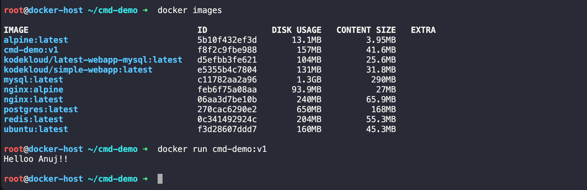

The container prints "hello Anuj!!" and exits.

#### Override the CMD

Now run below command to override that CMD command 
```bash 
docker run cmd-demo:v1 date
     OR 
docker run cmd-demo:v1 ls 
```
OUTPUT: 
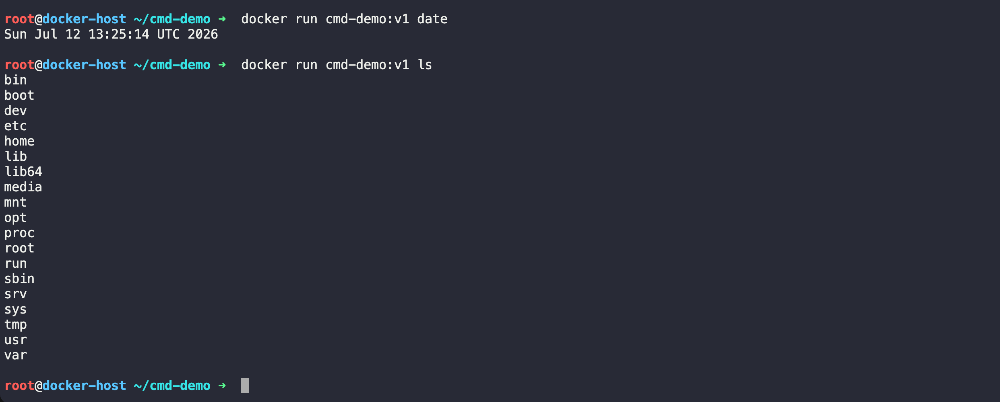

#### What happened?
The original Dockerfile contains:
```dockerfile 
FROM ubuntu:latest
CMD ["echo", "hello Anuj!!"]
```
But when we supplied:
```bash
docker run cmd-demo:v1 date 
```
- Docker replace the default `CMD` with `date` and Similar happen with `ls`.
- Key Point: `CMD` is a default command. It is easily overridden at runtime.


### Part 2: Using ENTRYPOINT

Create another directory.
```bash
mkdir entrypoint-demo 
cd entrypoint-demo 
```
Create this Dockerfile:
```dockerfile 
From ubuntu:latest

ENTRYPOINT ["echo"]
```

#### Build the Image from the Dockerfile 
```bash 
docker build -t entry-demo:v1
```
#### Run Without Arguments
```bash 
docker run entry-demo:v1
```
Output: 
```
echo runs without any arguments, so it simply prints a blank line.
```

#### Run With Additional Arguments
```bash 
docker run entry-demo:v1 hello
       OR 
docker run entry-demo:v1 "Hello Docker"
      OR 
docker run entry-demo:v1 DevOps SRE Docker
```
OUTPUT: 
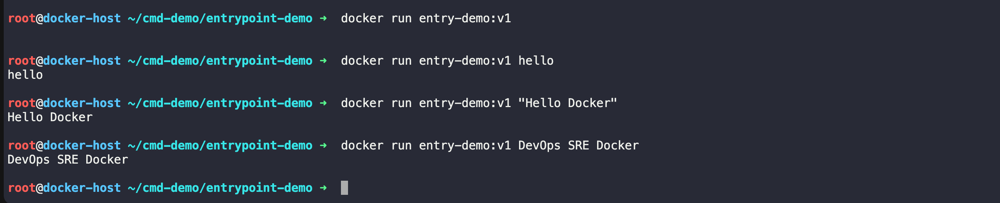


#### What happened?
```dockerfile 
FROM Ubuntu:latest 

ENTRYPOINT ["echo"]
```
Runtime: 
```bash 
docker run entry-demo:v1 hello
```
- Docker combines them:
```
echo hello
```
- The runtime arguments are appended to the ENTRYPOINT; they do not replace it

## CMD + ENTRYPOINT Together (Real World)

This is the pattern we'll see most often.

```Dockerfile 
 FROM ubuntu:latest

ENTRYPOINT ["ping"]

CMD ["google.com"]
```

Build: 
```bash 
docker build -t ping-demo . 
```

RUN: 
```bash 
docker run ping-demo
```
Docker executes: 
```bash 
ping google.com 
```
- Override only the default argument:

NOW RUN 
```bash 
docker run ping-demo openai.com
```
Docker ececutes: 
```bash 
ping openai.com
```
Here: 
- `ENTRYPOINT` stays fixed as `ping`
- `CMD` provides the default argument (google.com), which can be overridden.

Visual Comparison: 
`CMD`

```
Dockerfile

CMD ["echo", "hello"]

        │
docker run image
        │
        ▼

echo hello
```
Override:
```
docker run image date

        │
        ▼
OUTPUT: 
date
```
- The original CMD is completely replaced.

ENTRYPOINT: 
```
Dockerfile

ENTRYPOINT ["echo"]

        │
docker run image hello
        │
        ▼
OUTPUT: 
echo hello
```
- Arguments are added to the ENTRYPOINT.

#### CMD vs ENTRYPOINT

| Feature            | CMD                          | ENTRYPOINT                     |
| ------------------ | ---------------------------- | ------------------------------ |
| Purpose            | Default command or arguments | Main executable                |
| Can be overridden? | Yes, completely              | Not by default                 |
| Runtime arguments  | Replace the CMD              | Are appended to the ENTRYPOINT |
| Typical use        | Default behavior             | Fixed executable               |
| Real-world usage   | Default options              | Main application               |


#### Real-World Examples

Example 1: Python Application
```dockerfile 
FROM python:3.12-slim

WORKDIR /app

COPY . .

CMD ["python", "app.py"]
```

If someone runs:
```
docker run myapp python test.py
```
The default CMD is replaced with:
```bash 
python test.py
```

## IMP Q: What is the difference between CMD and ENTRYPOINT?

- `CMD` specifies the default command or arguments for a container. If you provide a command with docker run, it replaces the `CMD`.

- `ENTRYPOINT` specifies the main executable that always runs when the container starts. Any arguments passed to `docker run` are appended to the `ENTRYPOINT` rather than replacing it.

- In production Dockerfiles, it's common to use both:

- `ENTRYPOINT` defines the application to run.
- `CMD` defines its default arguments.

This combination provides sensible defaults while still allowing users to customize the application's behavior without changing the executable itself.


---

# Task 4: Build a Simple Web App Image

This is our first real-world Docker project. Instead of just printing text, we'll package a simple website into a Docker image using Nginx and serve it in a browser.

This is very similar to how static websites are deployed in production.

## Project Structure
Create a new directory:

```bash 
mkdir my-website
cd my-website 
```
our Project should looks like
```
my-website/
│
├── Dockerfile
└── index.html

```

### Step 1: Create `index.html`

Create the file and vi into it :

```bash 
touch index.html
   AND 
vi index.html 
```

ADD the Below content and save it  

```HTML 
<!DOCTYPE html>
<html>
<head>
    <title>My First Docker Website</title>
</head>
<body>
    <h1>Hello from Docker!</h1>

    <h2>🚀 My First Custom Docker Website</h2>

    <p>
        This website is running inside an Nginx Docker container.
    </p>

    <p>
        Built by <strong>Anuj</strong> while learning Docker.
    </p>
</body>
</html>
```

### Step 2: Create the Dockerfile
Create a file named **Dockerfile**:

```bash 
touch Dockerfile 
   OR 
vi Dockerfile 
```
Add the following:
```Dockerfile 
# Use the lightweight Nginx image
FROM nginx:alpine

# Copy the website into Nginx's default web directory
COPY index.html /usr/share/nginx/html/index.html

# Document the HTTP port
EXPOSE 80

# Start Nginx in the foreground
CMD ["nginx", "-g", "daemon off;"]
```

#### Understanding the Dockerfile

1. Base Image : 
```Dockerfile 
FROM nginx:alpine 
```
- uses the official **Nginx** image 

- Based on **Alpine Linux** , making it small and efficient. 
- Already includes a configured web server.

2. Copy the Website

```dockerfile 
COPY index.html /usr/share/nginx/html/index.html 
```
- This copies HOST Machine `index.html ` to Container ` /usr/share/nginx/html/index.html`

- This replaces Nginx's default welcome page with our own.

3. EXPOSE

```dockerfile
EXPOSE 80
```
- Documents that the container listens on port 80.

4. CMD
```dockerfile 
CMD ["nginx", "-g", "daemon off;"]
```
- Starts Nginx in the foreground so the container stays running.

### Step 3: Build the Image

From inside the project directory, run:

```bash 
docker build -t my-website:v1 . 
```
What does this command do?

| Part            | Meaning                                         |
| --------------- | ----------------------------------------------- |
| `docker build`  | Builds an image                                 |
| `-t`            | Assigns a name and tag                          |
| `my-website:v1` | Image name and version                          |
| `.`             | Uses the current directory as the build context |

### Step 4: Verify the Image

List local images:
```bash 
docker images 
```
Output:
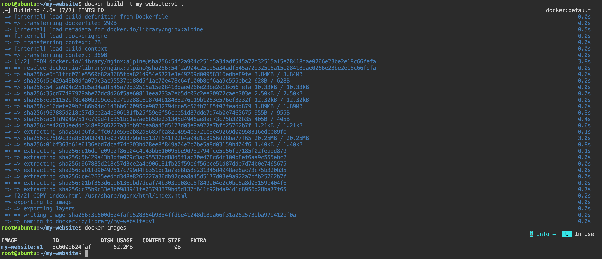


### Step 5: Run the Container
Start the container and map port 8080 on our machine to port 80 inside the container:
```bash 
docker run -d --name my-website-container -p 8080:80 my-website:v1

# Verify 
docker ps -a

```

OUTPUT: 
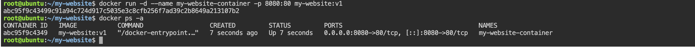

### Step 6: Access the Website

Open your browser and visit:
```
http://localhost:8080
```
we can see 
```
Hello from Docker!

🚀 My First Custom Docker Website

This website is running inside an Nginx Docker container.

Built by Anuj while learning Docker.
```
OUTOUT: 

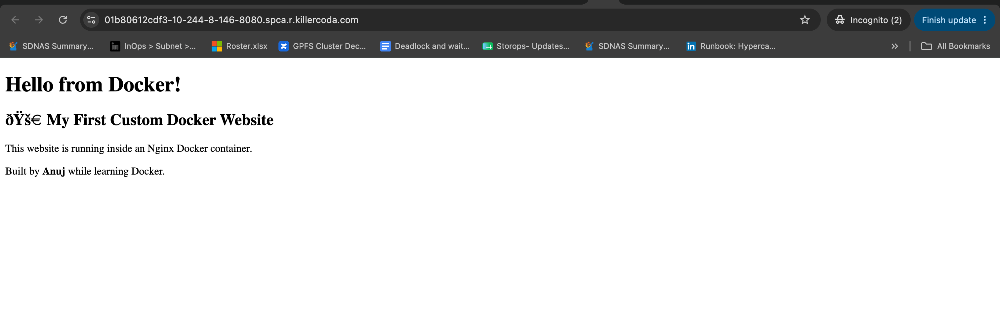


### Step 7: Verify the File Inside the Container

Open a shell and Run below command 
```bash 
docker exec -it my-website-container bash/sh

# check the web directory 

ls /usr/share/nginx/html

# Display our HTML file 
cat /usr/share/nginx/html/index.html

# Exit 

exit 

```

OUTPUT: 
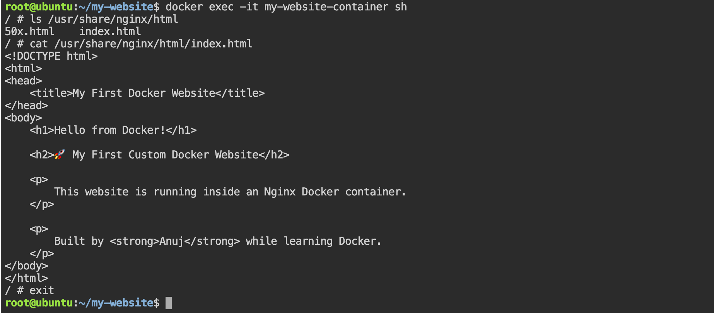


### Step 8: View the Logs
Check the Nginx logs:

```bash 
docker logs my-website-container 

# or monitor them in real time 
docker logs -f  my-website-container 
```
- Refresh the browser and we can see the HTTP access logs appear.

### Step 9: Stop and Remove the Container

Stop the container and Remove it  
```bash 

docker stop my-website-container
      AND 

docker rm my-website-container

```
OUTPUT: 
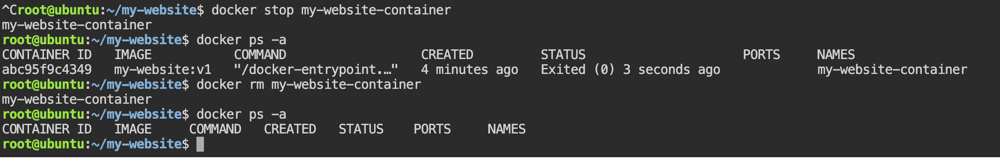


## Complete Workflow
```
index.html
Dockerfile
     │
     ▼
docker build -t my-website:v1 .
     │
     ▼
Custom Docker Image
     │
     ▼
docker run -d -p 8080:80
     │
     ▼
Running Nginx Container
     │
     ▼
http://localhost:8080
     │
     ▼
Your Website
```

### Commands Summary

| Task             | Command                                                              |
| ---------------- | -------------------------------------------------------------------- |
| Create project   | `mkdir my-website && cd my-website`                                  |
| Build image      | `docker build -t my-website:v1 .`                                    |
| List images      | `docker images`                                                      |
| Run container    | `docker run -d --name my-website-container -p 8080:80 my-website:v1` |
| List containers  | `docker ps`                                                          |
| View logs        | `docker logs my-website-container`                                   |
| Open shell       | `docker exec -it my-website-container sh`                            |
| Stop container   | `docker stop my-website-container`                                   |
| Remove container | `docker rm my-website-container`                                     |


