# Task 1: The Problem – Understanding Data Persistence in Docker

In this task we will observe that what happens to data stored inside a Docker container when the container is removed 

### Step 1: Run a PostgreSQL Container

pull the postgreSQL image (if we don't already have it )
```bash 
docker pull postgres
```
Run a PostgreSQL container:
```bash 
docker run -d  --name postgres-db  -e POSTGRES_PASSWORD=admin123  -p 5432:5432 postgres

```
Verify the container is running:
```bash 
docker ps 
   OR 
docker ps -a 
```
OUTPUT: 


### Step 2: Connect to PostgreSQL

Open a shell inside the container:
```bash 
docker exec -it postgres-db psql -U postgres 
```
we should see the postgreSQL prompt: 

```
postgres=# 
```
### Step 3: Create a Table
Create a sample Table :

```
CREATE TABLE employees (
    id SERIAL PRIMARY KEY , 
    name VARCHAR(50), 
    role VARCHAR(50)
);

# Insert a few records:

INSERT INTO employees(name , role )
VALUES 
('Anuj' 'Devops Engineer),
('Rahul' , 'SRE'),
('Priya' , 'Cloud Engineer');

# Verify the data:

SELECT * FROM employees; 

```

Example output:

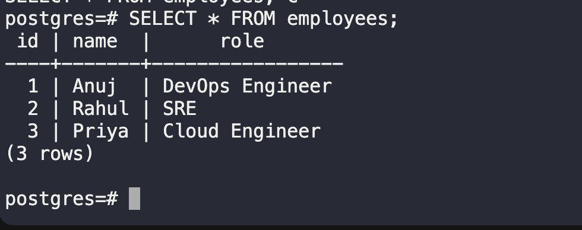


```
/q # exit postgresSQL 
```

### Step 4: Stop the Container

```bash 
docker stop postgres-db
```

### Step 5: Remove the Container

```bash 
docker rm postgres-db 
```

Verify:
```bash 
docker ps -a 
```
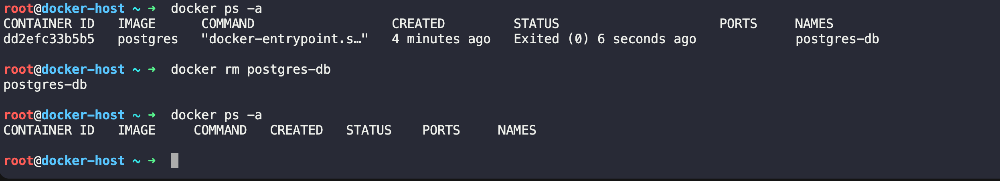
- The container no longer exists.


### Step 6: Run a New PostgreSQL Container

```bash
docker run -d --name postgres-db -e POSTGRES_PASSWORD=admin123 -p 5432:5432 postgres
```

Connect again:
```bash 
dockre exec -it postgres-db psql -U postgres
```

List the tables:
```
/dt 
```

OUTPUT: 
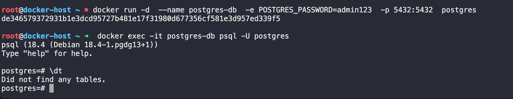

### What Happened?

When we remove the original container , all the data stored inside its writable layer was also deleted . 

The new PostgreSQL container starts with a fresh filesystem created from the original image . Since no persistent storage was attached, the database files from the previous container were lost.

This demonstrates that containers are **ephemeral**. Their writable layer exists only for the lifetime of the container. Removing the container removes any data stored inside it unless that data is kept in a Docker volume or a bind mount.

### Why Did This Happen?

Docker images are read-only. When a container starts, Docker adds a writable layer on top of the image. Any files created or modified inside the container are stored in this writable layer.

When the container is removed:
- The writable layer is deleted.
- All application data stored inside the container is lost.
- A new container starts with a clean writable layer.
- This is why databases such as PostgreSQL, MySQL, MongoDB, and Redis should always use persistent storage in production.


#### Q: Why is database data lost when a Docker container is removed?

Answer:

Because a container stores changes in its writable layer. When the container is deleted, that writable layer is also deleted. Without a Docker Volume or Bind Mount, the database files are not persisted, so a new container starts with an empty database.

# Task 2: Named Volumes

In this task we will learn how Docker Named volumes solve the data persistance problem that we faced in the TASK-01 

Ulike a container's writable layer , a named volumes exists independently of the container , so our data remain safe even if the container is deleted 


### Step 1: Create a Named Volume

Create a Docker volume:

```bash 
docker volume create postgres-data
```
Verify that the volume exist 
```bash 
docker volume ls 
```

OUTPUT: 
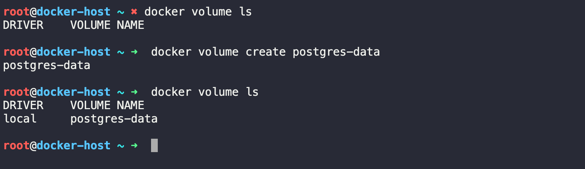

### Step 2: Run PostgreSQL with the Volume

Now we will Run PostgreSQL container and attached the volumes 
```bash 
docker run -d --name postgres-db -e POSTGRES_PASSWORD=admin123 -v postgres-data:/var/lib/postgresql -p 5432:5432 postgres:18
```
Understanding `-v` : 
```
postgres-data:/var/lib/postgresql/data
```
| Part                       | Meaning                                        |
| -------------------------- | ---------------------------------------------- |
| `postgres-data`            | Docker named volume (present in local )                           |
| `/var/lib/postgresql/data` | PostgreSQL data directory inside the container |

- All the databse files will now be stored in the Docker volume instead of the container's writable layer 

### Step 3: Connect to PostgreSQL

```bash 
docker ecec -it postgres-db psql -U postgres
```

#### Step 4: Create a Table

```sql
CREATE TABLE employees  (
    id SERIAL PRIMARY KEY, 
    name VARCHAR(50), 
    role VARCHAR(50)
);

-- Insert data:

INSERT INTO employees (name, role )
VALUES
('Anuj' , 'DevOps Engineer')
('Rahul','SRE')
('Priya','Cloud Engineer')


-- Verify 
SELECT * FROM employees;

-- To exit the postgres Database 

\q

```

OUTPUT: 
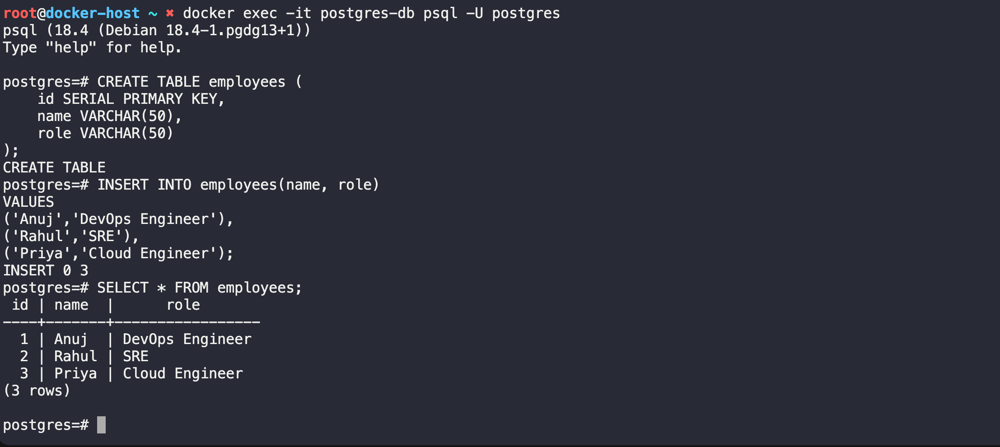

### Step 5: Stop and remove  the Container
```bash 
docekr stop postgres-db && docker rm postgres-db
```

- We notice that only the **container is removed** . The volume is still exists 

### Step 6: Verify the Volume
```bash 
docker volume ls 
```
Output:
```
DRIVER    VOLUME NAME
local     postgres-data
```
- The volume is still available.

### Step 8: Run a Brand New Container
Start another PostgreSQL container using the same volume:

```bash 
docker run -d --name postgres-db -e POSTGRES_PASSWORD=admin123 -v postgres-data:/var/lib/postgresql -p 5432:5432 postgres:18

```
OUTPUT : 
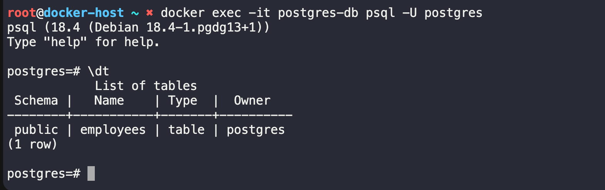


- The table is still there 
- Data also preserved 

### Step 9: Inspect the Volume

Inpect the volume which we have created and mounted to the container 
```bash 
docker volume inspect postgres-data
```
OUTPUT: 
```JSON
root@docker-host ~ ➜  docker inspect postgres-data


[
    {
        "CreatedAt": "2026-07-18T08:43:48-04:00",
        "Driver": "local",
        "Labels": null,
        "Mountpoint": "/var/lib/docker/volumes/postgres-data/_data",
        "Name": "postgres-data",
        "Options": null,
        "Scope": "local"
    }
]


```
Architecture

```

               Docker Volume
          postgres-data
                 │
                 │
      -----------------------
      │                     │
      ▼                     ▼
Container 1           Container 2
(Postgres)            (New Postgres)
      │                     │
      └──────────► Same Data
```


## What Happened?

Unlike the previous task, the database files were not stored inside the container. They were stored in the Docker named volume.

When the first container was removed:


- The container was deleted.
- The Docker volume remained.
- The database files remained inside the volume.

When a new container was started using the same volume, PostgreSQL automatically used the existing database files, so the table and data were still available.

### Why Named Volumes Are Important:

Named volumes are commonly used for stateful applications such as:

- PostgreSQL
- MySQL
- MongoDB
- Redis
- Elasticsearch
- Jenkins
- SonarQube

They ensure that application data persists even when containers are stopped, removed, or recreated.

#### Q: -> What is a Docker Named Volume, and why would you use one?

A Docker Named Volume is a Docker-managed storage location that exists independently of containers. It is used to persist application data across container restarts and recreations. Named volumes are commonly used with databases and other stateful applications because removing a container does not delete the data stored in the volume.


# Task 3: Bind Mounts

In this Task we will learn how **BIND MOUNTS** a Docker container to directly use files from our HOST machine. Ulike named Volumes , bind mounts points to a specific directory on our computer, Making them ideal for devlopment because changes on the host are immediately reflected inside the container.

### Step 1: Create a Folder on our Host

Create a new directory:

```bash 
mkdir my-website-on-host
cd my-website-on-host
```
Create an `index.html` file:
```HTML
vi index.html 

# Add the following content:

<!DOCTYPE html>
<html>
<head>
    <title>Docker Bind Mount Demo</title>
</head>
<body>
    <h1>Hello from Bind Mount!</h1>
    <p>This page is served from my host machine.</p>
</body>
</html>
```

Verify the file:
```bash 
cat index.html 
```
OUTOUT:


### Step 2: Run an Nginx Container with a Bind Mount
Run the container:
```bash  
docker run -d --name nginx-bind -p 8080:80 -v $(pwd):/usr/share/nginx/html nginx:alpine
```

Understanding the `-v` Option

`$(pwd):/usr/share/nginx/html`

| Part                    | Meaning                                  |
| ----------------------- | ---------------------------------------- |
| `$(pwd)`                | Current directory on your host machine   |
| `/usr/share/nginx/html` | Nginx web directory inside the container |

- This means Nginx serves files directly from our local folder.

### Step 3: Access the Website

Open your browser and visit:
```bash 
http://localhost:8080
```

we should see:

OUTPUT: 
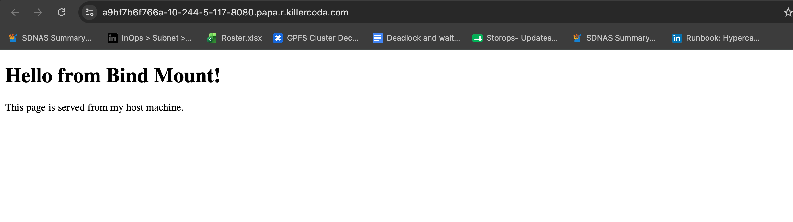

### Step 4: Edit the File on Your Host

Modify `index.html`:

```HTML 
<!DOCTYPE html>
<html>
<head>
    <title>Docker Bind Mount Demo</title>
</head>
<body>
    <h1>Hello Docker!</h1>
    <p>I edited this file without rebuilding the image.</p>
</body>
</html>
```
Save the file.Refesh the browser we should immediately see:

OUTPUT : 
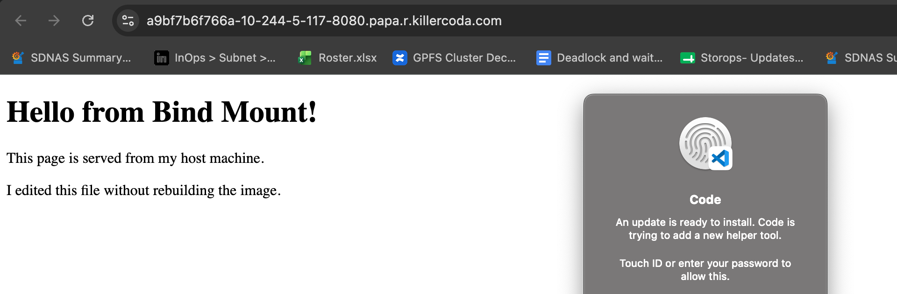

### Step 5: Verify the Mount

Inspect the container:
```bash 
docker inspect nginx-bind
```
Look for the Mounts section:
```
OUTOUT: 


- This confirms that Docker is using Bind Mounts

Stop and Remove the Container
```bash 
docker stop nginx-bind && docker rm nginx-bind
```
- Our `index.html` file remains on our host machine Because Docker never owned it 

### Architecture

```
Host Machine
-------------------------
my-website/
└── index.html
        │
        │ Bind Mount
        ▼
Docker Container
-------------------------
/usr/share/nginx/html
        │
        ▼
Nginx Web Server
        │
        ▼
http://localhost:8080
```
## Named Volume vs Bind Mount

| Feature                 | Named Volume                           | Bind Mount                                    |
| ----------------------- | -------------------------------------- | --------------------------------------------- |
| Storage Location        | Managed by Docker                      | Specific directory on the host                |
| Managed By              | Docker                                 | User                                          |
| Easy to Share with Host | No                                     | Yes                                           |
| Best For                | Databases, persistent application data | Development, source code, configuration files |
| Data Visible on Host    | Stored in Docker's internal directory  | Stored directly in your chosen host directory |
| Platform Independence   | High                                   | Depends on host filesystem paths              |

#### Q -> What is the difference between a Named Volume and a Bind Mount?

A **Named Volume** is managed entirely by Docker and is primarily used for persistent application data such as databases. Docker decides where the data is stored, and the data remains available even after containers are removed.

A **Bind Mount** directly maps a directory or file from the host machine into a container. Any changes made on the host are immediately reflected inside the container, making bind mounts ideal for development workflows where code changes need to be visible without rebuilding the Docker image.

#### Q: When would you use a Bind Mount instead of a Named Volume?

Use a **Bind Mount** during development when you need to edit source code or configuration files on our host machine and see the changes instantly inside the container. 

Use a **Named Volume** for persistent application data, especially databases, where Docker-managed storage provides better portability and isolation.


# Task 4: Docker Networking Basics

Docker automatically creates networks that allow containers to communicate with each other. In this task, we'll explore the default bridge network and understand how container communication works.

### Step 1: List All Docker Networks

Run the following command:
```bash 
docker network ls
```
Example output:

```
NETWORK ID     NAME      DRIVER    SCOPE
4f2a7d1c3a9b   bridge     bridge    local
8e3c9b2f1d6a   host       host      local
1b7d8c4e5f9a   none       null      local
```
Understanding the Default Networks

| Network  | Purpose                                   |
| -------- | ----------------------------------------- |
| `bridge` | Default network for standalone containers |
| `host`   | Container shares the host's network stack |
| `none`   | Container has no network connectivity     |

- **Overlay Networking** -> Overlay networking in Docker is a networking driver that allows containers running on different Docker hosts to communicate as if they were on the same local network. It is commonly used with Docker Swarm for multi-host container deployments.


### Step 2: Inspect the Default Bridge Network

Inspect the bridge network:
```bash
docker network inspect bridge
```
Example output (truncated):

```JSON 
[
  {
    "Name": "bridge",
    "Driver": "bridge",
    "Subnet": "172.17.0.0/16",
    "Gateway": "172.17.0.1"
  }
]
```
Notice:
- Network Name
- Driver
- Subnet
- Gateway
- Connected Containers (if any)

### Step 3: Run Two Containers

Start two Ubuntu containers:

```bash
docker run -dit --name ubuntu1 ubuntu
```
```bash
docker run -dit --name ubuntu02 ubuntu 
```
Verify: 
```bash 
docker ps 
```
### Step 4: Can They Ping Each Other by Name?
Open a shell inside the first container:
```bash 
docker exec -it ubuntu1 bash
```
Install the ping utility (if required):
```bash 
apt update
apt install -y iputils-ping
```
Try:
```bash 
ping ubuntu2
```

Expected output:


-  No, containers on the **default bridge network** cannot communicate using container names because Docker does not provide automatic **DNS resolution** on the default bridge network.

- Now just exit the container `exit`

### Step 5: Find the IP Address of the Second Container
Inspect the second container:
```bash 
docker inspect ubuntu2
```
Locate the IP address:

```bash 
  "IPAddress": "172.12.0.3",
```

### Step 6: Ping by IP Address
Enter the first container again:
```bash 
docker exec -it ubuntu1 bash
```
Ping the second container using its IP:
```bash 
ping 172.12.0.3
```
OUTPUT: 


Yes, containers on the default bridge network can communicate using their **IP addresses**

Stop the ping:
```bash 
ctl + c 
```
- exit the container 


### Verify Network Information
View the bridge network again:
```bash
docker network inspect bridge 
```
we should now see both containers listed under the Containers section with their respective IP addresses.

Architecture

```
                 Docker Bridge Network
              (172.17.0.0/16)
                     │
        ┌────────────┴────────────┐
        │                         │
        ▼                         ▼
   ubuntu1                  ubuntu2
172.17.0.2              172.17.0.3
        │                         │
        └────── Ping by IP ───────┘

Ping by Name ❌
Ping by IP   ✅
```

### Q -> Can containers on the default bridge network ping each other by name?

No. The default bridge network does not provide automatic DNS-based name resolution. Containers cannot resolve each other's names unless they are connected to a user-defined bridge network.

### Q-> Can containers on the default bridge network ping each other by IP?
Yes. Containers connected to the default bridge network can communicate directly using their assigned IP addresses.

### IMP Q: Why can't containers on the default bridge network communicate using container names?

The default **bridge** network does not include Docker's embedded DNS service for automatic container name resolution. Containers can communicate using IP addresses, but not by name. To enable name-based communication, create and use a **user-defined bridge** network, which provides automatic DNS resolution between containers.


# Task 5: Custom Networks

In this task we will create a user-defined **bridge network** and observe how DOCKER provide provides **Automatic DNS-based name resolution between containers connected to the same network 


unlike the default `bridge` network , user-defined `bridge` networks allow containers to communicate using container  names instead of IP addresses.


### Step 1: Create a Custom Bridge Network
Create a new Docker network:

```bash 
docker network create my-app-net
```
verify: 
```bash 
docker network ls 
```
OUTPUT: 
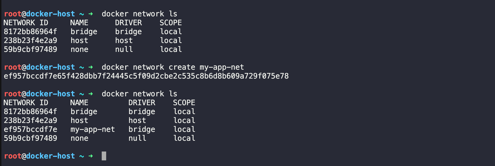


### Step 2: Inspect the Network

```bash 
docker network inspect my-app-net 
```
- Initally we will see that there is no containers are connected. 


### Step 3: Run Two Containers on the Custom Network
Start the first container:
```bash 
docker run --dit --name app1 --network my-app-net ubuntu
```
Start the second container:
```bash 
docker run -dit --name app2 --network my-app-net ubuntu
```
Verify:
```bash 
docker ps 
```
OUTPUT: 
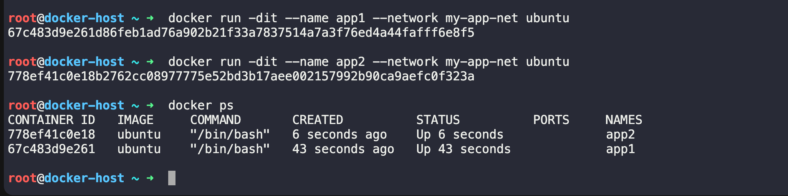

### Step 4: Open a Shell in the First Container

```bash 
docker exec -it app1 bash 
```
Install the ping utility if needed:
```bash 
apt update 
apt install -y iputils-ping
```

### Step 5: Ping by Container Name
```bash 
ping app2
```
OUTPUT: 


- The containers can successfully communicate using container names.


### Step 6: Verify DNS Resolution
```bash 
getent hosts app2 
```

OUTPUT: 


n
- Docker's embedded DNS server automatically resolves the container name to its IP address. 

- Exit the container 

### Step 7: Inspect the Custom Network

```bash 
docker network inspect my-app-net 
```

we could see both the container connected 

OUTPUT: 
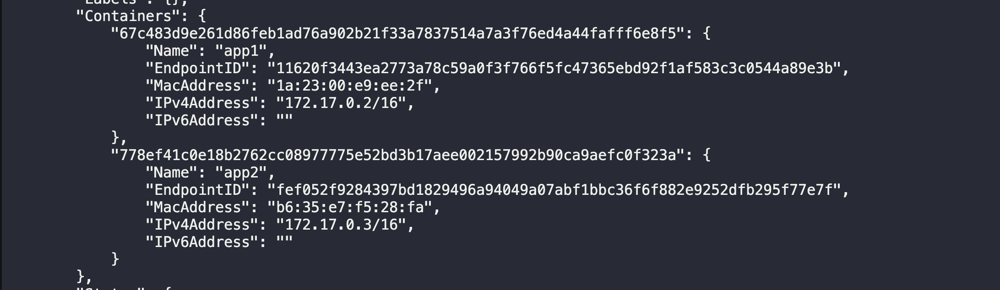


#### Architecture

```
                my-app-net
          (User-defined Bridge)
                  │
        ┌─────────┴─────────┐
        │                   │
        ▼                   ▼
      app1               app2
172.18.0.2          172.18.0.3
        │
        │ ping app2
        ▼
 Docker DNS resolves
 "app2" → 172.18.0.3
 ```


### Q: -> Can containers on a custom bridge network ping each other by name?

- Yes. Docker automatically provides an embedded DNS server for user-defined bridge networks. Each container name is registered as a DNS record, allowing containers to communicate using names instead of IP addresses.

### Q: -> Why does custom networking allow name-based communication but the default bridge doesn't?

- The default bridge network is a legacy network that does not provide automatic DNS-based service discovery between containers. Containers can communicate using IP addresses but cannot resolve each other's names.

- A user-defined bridge network includes Docker's embedded DNS service. When containers join the same custom network, Docker automatically registers their names and resolves them to the correct IP addresses. This makes communication easier and more reliable because container IP addresses can change, while container names remain consistent.


#### IMP-> Q: Why do most Docker Compose applications use custom bridge networks instead of the default bridge network?

Docker Compose creates a **user-defined bridge network** by default because it provides automatic DNS-based service discovery. Containers can communicate using service or container names (for example,` web`, `db`, or `redis`) instead of hardcoding IP addresses, making applications easier to manage, scale, and maintain.