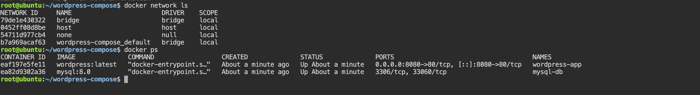
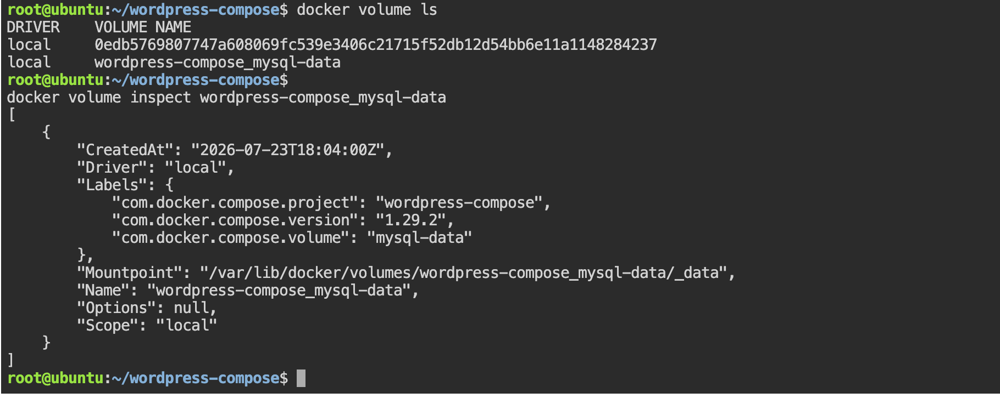
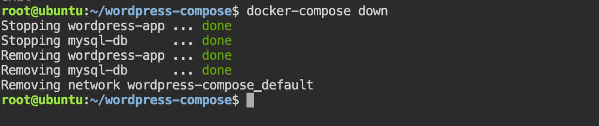
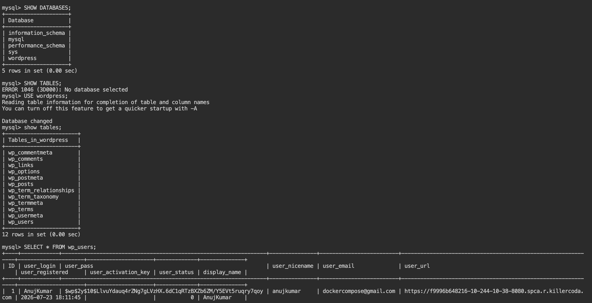

# Task 1: Install & Verify Docker Compose

Docker Compose is a tool for defining and managing multi-container Docker applications using a YAML file ( `docker-compose.yml` or `compose.yaml`).

Modern Docker Desktop includes Docker Compose by default as the Compose V2 plugin, so you usually don't need to install it separately.

### Step 1: Check if Docker Compose is Installed

Run: 
```bash 
docker compose version 
```
Note: Modern Docker uses `docker compose` (with a space), not the older `docker-compose` command.

Expected Output
```
Docker Compose version v5.0.2
```
- If you see a version similar to the above, Docker Compose is installed and ready to use.

### Step 2: Verify Docker is Running

Check the Docker Engine:
```bash 
docker version
```
Example:
```bash 
Client:
 Version:           28.x.x

Server:
 Engine:
  Version:          28.x.x

```
Example:

```
Client:
 Version:           28.x.x

Server:
 Engine:
  Version:          28.x.x

```
Both Client and Server sections should appear. If only the client appears, make sure the Docker daemon (or Docker Desktop) is running.

### Step 3: Verify Docker Compose Works

Run: 
```bash 
docker compose 
```
we can see the compose help menu , for example: 
```
Usage: docker compose [OPTIONS] COMMAND

Commands:
  up
  down
  build
  ps
  logs
  exec
  pull
  restart
  stop
  ...
```

This confirms the Compose plugin is working correctly.

Commands Summary

| Task                            | Command                    |
| ------------------------------- | -------------------------- |
| Check Compose version           | `docker compose version`   |
| Check Docker version            | `docker version`           |
| Verify Compose is working       | `docker compose`           |
| (Optional) Check legacy Compose | `docker-compose --version` |

## Q: What is Docker Compose?

Docker Compose is a tool for defining and running multi-container Docker applications. It uses a YAML configuration file to describe services, networks, volumes, environment variables, and port mappings. With a single command such as docker compose up, you can build and start an entire application stack consistently across development and testing environments.

# Task 2: Your First Docker Compose File

In this task we will create our first Docker Compose project that runs a single nginx
container 

Instead of typing a long `docker run` command, we'll define everything in a `docker-compose.yml` file and let Docker Compose manage the container


##### Project Structure: -> Create a new project directory:


```bash 
mkdir compose-basics
cd compose-basics
```
our project should look like:
```
compose-basics/
└── docker-compose.yml
```

### Step 1: Create docker-compose.yml

Create the file:
```bash 
vi docker-compose.yml
```
```YAML
services:
  nginx:
    image: nginx:alpine
    container_name: nginx-compose
    ports:
      - "8080:80"
```

#### Understanding the Compose File

`services`

- Defines the containers that Docker Compose will create.

`nginx`

 The service name.

 Docker Compose uses this name for:
 - Service discovery
 - DNS resolution
 - Managing the container

`image`

```
image: nginx:alpine
```
- Tells Docker which image to use.

- If the image doesn't exist locally, Docker automatically downloads it.

`container_name`

```YAML
container_name: nginx-compose
```
- Assigns a custom name to the container.

- Without this, Docker Compose generates a name automatically.

`ports`

```YAML
ports:
  - "8080:80"
```
Maps:
```
Host Port      Container Port
8080     --->        80
```
we will access Nginx using:
```
http://localhost:8080
```

### Step 2: Start the Application

Run: 
```bash 
docker compose up 
```
Example output:
```
[+] Running 1/1
 ✔ Container nginx-compose Started
 ```
 - The terminal stays attached and displays container logs.

 ### Step 3: Run in Detached Mode (Optional)

 To run in the background:
 ```bash 
 docker compose up -d
 ```
 Verify:
 ```bash 
 docker ps 
 ```
 Example:
 ```bash 
 CONTAINER ID   IMAGE           STATUS
ab123456       nginx:alpine    Up 10 seconds
```

### Step 4: Access the Website

Open your browser:
```
http://localhost:8080
```
we can  should see the default Welcome to nginx! page.

### Step 5: View Running Services
```bash
docker compose ps 
```
Example:
```
NAME             IMAGE           STATE
nginx-compose    nginx:alpine    running
```

### Step 6: View Logs
```bash 
docker compose logs
```
Or follow logs in real time:
```bash 
docker compose logs -f
```

### Step 7: Stop the Application

If running in the foreground:
```bash 
ctrl + c 
```
If running in detached mode:
```
docker compose down
```
Example output:
```
[+] Running 1/1
 ✔ Container nginx-compose Removed
 ✔ Network compose-basics_default Removed
 ```
 OUTPUT: 
 
 
- Notice that Docker Compose also removes the automatically created network.

### Complete Workflow

```
docker-compose.yml
        │
        ▼
docker compose up
        │
        ▼
Nginx Container
        │
        ▼
http://localhost:8080
        │
        ▼
docker compose down
        │
        ▼
Container Removed
Network Removed
```
### Commands Summary

| Task                      | Command                                     |
| ------------------------- | ------------------------------------------- |
| Create project            | `mkdir compose-basics && cd compose-basics` |
| Create Compose file       | `touch docker-compose.yml`                  |
| Start application         | `docker compose up`                         |
| Start in background       | `docker compose up -d`                      |
| View running services     | `docker compose ps`                         |
| View logs                 | `docker compose logs`                       |
| Follow logs               | `docker compose logs -f`                    |
| Stop and remove resources | `docker compose down`                       |


## Q: What are the advantages of using Docker Compose instead of `docker run`?

Docker Compose allows you to define your application's infrastructure as code using a YAML file. Instead of remembering long docker run commands, you can describe containers, networks, volumes, environment variables, and dependencies in a single file. This makes applications easier to deploy, share, version-control, and reproduce across development, testing, and production environments.

# Task 3: Two-Container Setup (WordPress + MySQL)

This task demonstrates one of the biggest advantages of Docker Compose—running multiple related services together. we will deploy a WordPress application with a MySQL database, where:
- Docker Compose automatically creates a shared network
- WordPress connects to MySQL using the service name (`db`).
- MySQL stores its data in a **named volume** for persistence

#### Project Structure

Create a new directory:
```
mkdir wordpress-compose
cd wordpress-compose
```

our project will contain:

```
wordpress-compose/
└── docker-compose.yml
```
### Step 1: Create `docker-compose.yml`

Create the file:
```bash 
vi docker-compose.yml 
```

Add the following content:
```YAML
services:
  db:
    image: mysql:8.0
    container_name: mysql-db
    restart: always
    environment:
      MYSQL_ROOT_PASSWORD: rootpassword
      MYSQL_DATABASE: wordpress
      MYSQL_USER: wpuser
      MYSQL_PASSWORD: wppassword
    volumes:
      - mysql-data:/var/lib/mysql

  wordpress:
    image: wordpress:latest
    container_name: wordpress-app
    restart: always
    depends_on:
      - db
    ports:
      - "8080:80"
    environment:
      WORDPRESS_DB_HOST: db:3306
      WORDPRESS_DB_USER: wpuser
      WORDPRESS_DB_PASSWORD: wppassword
      WORDPRESS_DB_NAME: wordpress

volumes:
  mysql-data:

```

#### Understanding the Compose File

Service: `db`

```YAML 
db:
```
This is MYSQL service 
Docker compose Automatically register the HOSTName
```
db
```  
- Every container on the Compose network an reach mysql using this name 

#### MySQL Environment Variables

```YAML 
environment:
  MYSQL_ROOT_PASSWORD: rootpassword
  MYSQL_DATABASE: wordpress
  MYSQL_USER: wpuser
  MYSQL_PASSWORD: wppassword
```
These variables initialize the MySQL database during the first startup.

#### Named Volume: 

```YAML 
volumes:
  - mysql-data:/var/lib/mysql
```
This stores all MySQL database files in a Docker-managed named volume.

Even if the container is recreated, the database remains.


#### `WordPress` Service
```YAML
wordpress:
```
Runs the official WordPress image.

`depends_on`

```YAML
depends_on:
  - db
```
Ensures Docker starts the MySQL container before the WordPress container.

Note: `depends_on` controls startup order but does not wait until MySQL is fully ready to accept connections.

Database Connection
```YAML 
WORDPRESS_DB_HOST: db:3306
```
This is the most important line.
Notice: 
```
db 
```
- This is the service name, not an IP address.
- Docker Compose's internal DNS automatically resolves:

```
db
```
↓

```
172.xx.xx.xx
```
Port Mapping

```YAML
ports:
  - "8080:80"
```
Access WordPress at:
```
http://localhost:8080
```

### Step 2: Start the Application

Run:
```bash 
docker compose up -d 
```
Example:
```bash 
Creating network "wordpress-compose_default"
Creating volume "wordpress-compose_mysql-data"
Creating mysql-db
Creating wordpress-app
```
### Step 3: Verify the Containers

```bash 
docker compose ps
```

Example:
```
NAME             IMAGE              STATE
mysql-db         mysql:8.0          running
wordpress-app    wordpress:latest   running

```
### Step 4: Verify the Network

```bash 
docker network ls
```
we'll see something similar to:
```
wordpress-compose_default
```
- Docker Compose created this automatically.

Inspect it:
```bash 
docker network inspect wordpress-compose_default
```


- we should see both containers connected.

### Step 5: Access WordPress

Open your browser:
```
http://localhost:8080
```
we'll see the WordPress installation page.

Complete the setup:
- Language - English 
- Site Title - wordpresssite 
- Username - Anujkumar
- Password - wordpress@docker
- Email - dockercompose@gmail.com

Click Install WordPress.
Then log in to the dashboard.

OUTPUT : 


List volumes:
```bash 
docker volume ls 
```
Example:
```
DRIVER    VOLUME NAME
local     wordpress-compose_mysql-data
```
Inspect the volume:
```bash 
docker volume inspect wordpress-compose_mysql-data
```
OUTPUT: 



### Step 7: Verify MySQL Connectivity

Enter the WordPress container:
```bash 
docker exec -it wordpress-app bash
```
Check DNS resolution:
```bash 
getent hosts db
```
OUTPUT: 
```
root@eaf197e5fe11:/var/www/html# getent hosts db
172.18.0.2      db
root@eaf197e5fe11:/var/www/html# 
```


- This confirms that WordPress resolves the MySQL service name correctly. Exit the container 

### Step 8: Stop Everything

```bash 
docker compose down
```
Output:



- Notice that the named volume is not removed.

### Step 9: Start Again
```bash 
docker compose up -d
```

Visit:
```
http://localhost:8080
```

we'll notice:

- WordPress opens directly.
- our site title remains
- our admin account still exists.
- Posts and settings are preserved.

After exec to the database 
```bash 
docker exec -it mysql-db bash
```
Inside it press 
```bash 
mysql -u root -p
```
OUTPUT: 




This confirms that the MySQL data persisted because it was stored in the named volume.

#### Complete Architecture
```
                   Docker Compose

                wordpress-compose
                        │
        ┌───────────────┴────────────────┐
        │                                │
        ▼                                ▼
   wordpress-app                  mysql-db
        │                                │
        │       Connects using           │
        ├──────────── db ───────────────►│
        │                                │
        ▼                                ▼
 Browser (8080)                 Named Volume
                             mysql-data
```

### Verification

After running:
```
docker compose down
docker compose up -d
```
our WordPress data should still be available.

**Reason**: Although the containers and network were removed, the named volume (    `mysql-data`) was preserved. When the new MySQL container started, it reused the same volume, allowing WordPress to access the existing database and retain all site content, users, and settings.


Note: If you run `docker compose down -v`, Docker also removes the named volumes. In that case, the MySQL database is deleted, and WordPress starts as a fresh installation.

### Q: How does WordPress communicate with MySQL in Docker Compose without using an IP address?

Docker Compose automatically creates a user-defined bridge network and provides built-in DNS-based service discovery. Each service name becomes a hostname on that network. In this example, WordPress connects to MySQL using `db:3306`, where `db` is the MySQL service name. Docker resolves `db` to the correct container IP automatically, eliminating the need to hardcode IP addresses.


# Task 4: Docker Compose Commands
In this Taks we will practice the most commonly used **Docker compose commands**
These are the command we will use daily when devloping and managing multi-container applications 

1. Start Services in Detached Mode
Start all services in the background:

```bash 
docker compose up -d 
```
verify 
```bash 
docker ps 
```
Example output:
```
NAME             IMAGE              STATUS
mysql-db         mysql:8.0          Up
wordpress-app    wordpress:latest   Up
```

### 2. View Running Services

List all services managed by the Compose project:
```bash 
docker compose ps 
```
Example:
```
NAME             IMAGE              STATUS
mysql-db         mysql:8.0          Up
wordpress-app    wordpress:latest   Up
```

### 3. View Logs of All Services

Display logs from every service:
```bash 
docker compose logs
```
Follow logs in real time:
```bash 
docker compose logs -f 
```

Example output:
```bash 
mysql-db      | MySQL init process done.
wordpress-app | Apache started.
```

### 4. View Logs of a Specific Service
View logs for the WordPress service:
```bash 
docker compose logs wordpress
```
Or for the MySQL service:
```bash 
docker compose logs db
```
Follow logs continuously:
```bash 
docker compose logs -f wordpress 
```

- Always use service name defined in `docker-compose.yml` (for example, `db` or `wordpress` ) not the container name 

### 5. Stop Services Without Removing Them

Stop all running services:
```bash 
docker compose stop 
```
verify 
```bash 
docker compose ps 
```
Example output : 

```
NAME             IMAGE              STATUS
mysql-db         mysql:8.0          Exited
wordpress-app    wordpress:latest   Exited
```
Restart the stopped services:
```bash 
docker compose start 
```

### 6. Remove Everything (Containers and Networks)
Stop and remove all containers and the project network:
```bash 
docker compose down 
```
Example output:
```
Stopping wordpress-app
Stopping mysql-db

Removing wordpress-app
Removing mysql-db

Removing network wordpress-compose_default
```

Note: **Named volumes** are not removed by default.

To also remove **named volumes**:
```bash 
docker compose down -v 
```
This deletes persistent data such as our MySQL database.

### 7. Rebuild Images After Making Changes

If we have modified our Dockerfile application code and need to rebuild images:

```bash 
docker compose up --build 
```
or run in detached mode: 
```bash 
docker compose up -d --build 
```
To rebuild images without starting containers:
```bash 
 docker compose build 
 ```

Complete Workflow
```
docker compose up -d
        │
        ▼
docker compose ps
        │
        ▼
docker compose logs
        │
        ▼
docker compose logs db
        │
        ▼
docker compose stop
        │
        ▼
docker compose start
        │
        ▼
docker compose down
        │
        ▼
docker compose up -d --build

```
Commands Summary

| Task                                     | Command                              |
| ---------------------------------------- | ------------------------------------ |
| Start services (detached)                | `docker compose up -d`               |
| View running services                    | `docker compose ps`                  |
| View logs (all services)                 | `docker compose logs`                |
| Follow logs                              | `docker compose logs -f`             |
| View logs for one service                | `docker compose logs <service-name>` |
| Stop services                            | `docker compose stop`                |
| Start stopped services                   | `docker compose start`               |
| Remove containers and networks           | `docker compose down`                |
| Remove containers, networks, and volumes | `docker compose down -v`             |
| Rebuild images                           | `docker compose build`               |
| Rebuild and start services               | `docker compose up -d --build`       |


### IMP Q: What is the difference between docker compose stop and docker compose down?

- `docker compose stop` stops the running containers but keeps the containers, networks, and volumes intact. we can restart them later using docker compose start.

- `docker compose down` stops and removes the containers and the Compose-created network. Named volumes are preserved unless you use the -v option, which also deletes the volumes and their data.
