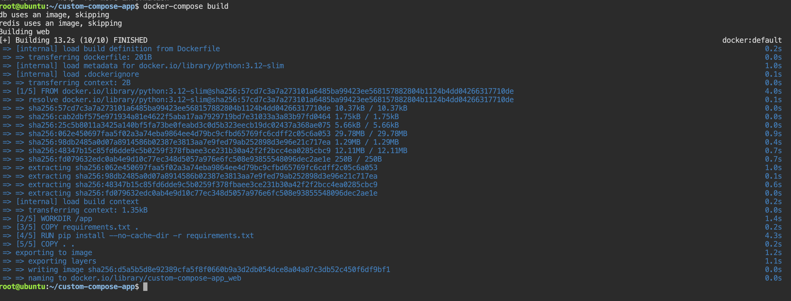
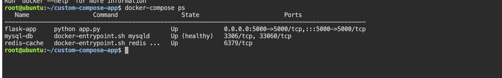
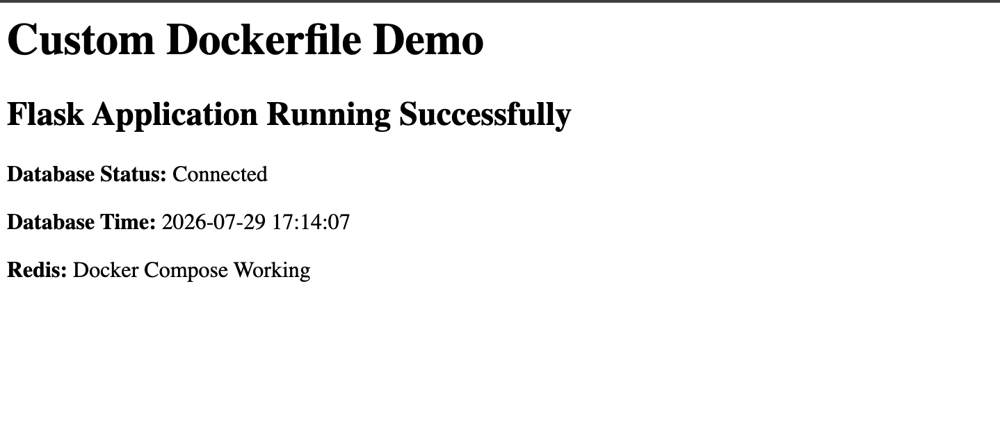
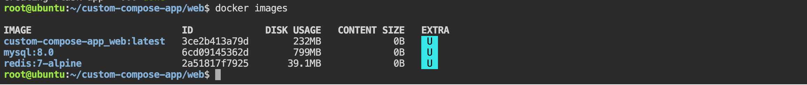
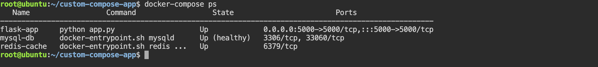
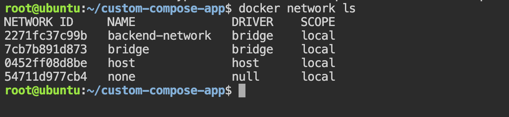
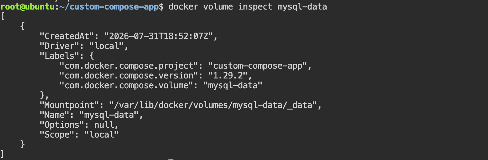
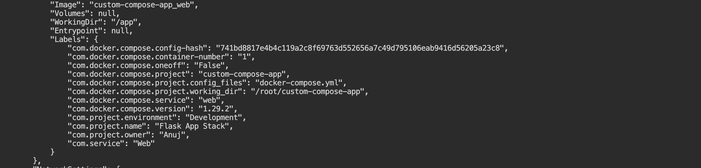
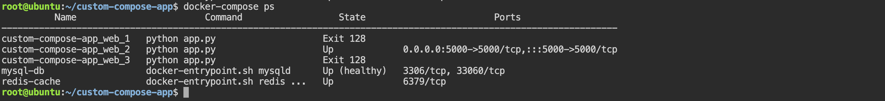
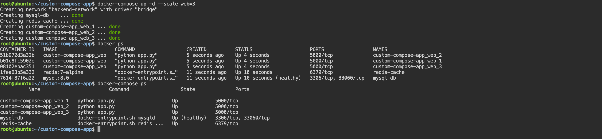

# Task 1: Build Your Own App Stack (Flask + MySQL + Redis)

In this task we will build a real-world 3-tier applications using Docker Compose.

The stack consists of:

- Flask – Web application
- MySQL – Database
- Redis – Cache
- Docker Compose – Orchestrates all services
- Custom Dockerfile – Builds the Flask application image

The Flask application will:

- Connect to MySQL
- Verify the database connection
- Connect to Redis
- Display a success message in the browser

#### Project Structure
```
flask-app-stack/
│
├── docker-compose.yml
│
└── web/
    ├── Dockerfile
    ├── app.py
    └── requirements.txt
```
Create the project:

```bash 
mkdir flask-app-stack
cd flask-app-stack

mkdir web
cd web

touch Dockerfile app.py requirements.txt

cd ..
touch docker-compose.yml
```

### Step 1: Create the Flask Application
`app.py`

```python 
from flask import Flask
import mysql.connector
import redis
import time

app = Flask(__name__)

# Wait for MySQL
db = None
while db is None:
    try:
        db = mysql.connector.connect(
            host="db",
            user="appuser",
            password="apppassword",
            database="myapp"
        )
    except Exception:
        print("Waiting for MySQL...")
        time.sleep(3)

# Connect to Redis
cache = redis.Redis(host="redis", port=6379)

@app.route("/")
def home():
    cursor = db.cursor()

    cursor.execute("SELECT NOW();")
    current_time = cursor.fetchone()[0]

    cache.set("status", "Connected")

    redis_status = cache.get("status").decode()

    return f"""
    <h1>Docker Compose Demo</h1>

    <p><b>MySQL:</b> Connected</p>

    <p>Database Time:
    {current_time}</p>

    <p><b>Redis:</b>
    {redis_status}</p>
    """

if __name__ == "__main__":
    app.run(host="0.0.0.0", port=5000)
```

### Step 2: Create requirements.txt
```bash 
Flask==3.1.0
mysql-connector-python==9.2.0
redis==5.2.1
```

### Step 3: Create the Dockerfile

```Dockerfile 
FROM python:3.12-slim

WORKDIR /app

COPY requirements.txt .

RUN pip install --no-cache-dir -r requirements.txt

COPY . .

EXPOSE 5000

CMD ["python", "app.py"]
```
Understanding the Dockerfile

| Instruction | Purpose                            |
| ----------- | ---------------------------------- |
| FROM        | Base Python image                  |
| WORKDIR     | Working directory inside container |
| COPY        | Copy application files             |
| RUN         | Install Python dependencies        |
| EXPOSE      | Document application port          |
| CMD         | Start the Flask application        |


### Step 4: Create `docker-compose.yml`

```YAML
services:

  web:
    build: ./web
    container_name: flask-app

    ports:
      - "5000:5000"

    depends_on:
      - db
      - redis

    environment:
      DB_HOST: db
      DB_NAME: myapp
      DB_USER: appuser
      DB_PASSWORD: apppassword
      REDIS_HOST: redis

  db:
    image: mysql:8.0

    container_name: mysql-db

    restart: always

    environment:
      MYSQL_ROOT_PASSWORD: rootpassword
      MYSQL_DATABASE: myapp
      MYSQL_USER: appuser
      MYSQL_PASSWORD: apppassword

    volumes:
      - mysql-data:/var/lib/mysql

  redis:
    image: redis:7-alpine

    container_name: redis-cache

    restart: always

volumes:
  mysql-data:

```

### Step 5: Build the Stack

```bash 
docker compose build 
```
### Step 6: Start Everything

```bash 
docker compose up -d
```
Verify:
```bash 
docker compose ps 
```

OUTPUT: 


### Step 7: View Logs

```bash 
docker compose logs web
```
Follow logs:
```bash 
docker compose logs -f web 
```

### Step 8: Access the Application

Open:
```bash 
http://localhost:5000
```
OUTPUT: 


### Step 9: Verify MySQL

```bash 
docker exec -it mysql-db mysql -u appuser -p
```
Password:
```
apppassword
```
Verify:
```sql
SHOW DATABASES;
```
OUTPUT: 


### Step 10: Verify Redis

Enter Redis:
```bash 
docker exec -it redis-cache redis-cli 
```
Check the stored key:
```bash
GET status
```
Output:


Architecture
```
                 Docker Compose

             flask-app-stack
                     │
     ┌───────────────┼───────────────┐
     │               │               │
     ▼               ▼               ▼
 Flask App       MySQL DB         Redis
 (Python)        (Persistent)     (Cache)
     │               ▲
     │               │
     └────── Connects ┘
     │
     └──────── Connects to Redis

Browser
http://localhost:5000
```

### IMPT Q: How do containers communicate with each other in a Docker Compose application?

Docker Compose automatically creates a user-defined bridge network for the project. Each service is registered in Docker's internal DNS using its service name. Instead of using IP addresses, containers communicate by referring to service names such as db for MySQL or redis for Redis. This makes the application more portable and resilient because service names remain constant even if container IP addresses change.


# Task 2: depends_on & Healthchecks
In the previous Task we used : 

```YAML 
depends_on:
  - db
  - redis
```
This only ensures that Docker Starts the `db` container before the `web` container. It does not gurantee that MySQL is ready to accept connections

For exmaple:
```
MySQL Container Started ✅

↓

MySQL Initializing...

↓

Creating database...

↓

Loading users...

↓

Ready for connections

```
- During initialization, if Flask tries to connect, it may fail because MySQL isn't fully ready yet.

- To solve this, Docker Compose supports **healthchecks**. A healthcheck repeatedly tests whether a container is actually healthy. Combined with `depends_on: condition: service_healthy`, the `web` service waits until the database passes its healthcheck.

- Note: This behavior is supported by modern Docker Compose (Compose V2).

### Step 1: Update the Database Service

Modify the `db` service in our `docker-compose.yml`: 
```YAML
db:
  image: mysql:8.0
  container_name: mysql-db

  restart: always

  environment:
    MYSQL_ROOT_PASSWORD: rootpassword
    MYSQL_DATABASE: myapp
    MYSQL_USER: appuser
    MYSQL_PASSWORD: apppassword

  volumes:
    - mysql-data:/var/lib/mysql

  healthcheck:
    test: ["CMD", "mysqladmin", "ping", "-h", "localhost", "-uroot", "-prootpassword"]
    interval: 10s
    timeout: 5s
    retries: 5
    start_period: 20s
```
#### Understanding the Healthcheck

`Test`

```bash 
test:
  ["CMD", "mysqladmin", "ping", "-h", "localhost", "-uroot", "-prootpassword"]
  ```
Docker Runs this command inside the MySQL container

Equivalent command:
```bash 
mysqladmin ping -h localhost -uroot -prootpassword
```
If MySQL is accepting connections, we'll see:
```
mysqld is alive
```
- Docekr marks the contaner as **healthy**

`intervel`
```
interval: 10s
```
- Docker performs the health check every 10 seconds.

`Timeout`
```
timeout: 5s
```
- If the command takes longer than 5 seconds, the check is considered failed.

`Retries`

```
retries: 5
```
- Docker allows up to 5 consecutive failures before marking the container as **unhealthy**

`Start Period`

```
start_period: 20s
```
- MySQL needs time to initialize.
- During these first 20 seconds, failed health checks are ignored.

### Step 2: Update the Web Service
Replace the previous `depends_on` section:

```YAML 
depends_on:
  - db
  - redis
```

with:
```bash 
depends_on:
  db:
    condition: service_healthy
  redis:
    condition: service_started
```
This tell the Docker compose: 

- Wait until MySQL is healthy.
- Wait until Redis has started.
- Only then start the Flask application.

### Complete `web` Service

```YAML 
web:
  build: ./web
  container_name: flask-app

  ports:
    - "5000:5000"

  depends_on:
    db:
      condition: service_healthy
    redis:
      condition: service_started

  environment:
    DB_HOST: db
    DB_NAME: myapp
    DB_USER: appuser
    DB_PASSWORD: apppassword
    REDIS_HOST: redis
```
Full Docker compose YAML 

```YAML 
version: "3.8"

services:
  web:
    build: ./web
    container_name: flask-app

    ports:
      - "5000:5000"

    depends_on:
      db:
        condition: service_healthy
      redis:
        condition: service_started

    environment:
      DB_HOST: db
      DB_NAME: myapp
      DB_USER: appuser
      DB_PASSWORD: apppassword
      REDIS_HOST: redis

  db:
    image: mysql:8.0
    container_name: mysql-db
    restart: always

    environment:
      MYSQL_ROOT_PASSWORD: rootpassword
      MYSQL_DATABASE: myapp
      MYSQL_USER: appuser
      MYSQL_PASSWORD: apppassword

    volumes:
      - mysql-data:/var/lib/mysql

    healthcheck:
      test: ["CMD", "mysqladmin", "ping", "-h", "localhost", "-uroot", "-prootpassword"]
      interval: 10s
      timeout: 5s
      retries: 5
      start_period: 20s

  redis:
    image: redis:7-alpine
    container_name: redis-cache
    restart: always

volumes:
  mysql-data:

```

### Step 3: Bring Everything Down
```bash 
docker compose down
```

### Step 4: Start the Stack
```bash 
docker compose up 
```
Watch the logs carefully 

Example:
```bash 
Creating mysql-db...

Creating redis-cache...

mysql-db      | Initializing database...

mysql-db      | Starting MySQL...

mysql-db      | mysqld is alive

mysql-db      | Healthy

Starting flask-app...
```
OUTPUT: 


- Notice that the Flask container starts only after the database becomes healthy.

### Step 5: Verify the Health Status
Run:
```bash 
docker compose ps
```
OUTPUT: 


- The `(healthy)` status confirms that the healthcheck is passing.

we can also inspect the health details:
```bash 
docker inspect mysql-db
```

Look for:
```JSON 
"Health": {
    "Status": "healthy"
}
```

### Startup Flow
```
docker compose up
        │
        ▼
Start MySQL Container
        │
        ▼
Initialize Database
        │
        ▼
Run Healthcheck
(mysqladmin ping)
        │
        ▼
Healthy?
        │
   ┌────┴────┐
   │         │
  No        Yes
   │         │
Wait      Start Flask
             │
             ▼
      Connect to MySQL
```


### Why Is This Better?

Without a healthcheck:
```
MySQL Container Started

↓

Flask Starts Immediately

↓

MySQL Still Initializing

↓

Connection Failed
```
With a healthcheck:
```
MySQL Container Started

↓

Healthcheck Runs

↓

MySQL Ready

↓

Container Marked Healthy

↓

Flask Starts

↓

Connection Successful
```
This makes your application startup more reliable, especially for services like MySQL, PostgreSQL, MongoDB, and other databases that take time to initialize.


## IMP Q: Why isn't `depends_on` alone enough for database-dependent applications?

By itself, `depends_on` only controls the order in which containers are started. It does not verify that the dependent service is ready to accept connections. A database container may be running while it is still initializing. By adding a **healthcheck** and using `depends_on` with `condition: service_healthy`, Docker Compose waits until the database passes its health check before starting the application, reducing startup failures caused by premature connection attempts.


# Task 3: Restart Policies

Docker restart policies determine what Docker should do when a container exits or when the Docker daemon restarts. They improve application availability by automatically restarting containers under specific conditions.

In this we will compare `restart: always` and `restart: on-failure.`

### Step 1: Add `restart: always`

Update our database service in `docker-compose.yml`:
```YAML 
services:
  db:
    image: mysql:8.0
    container_name: mysql-db

    restart: always

    environment:
      MYSQL_ROOT_PASSWORD: rootpassword
      MYSQL_DATABASE: myapp
      MYSQL_USER: appuser
      MYSQL_PASSWORD: apppassword

    volumes:
      - mysql-data:/var/lib/mysql
```

### Understanding `restart: always`
```
If the container stops
        │
        ▼
Docker automatically starts it again
```
This applies if:
- The container crashes.
- The container is killed
- The Docker daemon restarts.
- The host machine reboots.

### Step 2: Start the Stack
```bash 
docker compose up -d 
```
verify: 
```bash 
docker ps 
   OR 
docker compose ps 
```
Example Output: 

```
NAME          STATUS
mysql-db      Up
flask-app     Up
redis-cache   Up
```
### Step 3: Manually Kill the Database Container
Kill the MySQL container:
```bash 
docker kill mysql-db
```
Example:
```
mysql-db
```

### Step 4: Watch What Happens
Immediately run:
```bash 
docker ps 
```
or watch continuously:
```bash
watch docker ps
```

Within a few seconds, we'll see
```
mysql-db
STATUS: Up
```
- Docker automatically recreated the running state because of:
```
restart: always 
```
we can also view the logs 
```bash 
docker logs mysql-db
```

### Step 5: Change to `restart: on-failure`
Modify the Compose file:
```YAML 
restart: on-failure
```
Or specify a retry limit:
```bash 
restart: on-failure:5
```
This means Docker will restart the container only if it exits with a **non-zero exit code (an error)**.

### Step 6: Recreate the Container
Apply the change:
```bash 
docker compose down
```

```bash 
docker compose up -d
```

### Step 7: Test `on-failure`
Kill the container:
```bash 
docker kill mysql-db
```
The container is terminated with a signal (`SIGKILL`), not because the application exited with an error code. Depending on how the container stops, `on-failure` may not restart it because it is intended for processes that exit due to failures rather than being intentionally stopped.


A better way to observe `on-failure` is with a container that exits with a non-zero status, for example:

```bash 
docker run --rm --restart on-failure alpine sh -c "exit 1"
```

Docker will attempt to restart the container because it exited with status code `1`.


### Restart Policy Comparison

`restart: always`

```
Container Stops
       │
       ▼
Docker Restarts It
```
Used for long-running services that should always be available.

Examples:
- MySQL
- PostgreSQL
- Redis
- Nginx
- RabbitMQ
- Elasticsearch


`restart: on-failure`

```
Container Exits

Exit Code = 0
       │
       ▼
No Restart

Exit Code ≠ 0
       │
       ▼
Restart
```
Used for applications that should only restart after unexpected failures.

Examples:
- Batch jobs
- Data import tasks
- Worker processes
- Scheduled scripts

### Architecture

```
           Restart Policy

          Container Stops
                 │
        ┌────────┴────────┐
        │                 │
 restart: always    restart: on-failure
        │                 │
Restart Every Time   Restart Only
   
                    On Failure
```

#### Notes

`restart: always`

- Restarts the container whenever it stops
- Also restarts the container after the Docker daemon or host system restarts.
- Best suited for production services that should remain available.

`restart: on-failure`
- Restarts the container only when the main process exits with a non-zero exit code.
- Does not restart containers that exit successfully.
- Can be configured with a retry limit (for example, `on-failure:5`).


### Common Restart Policies
| Policy           | Description                                                                    |
| ---------------- | ------------------------------------------------------------------------------ |
| `no`             | Never restart the container (default).                                         |
| `always`         | Always restart the container if it stops.                                      |
| `unless-stopped` | Restart automatically unless the container was explicitly stopped by the user. |
| `on-failure`     | Restart only if the container exits with a non-zero exit code.                 |


### Q: When would you use each restart policy?

Answer:

- `restart: always` is ideal for long-running services such as databases, web servers, caches, and message brokers that should automatically recover after crashes or host reboots.

- `restart: on-failure` is better for applications that should restart only after unexpected errors, such as worker processes, migration jobs, or data-processing tasks. It avoids restarting containers that completed successfully.


# Task 4: Custom Dockerfiles in Compose

Project Structure
```
custom-compose-app/
│
├── docker-compose.yml
│
└── web/
    ├── Dockerfile
    ├── requirements.txt
    └── app.py
```
Create it:

```bash 
mkdir custom-compose-app
cd custom-compose-app

mkdir web
cd web 


touch Dockerfile
touch requirements.txt
touch app.py

cd ..
touch docker-compose.yml
```
### File 1: `web/app.py`

```Python 
from flask import Flask
import mysql.connector
import redis
import time

app = Flask(__name__)

# Wait until MySQL is available
db = None
while db is None:
    try:
        db = mysql.connector.connect(
            host="db",
            user="appuser",
            password="apppassword",
            database="myapp"
        )
    except Exception:
        print("Waiting for MySQL...")
        time.sleep(3)

# Connect to Redis
cache = redis.Redis(host="redis", port=6379)

@app.route("/")
def home():

    cursor = db.cursor()

    cursor.execute("SELECT NOW();")
    db_time = cursor.fetchone()[0]

    cache.set("visits", "Docker Compose Working")

    cache_value = cache.get("visits").decode()

    return f"""
    <h1>Custom Dockerfile Demo</h1>

    <h2>Flask Application Running Successfully</h2>

    <p><b>Database Status:</b> Connected</p>

    <p><b>Database Time:</b> {db_time}</p>

    <p><b>Redis:</b> {cache_value}</p>
    """

if __name__ == "__main__":
    app.run(host="0.0.0.0", port=5000)

```

### File 2: `web/requirements.txt`

```
Flask==3.1.0
mysql-connector-python==9.2.0
redis==5.2.1
```
### File 3: `web/Dockerfile`

```dockerfile
FROM python:3.12-slim

WORKDIR /app

COPY requirements.txt .

RUN pip install --no-cache-dir -r requirements.txt

COPY . .

EXPOSE 5000

CMD ["python", "app.py"]
```

### File 4: `docker-compose.yml`

```YAML 
services:

  web:
    build:
      context: ./web
      dockerfile: Dockerfile

    container_name: flask-app

    ports:
      - "5000:5000"

    depends_on:
      db:
        condition: service_healthy
      redis:
        condition: service_started

    environment:
      DB_HOST: db
      DB_NAME: myapp
      DB_USER: appuser
      DB_PASSWORD: apppassword
      REDIS_HOST: redis

  db:
    image: mysql:8.0

    container_name: mysql-db

    restart: always

    environment:
      MYSQL_ROOT_PASSWORD: rootpassword
      MYSQL_DATABASE: myapp
      MYSQL_USER: appuser
      MYSQL_PASSWORD: apppassword

    volumes:
      - mysql-data:/var/lib/mysql

    healthcheck:
      test: ["CMD", "mysqladmin", "ping", "-h", "localhost", "-uroot", "-prootpassword"]
      interval: 10s
      timeout: 5s
      retries: 5
      start_period: 20s

  redis:
    image: redis:7-alpine

    container_name: redis-cache

    restart: always

volumes:
  mysql-data:
```

### Step 1: Build the Custom Image

Since we're using:
```bash 
build:
  context: ./web
  dockerfile: Dockerfile
```
Docker compose builds the image from our local Dockerfile Instead of pulling pre build application image.

Run:
```bash 
docker compose build
```

OUTPUT: 



### Step 2: Start Everything
```bash 
docker compose up -d 
```
verify: 
```bash 
docker compose ps 
```
we should see 
OUTPUT: 



Open:
```
http://localhost:5000
```
we should see:
```
Custom Dockerfile Demo

Flask Application Running Successfully

Database Status: Connected

Database Time: 2026-07-29 ...

Redis: Docker Compose Working
```

OUTPUT: 


### Step 3: Make a Code Change

Open:
```
web/app.py
```
Change this line:
```Python 
<h1>Custom Dockerfile Demo</h1>
```

to
```pyhton 
<h1>Version 2 - Application Updated</h1>
```
or change:

```bash 
cache.set("visits", "Docker Compose Working")
```
to
```bash 
cache.set("visits", "Application Updated Successfully")
```
Save the file.

### Step 4: Rebuild and Restart with One Command
Instead of running:
```bash 
docker compose build
docker compose down
docker compose up -d
```
run a single command 
```bash 
docker compose up -d --build 
```
This command:
1. Rebuilds the `web` image.
2. Recreates the `web` container if the image changed.
3. Starts the services in detached mode.

Visit:
```
http://localhost:5000
```
we'll see your updated content, confirming the new image was built and deployed.
OUTPUT:


### Verify the New Image

List images:
```bash 
docker images 
```
Example:Output 




Notice that Compose created an image for our application using the project name and service name.

### Complete Flow
```
                docker compose up -d --build
                           │
                           ▼
                Read docker-compose.yml
                           │
                           ▼
              build:
                context: ./web
                           │
                           ▼
                Read Dockerfile
                           │
                           ▼
                Build Flask Image
                           │
                           ▼
              Create/Update web Container
                           │
                           ▼
            Start MySQL and Redis Services
                           │
                           ▼
                Open http://localhost:5000
                           │
                           ▼
              Updated Application Visible
```

Commands Summary

| Task                | Command                        |
| ------------------- | ------------------------------ |
| Build image         | `docker compose build`         |
| Start services      | `docker compose up -d`         |
| Rebuild and restart | `docker compose up -d --build` |
| View logs           | `docker compose logs -f web`   |
| List containers     | `docker compose ps`            |
| Stop everything     | `docker compose down`          |

# Task 5: Named Networks & Volumes

In this Task we will improve our existing Docker compose projec by : 
- Creating an **Explicit custom Network** instead of using the default compose network 
- Creating **Named Volumes** For persistance Database Storage.
- Adding **Lables** to services for better organization and metadata 

This is common practice in production environment because it gives us more control over networking and storage 


Project Structure

```
custom-compose-app/
│
├── docker-compose.yml
│
└── web/
    ├── Dockerfile
    ├── app.py
    └── requirements.txt
```
No changes are required to `app.py`, `Dockerfile`, or `requirements.txt`.

Only update **docker-compose.yml**

#### docker-compose.yml
```YAML 
services:

  web:
    build:
      context: ./web
      dockerfile: Dockerfile

    container_name: flask-app

    ports:
      - "5000:5000"

    depends_on:
      db:
        condition: service_healthy
      redis:
        condition: service_started

    environment:
      DB_HOST: db
      DB_NAME: myapp
      DB_USER: appuser
      DB_PASSWORD: apppassword
      REDIS_HOST: redis

    networks:
      - backend-network

    labels:
      com.project.name: "Flask App Stack"
      com.project.environment: "Development"
      com.project.owner: "Anuj"
      com.service: "Web"

  db:
    image: mysql:8.0

    container_name: mysql-db

    restart: always

    environment:
      MYSQL_ROOT_PASSWORD: rootpassword
      MYSQL_DATABASE: myapp
      MYSQL_USER: appuser
      MYSQL_PASSWORD: apppassword

    volumes:
      - mysql-data:/var/lib/mysql

    healthcheck:
      test: ["CMD", "mysqladmin", "ping", "-h", "localhost", "-uroot", "-prootpassword"]
      interval: 10s
      timeout: 5s
      retries: 5
      start_period: 20s

    networks:
      - backend-network

    labels:
      com.project.name: "Flask App Stack"
      com.project.environment: "Development"
      com.project.owner: "Anuj"
      com.service: "Database"

  redis:
    image: redis:7-alpine

    container_name: redis-cache

    restart: always

    networks:
      - backend-network

    labels:
      com.project.name: "Flask App Stack"
      com.project.environment: "Development"
      com.project.owner: "Anuj"
      com.service: "Cache"

volumes:
  mysql-data:
    name: mysql-data

networks:
  backend-network:
    name: backend-network
    driver: bridge
```
### Step 1: Remove Existing Stack

```bash 
docker compose down
```
### Step 2: Start the New Stack
```bash 
docker compose up -d
```
Verify:
```bash 
docker compose ps 
```
OUTPUT: 



### Step 3: Verify the Network
List all the Docker Networks 
```bash 
docker network ls 
```
OutPut: 

Notice that Compose created **backend-network** instead of the default project network.

Inspect it:
```bash ba
docker network inspect backend-network
```
we should see all three containers connected

```
backend-network

├── flask-app
├── mysql-db
└── redis-cache
```

### Step 4: Verify the Volume
List volumes: 
```bash 
docker volume ls 
```

Output: 


Inspect the volume:
```bash
docker volume inspect mysql-data 
```
OUTPUT: 


### Step 5: Verify Labels
Inspect the Flask container:
```bash 
docker inspect flask-app
```

Search for Labels.

Output: 

```JSON 
"Labels": {
    "com.project.name": "Flask App Stack",
    "com.project.environment": "Development",
    "com.project.owner": "Anuj",
    "com.service": "Web"
}
OUTPUT: 


```
Check MySQL:
```bash 
docker inspect mysql-db
```
Check Redis:
```bash 
docker inspect redis-cache
```
Each service has its own labels.


### Project Architecture

```
                    Docker Compose
                           │
                           ▼
                  backend-network
                           │
      ┌────────────────────┼────────────────────┐
      │                    │                    │
      ▼                    ▼                    ▼
 Flask App            MySQL Database         Redis Cache
      │                    │                    │
      │                    │                    │
      └──────────────Communicate───────────────┘

                Named Volume
                  mysql-data
                       │
                       ▼
             Persistent Database Files
```

### Understanding Named Networks
instead of 
```YAML 
services: 
```
Docker compose Automatically creates: 
```
project_default
```
When you define:
```YAML 
networks:
  backend-network:
    driver: bridge
```
Docker creates:
```
backend-network
```
Now every service explicitly joins:
```YAML 
networks:
  - backend-network
```

Benefits:
- Better organization
- Easier troubleshooting
- Easy to share with other Compose projects (if needed)
- Production-friendly naming


### Understanding Named Volumes
Instead of:
```YAML 
volumes: 
  - /var/lib/mysql 
```
we define 
```YAML 
volumes:
  mysql-data:
```
Docker creates:
```
mysql-data
```
Benefits:
- Persistent database storage
- Data survives container recreation
- Easy backup and restore
- Easy inspection

### Understanding Labels
Labels are metadata attached to Docker objects.

Example:
```YAML 
labels:
  com.project.name: "Flask App Stack"
  com.project.environment: "Development"
  com.project.owner: "Anuj"
```
Docker stores them inside  the containe metadata 

They are commonly used for:
- Monitoring (Prometheus)
- Logging
- Service discovery
- Kubernetes migration 
- Documentation
- Automation scripts

### Q: Why define explicit networks and named volumes instead of relying on Docker Compose defaults?

Explicit networks and named volumes make a Compose project more predictable and maintainable. A named network provides a stable, descriptive network that can be reused or shared if needed, while named volumes ensure persistent data storage across container recreations. Adding labels helps identify services and is useful for monitoring, automation, and operational tooling in larger environments.


# Task 6: Scaling (Bonus)
One of the Docker Compose's useful features is the ability to run multiple instances (replicas) of a service. In this task , we will scale the **Flask web application** to 3 replicas and observe what  happens . 

Step 1: Update `docker-compose.yml`
Before scaling, remove the `container_name` from the web service.
```YAML
services:

  web:
    build:
      context: ./web
      dockerfile: Dockerfile

    container_name: flask-app

    ports:
      - "5000:5000"

    depends_on:
      db:
        condition: service_healthy
      redis:
        condition: service_started

    environment:
      DB_HOST: db
      DB_NAME: myapp
      DB_USER: appuser
      DB_PASSWORD: apppassword
      REDIS_HOST: redis

    networks:
      - backend-network

    labels:
      com.project.name: "Flask App Stack"
      com.project.environment: "Development"
      com.project.owner: "Anuj"
      com.service: "Web"

  db:
    image: mysql:8.0

    container_name: mysql-db

    restart: always

    environment:
      MYSQL_ROOT_PASSWORD: rootpassword
      MYSQL_DATABASE: myapp
      MYSQL_USER: appuser
      MYSQL_PASSWORD: apppassword

    volumes:
      - mysql-data:/var/lib/mysql

    healthcheck:
      test: ["CMD", "mysqladmin", "ping", "-h", "localhost", "-uroot", "-prootpassword"]
      interval: 10s
      timeout: 5s
      retries: 5
      start_period: 20s

    networks:
      - backend-network

    labels:
      com.project.name: "Flask App Stack"
      com.project.environment: "Development"
      com.project.owner: "Anuj"
      com.service: "Database"

  redis:
    image: redis:7-alpine

    container_name: redis-cache

    restart: always

    networks:
      - backend-network

    labels:
      com.project.name: "Flask App Stack"
      com.project.environment: "Development"
      com.project.owner: "Anuj"
      com.service: "Cache"

volumes:
  mysql-data:
    name: mysql-data

networks:
  backend-network:
    name: backend-network
    driver: bridge
    
```
❌ Remove this line
```
container_name: flask-app
```
Why?
When scaling, Docker needs to create multiple containers:
```
web-1
web-2
web-3
```
If we specify:
```YAML 
container_name: flask-app
```
every replica would try to use the same container name,  which is impossible 

we will get an error like 
```bash 
container name "flask-app" is already in use
```
- Leave the `container_name` on `db` and `redis` because they each have only one instance. 

# Step 2: Scale the Web Service
RUN: 
```bash 
docker compose up -d --scale  web=3 
```
OUTOUT: 
```
Creating custom-compose-app-web-1
Creating custom-compose-app-web-2
Creating custom-compose-app-web-3
```
### Step 3: Verify
```bash 
docker compose ps 
```
OUTPUT: 


### Step 4: List Containers
```bash 
docker ps 
```
OUTPUT: 


- NOTICE Docker automatically numbered the web containers. 

#### WHAT HAPPENS? 
All the flask container connects to: 
- The same MYSQL database 
- The same Redis cache 
- The same docker network 

Architecture becomes:
```
                     Browser
                        │
                        │
                  (Port 5000)
                        │
      ┌─────────────────┼─────────────────┐
      │                 │                 │
      ▼                 ▼                 ▼
   Web-1             Web-2             Web-3
      │                 │                 │
      └────────────┬────┴────┬────────────┘
                   │         │
                   ▼         ▼
                 MySQL     Redis
```

#### What Breaks?
we'll likely see an error similar to:
```
Bind for 0.0.0.0:5000 failed:
port is already allocated
```
or
```
Error starting userland proxy:
listen tcp4 0.0.0.0:5000:
bind: address already in use
```
#### Why?
Our compose file contains 
```YAML 
ports:
  - "5000:5000"
```
This means:
```
Host Port 5000
        │
        ▼
Container Port 5000
```
Now imagine three containers:
```
Host Port 5000
        │

Web-1 wants it ✔

Web-2 wants it ❌

Web-3 wants it ❌
```
Only one process can listen on the same host port 

Docker cannot map: 
```
5000 -> Web-1

5000 -> Web-2

5000 -> Web-3
```
at the same time 


### Why Doesn't Simple Scaling Work with Port Mapping?
Because the host port must be unique.

One host port can only forward traffic to one container.

For example:
```
localhost:5000

↓

Which container?

Web-1 ?

Web-2 ?

Web-3 ?
```

Docker has no built-in load balancer in standard Docker Compose mode to decide where to send requests.


### How Is This Solved in Real Production?
Instead of exposing every web container directly, we place a **reverse proxy or load balancer** in front of them.

Example:

```bash 
                  Browser
                     │
                     ▼
               Nginx / Traefik
             (Load Balancer)
                     │
        ┌────────────┼────────────┐
        ▼            ▼            ▼
      Web-1       Web-2       Web-3
        │            │            │
        └────────────┼────────────┘
                     │
             MySQL + Redis
```
The load balancer listens on port 5000 (or 80/443) and distributes incoming requests across all web containers.


### If You Just Want Multiple Containers (Without Publishing Ports)

we can temporarily remove:
```YAML
ports:
  - "5000:5000"
```
Then run:
```bash 
docker compose up -d --scale web=3
```
OUTPUT: 


Now all three containers start successfully because they communicate only over Docker's internal network. However, they won't be directly accessible from our host.

#### Commands Summary

| Task                      | Command                              |
| ------------------------- | ------------------------------------ |
| Scale web service         | `docker compose up -d --scale web=3` |
| View running services     | `docker compose ps`                  |
| List containers           | `docker ps`                          |
| Scale back to one replica | `docker compose up -d --scale web=1` |


#### Notes
#### What happened?

- Docker created three Flask containers.
- All three connected to the same custom network.
- All three shared the same MySQL database.
- All three shared the same Redis cache.
- Port publishing became the limiting factor.

### Why doesn't simple scaling work with port mapping?

Docker can create multiple container replicas, but only one container can bind to a specific host port. Since every replica tries to publish 5000:5000, the second and third replicas cannot claim the already-used host port. In production, this is solved by exposing a single reverse proxy or load balancer, which listens on the host port and distributes traffic to multiple backend containers.


### IMP Q: Why doesn't `docker compose up --scale web=3` work well when the service publishes a fixed host port?

Each replica attempts to publish the same host port (for example,` 5000:5000 `). A host port can only be bound by one container at a time, so additional replicas fail to publish that port. In production, a reverse proxy or load balancer (such as Nginx, Traefik, or a cloud load balancer) listens on the host port and forwards requests to multiple application replicas running on the internal Docker network.