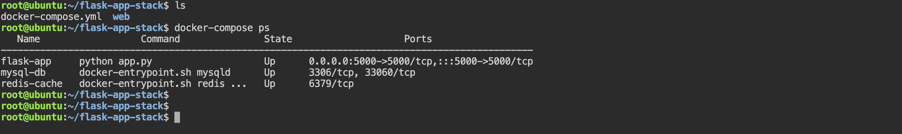
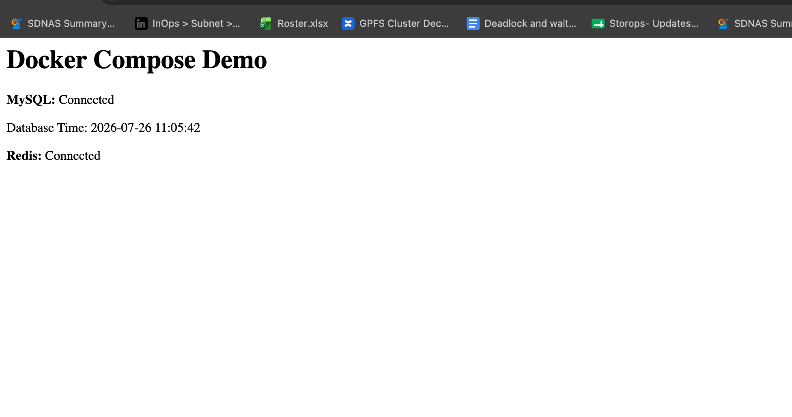
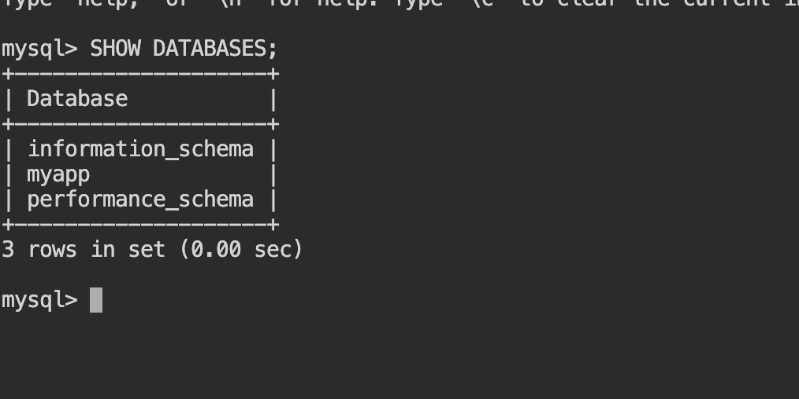
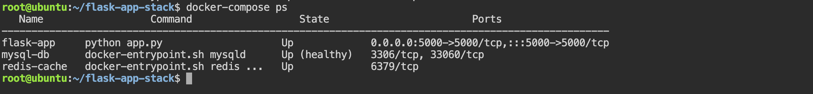

# Task 1: Build Your Own App Stack (Flask + MySQL + Redis)

In this task we will build a real-world 3-tier applications using Docker Compose.

The stack consists of:

- Flask – Web application
- MySQL – Database
- Redis – Cache
- Docker Compose – Orchestrates all services
- Custom Dockerfile – Builds the Flask application image

The Flask application will:

- Connect to MySQL
- Verify the database connection
- Connect to Redis
- Display a success message in the browser

#### Project Structure
```
flask-app-stack/
│
├── docker-compose.yml
│
└── web/
    ├── Dockerfile
    ├── app.py
    └── requirements.txt
```
Create the project:

```bash 
mkdir flask-app-stack
cd flask-app-stack

mkdir web
cd web

touch Dockerfile app.py requirements.txt

cd ..
touch docker-compose.yml
```

### Step 1: Create the Flask Application
`app.py`

```python 
from flask import Flask
import mysql.connector
import redis
import time

app = Flask(__name__)

# Wait for MySQL
db = None
while db is None:
    try:
        db = mysql.connector.connect(
            host="db",
            user="appuser",
            password="apppassword",
            database="myapp"
        )
    except Exception:
        print("Waiting for MySQL...")
        time.sleep(3)

# Connect to Redis
cache = redis.Redis(host="redis", port=6379)

@app.route("/")
def home():
    cursor = db.cursor()

    cursor.execute("SELECT NOW();")
    current_time = cursor.fetchone()[0]

    cache.set("status", "Connected")

    redis_status = cache.get("status").decode()

    return f"""
    <h1>Docker Compose Demo</h1>

    <p><b>MySQL:</b> Connected</p>

    <p>Database Time:
    {current_time}</p>

    <p><b>Redis:</b>
    {redis_status}</p>
    """

if __name__ == "__main__":
    app.run(host="0.0.0.0", port=5000)
```

### Step 2: Create requirements.txt
```bash 
Flask==3.1.0
mysql-connector-python==9.2.0
redis==5.2.1
```

### Step 3: Create the Dockerfile

```Dockerfile 
FROM python:3.12-slim

WORKDIR /app

COPY requirements.txt .

RUN pip install --no-cache-dir -r requirements.txt

COPY . .

EXPOSE 5000

CMD ["python", "app.py"]
```
Understanding the Dockerfile

| Instruction | Purpose                            |
| ----------- | ---------------------------------- |
| FROM        | Base Python image                  |
| WORKDIR     | Working directory inside container |
| COPY        | Copy application files             |
| RUN         | Install Python dependencies        |
| EXPOSE      | Document application port          |
| CMD         | Start the Flask application        |


### Step 4: Create `docker-compose.yml`

```YAML
services:

  web:
    build: ./web
    container_name: flask-app

    ports:
      - "5000:5000"

    depends_on:
      - db
      - redis

    environment:
      DB_HOST: db
      DB_NAME: myapp
      DB_USER: appuser
      DB_PASSWORD: apppassword
      REDIS_HOST: redis

  db:
    image: mysql:8.0

    container_name: mysql-db

    restart: always

    environment:
      MYSQL_ROOT_PASSWORD: rootpassword
      MYSQL_DATABASE: myapp
      MYSQL_USER: appuser
      MYSQL_PASSWORD: apppassword

    volumes:
      - mysql-data:/var/lib/mysql

  redis:
    image: redis:7-alpine

    container_name: redis-cache

    restart: always

volumes:
  mysql-data:

```

### Step 5: Build the Stack

```bash 
docker compose build 
```
### Step 6: Start Everything

```bash 
docker compose up -d
```
Verify:
```bash 
docker compose ps 
```

OUTPUT: 



### Step 7: View Logs

```bash 
docker compose logs web
```
Follow logs:
```bash 
docker compose logs -f web 
```

### Step 8: Access the Application

Open:
```bash 
http://localhost:5000
```
OUTPUT: 


### Step 9: Verify MySQL

```bash 
docker exec -it mysql-db mysql -u appuser -p
```
Password:
```
apppassword
```
Verify:
```sql
SHOW DATABASES;
```
OUTPUT: 


### Step 10: Verify Redis

Enter Redis:
```bash 
docker exec -it redis-cache redis-cli 
```
Check the stored key:
```bash
GET status
```
Output:


Architecture
```
                 Docker Compose

             flask-app-stack
                     │
     ┌───────────────┼───────────────┐
     │               │               │
     ▼               ▼               ▼
 Flask App       MySQL DB         Redis
 (Python)        (Persistent)     (Cache)
     │               ▲
     │               │
     └────── Connects ┘
     │
     └──────── Connects to Redis

Browser
http://localhost:5000
```

### IMPT Q: How do containers communicate with each other in a Docker Compose application?

Docker Compose automatically creates a user-defined bridge network for the project. Each service is registered in Docker's internal DNS using its service name. Instead of using IP addresses, containers communicate by referring to service names such as db for MySQL or redis for Redis. This makes the application more portable and resilient because service names remain constant even if container IP addresses change.


# Task 2: depends_on & Healthchecks
In the previous Task we used : 

```YAML 
depends_on:
  - db
  - redis
```
This only ensures that Docker Starts the `db` container before the `web` container. It does not gurantee that MySQL is ready to accept connections

For exmaple:
```
MySQL Container Started ✅

↓

MySQL Initializing...

↓

Creating database...

↓

Loading users...

↓

Ready for connections

```
- During initialization, if Flask tries to connect, it may fail because MySQL isn't fully ready yet.

- To solve this, Docker Compose supports **healthchecks**. A healthcheck repeatedly tests whether a container is actually healthy. Combined with `depends_on: condition: service_healthy`, the `web` service waits until the database passes its healthcheck.

- Note: This behavior is supported by modern Docker Compose (Compose V2).

### Step 1: Update the Database Service

Modify the `db` service in our `docker-compose.yml`: 
```YAML
db:
  image: mysql:8.0
  container_name: mysql-db

  restart: always

  environment:
    MYSQL_ROOT_PASSWORD: rootpassword
    MYSQL_DATABASE: myapp
    MYSQL_USER: appuser
    MYSQL_PASSWORD: apppassword

  volumes:
    - mysql-data:/var/lib/mysql

  healthcheck:
    test: ["CMD", "mysqladmin", "ping", "-h", "localhost", "-uroot", "-prootpassword"]
    interval: 10s
    timeout: 5s
    retries: 5
    start_period: 20s
```
#### Understanding the Healthcheck

`Test`

```bash 
test:
  ["CMD", "mysqladmin", "ping", "-h", "localhost", "-uroot", "-prootpassword"]
  ```
Docker Runs this command inside the MySQL container

Equivalent command:
```bash 
mysqladmin ping -h localhost -uroot -prootpassword
```
If MySQL is accepting connections, we'll see:
```
mysqld is alive
```
- Docekr marks the contaner as **healthy**

`intervel`
```
interval: 10s
```
- Docker performs the health check every 10 seconds.

`Timeout`
```
timeout: 5s
```
- If the command takes longer than 5 seconds, the check is considered failed.

`Retries`

```
retries: 5
```
- Docker allows up to 5 consecutive failures before marking the container as **unhealthy**

`Start Period`

```
start_period: 20s
```
- MySQL needs time to initialize.
- During these first 20 seconds, failed health checks are ignored.

### Step 2: Update the Web Service
Replace the previous `depends_on` section:

```YAML 
depends_on:
  - db
  - redis
```

with:
```bash 
depends_on:
  db:
    condition: service_healthy
  redis:
    condition: service_started
```
This tell the Docker compose: 

- Wait until MySQL is healthy.
- Wait until Redis has started.
- Only then start the Flask application.

### Complete `web` Service

```YAML 
web:
  build: ./web
  container_name: flask-app

  ports:
    - "5000:5000"

  depends_on:
    db:
      condition: service_healthy
    redis:
      condition: service_started

  environment:
    DB_HOST: db
    DB_NAME: myapp
    DB_USER: appuser
    DB_PASSWORD: apppassword
    REDIS_HOST: redis
```
Full Docker compose YAML 

```YAML 
version: "3.8"

services:
  web:
    build: ./web
    container_name: flask-app

    ports:
      - "5000:5000"

    depends_on:
      db:
        condition: service_healthy
      redis:
        condition: service_started

    environment:
      DB_HOST: db
      DB_NAME: myapp
      DB_USER: appuser
      DB_PASSWORD: apppassword
      REDIS_HOST: redis

  db:
    image: mysql:8.0
    container_name: mysql-db
    restart: always

    environment:
      MYSQL_ROOT_PASSWORD: rootpassword
      MYSQL_DATABASE: myapp
      MYSQL_USER: appuser
      MYSQL_PASSWORD: apppassword

    volumes:
      - mysql-data:/var/lib/mysql

    healthcheck:
      test: ["CMD", "mysqladmin", "ping", "-h", "localhost", "-uroot", "-prootpassword"]
      interval: 10s
      timeout: 5s
      retries: 5
      start_period: 20s

  redis:
    image: redis:7-alpine
    container_name: redis-cache
    restart: always

volumes:
  mysql-data:

```

### Step 3: Bring Everything Down
```bash 
docker compose down
```

### Step 4: Start the Stack
```bash 
docker compose up 
```
Watch the logs carefully 

Example:
```bash 
Creating mysql-db...

Creating redis-cache...

mysql-db      | Initializing database...

mysql-db      | Starting MySQL...

mysql-db      | mysqld is alive

mysql-db      | Healthy

Starting flask-app...
```
OUTPUT: 


- Notice that the Flask container starts only after the database becomes healthy.

### Step 5: Verify the Health Status
Run:
```bash 
docker compose ps
```
OUTPUT: 



- The `(healthy)` status confirms that the healthcheck is passing.

we can also inspect the health details:
```bash 
docker inspect mysql-db
```

Look for:
```JSON 
"Health": {
    "Status": "healthy"
}
```

### Startup Flow
```
docker compose up
        │
        ▼
Start MySQL Container
        │
        ▼
Initialize Database
        │
        ▼
Run Healthcheck
(mysqladmin ping)
        │
        ▼
Healthy?
        │
   ┌────┴────┐
   │         │
  No        Yes
   │         │
Wait      Start Flask
             │
             ▼
      Connect to MySQL
```


### Why Is This Better?

Without a healthcheck:
```
MySQL Container Started

↓

Flask Starts Immediately

↓

MySQL Still Initializing

↓

Connection Failed
```
With a healthcheck:
```
MySQL Container Started

↓

Healthcheck Runs

↓

MySQL Ready

↓

Container Marked Healthy

↓

Flask Starts

↓

Connection Successful
```
This makes your application startup more reliable, especially for services like MySQL, PostgreSQL, MongoDB, and other databases that take time to initialize.


## IMP Q: Why isn't `depends_on` alone enough for database-dependent applications?

By itself, `depends_on` only controls the order in which containers are started. It does not verify that the dependent service is ready to accept connections. A database container may be running while it is still initializing. By adding a **healthcheck** and using `depends_on` with `condition: service_healthy`, Docker Compose waits until the database passes its health check before starting the application, reducing startup failures caused by premature connection attempts.