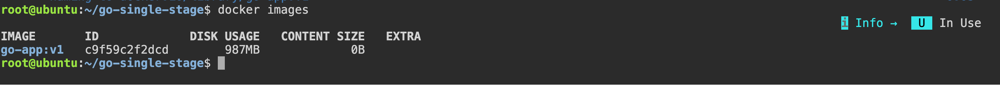
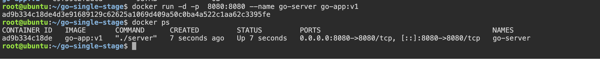
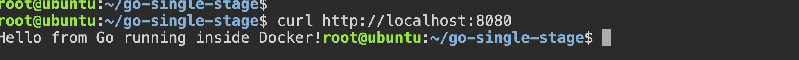
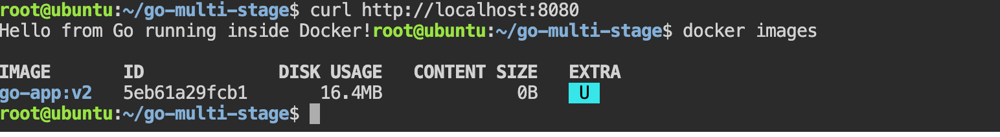
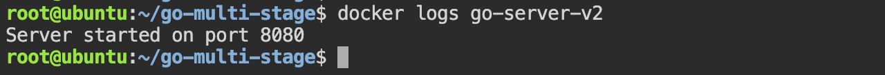

# Task 1: The Problem with Large Images (Single-Stage Build)

In this Task we will create a simple GO application, Containarize it using a **Single-stage-Dockerzfile** , Build the image and check it's size

Project Structure
```bash 
go-single-stage/
├── Dockerfile
├── go.mod
└── main.go
```
Create the project:
```bash 
mkdir go-single-stage
cd go-single-stage

touch Dockerfile
touch go.mod
touch main.go
```

#### File1: `main.go`
```GO 
package main 

import (
    "fmt"
    "net/http"

)

func home(w http.ResponseWriter , r *http.Request) {

    fmt.Fprintf(w, "Hello from Go running inside Docker!")
}

func main() {
	http.HandleFunc("/", home)

	fmt.Println("Server started on port 8080")

	http.ListenAndServe(":8080", nil)
}

```
This Program : 
- Starts an HTTP server 
- Listens on port 8080
- Returns a simple message when someone visits the root URL.

#### File 2: `go.mod`

```Go
module go-single-stage

go 1.24
```

#### File 3: Dockerfile (Single Stage)

```Dockerfile
# base image 
FROM golang:1.24

WORKDIR /app

COPY go.mod .

COPY main.go . 

RUN go build -0 server . 

EXPOSE 8080

CMD ["./server"]
```

### Understanding the Dockerfile
Base Image
```dockerfile 
FROM golang:1.24
```
Uses the official GO image 

It Contains: 
- Go compiler
- Go SDK
- Linux
- Build tools

Working Directory

```Dockerfile 
WORKDIR /app
```
Creates:
```bash 
/app
```
and makes it the current working directory.

Copy Files

```dockerfile 
COPY go.mod .
COPY main.go .
```
Copies the source code into the image / container.

Build the Binary
```bash 
RUN go buld -o server . 
```

Compiles:
```bash 
main.go 
```
into an executable named: 
```
server 
```
Expose Port

```dockerfile 
EXPOSE 8080
```
Documents that the application listens on port 8080.

Start the Application
```Dockerfile 
CMD ["./server"]
```
Runs the compiled binary when the container starts.


### Step 1: Build the Image
```bash 
docker build -t go-app:vi . 
```
Expected Output: 
```
Successfully built xxxxxxxxx
Successfully tagged go-app:v1
```

Step 2: Check the Image

```bash 
docker images 
```
Example Output:
```bash 
REPOSITORY   TAG   IMAGE ID       SIZE

go-app       v1    a1b2c3d4e5f6   980MB
```

OUTPUT: 


Note: The exact size depends on our Docker version and the Go base image, but it will typically be hundreds of MB to around 1 GB because the image includes the Go compiler and build toolchain.

### Step 3: Run the Container
```bash 
docker run -d -p 8080:8080 --name go-server go-app:v1
```
verify 
```bash 
docker ps 
```
OUTPUT: 



### Step 4: Test the Application

OPEN: 
```
http://localhost:8080
```
Expected output:
```
Hello from Go running inside Docker!
```
OUTPUT: 


Or test with curl:
```bash
curl http://localhost:8080
```
### Step 5: View Logs
```bash 
docker logs go-server
```
OutPut: 


### Step 6: Stop and Remove
```bash 
docker stop go-server
docker rm go-server
```
#### Project Flow
```
main.go
     │
     ▼
Dockerfile
     │
     ▼
docker build
     │
     ▼
Go Compiler
     │
     ▼
Creates Binary (server)
     │
     ▼
Docker Image
     │
     ▼
docker run
     │
     ▼
Go HTTP Server
     │
     ▼
http://localhost:8080
```

#### Commands Summary

| Task             | Command                                                 |
| ---------------- | ------------------------------------------------------- |
| Build image      | `docker build -t go-app:v1 .`                           |
| List images      | `docker images`                                         |
| Run container    | `docker run -d -p 8080:8080 --name go-server go-app:v1` |
| View logs        | `docker logs go-server`                                 |
| Test app         | `curl http://localhost:8080`                            |
| Stop container   | `docker stop go-server`                                 |
| Remove container | `docker rm go-server`                                   |


#### What to Note
Record the image size from 
```bash 
docker image 
```
OUTPUT: 


- we'll compare this with a multi-stage Docker build in the next task. The multi-stage image will be dramatically smaller because it contains only the compiled binary and runtime essentials, not the Go compiler and build tools.

### IMP Q: Why is a single-stage Go Docker image so large?

A single-stage build uses the full Go base image for both compiling and running the application. As a result, the final image includes the Go compiler, SDK, package cache, and other build tools that are no longer needed at runtime. This increases the image size significantly. Multi-stage builds solve this by compiling the application in one stage and copying only the final binary into a minimal runtime image.

# Task 2: Multi-Stage Build

In this Task we will rewrite the previous Dockerfile using a **multi-stage build** . This is the standard approach used in production because it keeps the final image small by excluding the GO compiler and build tools. 

we will use: 
- **Stage 1:** Build the Go application.
- **Stage 2:** Copy only the compiled binary into a minimal Alpine image.

### Project Structure
Use the same project from Task 1.
```
go-multi-stage/
├── Dockerfile
├── go.mod
└── main.go
```
- Only the Dockerfile changes. 

### File 1: `main.go`
(No changes)

```GO 
package main

import (
	"fmt"
	"net/http"
)

func home(w http.ResponseWriter, r *http.Request) {
	fmt.Fprintf(w, "Hello from Go running inside Docker!")
}

func main() {
	http.HandleFunc("/", home)

	fmt.Println("Server started on port 8080")

	http.ListenAndServe(":8080", nil)
}
```
### File 2: `go.mod`
(No changes)
```GO 
module go-single-stage

go 1.24
```
### File 3: `Dockerfile (Multi-Stage)`

```dockerfile
# ============================
# Stage 1 - Build the Go App
# ============================

FROM golang:1.24 AS builder

WORKDIR /app

COPY go.mod .

COPY main.go .

RUN CGO_ENABLED=0 GOOS=linux go build -o server .

# ============================
# Stage 2 - Runtime Image
# ============================

FROM alpine:3.22

WORKDIR /app

COPY --from=builder /app/server .

EXPOSE 8080

CMD ["./server"]

```

### Understanding the Dockerfile

Stage 1
```dockerfile 
FROM golang:1.24 AS builder
```
Creates a temporary image named:
```
builder 
```
This stage contains:
- Go Compiler
- Go SDK
- Build tools
- Linux
Used only for compilation.

Working Directory
```dockerfile 
WORKDIR /app
```
Creates:
```
/app
```
Copy Source Files
```bash 
COPY go.mod .

COPY main.go .
```
Copies the application source code.

Compile

```dockerfile 
RUN go build -o server .
```

Produces:
```
/app/server
```
This is the compiled Go binary.

Stage 2

Now Docker starts from a completely new image.

```dockerfile 
FROM alpine:3.22
```
Instead of using the large Go SDK image,

we use Alpine Linux.

Alpine is only around 7–10 MB.


Working Directory
```dockerfile 
WORKDIR /app
```
Creates:
```
/app
```

Copy Only the Binary
```dockerfile 
COPY --from=builder /app/server .
```
This is the important line.

Docker copies only:
```
server
```
from the first stage.

It does not copy:

- Go compiler
- SDK
- Cache
- Source code
- Build tools

Only the executable.

Expose

```dockerfile
EXPOSE 8080
```
Documents the application port.

Start Application
```dockerfile 
CMD ["./server"]
```
Runs the compiled binary.

### Step 1: Build the Image

```bash 
docker build -t go-app:v2 .
```
Expected output:
```
Successfully built xxxxxxxxx

Successfully tagged go-app:v2
```
### Step 2: Compare Image Sizes

```bash 
docker images 
```

Output:


- our exact numbers will vary depending on the Go and Alpine versions, but the multi-stage image should be dramatically smaller than the single-stage image.

### Step 3: Run the Container

```bash 
docker run -d -p 8080:8080 --name go-server-v2 go-app:v2
```
Verify:
```bash 
docker ps 
```

Output: 


### Step 4: Test the Application

Open:
```
http://localhost:8080

OR 

curl http://localhost:8080

```
Output: 


### Step 5: View Logs
```bash 
docker logs go-server-v2
```

Output:


```
Server started on port 8080
```

### Step 6: Stop and Remove
```bash 
docker stop go-server-v2

docker rm go-server-v2
```

### How Multi-Stage Build Works
```
               Stage 1
      ┌─────────────────────────┐
      │ golang:1.24             │
      │                         │
      │ Copy Source             │
      │ Compile                 │
      │                         │
      │ server                  │
      └──────────┬──────────────┘
                 │
                 │ COPY --from=builder
                 ▼
      ┌─────────────────────────┐
      │ alpine:3.22             │
      │                         │
      │ server                  │
      │                         │
      │ CMD ./server            │
      └─────────────────────────┘

```
Only the compiled binary moves into the second stage.

Everything else is discarded.

### Image Size Comparison

| Build Type   | Base Image    | Approximate Size |
| ------------ | ------------- | ---------------: |
| Single-stage | `golang:1.24` |     ~900 MB–1 GB |
| Multi-stage  | `alpine:3.22` |        ~10–20 MB |

The exact sizes depend on your environment, but the reduction is usually more than 95%.

### Notes

#### Why is the multi-stage image so much smaller?
The first stage contains everything required to build the application, including the Go compiler, SDK, package cache, source code, and other build tools. These are only needed during compilation.

The second stage starts from a minimal runtime image (`alpine`) and copies only the compiled executable from the builder stage. Because the compiler, source files, caches, and build dependencies are left behind, the final image is much smaller. Smaller images download faster, start more quickly, consume less storage, and reduce the attack surface by including fewer unnecessary components.

### Imp : Q: What are the advantages of a multi-stage Docker build?
Multi-stage builds separate the build environment from the runtime environment. The application is compiled in a builder image that contains the required SDK and tools, and only the final executable is copied into a minimal runtime image. This results in significantly smaller images, faster deployments, improved security through a reduced attack surface, and cleaner production containers without build-time dependencies.

# Task 3: Push to Docker Hub
In this task we will publish the GO application we build in the previous task to **Docker Hub**, making it available to Download from any machine 

we will learn how to: 
- Create a Docker HUB Account 
- Log in using Docker CLI 
- Tag your image correctly 
- push it to Docker HUB 
- Remove the Local Image 
- pull it back to verify 

#### PreRequisites 
we should already have an image from previous task 

Verify: 
```bash 
docker images 
```
OUTPUT: 


### Step 1: Create a Docker Hub Account

Go TO: 
```LINK
https://hub.docker.com/
```
Create a Free account if we don't already have one 

suppose your username is: 
```
Anuj2402
```
Replace it with your own Docker Hub username in following Commands.

### Step 2: Login from the Terminal
RUN: 
```bash 
docker login 
```
Example: 
```
username: Anuj2402 
password: 
```
if successful:
```
Login Succeeded
```
Verify:
```bash 
docker info 
```
Near the bottom you should see 
```
Username: anuj2402
```

### Step 3: Tag the Image
current image: 
```
go-app:v2
```
Docker Hub expects:
```
dockerhub-username/repository:tag
```
Tag it:
```
docker tag go-app:v2 anuj2402/go-app:v1
```
Verify:
```bash 
docker images 
```

EXAMPLE:
```
REPOSITORY           TAG

go-app               v2

anuj2402/go-app      v1
```
Notice both tags points to the same image ID 

### Step 4: Push to Docker Hub
Run:
```bash 
docker push anuj2402/go-app:v1
```
Example: 
```
The push refers to repository [docker.io/anuj2402/go-app]

Layer already exists

Layer already exists

v1: digest:
sha256:xxxxxxxxxxxxxxxx

Pushed
```

### Step 5: Verify on Docker Hub

Open your browser.

Navigate to:
```
https://hub.docker.com/r/anuj2402/go-app
```
we should see 

- Repository name
- Tag (v1)
- Image size
- Push time

### Step 6: Remove the Local Image

To prove that the image can be downloaded again, remove it locally 

First stop any running container:
```bash
docker stop go-server-v2
```
Remove the container:
```bash 
docker rm go-server-v2
```

Now remove the images:

```bash 
docker rmi anuj2402/go-app:v1
```
```bash 
docker rmi go-app:v2
```
verify: 
```bash 
docker images 
```
The image should no longer appear. 

### Step 7: Pull the Image Again

Download it from the Docker HUB 
```bash 
docker pull anuj2402/go-app:v1
```
Example: 
```
Pulling from anuj2402/go-app

Downloaded newer image

Status: Downloaded newer image
```
Verify:
```bash 
doker images
```
Example:
```bash 
REPOSITORY          TAG

anuj2402/go-app     v1
```

### Step 8: Run the Downloaded Image

Run:
```bash 
docker run -d -p 8080:8080 --name go-server anuj2402/go-app:v1
```
Verify:
```bash 
docker ps 
```
Expected:

```
CONTAINER ID   IMAGE

xxxxxx         anuj2402/go-app:v1
```

### Step 9: Test the Application

Browser:
```
http://localhost:8080
   
   OR 

curl http://localhost:8080

```
Output:
```
Hello from Go running inside Docker!
```
This confirms that the image works exactly the same after being pulled from Docker Hub.

### Complete Workflow
```
Go Source Code
        │
        ▼
Dockerfile
        │
        ▼
docker build
        │
        ▼
Local Image
(go-app:v2)
        │
        ▼
docker tag
        │
        ▼
anuj2402/go-app:v1
        │
        ▼
docker push
        │
        ▼
Docker Hub Repository
        │
        ▼
docker pull
        │
        ▼
Any Machine
        │
        ▼
docker run
```
#### Commands Summary

| Task              | Command                                                          |
| ----------------- | ---------------------------------------------------------------- |
| Login             | `docker login`                                                   |
| View local images | `docker images`                                                  |
| Tag image         | `docker tag go-app:v2 anuj2402/go-app:v1`                        |
| Push image        | `docker push anuj2402/go-app:v1`                                 |
| Remove image      | `docker rmi anuj2402/go-app:v1`                                  |
| Pull image        | `docker pull anuj2402/go-app:v1`                                 |
| Run image         | `docker run -d -p 8080:8080 --name go-server anuj2402/go-app:v1` |


#### Understanding Image Tags
Suppose your Docker Hub username is anuj2402.
```
anuj2402/go-app:v1
│         │      │
│         │      └── Tag (Version)
│         │
│         └──────── Repository Name
│
└────────────────── Docker Hub Username
```
we can create multiple versions:
```
anuj2402/go-app:v1

anuj2402/go-app:v2

anuj2402/go-app:latest
```

# imp Q : Why do we tag an image before pushing it to Docker Hub?

Docker Hub organizes images using the format `username/repository:tag`. A local image such as `go-app:v2` has no registry or namespace information. By tagging it as `yourusername/go-app:v1`, Docker knows which repository to push to and which version (tag) to assign. Tags are commonly used for versioning releases such as `v1.0`, `v2.1`, or `latest`.


# Task 4: Docker Hub Repository

In this task we will explore our Docker Hub repository after pushing our image. we will learn how repository descriptions, tags, and image versioning work.

### Step 1: Open Docker Hub

Open your browser and sign in to Docker Hub.

Go to your repository:
```
https://hub.docker.com/r/<your-dockerhub-username>/go-app
```
For example, if your username is `anuj2402`:
```
https://hub.docker.com/r/anuj2402/go-app
```
we should see: 
- Repository name
- Image tags
- Last pushed time
- Pull count
- Repository description (currently empty)

### Step 2: Add a Repository Description
Click **Settings** (or **General**, depending on the Docker Hub UI), then edit the repository description.

Example :
Short Description
```
A simple Go web application containerized using Docker and Multi-Stage Builds.
```
Full Description (Optional)
```
This project demonstrates Docker best practices for Go applications.

Features:
- Go HTTP server
- Multi-stage Docker build
- Lightweight Alpine runtime image
- Exposes port 8080
- Ready to run with Docker

Build:
docker build -t go-app .

Run:
docker run -d -p 8080:8080 go-app
```
Save the changes 


### Step 3: Explore the Tags Tab
Open the Tags tab.

we might see something like:

| Tag      | Description                      |
| -------- | -------------------------------- |
| `v1`     | First version of the application |
| `latest` | Default version (if pushed)      |

If you only pushed:
```bash 
docker push <your-username>/go-app:v1
```
then we will see 
```
v1
```
### Step 4: Create Another Version
Let's Create a second version 
Modify your application 

Open: 
```
main.go
```
change

```GO
fmt.Fprintf(w, "Hello from Go running inside Docker!")
```
TO: 
```GO 
fmt.Fprintf(w, "Hello from Version 2!")
```
### Step 5: Build Again
```bash 
docker build -t go-app:v2 .
```
### Step 6: Tag Version 2
```bash 
docker tag go-app:v2 <your-username>/go-app:v2
```
Example:
```bash 
docker tag go-app:v2 anuj2402/go-app:v2
```
### Step 7: Push Version 2

```bash 
docker push <your-username>/go-app:v2
```
Example:
```bash 
docker push anuj2402/go-app:v2
```
Now Docker Hub will show:
```
v1
v2
```

### Step 8: Add the `latest` Tag
The `latest` tag is just another tag—it isn't created automatically for every image.

Tag your newest version:
```bash 
docker tag go-app:v2 <your-username>/go-app:latest
```
Example:
```bash
docker tag go-app:v2 anuj2402/go-app:latest
```
Push it:
```bash 
docker push <your-username>/go-app:latest
```

Now Docker Hub will display:
```
latest

v2

v1
```

### Step 9: Pull a Specific Tag

Remove the local image if needed:
```bash 
docker rmi <your-username>/go-app:v1
```
Pull version 1:
```bash 
docker pull <your-username>/go-app:v1
```
Run it:
```bash 
docker run -d -p 8080:8080 --name go-v1 <your-username>/go-app:v1
```
Visit: 
```
http://localhost:8080
```
Output:
```bash 
Hello from Go running inside Docker!
```

### Step 10: Pull Version 2

```bash 
docker pull <your-username>/go-app:v2
```
Run it on another port:
```bash 
docker run -d -p 8081:8080 --name go-v2 <your-username>/go-app:v2
```
Visit:
```
http://localhost:8081
```

Output:
```
Hello from Version 2!
```

### Step 11: Pull `latest`

```bash 
docker pull <your-username>/go-app:latest
```
Run it:
```bash 
docker run -d -p 8082:8080 --name go-latest <your-username>/go-app:latest
```

Visit:
```bash 
http://localhost:8082
```
If `latest` points to `v2`, we'll see:
```
Hello from Version 2!
```

### What Happens?

Pulling a Specific Tag
```bash 
docker pull anuj2402/go-app:v1
```
Docker **downloads exactly** version `v1`.

Pulling Another Specific Tag
```bash 
docker pull anuj2402/go-app:v2
```
Docker **downloads exactly** version `v2`.

Pulling `latest`
```bash 
docker pull anuj2402/go-app:latest
```
Docker downloads **whatever image the** `latest` tag currently references.

`latest` is not necessarily the newest image—it is simply a tag that someone assigned.

##### Image Versioning
```
Repository

go-app
│
├── v1
│      └── First Release
│
├── v2
│      └── Updated Release
│
└── latest
       │
       ▼
      v2
```

### Docker Hub Workflow

```
Source Code
      │
      ▼
docker build
      │
      ▼
Local Image
      │
      ▼
docker tag
      │
      ▼
v1
v2
latest
      │
      ▼
docker push
      │
      ▼
Docker Hub
      │
      ▼
Users Pull
Specific Versions
```


### Commands Summary

| Task        | Command                                              |
| ----------- | ---------------------------------------------------- |
| Build image | `docker build -t go-app:v2 .`                        |
| Tag image   | `docker tag go-app:v2 <your-username>/go-app:v2`     |
| Push image  | `docker push <your-username>/go-app:v2`              |
| Tag latest  | `docker tag go-app:v2 <your-username>/go-app:latest` |
| Push latest | `docker push <your-username>/go-app:latest`          |
| Pull v1     | `docker pull <your-username>/go-app:v1`              |
| Pull v2     | `docker pull <your-username>/go-app:v2`              |
| Pull latest | `docker pull <your-username>/go-app:latest`          |

### Notes

### What is a Docker image tag?

A tag identifies a specific version of an image. Multiple tags (such as `v1`, `v2`, or `latest`) can point to different image versions, allowing you to manage releases and roll back if needed.

Pulling a specific tag vs `latest`

- `docker pull <your-username>/go-app:v1` always retrieves the image tagged as`v1`.

- `docker pull <your-username>/go-app:v2` always retrieves the image tagged as `v2`.

- `docker pull <your-username>/go-app:latest` retrieves whichever image currently has the latest tag. The latest tag is simply a label and does not automatically represent the newest build.

### Q: Why should production deployments use versioned tags instead of latest?

Production deployments should use immutable version tags (such as `v1.0.3` or `v2.1.0`) because they provide predictable, repeatable deployments and make rollbacks straightforward. The latest tag can change over time, so pulling it on different days may result in different application versions, leading to inconsistent environments and harder troubleshooting.

