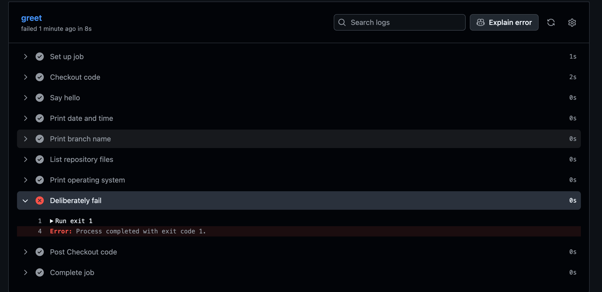

# Task 1: Set Up

we will do this **end-to-end from our terminal **

### Step 1: Create the GitHub repository
Go to the GITHUB : 
1.  Click + → New repository
2. Repository name:
```
github-actions-practice
```
3. Select Public

4. For now, leave these unchecked:
- ❌ Add a README
- ❌ Add .gitignore
- ❌ Choose a license

5. Click Create repository

### Step 2: Clone the repository locally
Open your terminal and go to the directory where you keep your DevOps practice repositories.

Example: 
```bash 
cd 90DAYSOFDEVOPS/Day-40-First-github-action-workflow 
```
Then clone:
```bash 
git clone https://github.com/Anuj2402/github-actions-practice.git
```
Enter the repository:
```bash 
cd github-actions-practice

# Check: 
pwd 

```
Then verify: 
```bash 
git status 
```
OUTPUT: 


### Step 3: Create the workflow directory
From inside `github-actions-practice`:

```bash 
mkdir -p .github/workflows
```
Check the structure:
```bash 
ls -la 
```
Then:
```bash 
ls -la .github
```
And: 
```bash 
ls -la .github/workflows
```
The final structure should be:
```bash 
github-actions-practice/
└── .github/
    └── workflows/
```

### Step 4: Verify Git sees the repository
Run:
```bash 
git remote -v 
```
we should see: 
```bash 
origin  https://github.com/Anuj2402/github-actions-practice.git (fetch)
origin  https://github.com/Anuj2402/github-actions-practice.git (push)
```

At this point we  have:
```
GitHub
   │
   │ clone
   ▼
github-actions-practice/
   │
   └── .github/
       └── workflows/
```


# Task 2/3: Hello Workflow

### Step 1: Create `hello.yml`
Run:
```bash
touch .github/workflows/hello.yml
```
Put this exactly inside:

```YAML 
name: Hello GitHub Actions

on:
  push:

jobs:
  greet:
    runs-on: ubuntu-latest

    steps:
      - name: Checkout code
        uses: actions/checkout@v4

      - name: Say hello
        run: echo "Hello from GitHub Actions!"

```
Understand the YAML

```YAML
name: Hello GitHub Actions
```
This is the name you'll see in the Actions tab.
```YAML
on:
  push: 
```

This means:
- Every time you push code to the repository, GitHub Actions starts this workflow.

```YAML 
jobs:
  greet:
```
Remember: jobs = What work needs to be done?

Creates one job named:
```
greet
```
```YAML
runs-on: ubuntu-latest
```
This tells GitHub Actions to run the job on an Ubuntu environment.
GitHub will run the job on an Ubuntu-hosted runnner 
Remember: `runs-on` = Where will the job run?

### Step 3: Understand the two steps

Step 1:
```YAML
- name: Checkout code
  uses: actions/checkout@v4
```
- This downloads/checks out our repository code onto the runner.

Step 2:
```YAML
- name: Say hello
  run: echo "Hello from GitHub Actions!"
```
This executes the Linux command:
```bash 
echo "Hello from GitHub Actions!"
```
OutPut: 
```
Hello from GitHub Actions!
```
### Step 4: Check your file
Run:
```bash
cat .github/workflows/hello.yml
```
we should see the YAML we just created 
Then check Git: 
```bash 
git status
```
we should see 
```
Untracked files:
  .github/workflows/hello.yml
  ```

### Step 5: Commit the workflow
```bash 
git add .github/workflows/hello.yml

git commit -m "Add hello GitHub Actions workflow"

```
### Step 6: Push it 🚀

```bash 
git push origin main
```
our push itself is the trigger 

The flow is now:
```
Your laptop
    │
    │ git push
    ▼
GitHub Repository
    │
    │ detects push
    ▼
GitHub Actions
    │
    ▼
┌─────────────────────┐
│ Job: greet          │
│ Runner: Ubuntu      │
├─────────────────────┤
│ 1. Checkout code    │
│ 2. Say hello        │
└─────────────────────┘
```

#### Important CI/CD concept

| Key        | Meaning                                           |
| ---------- | ------------------------------------------------- |
| `on:`      | Defines **when** the workflow starts              |
| `jobs:`    | Defines the **jobs** to execute                   |
| `runs-on:` | Defines **which runner/machine** executes the job |
| `steps:`   | Lists the individual **tasks** in a job           |
| `uses:`    | Uses an existing **GitHub Action**                |
| `run:`     | Executes a **shell command**                      |
| `name:`    | Gives a step a **readable name**                  |


we have just created a very basic CI pipeline:
```
git push
   ↓
Trigger
   ↓
GitHub Actions
   ↓
Job: greet
   ↓
Runner
   ↓
Checkout
   ↓
Run command
   ↓
GREEN ✅
```

# Task 4: Add More Steps

we will update our existing `.github/workflows/hello.yml`

Step 1: Open the workflow
From our repository 
```bash 

cd ~/90DaysOfDevOps/github-actions-practice
```
Open:
```
code .github/workflows/hello.yml
```

Replace Old YAML File content with this one 
```bash 
name: Hello GitHub Actions

on:
  push:

jobs:
  greet:
    runs-on: ubuntu-latest

    steps:
      - name: Checkout code
        uses: actions/checkout@v4

      - name: Say hello
        run: echo "Hello from GitHub Actions!"

      - name: Print date and time
        run: date

      - name: Print branch name
        run: echo "Branch: ${{ github.ref_name }}"

      - name: List repository files
        run: ls -la

      - name: Print operating system
        run: echo "OS: $RUNNER_OS"
```

Step 2: Understand the new steps

1. Current date and time
```YAML 
- name: Print date and time
  run: date
```
`date` is a Linux command that prints the runner's current date and time.

Example output:
```
Thu Aug 21 18:30:15 UTC 2026
```
2. Branch that triggered the workflow
```YAML 
- name: Print branch name
  run: echo "Branch: ${{ github.ref_name }}"
```
GitHub provides information about the workflow through the `github` context.

`${{ github.ref_name }}` gives the branch or tag name that triggered the workflow.

For example:
```bash 
Branch: main
```
This is very important in real CI/CD pipelines because you can make different decisions based on the branch.


3. List repository files
```YAML 
- name: List repository files
  run: ls -la
```
This runs `ls -la` on the GitHub Actions runner.
You should see files such as:
```bahs 
.github 
```
and anything else we've added to the repository.

4. Print the runner's operating system
```YAML
- name: Print operating system
  run: echo "OS: $RUNNER_OS"
```
`RUNNER_OS` is a GitHub Actions environment variable.

Because you're using:
```bash 
runs-on: ubuntu-latest
```
we should get 
```
OS: Linux
```
Push it 
```bash 
git status 
git add .github/workflows/hello.yml
git commit -m "Add more workflow steps"
git push origin main
```
Because our workflow has:
```YAML 
on: 
  push: 
```
this push automatically starts a new workflow run.


# Task 5: Break It On Purpose

This task is important because CI/CD troubleshooting is something we will constantly in real Devops/Sre work 

### Step 1: Add a deliberately failing step
Open our workflow : 
```bash 
cd ~/90DaysOfDevOps/github-actions-practice
code .github/workflows/hello.yml
```
Add this step at the end 
```YAML 
      - name: Deliberately fail
        run: exit 1
```
Our Workflow should look like: 
```YAML 
name: Hello GitHub Actions

on:
  push:

jobs:
  greet:
    runs-on: ubuntu-latest

    steps:
      - name: Checkout code
        uses: actions/checkout@v4

      - name: Say hello
        run: echo "Hello from GitHub Actions!"

      - name: Print date and time
        run: date

      - name: Print branch name
        run: echo "Branch: ${{ github.ref_name }}"

      - name: List repository files
        run: ls -la

      - name: Print operating system
        run: echo "OS: $RUNNER_OS"

      - name: Deliberately fail
        run: exit 1
```

 What does `exit 1` mean?
 - In Linux/shell commands:
```bash  
exit 0 # normally means success.
```
```bash 
exit 1 
```
means failure/error.

so we are intentionally telling GitHub Actions: 
-> This step failed.

### Step 2: Commit and push

```bash 
git add .github/workflows/hello.yml
git commit -m "Test pipeline failure"
git push origin main

```
Because Our workflow triggers on `push` , a new run will start automatically

### Step 3: Watch the failure
Go to:
**GitHub → Your repository → Actions → Hello GitHub Actions**

we will see something like 
```
❌ Hello GitHub Actions
```
Open the failed run.

Then click:
```
greet
```
we should see 
```
✓ Checkout code
✓ Say hello
✓ Print date and time
✓ Print branch name
✓ List repository files
✓ Print operating system
❌ Deliberately fail
```
The important thing is that the earlier steps can be green, while the failing step is red.


### Step 4: Read the error
Click:

Deliberately fail

we will see the output similar to : 
```bash 
Run exit 1
Error: Process completed with exit code 1.
```
The important information is 
```
Process completed with exit code 1
```
That tells you the command executed but returned a failure status.

Output: 


### How to troubleshoot it
When a CI job fails, read the log from top to bottom, but focus first on: 
1. 🔴 Which step failed?
2. What command was executed?
3. What is the error message?
4. What exit code was returned?
5. What happened immediately before the failure?
For this Example: 
```bash 
Failed step:
    ↓
Deliberately fail

Command:
    ↓
exit 1

Result:
    ↓
exit code 1

Pipeline:
    ↓
❌ FAILED
```
### Step 5: Fix the pipeline
Remove the deliberately failing step:
```YAML 
      - name: Deliberately fail
        run: exit 1

```
Save the file.

Then 
```bash 
git add .github/workflows/hello.yml
git commit -m "Fix failing workflow"
git push origin main
```

### Step 6: Verify again
Go back to:

**Actions → Hello GitHub Actions**

we should now have a new successful run:
```
✓ Hello GitHub Actions
```
And the job should show:
```
✓ Checkout code
✓ Say hello
✓ Print date and time
✓ Print branch name
✓ List repository files
✓ Print operating system
```
### Notes — What does a failed pipeline look like?
A failed pipeline appears with a red ❌ status in GitHub Actions. The failed job contains a failed step marked in red. To troubleshoot, I open the failed job, identify the failed step, read the command that was executed and examine the error message and exit code. After fixing the problem, I push the change and verify that the new workflow run becomes green.

