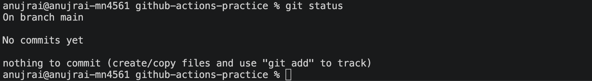

# Task 1: Set Up

we will do this **end-to-end from our terminal **

### Step 1: Create the GitHub repository
Go to the GITHUB : 
1.  Click + → New repository
2. Repository name:
```
github-actions-practice
```
3. Select Public

4. For now, leave these unchecked:
- ❌ Add a README
- ❌ Add .gitignore
- ❌ Choose a license

5. Click Create repository

### Step 2: Clone the repository locally
Open your terminal and go to the directory where you keep your DevOps practice repositories.

Example: 
```bash 
cd 90DAYSOFDEVOPS/Day-40-First-github-action-workflow 
```
Then clone:
```bash 
git clone https://github.com/Anuj2402/github-actions-practice.git
```
Enter the repository:
```bash 
cd github-actions-practice

# Check: 
pwd 

```
Then verify: 
```bash 
git status 
```
OUTPUT: 


### Step 3: Create the workflow directory
From inside `github-actions-practice`:

```bash 
mkdir -p .github/workflows
```
Check the structure:
```bash 
ls -la 
```
Then:
```bash 
ls -la .github
```
And: 
```bash 
ls -la .github/workflows
```
The final structure should be:
```bash 
github-actions-practice/
└── .github/
    └── workflows/
```

### Step 4: Verify Git sees the repository
Run:
```bash 
git remote -v 
```
we should see: 
```bash 
origin  https://github.com/Anuj2402/github-actions-practice.git (fetch)
origin  https://github.com/Anuj2402/github-actions-practice.git (push)
```

At this point we  have:
```
GitHub
   │
   │ clone
   ▼
github-actions-practice/
   │
   └── .github/
       └── workflows/
```


# Task 2/3: Hello Workflow

### Step 1: Create `hello.yml`
Run:
```bash
touch .github/workflows/hello.yml
```
Put this exactly inside:

```YAML 
name: Hello GitHub Actions

on:
  push:

jobs:
  greet:
    runs-on: ubuntu-latest

    steps:
      - name: Checkout code
        uses: actions/checkout@v4

      - name: Say hello
        run: echo "Hello from GitHub Actions!"

```
Understand the YAML

```YAML
name: Hello GitHub Actions
```
This is the name you'll see in the Actions tab.
```YAML
on:
  push: 
```

This means:
- Every time you push code to the repository, GitHub Actions starts this workflow.

```YAML 
jobs:
  greet:
```
Remember: jobs = What work needs to be done?

Creates one job named:
```
greet
```
```YAML
runs-on: ubuntu-latest
```
This tells GitHub Actions to run the job on an Ubuntu environment.
GitHub will run the job on an Ubuntu-hosted runnner 
Remember: `runs-on` = Where will the job run?

### Step 3: Understand the two steps

Step 1:
```YAML
- name: Checkout code
  uses: actions/checkout@v4
```
- This downloads/checks out our repository code onto the runner.

Step 2:
```YAML
- name: Say hello
  run: echo "Hello from GitHub Actions!"
```
This executes the Linux command:
```bash 
echo "Hello from GitHub Actions!"
```
OutPut: 
```
Hello from GitHub Actions!
```
### Step 4: Check your file
Run:
```bash
cat .github/workflows/hello.yml
```
we should see the YAML we just created 
Then check Git: 
```bash 
git status
```
we should see 
```
Untracked files:
  .github/workflows/hello.yml
  ```

### Step 5: Commit the workflow
```bash 
git add .github/workflows/hello.yml

git commit -m "Add hello GitHub Actions workflow"

```
### Step 6: Push it 🚀

```bash 
git push origin main
```
our push itself is the trigger 

The flow is now:
```
Your laptop
    │
    │ git push
    ▼
GitHub Repository
    │
    │ detects push
    ▼
GitHub Actions
    │
    ▼
┌─────────────────────┐
│ Job: greet          │
│ Runner: Ubuntu      │
├─────────────────────┤
│ 1. Checkout code    │
│ 2. Say hello        │
└─────────────────────┘
```

#### Important CI/CD concept

| Key        | Meaning                                           |
| ---------- | ------------------------------------------------- |
| `on:`      | Defines **when** the workflow starts              |
| `jobs:`    | Defines the **jobs** to execute                   |
| `runs-on:` | Defines **which runner/machine** executes the job |
| `steps:`   | Lists the individual **tasks** in a job           |
| `uses:`    | Uses an existing **GitHub Action**                |
| `run:`     | Executes a **shell command**                      |
| `name:`    | Gives a step a **readable name**                  |


we have just created a very basic CI pipeline:
```
git push
   ↓
Trigger
   ↓
GitHub Actions
   ↓
Job: greet
   ↓
Runner
   ↓
Checkout
   ↓
Run command
   ↓
GREEN ✅
```


