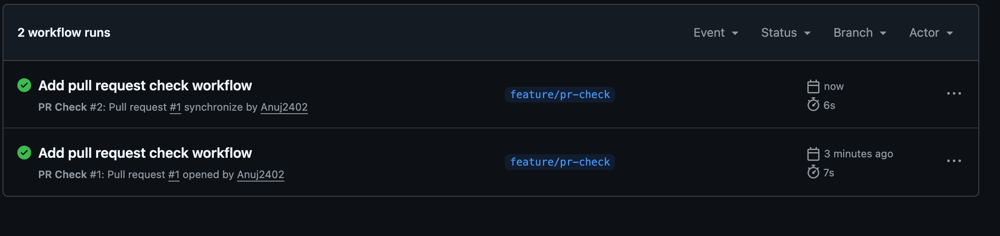
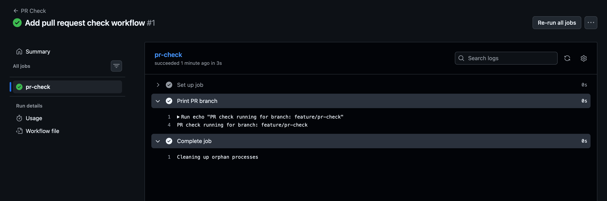
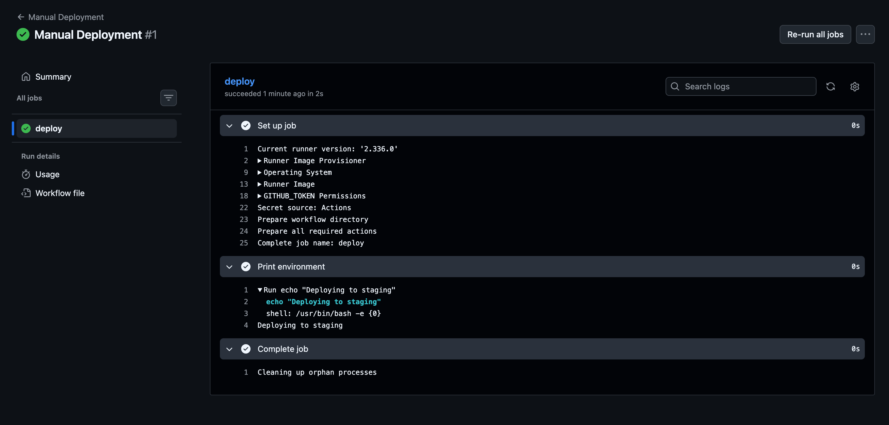

# Task 1: Trigger on Pull Request

we will create a separate workflow called `pr-check.yaml` that runs only when a PR is opened or updated against `main`

### Step 1: Create the workflow 

from our repository 
```bash 
cd ~/90DaysOfDevOps/github-actions-practice
# Create the file:
touch .github/workflows/pr-check.yml
#Open it:
code .github/workflows/pr-check.yml

```

Put this inside:
```YAML 
name: PR Check

on:
  pull_request:
    branches:
      - main
    types:
      - opened
      - synchronize

jobs:
  pr-check:
    runs-on: ubuntu-latest

    steps:
      - name: Print PR branch
        run: echo "PR check running for branch: ${{ github.head_ref }}"
```
#### Understand the important part

```YAML
on:
  pull_request:
```
The workflow is triggered by a Pull Request event, not a normal push.

```YAML 
branches:
  - main
```
This means the PR must be targeting `main`.
```YAML 
types:
  - opened
  - synchronize
```
OUTPUT: 

These are the two events required by the task:
| Event         | Meaning                                          |
| ------------- | ------------------------------------------------ |
| `opened`      | A new PR is created                              |
| `synchronize` | New commits are pushed to the PR's source branch |

So:
```
Feature branch
     │
     │ PR → main
     ▼
  GitHub
     │
     ├── PR opened ───────→ Workflow runs
     │
     └── New commit pushed
              │
              ▼
        Workflow runs again
```

And:
```YAML
${{ github.head_ref }}
```
gives you the source branch of the PR.

For example, if your branch is `feature/login`:
```
PR check running for branch: feature/login
```

### Step 2: Create a new branch
Before committing the workflow, create a feature branch:

```bash 
git checkout -b feature/pr-check
# verify
git branch
```
we should see 
```
* feature/pr-check
  main
```
### Step 3: Commit the workflow
```bash 
git add .github/workflows/pr-check.yml

# Then commit 
git commit -m "Add pull request check workflow"
```
### Step 4: Push the branch
```bash 
git push -u origin feature/pr-check
```
Now the branch exists on GitHub 
Go to our repository on GitHub.

we should see an option like:

**compare and pull request**

click it 

### Step 5: Create the Pull Request
Set : 
```bash 
base: main
compare: feature/pr-check
```
Create the PR.

our PR should look approximately like:
```
main  ←  feature/pr-check
```

### Step 6: Watch the workflow

As soon as the PR is opened, GitHub should trigger:

```bash 
PR Check
   ↓
pr-check
   ↓
Print PR branch
```
OUTPUT: 


On the PR page, look for the Checks section.

we should see 
```
✓ PR Check
```
Click it to see the workflow details.

The output should be:
```
PR check running for branch: feature/pr-check
```
#### Key concept
Our previos workflow used: 
```YAML 
on:
  push:
```
So:
**Push -> Workflow**

This new Workflow uses: 
```YAML 
on:
  pull_request:
```
So:

**PR opened/updated -> Workflow 

That's the foundation of `PR-based CI`, where tests and validations can run automatically before code is merged into `main`.


# Task 2: Scheduled Trigger

Let's add a scheduled trigger to your existing `hello.yml`.

### Step 1: Open `hello.yml`

```bash 
cd ~/90DaysOfDevOps/github-actions-practice
code .github/workflows/hello.yml
```
Change the `on:` section to:

```YAML 
on:
  push:

  schedule:
    - cron: "0 0 * * *"

```
our workflow will look like 
```YAML 
name: Hello GitHub Actions

on:
  push:

  schedule:
    - cron: "0 0 * * *"

jobs:
  greet:
    runs-on: ubuntu-latest

    steps:
      - name: Checkout code
        uses: actions/checkout@v4

      - name: Say hello
        run: echo "Hello from GitHub Actions!"

      - name: Print date and time
        run: date

      - name: Print branch name
        run: echo "Branch: ${{ github.ref_name }}"

      - name: List repository files
        run: ls -la

      - name: Print operating system
        run: echo "OS: $RUNNER_OS"

```

#### What does this cron mean?

```
0 0 * * *
│ │ │ │ │
│ │ │ │ └── Day of week: every day
│ │ │ └──── Month: every month
│ │ └────── Day: every day
│ └──────── Hour: 00
└────────── Minute: 00
```
So: 
```
0 0 * * *
```
Means: 
- Every day at 00:00 UTC (midnight UTC).

GitHub Actions scheduled workflows use UTC, not our local timezone.

### Step 2: Commit and push
```bash 
git add .github/workflows/hello.yml
git commit -m "Add scheduled workflow trigger"

git push
```
our workflow now has two triggers:
```
                 ┌─── Push ────────┐
                 │                 │
                 ▼                 │
              Workflow             │
                 ▲                 │
                 │                 │
          Schedule (cron)           │
                 │                 │
          Every midnight UTC        │
```

### Step 3: Cron for Monday at 9 AM
The Question Ask : 
-  what is the cron expression or every Monday at 9AM ?

The Answer is  :
```bash 
0 9 * * 1
```
Breakdown 

```
0  9  *  *  1
│  │  │  │  │
│  │  │  │  └── Monday
│  │  │  └───── Every month
│  │  └──────── Every day
│  └─────────── 09:00 UTC
└────────────── 00 minutes
```

NOTES: 
- Every day at midnight UTC: `0 0 * * *`
- Every Monday at 9 AM UTC: `0 9 * * 1`

Quick cron pattern
```
┌──────── minute (0-59)
│ ┌────── hour (0-23)
│ │ ┌──── day of month (1-31)
│ │ │ ┌── month (1-12)
│ │ │ │ ┌ day of week (0-7)
│ │ │ │ │
* * * * *
```


# Task 3: Manual Trigger

We'll create a workflow that **doesn't run automatically on push or PR**. It will run only when you manually click **Run workflow** and provide an environment.

### Step 1: Create `manual.yml`

From our repo 
```bash 
cd ~/90DaysOfDevOps/github-actions-practice
# Create the file:
touch .github/workflows/manual.yml
# Open it 
code .github/workflows/manual.yml
```
Add 
```YAML 
name: Manual Deployment

on:
  workflow_dispatch:
    inputs:
      environment:
        description: "Choose the environment"
        required: true
        type: choice
        options:
          - staging
          - production

jobs:
  deploy:
    runs-on: ubuntu-latest

    steps:
      - name: Print environment
        run: echo "Deploying to ${{ inputs.environment }}"
     
```
### Step 2: Understand the important part

`workflow_dispatch:`

```YAML 
on:
  workflow_dispatch:
```
This enables the **RUN workflow** button in GITHUB Actions. 

Unlike 
```YAML 
on:
  push:
```
nothing automatically triggers this workflow when you push code.

`inputs:`

we are asking the person running the workflow to provide an environment 
```YAML 
inputs:
  environment:
```
The user gets two choices:
```
staging
production
```
Because we used:
```
type: choice
```
- GitHub will show a dropdown rather than requiring the user to type the value manually.

`required: true`

```YAML 
required: true
```
means an environment must be selected before the workflow can start.

Using the input
This 
```YAML 
${{ inputs.environment }}
```
reads the value selected when the workflow was manually started.

For example, if you select:
```
staging
```
the step executes:
```bash 
echo "Deploying to staging"
```
Output:
```
Deploying to staging
```

### Step 3: Commit and push
Check the file:
```bash 
cat .github/workflows/manual.yml
#then 
git add .github/workflows/manual.yml

# Commit:
git commit -m "Add manual workflow trigger"
# push 
git push

```
### Step 4: Go to GitHub Actions
Open our repo on GitHub 

Go to : 
Actions
we should see 
```
Manual Deployment
```
Click it.

On the right side, click:

**Run workflow**

we'll see something similar to:
```
Run workflow

Branch: main

Choose the environment
[ staging ▼ ]

        Run workflow
```
Select:
- staging

Then click Run workflow.

### Step 5: Watch the run
Click the newly created workflow run.

Open:

**deploy → Print environment**

we should see 
```bash 
Deploying to staging
```
Now repeat the test with:
```
production
```
we should get 
```
Deploying to production
```

Verify

OUTPUT: 


we have successfully demonstrated:
```
GitHub Actions
      │
      │ Manual "Run workflow"
      ▼
┌─────────────────────┐
│ Select environment  │
│                     │
│ ○ staging            │
│ ○ production         │
└──────────┬──────────┘
           │
           ▼
       Workflow
           │
           ▼
  Print selected value
```
`workflow_dispatch` allows a GitHub Actions workflow to be triggered manually from the Actions UI. Inputs allow the person starting the workflow to provide values that can be used inside the jobs and steps.

 This workflow_dispatch trigger is especially useful later for manual **deployments, rollbacks, maintenance tasks, and operational workflows.**


