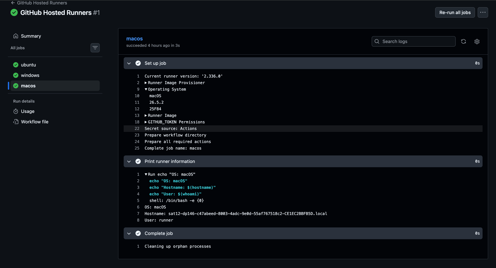
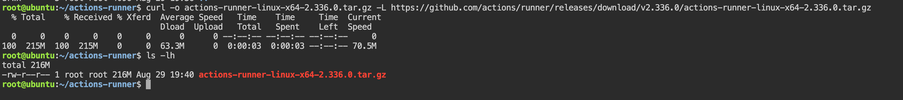
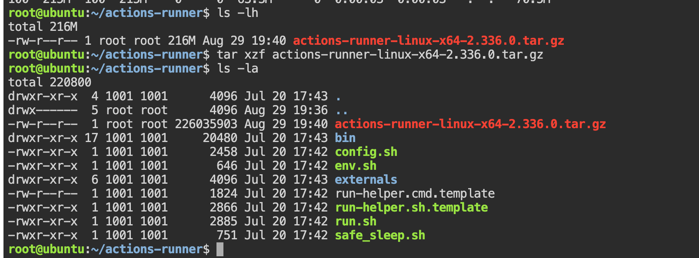
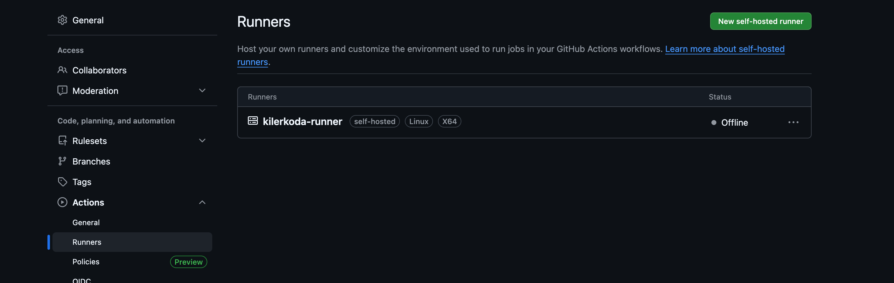
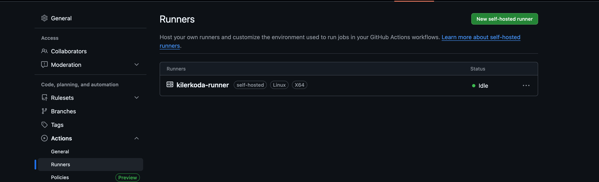

# Task 1: GitHub-Hosted Runners
we will create a new workflow with 3 independent jobs. Because they don't depend on each other , GitHub Actions can run them in parallel.

### Step 1: Create the workflow
From our Repo 
```bash 
cd ~/90DaysOfDevOps/github-actions-practice
# create 
touch .github/workflows/runners.yml
# open it 
code .github/workflows/runners.yml
```

Add. 
```YAML 
name: GitHub Hosted Runners

on:
  push:

jobs:
  ubuntu:
    runs-on: ubuntu-latest
    steps:
      - name: Print runner information
        run: |
          echo "OS: Linux"
          echo "Hostname: $(hostname)"
          echo "User: $(whoami)"

  windows:
    runs-on: windows-latest
    steps:
      - name: Print runner information
        shell: pwsh
        run: |
          Write-Host "OS: Windows"
          Write-Host "Hostname: $env:COMPUTERNAME"
          Write-Host "User: $env:USERNAME"

  macos:
    runs-on: macos-latest
    steps:
      - name: Print runner information
        run: |
          echo "OS: macOS"
          echo "Hostname: $(hostname)"
          echo "User: $(whoami)"
```
#### Why is Windows different?
Ubuntu and macOS runners use a Unix-like shell, so we can use:
```bash 
hostname
whoami
```
The Windows runner uses PowerShell, so we use:
```Powershell
$env:COMPUTERNAME
$env:USERNAME
```
### Step 2: Commit and push
Check the file : 
```bash
cat .github/workflows/runners.yml
# then 
git add .github/workflows/runners.yml
git commit -m "Add multi OS runner workflow"
git push
```

### Step 3: Watch all 3 jobs
Go to:

**GitHub → Actions → GitHub Hosted Runners**

we will see : 
```
GitHub Hosted Runners
        │
        ├── ubuntu       🐧
        ├── windows      🪟
        └── macos        🍎
```
- Because there is no `needs:` dependency between these jobs, GitHub can run them independently and in parallel.

we should eventually see : 
```
✓ ubuntu
✓ windows
✓ macos
```
Open each job and  check it's output 
For example, Ubuntu might show:
```
OS: Linux
Hostname: runner-xxxxx
User: runner
```
The exact hostname and user can vary because GitHub provides the runner environment for the job.

#### Notes: What is a GitHub-hosted runner

A **GitHub-hosted runner** is a virtual machine provided by GitHub that executes the jobs in a GitHub Actions workflow. GitHub manages the underlying machine, operating system environment, and runner software, so we don't need to maintain the runner ourselves.

#### GitHub-hosted vs self-hosted
```
GitHub-hosted
     │
     ▼
GitHub provides VM
     │
     ▼
GitHub manages it
     │
     ▼
our workflow runs
```
Whereas: 
```
Self-hosted
     │
     ▼
Your organization provides machine
     │
     ▼
Your organization manages it
     │
     ▼
Your workflow runs
```
#### Key point
when we write 
```YAML
runs-on: ubuntu-latest
```
we are essentially saying:
- **"GitHub, give this job an Ubuntu runner and execute my steps there."**
And with your three jobs:
```bash 
             Workflow
                 │
       ┌─────────┼─────────┐
       ▼         ▼         ▼
    Ubuntu    Windows     macOS
       │         │         │
       ▼         ▼         ▼
     Job 1     Job 2     Job 3
       │         │         │
       └─────────┼─────────┘
                 ▼
             Results

```
**Important:** The three jobs are separate runner environments. They don't share the same machine or filesystem.

OUTPUT Example: 


# Task 2: Explore What's Pre-installed
we will use our existing `ubuntu-latest` runner and check the four tools

### Step 1: Create the workflow

create:
```bash 
cd ~/90DaysOfDevOps/github-actions-practice
touch .github/workflows/software.yml
code .github/workflows/software.yml
```
Add
```YAML 
name: Pre-installed Software

on:
  push:

jobs:
  check-tools:
    runs-on: ubuntu-latest

    steps:
      - name: Check Docker
        run: docker --version

      - name: Check Python
        run: python --version

      - name: Check Node
        run: node --version

      - name: Check Git
        run: git --version
```

#### What this does? 
The job runs on : 
```YAML 
runs-on: ubuntu-latest 
```
Then executes four Command 
```
docker --version
python --version
node --version
git --version
```
we should get output similar to : 
```
Docker version ...
Python 3.x.x
v24.x.x
git version 2.x.x
```
- The exact versions can change, because GitHub periodically updates its runner images. GitHub says the software on GitHub-owned images is updated weekly.

### Step 2: Commit and push
```bash 
git add .github/workflows/software.yml
git commit -m "Check pre-installed runner software"
git push
```
Then go to:
**GitHub → Actions → Pre-installed Software → check-tools**
Open each step and read the output 

### Step 3: Explore the full software list
GitHub maintains the official runner-image repository containing the VM image definitions and the software included on GitHub-hosted runners.

[Runner Imgaes Git Repo](https://github.com/actions/runner-images?utm_source=chatgpt.com)

For the current `ubuntu-latest` image, GitHub currently maps ubuntu-latest` to Ubuntu 24.04 x64.

The image contains many categories of software, including tools such as:

- Docker
- Git
- Python
- Node.js
- Java
- Go
- .NET
- Terraform-related tooling
- AWS CLI
- Google Cloud CLI
- Kubernetes tooling
- Build tools
- Package managers
- Browsers and drivers

**Important: Don't depend blindly on pre-installed versions**

GitHub recommends using setup actions when you need a particular tool/version because setup actions give you more control over version selection and help make the workflow consistent even when the runner image is updated.

For example, instead of assuming the runner's Python version:
```YAML
- run: python --version
```
a real project might explicitly configure Python:

```YAML
- name: Set up Python
  uses: actions/setup-python@v5
  with:
    python-version: "3.12"
```
### Notes: Why does pre-installed software matter?

GitHub-hosted runners come with many commonly used development and CI/CD tools already installed. This saves time because the pipeline doesn't need to download and install every tool from scratch on every run. It makes builds faster and provides a ready-to-use environment. However, for reproducibility, we should explicitly configure important tool versions instead of relying only on whatever version happens to be pre-installed.

Simple example

Without pre-installed Docker:
```
Start runner
    ↓
Download Docker
    ↓
Install Docker
    ↓
Configure Docker
    ↓
Build image
```
With Docker pre-installed:
```
Start runner
    ↓
Docker already available
    ↓
Build image
```

#### CI/CD lesson
**Pre-installed tools = faster pipeline startup.**

**Explicit tool versions = more predictable/reproducible pipelines.**

That's an important distinction you'll use later when we build a proper **Docker → test → build → deploy** pipeline.

# Task 3: Set Up a Self-Hosted Runner
Let's do this on a Linux machine. If you have your Ubuntu VM/"kilerkoda" available, that's a good choice because you can keep the runner separate from your Mac.

A `self-hosted runner` is a machine you deploy and manage that executes GitHub Actions jobs. Unlike GitHub-hosted runners, you're responsible for the machine's OS, software, security, and maintenance.

- **Security note**: our repository is public. GitHub recommends using self-hosted runners with private repositories, because workflows from forks of a public repository can potentially execute untrusted code on your runner. For this learning exercise, don't put secrets or sensitive data on the runner.

### Step 1: Open your repository settings
Go to our repository:
[My repo ](https://github.com/Anuj2402/github-actions-practice?utm_source=chatgpt.com)

Then : 

**setting -> Action -> Runners**

Click: 

**New self-hosted runner**
Select
```
Operating system: Linux
Architecture: x64
```
GitHub will display installation commands specifically for your repository. **Use the token and URL GitHub gives you there** rather than copying a token from anywhere else—the registration token is temporary.

### Step 2: Prepare our Linux machine

From your terminal, SSH into your existing machine.
Use the same SSH command you normally use for `kilerkoda`.

Once connected, run:
```
hostname
```

we should get 
```
kilerkoda
```
Then check:
```bash 
uname -m
```

We want:
```
x86_64
```
And check the OS:
```
cat /etc/os-release
```
we should see our ubuntu information 

### Step 3 — Create the runner directory
Stay connected to this Ubuntu machine

Run only this first:
```bash 
mkdir -p ~/actions-runner
cd ~/actions-runner
```
verify: 
```bash 
pwd 
```
we should get something similar to : 
```bash 
/root/actions-runner
```
Then run: 
```bash 
ls -la 
```
It should currently be essentially empty.

### Step 4 — Download the GitHub Actions runner
Now go back to our GitHub repository:

**Settings → Actions → Runners → New self-hosted runner**
we already selected : 
```
Linux
x64
```
GitHub should now show a section like:

Download

with a command similar to:
```bash 
curl -o actions-runner.tar.gz -L https://github.com/actions/runner/releases/download/...
```
Important

Because GitHub changes runner versions, use the exact curl command displayed on your GitHub page.

Copy that command and run it on `kilerkoda`:

After it finishes, run:
```bash 
ls -lh
```
we should see something like 
```
actions-runner.tar.gz
```
OUTPUT: 


### Step 5 — Extract the runner
we are already in the correct directory:
```
/root/actions-runner
```
Run: 
```bash 
tar xzf actions-runner-linux-x64-2.336.0.tar.gz
```
Then check:
```bash 
ls -la
```
we should see files/directories such as:
```
config.sh
run.sh
svc.sh
bin/
externals/
```
OUTPUT: 



### Step 6: — Configure the runner

Now go to GitHub:
**Repository → Settings → Actions → Runners → New self-hosted runner → Linux → x64**
Run the exact configure command GitHub gives you, which will look like:
```
./config.sh --url https://github.com/Anuj2402/github-actions-practice --token YOUR_NEW_TOKEN
```
When it asks:
Runner name:

```
kilerkoda-runner
```
Additional labels:

Press Enter to accept the default.

Work folder:

Press Enter to accept:
```
_work
```
Expected result
```
we should eventually see something similar to:
```
√ Connected to GitHub

√ Runner successfully added
√ Runner connection is good
```

### Verify in GitHub BEFORE starting it

Go to:

**GitHub → github-actions-practice → Settings → Actions → Runners**

we should see:
```
kilerkoda-runner
Offline
```
or possibly:
```
kilerkoda-runner
● Offline
```
- That's expected right now because we've registered the runner but haven't started the runner application yet.

Why?

```
Registration
     ↓
GitHub knows the machine exists
     ↓
Runner application NOT running
     ↓
Offline
```

After we start it:
```
./run.sh
     ↓
Runner connects to GitHub
     ↓
🟢 Idle
```
OUTPUT: 


### Step 7 — Start the self-hosted runner
we are already logged in as:

```
ubuntu@ubuntu
```
and located at:
```
/home/ubuntu/actions-runner
```
Run:
```bahs 
./run.sh
```
we should see output similar to:
```
√ Connected to GitHub

Current runner version: '2.336.0'
2026-...: Listening for Jobs
```
The important line is:
```
Listening for Jobs
```
That means your runner is connected to GitHub and waiting for work.

Then check GitHub

Go to:

Settings → Actions → Runners

Refresh the page.

we should now see:
```
kilerkoda-runner
🟢 Idle
```
OUTPUT: 


### Write this in your notes
A self-hosted runner is a machine that we provide and manage to execute GitHub Actions jobs. GitHub connects the runner to our repository, but we are responsible for its OS, software, security, and maintenance.

#### What we built
```
GitHub Repository
      │
      │ GitHub Actions Job
      ▼
kilerkoda-runner
      │
      ▼
Ubuntu 24.04
      │
      ▼
Runs the workflow
```


