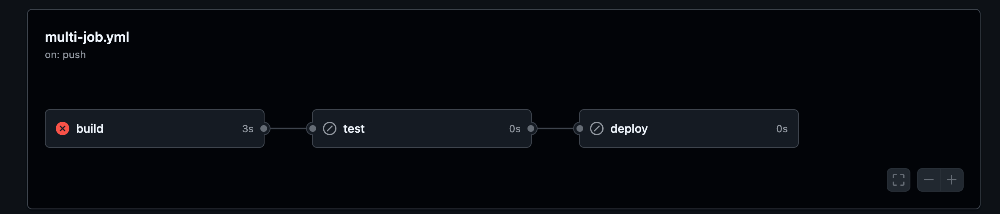
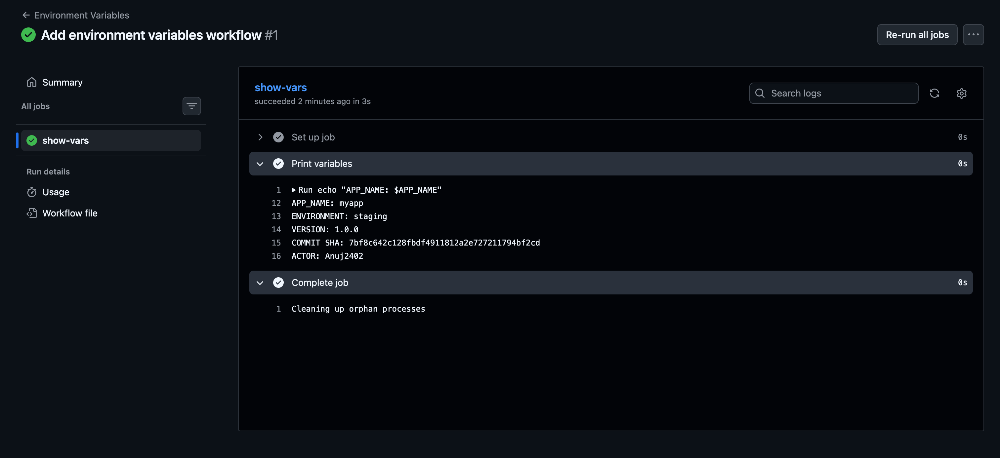
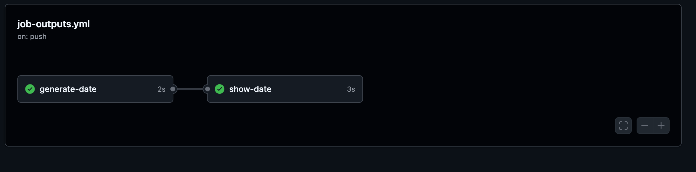
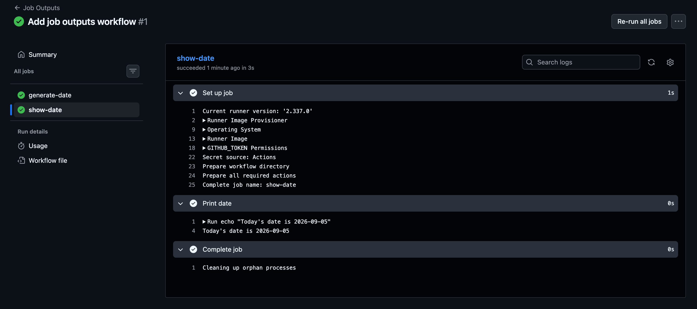

# Task 1: Multi-Job Workflow

### Step 1 — Create `multi-job.yml`

On our local machine , inside `github-actions-practice`

```bash 
cd ~/90DaysOfDevOps/github-actions-practice
touch .github/workflows/multi-job.yml
```
open it: 
```bash 
code .github/workflows/multi-job.yml
```

Write this indside the YAML file: 

```YAML 
name: Multi Job Workflow

on:
  push:

jobs:
  build:
    runs-on: ubuntu-latest
    steps:
      - name: Build
        run: echo "Building the app"

  test:
    needs: build
    runs-on: ubuntu-latest
    steps:
      - name: Test
        run: echo "Running tests"

  deploy:
    needs: test
    runs-on: ubuntu-latest
    steps:
      - name: Deploy
        run: echo "Deploying"
    
```

The important part Is
```YAML 
test:
  needs: Build 
```
- Means -> `test` cannot start until  `build` successfully finishes.

And
```YAML 
deploy: 
  needs: test 
```
- Means-> `Deploy` cannot start until `test` successfully finishes.

So the dependency chain is:
```
build
  │
  │ needs
  ▼
test
  │
  │ needs
  ▼
deploy
```

### Step 2 — Push it
Run: 
```bash 
git add .github/workflows/multi-job.yml
git commit -m "Add multi job workflow"
git push
```
Because the workflow has:
```YAML 
on: 
  push: 
```
the pipeline will start automatically 

### Step 3 — Check the Actions graph
Go to:

**GitHub → Actions → Multi Job Workflow**

we should see the dependency chain:
```
┌─────────┐
│  build  │
└────┬────┘
     │
     ▼
┌─────────┐
│  test   │
└────┬────┘
     │
     ▼
┌─────────┐
│ deploy  │
└─────────┘
```
- Notice that **all three jobs use separate runners**, but `needs` controls when they are allowed to start.

### Note for your learning
- `needs` creates dependencies between jobs. A job with `needs: build` waits for the build job to complete successfully before starting. This allows us to create controlled CI/CD stages such as **Build → Test → Deploy**.

### One important experiment
After you verify the successful run, change the build command temporarily to:
```YAML
run: |
  echo "Building the app"
  exit 1
```
Push it.

we will see : 
```
build  ❌
  ↓
test   ⏭️ skipped
  ↓
deploy ⏭️ skipped
```
OUTPUT: 


That's the real value of `needs:` **a failed build prevents downstream jobs from deploying.**

Then remove `exit 1` and push again.

# Task 2: Environment Variables

### Step 1 — Create the workflow
on our local machine

```bash 
cd ~/90DaysOfDevOps/github-actions-practice
touch .github/workflows/env-vars.yml
```
Open it: 
```bash 
code .github/workflows/env-vars.yml
```
Add: 

```YAML 
name: Environment Variables

on:
  push:

env:
  APP_NAME: myapp

jobs:
  show-vars:
    runs-on: ubuntu-latest

    env:
      ENVIRONMENT: staging

    steps:
      - name: Print variables
        env:
          VERSION: 1.0.0
        run: |
          echo "APP_NAME: $APP_NAME"
          echo "ENVIRONMENT: $ENVIRONMENT"
          echo "VERSION: $VERSION"
          echo "COMMIT SHA: $GITHUB_SHA"
          echo "ACTOR: $GITHUB_ACTOR"
```

### Step 2 — Understand the three levels

1. Workflow Level 

```YAML 
env: 
  APP_NAME: myapp 
```
This is available to all jobs and steps in this workflow

```
Workflow
   │
   ├── Job 1 → APP_NAME ✓
   ├── Job 2 → APP_NAME ✓
   └── Job 3 → APP_NAME ✓
```

2. Job level
```YAML 
jobs:
  show-vars:
    env:
      ENVIRONMENT: staging
```
This variable is available to all steps inside `show-vars.`
```
show-vars
   │
   ├── Step 1 → ENVIRONMENT ✓
   ├── Step 2 → ENVIRONMENT ✓
   └── Step 3 → ENVIRONMENT ✓
```
3. Step level

```YAML
steps:
  - name: Print variables
    env:
      VERSION: 1.0.0
```
`VERSION` is available only inside that particular step

```
Step: Print variables
        │
        └── VERSION ✓
```

### Step 3 — GitHub context variables

These are provided automatically by GitHub.

Commit SHA
```bash 
$GITHUB_SHA
```
This identifies the commit that triggered the workflow.

Actor

```bash 
$GITHUB_ACTOR
```
This identifies the GitHub user who triggered the workflow.

So this:
```YAML
echo "COMMIT SHA: $GITHUB_SHA"
echo "ACTOR: $GITHUB_ACTOR"
```
might produce:
```
APP_NAME: myapp
ENVIRONMENT: staging
VERSION: 1.0.0
COMMIT SHA: 8f31c...
ACTOR: Anuj2402
```
The SHA will obviously be different for each commit.

OUTPUT: 



### Step 4 — Push it

```bash 
git add .github/workflows/env-vars.yml
git commit -m "Add environment variables workflow"
git push
```
Then go to:

**GitHub → Actions → Environment Variables**

Open the job and check the Print variables step.

Expected result
```
✓ APP_NAME: myapp
✓ ENVIRONMENT: staging
✓ VERSION: 1.0.0
✓ COMMIT SHA: <40-character SHA>
✓ ACTOR: <GitHub username>
```
### Notes
Workflow-level variables are available throughout the workflow. Job-level variables are available to all steps within that job. Step-level variables are available only to that specific step. GitHub also provides context/environment variables such as `GITHUB_SHA` for the commit SHA and `GITHUB_ACTOR` for the user who triggered the workflow.

Easy way to remember
```
Workflow env
     ↓
  Job env
     ↓
 Step env
```

**Scope gets narrower as you go down.**


# Task 3: Job Outputs
This task is about passing data from one job to another.

we will use two jobs: 
```
generate-date
      │
      │ output: today
      ▼
show-date
```
### Step 1 — Create the workflow
on our local machine:

```bash 
cd ~/90DaysOfDevOps/github-actions-practice
touch .github/workflows/job-outputs.yml
```
Open it:
```bash 
code .github/workflows/job-outputs.yml
```
Put this in it:
```YAML 
name: Job Outputs

on:
  push:

jobs:
  generate-date:
    runs-on: ubuntu-latest

    outputs:
      today: ${{ steps.date.outputs.today }}

    steps:
      - name: Get today's date
        id: date
        run: echo "today=$(date +'%Y-%m-%d')" >> "$GITHUB_OUTPUT"

  show-date:
    needs: generate-date
    runs-on: ubuntu-latest

    steps:
      - name: Print date
        run: echo "Today's date is ${{ needs.generate-date.outputs.today }}"
```

### Step 2 — Understand the important pieces

1. Create the output
Inside the first job:
```YAML 
outputs:
  today: ${{ steps.date.outputs.today }}
```
We're saying:

- The job's output called today comes from the step output called today.

2. Give the step an ID

```YAML 
- name: Get today's date
  id: date 
```
The `id` allows us to reference this step later:
like
```
step.date 
```

3. Create the step output

This is the key command 
```bash 
echo "today=$(date +'%Y-%m-%d')" >> "$GITHUB_OUTPUT"
```
For example, it might create:
```
today=2026-09-02
```
GitHub Actions reads `$GITHUB_OUTPUT` and makes that value available as a step output.

So:
```
Step
 │
 ├── id: date
 │ 
 └── outputs: # this is job level 
       today = 2026-09-02
```

### Step 3 — Make the output available to another job
The second job has:
```YAML 
needs: generate-date
```
This does Two things: 
1. Make `show-date `wait for `generate-date`
2. Allows `show-date` to access the first job's outputs.

We then access it using
```YAML 
${{ needs.generate-date.outputs.today }}
```
Break it down:
```
needs
  ↓
generate-date
  ↓
outputs
  ↓
today
```

### Step 4 — Push the workflow
Run:
```bash 
git add .github/workflows/job-outputs.yml
# then 
git commit -m "Add job outputs workflow"
# then 
git push

```
Go to : **GitHub → Actions → Job Outputs**

we should see:
```
generate-date ✓
      │
      ▼
show-date ✓
```
OUTPUT: 


Open **show-date**
we should see something like : 
```
Today's date is 2026-09-02
```
OUTPUT: 


### Notes
The mental model: I'd remember GitHub Actions outputs like this:

```
┌──────────────────────────────┐
│ Job: generate-date            │
│                              │
│  ┌────────────────────────┐  │
│  │ Step: date             │  │
│  │                        │  │
│  │ today = 2026-09-05     │  │
│  └───────────┬────────────┘  │
│              │               │
│              │ step output   │
│              ▼               │
│       Job output: today      │
└──────────────┬───────────────┘
               │
               │ needs
               ▼
┌──────────────────────────────┐
│ Job: show-date               │
│                              │
│ needs.generate-date.outputs  │
│ .today                       │
│                              │
│          ↓                   │
│    2026-09-05                │
└──────────────────────────────┘

```

- **When someone pushes code, run generate-date, have its date step produce today's date, expose that value as a job output, wait for that job to finish, then let show-date consume that output and print it**.

- **Job outputs allow one job to pass dynamically generated data to another job. This is useful when a later job needs information produced by an earlier job, such as a version number, image tag, build ID, artifact name, or deployment information.**

#### Real world CI/CD example: 
Imagine:
```
Build
 │
 ├── Build Docker image
 └── Generate image tag
          │
          ▼
      Test
          │
          ▼
      Deploy
```
The build job could output:
```
IMAGE_TAG=1.5.2
```
Then the deploy job could use:
```YAML
${{ needs.build.outputs.image_tag }}
```
to deploy exactly that image.

Remember this syntax
```YAML 
outputs:
  name: ${{ steps.step-id.outputs.value }}
```
Then from another job:
```YAML 
${{ needs.job-id.outputs.name }}
```
So the complete flow is:
```
Step output
     ↓
Job output
     ↓
needs.<job>.outputs.<name>
     ↓
Another job
```


