# Task 1: GitHub Secrets

### Step 1 — Create the GitHub Secret
Go to the Repository 

**GitHub → `github-actions-practice` → Settings → Secrets and variables → Actions**

Then: 
1. Click New repository secret
2. Name:
```
MY_SECRET_MESSAGE
```
3. For the value, enter any test message, for example:
```
This is my private CI secret
```
4. Click Add secret

After creating it, we should see something like:
```
MY_SECRET_MESSAGE
Updated just now
```
OUTPUT: 
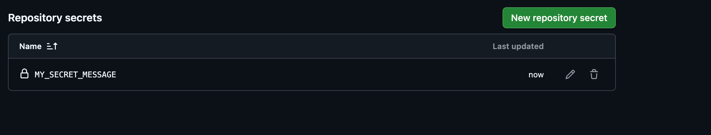

### Step 2 — Create the workflow
on our local machine 
```bash 
cd ~/github-actions-practice
# create 
touch .github/workflows/secrets.yml
```
Put this in 
```YAML 
name: GitHub Secrets

on:
  push:

jobs:
  check-secret:
    runs-on: ubuntu-latest

    steps:
      - name: Check if secret is set
        run: |
          if [ -n "${{ secrets.MY_SECRET_MESSAGE }}" ]; then
            echo "The secret is set: true"
          else
            echo "The secret is set: false"
          fi
```

Understand this

This : 
```YAML 
${{ secrets.MY_SECRET_MESSAGE }}
```
accesses the Github repository secret 

The shell: 
```bash 
-n 
```
checks whether the value is non-empty.

So we're checking:
```
Secret exists?
     │
     ├── Yes → The secret is set: true
     │
     └── No  → The secret is set: false
```

We are not printing the secret itself.

### Step 3 — Commit and push

```bash 
git add .github/workflows/secrets.yml
git commit -m "Add GitHub secrets workflow"
git push
```

Go to:

**GitHub → Actions → GitHub Secrets**

we  should see:
```
The secret is set: true
```
OUTPUT: 
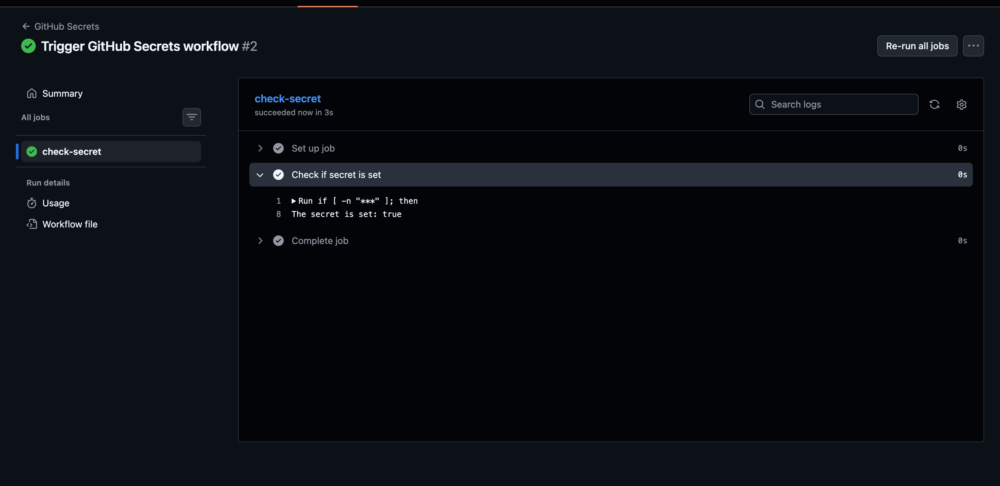

### Step 4 — Your experiment
Once Step 3 works, we'll deliberately add:
```YAML 
- name: Try printing secret
  run: echo "${{ secrets.MY_SECRET_MESSAGE }}"
```
and observe what GitHub does.


our workflow should now have both:
```YAML 
name: GitHub Secrets

on:
  push:

jobs:
  check-secret:
    runs-on: ubuntu-latest

    steps:
      - name: Check if secret is set
        run: |
          if [ -n "${{ secrets.MY_SECRET_MESSAGE }}" ]; then
            echo "The secret is set: true"
          else
            echo "The secret is set: false"
          fi
      - name: Try printing the secret
        run : echo "${{ secrets.MY_SECRET_MESSAGE }}"
```
Then:

```bash 
git add .github/workflows/secrets.yml
git commit -m "Test secret masking"
git push
```
**Go to Actions → GitHub Secrets → latest run → Try printing the secret.**

we should see the value masked, typically as:
```
***
```
OUTPUT: 
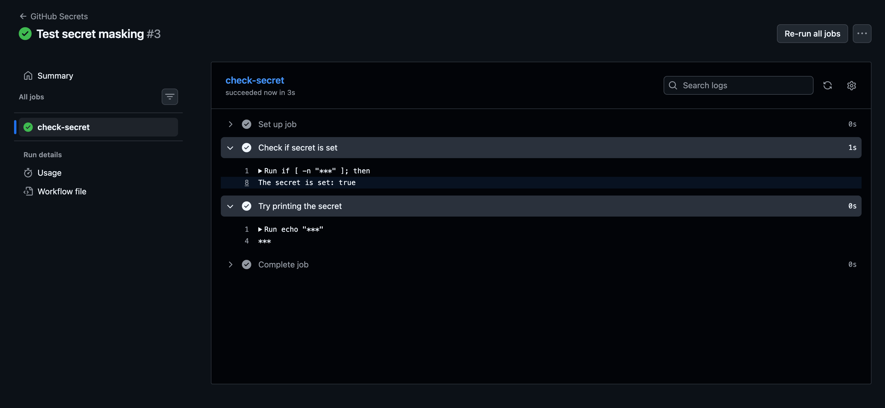
#### Note for your Task 1
#### QIMP -> Why should we never print secrets in CI logs?
CI/CD logs may be accessible to developers, stored for a period of time, copied into tickets, or exposed through screenshots/log collection. Printing credentials, tokens, passwords, or API keys can allow unauthorized access to systems. Even though GitHub masks many secrets, we should follow the principle of never intentionally printing secrets.


GitHub Secrets are encrypted values used to store sensitive information such as passwords, API keys, and tokens. Workflows can access them using `${{ secrets.SECRET_NAME }}`. GitHub masks secret values in logs to reduce accidental exposure, but secrets should never be intentionally printed.

# Task 2 — Use Secrets as Environment Variables

### Step 1 — Add DOCKER_USERNAME
Go to:

**GitHub → `github-actions-practice` → Settings → Secrets and variables → Actions → Secrets**

Click **New repository secret.**
Name
```
DOCKER_USERNAME
```

Secret
- our Docker Hub username.

After adding it, we should have:
```
MY_SECRET_MESSAGE
DOCKER_USERNAME
```
Output: 
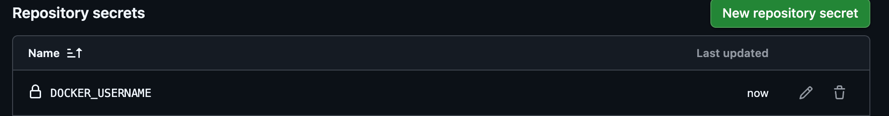

### Step 2 — Add DOCKER_TOKEN
Go to:

**GitHub → `github-actions-practice` → Settings → Secrets and variables → Actions → Secrets → New repository secret**

Set:

Name:
```
DOCKER_TOKEN
```
Secret:
```
Paste your Docker Hub access token here.
```

### Step 3 — Create the workflow
```bash 
cd ~/github-actions-practice
touch .github/workflows/docker-secrets.yml
```

Use this:
```YAML 
name: Docker Secrets as Environment Variables

on:
  push:

jobs:
  docker-secrets:
    runs-on: ubuntu-latest

    steps:
      - name: Use Docker credentials
        env:
          DOCKER_USERNAME: ${{ secrets.DOCKER_USERNAME }}
          DOCKER_TOKEN: ${{ secrets.DOCKER_TOKEN }}
        run: |
          echo "Docker username is configured: $([ -n "$DOCKER_USERNAME" ] && echo true || echo false)"
          echo "Docker token is configured: $([ -n "$DOCKER_TOKEN" ] && echo true || echo false)"
```
### What we're learning

Here:
```YAML 
env:
  DOCKER_USERNAME: ${{ secrets.DOCKER_USERNAME }}
  DOCKER_TOKEN: ${{ secrets.DOCKER_TOKEN }}
```
GitHub takes the secrets and makes them available to the shell as environment variables.

Then:
```bash 
"$DOCKER_USERNAME"
"$DOCKER_TOKEN"
```
uses those variables.

**We never hardcode either credential.**

And notice that we only print  `true/false`, not the actual values.

### Step 4 — Push it
```bash 
git add .github/workflows/docker-secrets.yml
git commit -m "Use Docker secrets as environment variables"
git push
```

Then check Actions → Docker Secrets as Environment Variables.

we should see:
```
Docker username is configured: true
Docker token is configured: true
```

OUTPUT: 
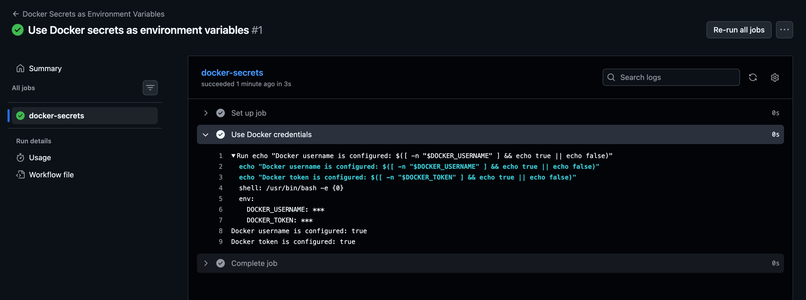

Using secrets as environment variables:

Secrets can be passed to a workflow step through the `env:` section. The shell can then access them using environment variables instead of hardcoding credentials.

Example:
```YAML
env:
  DOCKER_USERNAME: ${{ secrets.DOCKER_USERNAME }}
  DOCKER_TOKEN: ${{ secrets.DOCKER_TOKEN }}
```
This keeps credentials out of the workflow source code and GitHub masks secret values in logs.

Why this matters in real CI/CD
Later, when we do Docker CI/CD, we'll be able to use:
```
DOCKER_USERNAME
DOCKER_TOKEN
      ↓
docker login
      ↓
docker push
```
without putting our Docker credentials directly into the YAML.


# Task 3: Upload Artifacts

The concept we are learning is 
```
Job
 ↓
Generate file
 ↓
actions/upload-artifact
 ↓
GitHub stores file
 ↓
Actions run → Artifacts → Download
```
### Step 1 — Create the workflow
Create:
```bash 
cd ~/github-actions-practice
touch .github/workflows/artifact.yml
```
Put this in the file:
```YAML

name: Upload Artifact

on:
  push:

jobs:
  generate-report:
    runs-on: ubuntu-latest

    steps:
      - name: Generate test report
        run: |
          echo "Test Report" > test-report.txt
          echo "----------------" >> test-report.txt
          echo "Tests passed: 10" >> test-report.txt
          echo "Tests failed: 0" >> test-report.txt
          echo "Generated by GitHub Actions" >> test-report.txt

      - name: Upload test report
        uses: actions/upload-artifact@v4
        with:
          name: test-report
          path: test-report.txt

```
#### What is happening?
This step: 
```YAML 
run: | 
  echo: "Test Report" > test-report.txt
```
creates a file inside the runner.

Then:
```YAML 
uses: actions/upload-artifact@v4
```
uploads that file from the runner and attaches it to the workflow run.

The important part is:

### Step 2 — Push it
Run:
```bash 
git add .github/workflows/artifact.yml
git commit -m "Add artifact upload workflow"
git push
```
Then go to:
**GitHub → Actions → Upload Artifact → latest run**

OUTPUT: 
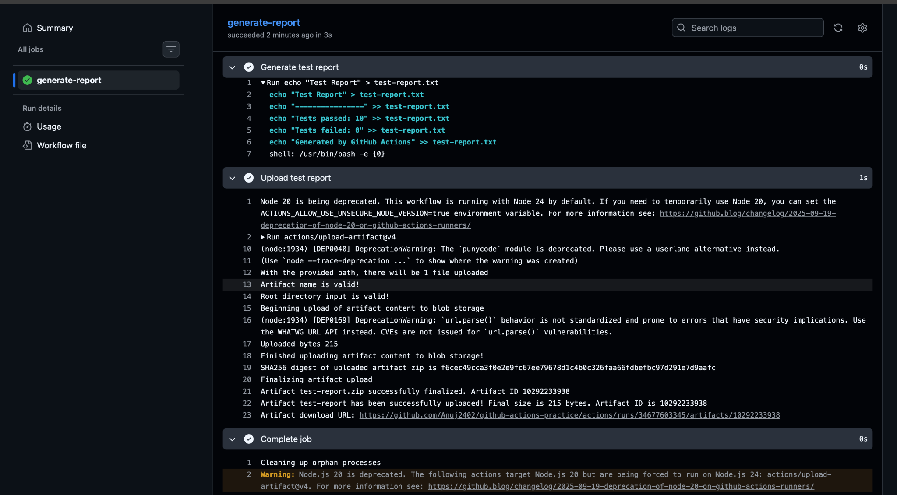

#### NOTES: 

Verified: The `test-report` artifact was successfully uploaded by GitHub Actions and downloaded from the Actions run summary. The ZIP contained `test-report.txt`.

**Artifacts:** Artifacts are files generated during a GitHub Actions workflow, such as test reports, logs, binaries, or build packages. `actions/upload-artifact ` stores these files so they can be downloaded after the workflow completes.

# Task 4: Download Artifacts Between Jobs

### Step 1: Create Job 1

Create :
```bash 
.github/workflows/artifact-between-jobs.yml
```
For now, put only this:
```YAML 
name: Artifact Between Jobs

on:
  push:

jobs:
  generate:
    runs-on: ubuntu-latest

    steps:
      - name: Generate file
        run: |
          echo "Hello from Job 1" > message.txt
          cat message.txt

      - name: Upload artifact
        uses: actions/upload-artifact@v4
        with:
          name: job1-artifact
          path: message.txt

```

#### What this does
Job 1 (`generate`):

1. Creates `message.txt`
2. Puts `Hello from Job 1` inside it
3. Uploads it as an artifact named `job1-artifact`

Add workflow commit and push 

OUTPUT: 
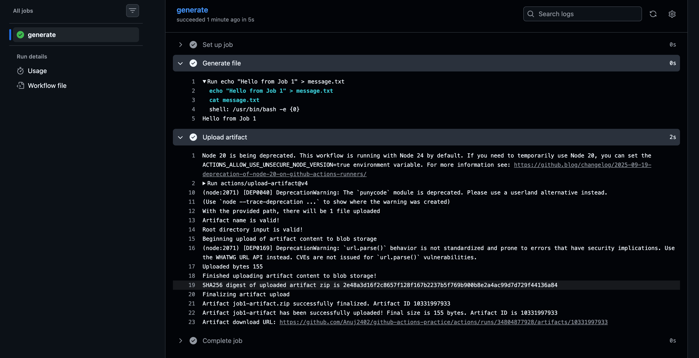

From your screenshot:
- `generate`→ ✅ succeeded
- `message.txt` → successfully created
- Contents → `Hello from Job 1`
- `job1-artifact` → ✅ successfully uploaded
- Artifact ID is shown → `10331997933`

###  Step 2 — Create Job 2

Modify the same `artifact-between-jobs.yml` and add this below the generate job:

```YAML 
  use-artifact:
    needs: generate
    runs-on: ubuntu-latest

    steps:
      - name: Download artifact
        uses: actions/download-artifact@v4
        with:
          name: job1-artifact

      - name: Read artifact
        run: |
          echo "Contents of artifact:"
          cat message.txt
```
our workflow should now have:
```YAML 
name: Artifact Between Jobs

on:
  push:

jobs:
  generate:
    runs-on: ubuntu-latest

    steps:
      - name: Generate file
        run: |
          echo "Hello from Job 1" > message.txt
          cat message.txt

      - name: Upload artifact
        uses: actions/upload-artifact@v4
        with:
          name: job1-artifact
          path: message.txt

  use-artifact:
    needs: generate
    runs-on: ubuntu-latest

    steps:
      - name: Download artifact
        uses: actions/download-artifact@v4
        with:
          name: job1-artifact

      - name: Read artifact
        run: |
          echo "Contents of artifact:"
          cat message.txt
```
#### Important concept
Notice:
```
needs: generate
```
This means:

Job 1 (`generate`) → Job 2 (`use-artifact`)
Job 2 will wait until Job 1 successfully finishes.

Then:
```YAML 
uses: actions/download-artifact@v4
```
downloads the artifact created by Job 1.

Finally:
```bash 
cat message.txt
```
should print:
```
Contents of artifact:
Hello from Job 1
```
OUTPUT: 
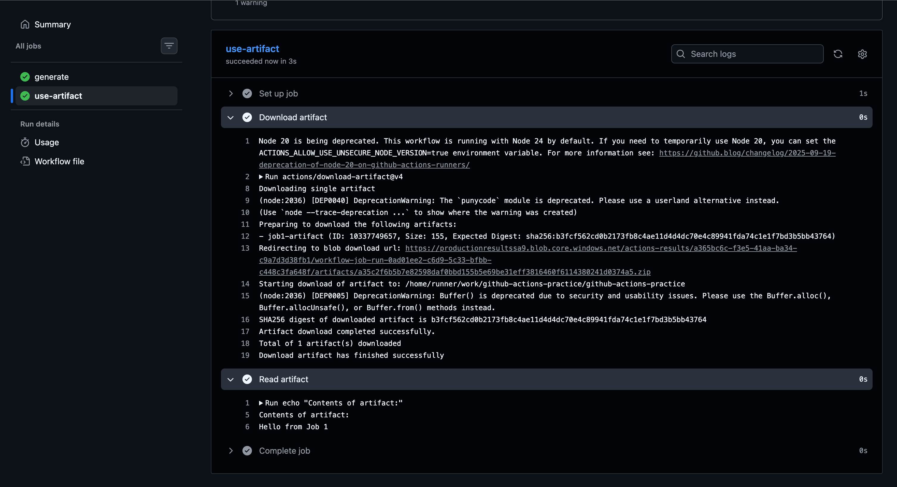

Push the change and check the Actions → workflow run.
1. `generate` → ✅ created `message.txt`
2. Upload artifact → ✅ uploaded `job1-artifact`
3. `use-artifact` → ✅ waited for `generate`
4. Download artifact → ✅ downloaded `job1-artifact`
5. Read artifact → ✅ printed:

#### Q(IMP) -> When would you use artifacts in a real pipeline?
Artifacts are used to store and pass files generated during a CI/CD workflow, such as test reports, logs, build packages, binaries, coverage reports, or deployment files. They are especially useful when one job needs to use files produced by another job.


# Task 5: Run Real Tests in CI

In This task the Goal is to Learn How **CI executes a real script and detects failures** we'll use a simple Shell script first. It also avoids installing dependencies.

### Step 1: Add the script
our `github-actions-practice` repo, create:
```
scripts/health_check.sh
```
Put this inside:
```bash 
#!/bin/bash

echo "Starting health check..."

echo "Checking Linux environment..."
uname -s

echo "Checking current user..."
whoami

echo "Health check passed!"
exit 0
```

Then make it executable locally:
```bash 
chmod +x scripts/health_check.sh
```
Run it:
```bash 
./scripts/health_check.sh
```
we  should get something similar to:
```
Starting health check...
Checking Linux environment...
Linux
Checking current user...
...
Health check passed!
```
And importantly, the command should finish with exit code 0.

OUTOUT: 
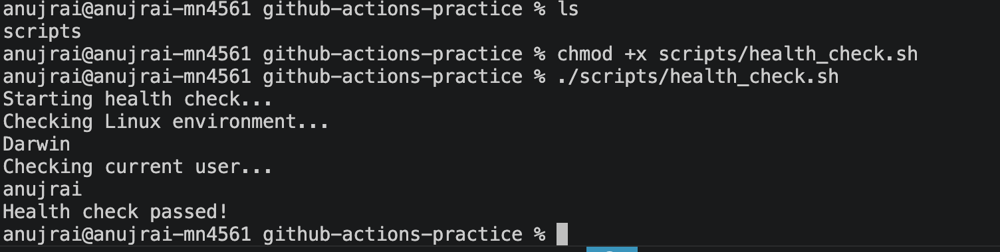

### Step 2 — Create the CI workflow
Now create: 
```
.github/workflows/run-script.yml
```
Put this in it:
```YAML 
name: Run Health Check

on:
  push:
  pull_request:

jobs:
  health-check:
    runs-on: ubuntu-latest

    steps:
      - name: Checkout code
        uses: actions/checkout@v4

      - name: Run health check
        run: ./scripts/health_check.sh
```
#### Why this works
```YAML 
uses: actions/checkout@v4
```
- Downloads our repository onto the GitHub runner.

Then:
```bash 
run: ./scripts/health_check.sh
```
executes our script.

And because we have:
```bash 
exit 0 
```
the script succeeds, so GitHub Actions should show a green ✅ job

Also notice we aren't using `continue-on-error`. Therefore, if the script returns a non-zero exit code, the CI job will fail automatically.

#### Create the workflow, commit it, and push:
```bash 
git add .github/workflows/run-script.yml
git commit -m "Add health check CI workflow"
git push
```
Then check **GitHub → Actions.**

we should see something like
```
Run Health Check
└── health-check ✅
    ├── Checkout code ✅
    └── Run health check ✅
```
OUTPUT: 
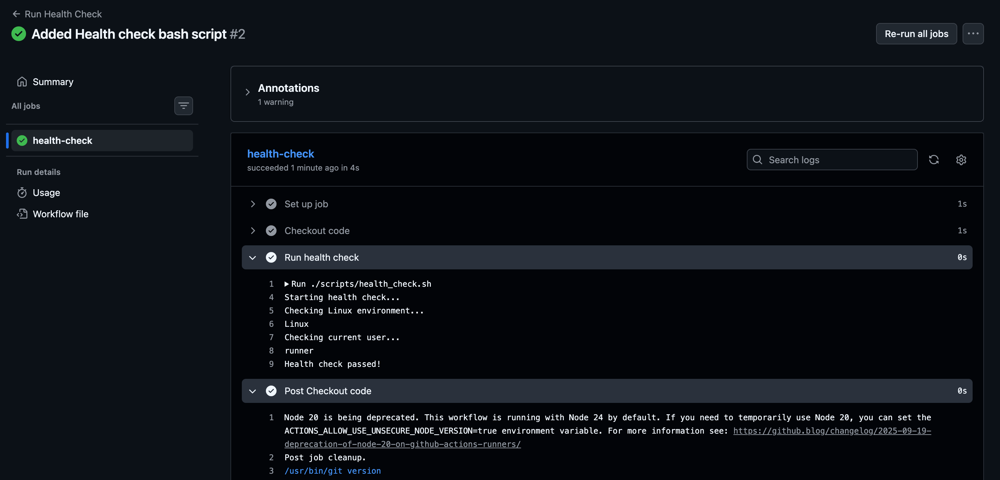

### Step 3 — Intentionally break the script

We want to prove that CI actually detects failures.

Open:
```bash 
scripts/health_check.sh
```
Change the last line from:
```bash 
exit 0 
``
to: 
```bash 
exit 1
```
so the end of the script becomes: 
```bash 
echo "Health check passed!"
exit 1
```
Commit and push:
```bash 
git add scripts/health_check.sh
git commit -m "Intentionally break health check"
git push
```
OUTPUT: 
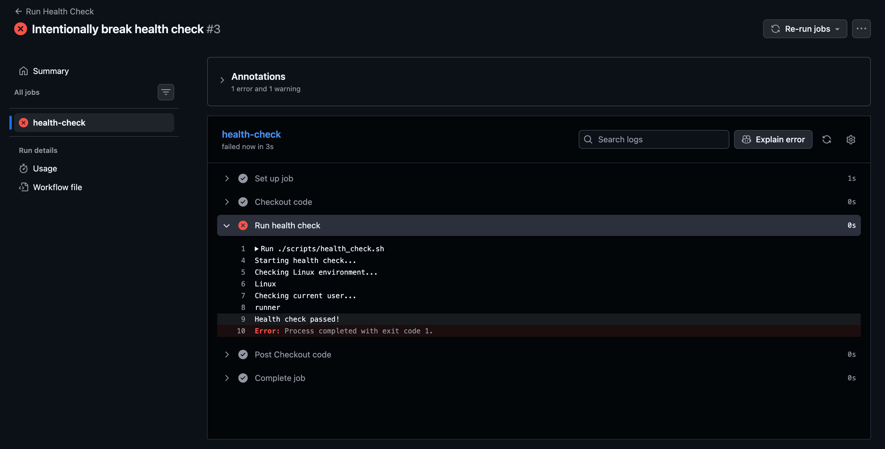

### Now do the final step: Fix it
Go back to our `scripts/health_check.sh` and undo whatever change you made to intentionally cause the failure.

Then locally run:
```bash 
./scripts/health_check.sh
echo $?
```

# Task 6: Caching

### Step 1: Create a workflow that installs dependencies

We'll use Python + pip because it's easy to observe caching.

First, create:
```bash 
.github/workflows/cache-demo.yml
```
Put this in it:
```YAML 
name: Cache Demo

on:
  push:

jobs:
  install-dependencies:
    runs-on: ubuntu-latest

    steps:
      - name: Checkout code
        uses: actions/checkout@v4

      - name: Set up Python
        uses: actions/setup-python@v5
        with:
          python-version: '3.12'

      - name: Cache pip
        uses: actions/cache@v4
        with:
          path: ~/.cache/pip
          key: ${{ runner.os }}-pip-${{ hashFiles('**/requirements.txt') }}
          restore-keys: |
            ${{ runner.os }}-pip-

      - name: Install dependencies
        run: |
          pip install -r requirements.txt

```
But first, we need `requirements.txt`

At the root of our repository, create:
```
requirements.txt
```
For example:
```
requests
pytest
```
our repository should look approximately like:
```
github-actions-practice/
├── .github/
│   └── workflows/
│       └── cache-demo.yml
├── scripts/
│   └── health_check.sh
└── requirements.txt
```
OUTPUT: 
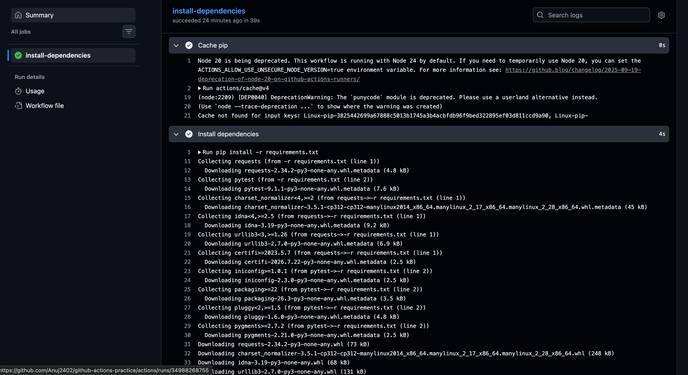

### Step 3 — Run the workflow a second time

Since our workflow triggers on `push`, make a tiny change and push it:
```bash 
echo "# cache test" >> requirements.txt

git add requirements.txt
git commit -m "Test dependency caching"
git push
```
Then open the new GitHub Actions run.

#### What we're looking for
Open the Cache pip step.

On the first run, we should have seen something like:

```
Cache not found for input keys
```
On the second run, ideally:
```
Cache restored from key: ...
```
And during `Install dependencies`, we should notice that packages are retrieved from the local pip cache rather than downloaded again.

**Important**: Because we changed `requirements.txt`, the `hashFiles('**/requirements.txt')` part creates a new cache key. So this particular second run may be a cache miss.

If that happens, that's actually a useful lesson.

OUTPUT : 
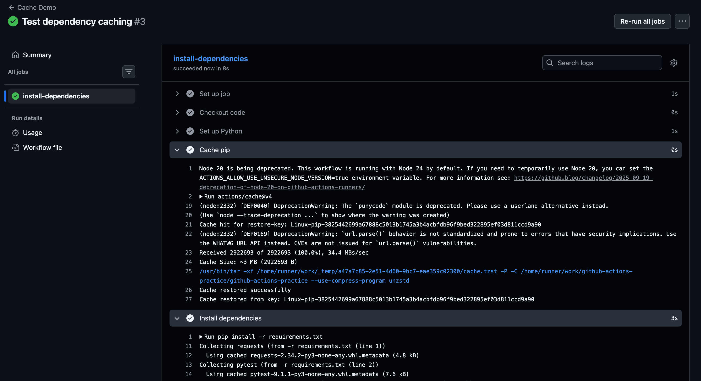

our screenshot shows the important lines:
```
Cache hit for restore-key
Cache restored successfully
Cache restored from key: Linux-pip-...
```
And during installation:
```
Using cached requests...
Using cached pytest...
```
The workflow also dropped from about **39 seconds on the first run to 8 seconds** on this run. That's exactly the observation Task 6 wants.

**Now write this in your notes**

**What is being cached?**

The workflow caches the Python `pip` package download cache located at `~/.cache/pip.` This contains downloaded Python packages/wheels and metadata, so subsequent workflow runs can reuse them instead of downloading everything again.

**Where is it stored?**
GitHub Actions stores the cache remotely for the repository and restores it onto the runner at `~/.cache/pip` when the cache key matches.

**Why is caching useful?**
Caching reduces dependency download time and makes CI pipelines faster.
