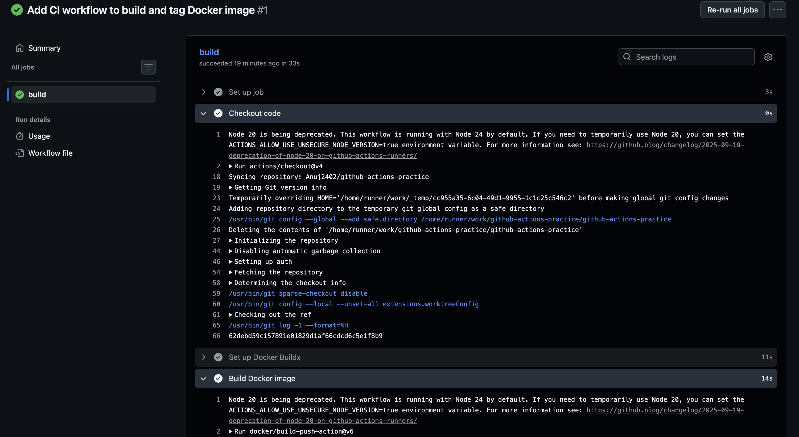
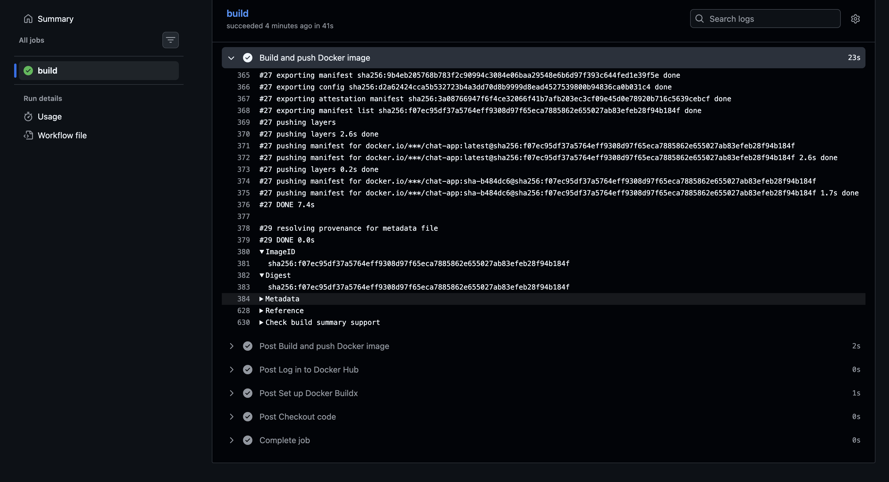
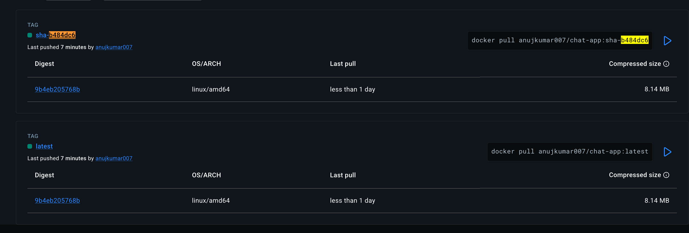
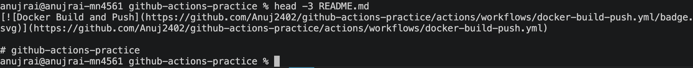
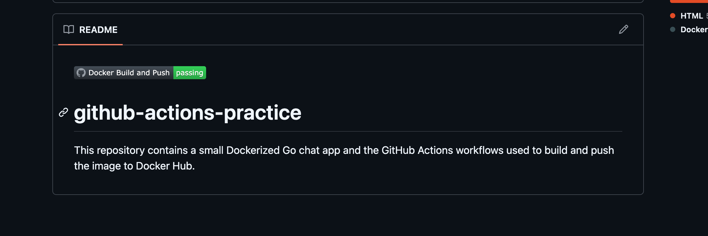

# Task 1: Prepare

1. I am using the Go-Chat- APP That i Dockerized on Day 36 

2. Added the Dockerfile to our github-actions-practice repo

```dockerfile 
# syntax=docker/dockerfile:1

FROM golang:1.22-alpine AS builder

WORKDIR /src

RUN apk add --no-cache git ca-certificates

COPY go.mod ./
RUN go mod download

COPY main.go ./
COPY index.html ./
COPY history.html ./

RUN CGO_ENABLED=0 GOOS=linux GOARCH=amd64 go build -ldflags="-s -w" -o /out/chat-server main.go

FROM alpine:3.20 AS runtime

RUN apk add --no-cache ca-certificates tzdata \
    && addgroup -S appgroup \
    && adduser -S -G appgroup -H -h /app appuser

WORKDIR /app

COPY --from=builder /out/chat-server ./chat-server
COPY --from=builder /src/index.html ./index.html
COPY --from=builder /src/history.html ./history.html

RUN chown -R appuser:appgroup /app

USER appuser

EXPOSE 8080

HEALTHCHECK --interval=30s --timeout=3s --start-period=5s --retries=3 \
    CMD wget --spider http://127.0.0.1:8080/ || exit 1

ENTRYPOINT ["./chat-server"]

```
3.  Make sure DOCKER_USERNAME and DOCKER_TOKEN secrets are set from Day 44
- Secrectes are Set already 

# Task 2: Build the Docker Image in CI

```bash 
touch .github/workflows/docker-publish.yml
```
put it in YAML 
```YAML 
name: Docker Build and Push

on:
  push:
    branches: [main]

jobs:
  build:
    runs-on: ubuntu-latest

    steps:
      - name: Checkout code
        uses: actions/checkout@v4

      - name: Set up Docker Buildx
        uses: docker/setup-buildx-action@v3

      - name: Build Docker image
        uses: docker/build-push-action@v6
        with:
          context: .
          file: ./Dockerfile
          push: false
          tags: |
            ${{ secrets.DOCKER_USERNAME }}/chat-app:latest
            ${{ secrets.DOCKER_USERNAME }}/chat-app:${{ github.sha }}
```
#### Understand the Flow 

1. Trigger

```YAML 
on:
  push:
    branches: [main]
```
- Runs when you `push to main`.

2.  Runner 
```YAML 
runs-on: ubuntu-latest
```
- GitHub gives us an Ubuntu machine.

3. Checkout
```YAML 
uses: actions/checkout@v4
```
- Downloads our GitHub code into the runner.

4. Buildx
```YAML
uses: docker/setup-buildx-action@v3
```
- Sets up Docker's build system.

5. Build Docker image
```YAML
uses: docker/build-push-action@v6
```
- Builds our Docker image.

Important part:
```YAML 
context: .
file: ./Dockerfile
push: false
```
- `context: .` -> use the current repo 
- `file: ./Dockerfile` -> use this Dockerfile
- `push: false` -> build only, don't upload to Docker Hub

6. Tags
```YAML 
tags: |
  ${{ secrets.DOCKER_USERNAME }}/chat-app:latest
  ${{ secrets.DOCKER_USERNAME }}/chat-app:${{ github.sha }}
```
This gives the image two names:
```
username/chat-app:latest
username/chat-app:<commit-sha>
```
The important thing to understand now:
This workflow builds the Docker image but does NOT push it to Docker Hub.


OutPut:


- This workflow builds a Docker image, but currently does NOT push it to Docker Hub.

# Task 3: Push to Docker Hub
```YAML
name: Docker Build and Push

on:
  push:
    branches: [main]

jobs:
  build:
    runs-on: ubuntu-latest

    steps:
      - name: Checkout code
        uses: actions/checkout@v4

      - name: Set up Docker Buildx
        uses: docker/setup-buildx-action@v3

      - name: Get short commit SHA
        id: vars
        run: echo "sha_short=$(git rev-parse --short HEAD)" >> "$GITHUB_OUTPUT"

      - name: Log in to Docker Hub
        uses: docker/login-action@v3
        with:
          username: ${{ secrets.DOCKER_USERNAME }}
          password: ${{ secrets.DOCKER_TOKEN }}

      - name: Build and push Docker image
        uses: docker/build-push-action@v6
        with:
          context: .
          file: ./Dockerfile
          push: true
          tags: |
            ${{ secrets.DOCKER_USERNAME }}/chat-app:latest
            ${{ secrets.DOCKER_USERNAME }}/chat-app:sha-${{ steps.vars.outputs.sha_short }}
```

#### Let's Understand the Above YAML for Push to Docker Hub

1. Get Short Commit SHA
```YAML 
- name: Get short commit SHA
  id: vars
  run: echo "sha_short=$(git rev-parse --short HEAD)" >> "$GITHUB_OUTPUT"
```
-  Gets The short Version of the GIT Commit ID 

Example:
```
a7f32c1
```
Then we can use: 
```
chat-app:sha-a7f32c1
```
2. Log In To Docker Hub 
```YAML 
uses: doceker/login-action@v3
with: 
  username: ${{ secrets.DOCKER_USERNAME }}
  password: ${{ secrets.DOCKER_TOKEN }}
```
- Logs GitHub Actions into our Docker Hub account
- The credentials come from GitHub Secrets, not hardcoded values.

3. Build AND push
```YAML 
push: true
```
- This is the important change.
Previously:
```YAML 
push: false
```
Build only
Now:
```YAML 
push: true
```
- Build + upload to Docker Hub

4. Two image tags
```YAML 
tags: |
  ${{ secrets.DOCKER_USERNAME }}/chat-app:latest
  ${{ secrets.DOCKER_USERNAME }}/chat-app:sha-${{ steps.vars.outputs.sha_short }}
```
we will get: 
```
yourusername/chat-app:latest
yourusername/chat-app:sha-a7f32c1
```
So:
`latest` → points to the latest image.
`sha-a7f32c1` → points to a specific Git commit.

OUTPUT: 


DOCKER HUB OUTPUT: 


Overall flow
```
GitHub push
    ↓
Checkout code
    ↓
Setup Docker
    ↓
Get commit SHA
    ↓
Login Docker Hub
    ↓
Build image
    ↓
Push image 🚀
```

# Task 4: Only Push on Main

This task is about controlling when our Docker image is pushed to Docker Hub.
You want to test that the Docker image can be built successfully on feature branches, but you don't want every developer branch to upload images to Docker Hub.

### Step 1: Update the workflow
```YAML 
name: Docker Build and Push

on:
  push:
    branches:
      - '**'
  pull_request:
    branches:
      - main

jobs:
  build:
    runs-on: ubuntu-latest

    steps:
      - name: Checkout code
        uses: actions/checkout@v4

      - name: Set up Docker Buildx
        uses: docker/setup-buildx-action@v3

      - name: Get short commit SHA
        id: vars
        run: echo "sha_short=$(git rev-parse --short HEAD)" >> "$GITHUB_OUTPUT"

      - name: Log in to Docker Hub
        uses: docker/login-action@v3
        with:
          username: ${{ secrets.DOCKER_USERNAME }}
          password: ${{ secrets.DOCKER_TOKEN }}

      - name: Build and push Docker image
        uses: docker/build-push-action@v6
        with:
          context: .
          file: ./Dockerfile
          push: ${{ github.ref == 'refs/heads/main' }}
          tags: |
            ${{ secrets.DOCKER_USERNAME }}/chat-app:latest
            ${{ secrets.DOCKER_USERNAME }}/chat-app:sha-${{ steps.vars.outputs.sha_short }}
```
#### Let's Understand 
1. we changed the trigger
Previously you had:
```YAML 
on:
  push:
    branches: [main]
```
- That means -> Run this workflow only when the code is pushed to `main.`

Now you have:
```YAML 
on:
  push:
    branches:
      - '**'
  pull_request:
    branches:
      - main
```
`push: '**'`
```YAML 
push:
  branches:
    - '**'
```
This Means -> Run this workflow when code is pushed to any branch.


2. You added `pull_request`

```YAML 
pull_request:
  branches:
    - main
```
- This means -> Run the workflow when a Pull Request is made toward `main.`
For example:
```
feature-login
      |
      | Pull Request
      ↓
    main
```
The workflow runs and builds the Docker image.
But it should not push the image.

3. The most important change: `push:`
our Old version was 
```YAML 
push: true 
```
- That means Build the image AND push it to Docker Hub.

Now we have 
```YAML 
push: ${{ github.ref == 'refs/heads/main' }}
```
This is a condition.
GitHub checks:
```
Is the current ref exactly refs/heads/main?
             |
       ┌─────┴─────┐
      YES          NO
       ↓            ↓
   push: true    push: false
```
On `main`
```YAML 
github.ref == 'refs/heads/main'
```
is `true`
Therefore:
```YAML 
push: true
```
- Docker image: BUILD AND PUSH 

On a `feature branch`

For example:
```YAML 
github.ref == 'refs/heads/feature-login'
```
- The condition is false 

Therefore: 
```YAML 
push: fasle
```
Docker image: only BUILD but will Not PUSH 


# Task 5: Add a Status Badge
### Step 1: Get the badge URL

Go to your repo on GitHub → Actions tab → click on the "Docker Build and Push" workflow in the left sidebar (not a specific run — the workflow itself) → click the ... (three-dot menu) in the top right → "Create status badge".

GitHub will show you a Markdown snippet like:
Get the badge URL from the Actions tab

```
[](https://github.com/Anuj2402/github-actions-practice/actions/workflows/docker-build-push.yml)
```

### Step 2: Add it to `README.md`
```bash 
cd ~/github-actions-practice
sed -i '1i [](https://github.com/Anuj2402/github-actions-practice/actions/workflows/docker-build-push.yml)\n' README.md
```
Verify:
```bash 
head -3 README.md
```
Expect the badge Markdown as line 1, a blank line, then our existing README content starting at line 3.
OUTPUT: 


### Step 3: Push and verify green 
```bash 
git add README.md
git commit -m "Add CI status badge to README"
git push origin main
```
Then open:

```
https://github.com/Anuj2402/github-actions-practice
```
OUTPUT: 

- The rendered README on GitHub shows the badge live and green — "passing"
