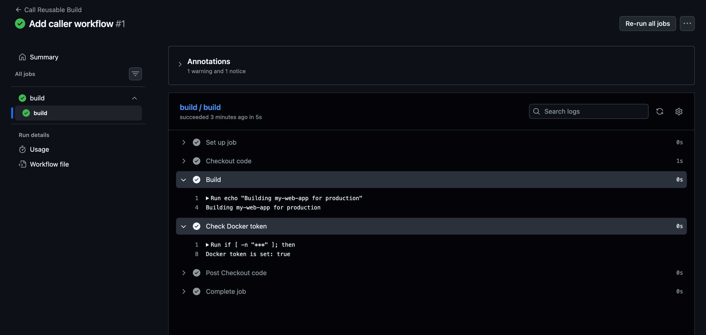
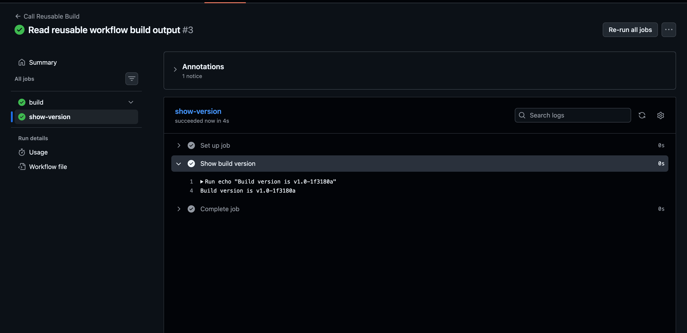
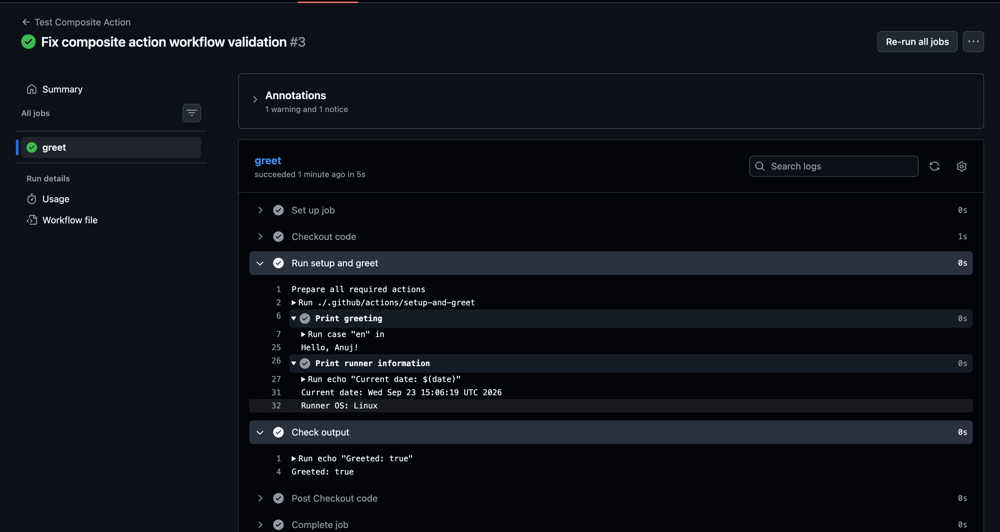

# Task 1: Understand `workflow_call`

This Task is introducing reusable workflows in GitHub Actions. The main Idea is : **Write a workflow once , then call it from other workflows instead of copying the same YAML repeatedly.**

1. What is a reusable workflow?
A **Reusable workflow** is a GitHub Action workflow that is designed to be called by another workflow.

For example, imagine we have the same Docker build process in 5 repositories:

```
Repo A ──┐
Repo B ──┤
Repo C ──┼──> Docker Build Workflow
Repo D ──┤
Repo E ──┘
```
Instead of copying the Docker workflow into every repository, we create it **once** and let the other workflows call it.

This reduces duplication and makes maintenance easier.

2. What is `workflow_call`?

`workflow_call` Tells the GitHub: **This workflow can be called by another workflow**

Example: 
```YAML 
on:
  workflow_call:
```
A normal workflow might have: 
```YAML 
on: 
  push:
```
A reusable workflow instead has: 
```YAML 
on:
  workflow_call: 
```
- we can also define **inputs and secrets** that the calling workflow can provide.

3. **Reusable workflow vs regular action** `uses:`

This is an important distinction.

we have already used actions like: 
```YAML 
steps:
  - uses: actions/checkout@v4
```
Here, `actions/checkout@v4` is an action used inside a step.

A reusable workflow is called at the **job level:**

```YAML 
jobs: 
  build:
    uses: ./.github/workflows/docker-build.yml
```
So:
```
Regular Action
     ↓
inside a step
     ↓
steps:
  - uses: ...

Reusable Workflow
     ↓
at job level
     ↓
jobs:
  build:
    uses: ...
```
A reusable workflow can contain **multiple jobs and multiple steps**, whereas an action is a reusable unit used within a step.

4. Where must the reusable workflow live?
It must be inside:
```
.github/workflows/
```
For example:
```
github-actions-practice/
│
├── .github/
│   └── workflows/
│       ├── main.yml
│       ├── docker-publish.yml
│       └── reusable-docker.yml
│
└── README.md
```

The reusable workflow file must be directly inside `.github/workflows` ;
subdirectories aren't supported.

5. The complete picture

Think of it like this:
```
Caller Workflow
     │
     │ calls
     ↓
Reusable Workflow
     │
     ├── Job 1
     │    ├── Step 1
     │    └── Step 2
     │
     └── Job 2
          ├── Step 1
          └── Step 2
```
The reusable workflow starts with:

```YAML 
name: Reusable Docker Build

on:
  workflow_call:
```
Then another workflow can call it.

In short:
`workflow_call` = **"Make this workflow available for other workflows to call."**

# Task 2: Create Your First Reusable Workflow

In this task we are going to create the reusable workflow , but we won't call it yet 
Let's Do it step by step 

### Step 1 — Create the file
Inside our repository: Create 
```bash 
.github/workflows/reusable-build.yml
```
Start with only this:
```YAML 
name: Reusable Build 

on: 
  workflow_call:
```
### Step 2 — Add the inputs
Under `workflow_call`, add:
```YAML
inputs: 
  app_name: 
    type: string 
    required: true


  environment: 
    type : string 
    required: true
    default: staging
```
So now:
```YAML 
name: Reusable Build

on:
  workflow_call:
    inputs:
      app_name:
        type: string
        required: true

      environment:
        type: string
        required: true
        default: staging
```
Important: `environment` has both `required: true` and `default: staging`. GitHub's reusable-workflow input rules allow a default value, but if the task specifically requires it to be `required: true`, keep the task's requested definition for now.

### Step 3 — Add the secret
Add:
```YAML 
    secrets:
      docker_token:
        required: true
```
Now we have:

```YAML 
name: Reusable Build

on:
  workflow_call:
    inputs:
      app_name:
        type: string
        required: true

      environment:
        type: string
        required: true
        default: staging

    secrets:
      docker_token:
        required: true
```
### Step 4 — Create the job

Add:
```YAML 
jobs:
  build:
    runs-on: ubuntu-latest

    steps:
      - name: Checkout code
        uses: actions/checkout@v4

      - name: Build
        run: echo "Building ${{ inputs.app_name }} for ${{ inputs.environment }}"

      - name: Check Docker token
        run: |
          if [ -n "${{ secrets.docker_token }}" ]; then
            echo "Docker token is set: true"
          else
            echo "Docker token is set: false"
          fi
```
Complete file
```YAML 
name: Reusable Build

on:
  workflow_call:
    inputs:
      app_name:
        type: string
        required: true

      environment:
        type: string
        required: true
        default: staging

    secrets:
      docker_token:
        required: true

jobs:
  build:
    runs-on: ubuntu-latest

    steps:
      - name: Checkout code
        uses: actions/checkout@v4

      - name: Build
        run: echo "Building ${{ inputs.app_name }} for ${{ inputs.environment }}"

      - name: Check Docker token
        run: |
          if [ -n "${{ secrets.docker_token }}" ]; then
            echo "Docker token is set: true"
          else
            echo "Docker token is set: false"
          fi
```

#### What this workflow does
when another workflow call's it  it will receive: 
```
app_name      → application name
environment   → staging/production/etc.
docker_token  → secret
```

And produce something like:
```
Building chat-app for staging
Docker token is set: true
```
It will not run by itself because it only has
```YAML 
on:
  workflow_call:
```
- The next task will create the **caller workflow** that actually triggers this one.

commit and push the file:
```bash 
git add .github/workflows/reusable-build.yml
git commit -m "Add reusable build workflow"
git push
```

# Task 3: Create a Caller Workflow

This Taks Where we will actually use the reusable workflow we created in Task 2.

### Step 1 — Create the caller file
Create:
```
.github/workflows/call-build.yml
```
Put this in it:
```YAML 
name: Call Reusable Build

on:
  push:
    branches:
      - main

jobs:
  build:
    uses: ./.github/workflows/reusable-build.yml
    with:
      app_name: "my-web-app"
      environment: "production"
    secrets:
      docker_token: ${{ secrets.DOCKER_TOKEN }}
```
##### What is happening here?
The important part is:

```YAML 
jobs:
  build:
    uses: ./.github/workflows/reusable-build.yml
```
This says: Run the reusable workflow I created earlier

Then we're passing the inputs:
```YAML 
with:
  app_name: "my-web-app"
  environment: "production"
```
So inside `reusable-build.yml:`

```YAML 
${{ inputs.app_name }}
```
becomes:
```
my-web-app
```
and:
```YAML 
${{ inputs.environment }}
```
becomes:
```
production
```
Therefore the output should be:

```
Building my-web-app for production
```
We're also passing the Docker secret:
```YAML 
secrets:
  docker_token: ${{ secrets.DOCKER_TOKEN }}
```
So the reusable workflow receives it as:
```YAML 
${{ secrets.docker_token }}

```
and should print only:
```
Docker token is set: true
```
### Step 2 — Commit and push
After creating file 
```bash 
git add .github/workflows/call-build.yml
git commit -m "Add caller workflow"
git push
```
Because the workflow is configured for:
```YAML 
on:
  push:
    branches:
      - main
```
- pushing to main should trigger it.

OUTPUT: 


#### Verified
🟢 Caller workflow succeeded
- build job succeeded
- Building my-web-app for production ✅
- Docker token is set: true ✅
- The actual Docker token was masked as `***` ✅

So the flow is working:
```
Push to main
     ↓
call-build.yml
     ↓
calls reusable-build.yml
     ↓
Checkout
     ↓
Build: my-web-app / production
     ↓
Check secret
     ↓
Success ✅
```
#### What we just learned

The caller provides the values:
```YAML 
with:
  app_name: "my-web-app"
  environment: "production"
```
and the reusable workflow consumes them:
```YAML 
${{ inputs.app_name }}
${{ inputs.environment }}
```
Similarly, the caller passes:
```YAML 
docker_token: ${{ secrets.DOCKER_TOKEN }}
```
and the reusable workflow receives:
```
${{ secrets.docker_token }}
```
That's the core purpose of `workflow_call`.

# Task 4: Add Outputs to the Reusable Workflow
This Task Teaches an important concept : **Outputs from a reusable worflow can be passed back to the caller workflow**

Let's Do it step by step 

### Step 1 — Modify `reusable-build.yml`

we currently have: 
```YAML 
on:
  workflow_call:
    inputs:
      ...
    secrets:
      ...
```
Add `output` under `workflow_call:`

```YAML 
outputs:
  build_version:
    description: "Generated build version"
    value: ${{ jobs.build.outputs.build_version }}
```
So the top part becomes: 
```YAML 
name: Reusable Build

on:
  workflow_call:
    inputs:
      app_name:
        type: string
        required: true

      environment:
        type: string
        required: true
        default: staging

    secrets:
      docker_token:
        required: true

    outputs:
      build_version:
        description: "Generated build version"
        value: ${{ jobs.build.outputs.build_version }}
```
#### Why jobs.build.outputs?
Because the version will first be created inside the `build` job.

Think 
```
Step
 ↓
Job output
 ↓
Reusable workflow output
 ↓
Caller workflow
```
### Step 2 — Create the job output

Inside the `job.build`, add: 
```YAML 
outputs: 
  build_version: ${{ steps.version.outputs.build_version }}
```
So: 
```YAML 
jobs:
  build:
    runs-on: ubuntu-latest

    outputs:
      build_version: ${{ steps.version.outputs.build_version }}
```
This Says: 
- Take the output calles `build_version` from the step called `version` and expose it as job output

### Step 3 — Generate the version
Add this step before our build step: 
```YAML 
- name: Generate build version
  id: version
  run: |
    SHORT_SHA=$(git rev-parse --short HEAD)
    echo "build_version=v1.0-$SHORT_SHA" >> "$GITHUB_OUTPUT"
```
For example, if the commit is:
```
a7f32c1
```
the output becomes:
```
v1.0-a7f32c1
```
The important part is:
```bash 
echo "build_version=..." >> "$GITHUB_OUTPUT"
```
That's How Github Actions steps creates an output.GitHub reads `$GITHUB_OUTPUT` and recognizes:

our reusable workflow should now look like this
```YAML 
name: Reusable Build

on:
  workflow_call:
    inputs:
      app_name:
        type: string
        required: true

      environment:
        type: string
        required: true
        default: staging

    secrets:
      docker_token:
        required: true

    outputs:
      build_version:
        description: "Generated build version"
        value: ${{ jobs.build.outputs.build_version }}

jobs:
  build:
    runs-on: ubuntu-latest

    outputs:
      build_version: ${{ steps.version.outputs.build_version }}

    steps:
      - name: Checkout code
        uses: actions/checkout@v4

      - name: Generate build version
        id: version
        run: |
          SHORT_SHA=$(git rev-parse --short HEAD)
          echo "build_version=v1.0-$SHORT_SHA" >> "$GITHUB_OUTPUT"

      - name: Build
        run: echo "Building ${{ inputs.app_name }} for ${{ inputs.environment }}"

      - name: Check Docker token
        run: |
          if [ -n "${{ secrets.docker_token }}" ]; then
            echo "Docker token is set: true"
          else
            echo "Docker token is set: false"
          fi
```

Commit and push it : 

### Step 2 — Update call-build.yml
our current `build` job calls the reusable workflow 
we need to add a second job that waits for it: 

```YAML 
jobs:
  build:
    uses: ./.github/workflows/reusable-build.yml
    with:
      app_name: "my-web-app"
      environment: "production"
    secrets:
      docker_token: ${{ secrets.DOCKER_TOKEN }}

  show-version:
    needs: build
    runs-on: ubuntu-latest

    steps:
      - name: Show build version
        run: echo "Build version is ${{ needs.build.outputs.build_version }}"
```
#### What does this mean ? 
First: 
```YAML 
needs: build
```
means-> Don't start `show-version` until the reusable workflow's `build` job finishes successfully.

Then: 
```YAML 
${{ needs.build.outputs.build_version }}
```
means: Get the `build_version` output from the `build ` job.
So the flow becomes:
```
call-build.yml
       │
       ▼
   build job
       │
       │ reusable-build.yml
       │
       ▼
 generates:
 v1.0-a7f32c1
       │
       ▼
 show-version
       │
       ▼
 Build version is v1.0-a7f32c1
 ```

 Now our complete `call-build.yaml`
 ```YAML 
 name: Call Reusable Build

on:
  push:
    branches:
      - main

jobs:
  build:
    uses: ./.github/workflows/reusable-build.yml
    with:
      app_name: "my-web-app"
      environment: "production"
    secrets:
      docker_token: ${{ secrets.DOCKER_TOKEN }}

  show-version:
    needs: build
    runs-on: ubuntu-latest

    steps:
      - name: Show build version
        run: echo "Build version is ${{ needs.build.outputs.build_version }}"
```

Now commit and push:
```bash 
git add .github/workflows/call-build.yml
git commit -m "Read reusable workflow build output"
git push
```
Then check Actions → Call Reusable Build.

should see two jobs:
```
build          ✅
     ↓
show-version   ✅
```
And `show-version` should print something like:
```
Build version is v1.0-abc1234
```
OUTPUT: 


The important flow we just implemented is:
```
reusable-build.yml
        │
        │ generates
        ▼
v1.0-1f3180a
        │
        │ workflow output
        ▼
call-build.yml
        │
        ▼
show-version job
        │
        ▼
Build version is v1.0-1f3180a
```
#### The key concept
we now know the difference between these three levels:
```
Step output
    ↓
Job output
    ↓
Reusable workflow output
    ↓
Caller workflow
```
And our `needs:` ensures the second job waits for the first:
```YAML 
show-version:
  needs: build
```

# Task 5: Create a Composite Action

### Step 1 — Create the custom action
Create this file: 
```
.github/actions/setup-and-greet/action.yml
```

put this inside 
```YAML 
name: Setup and Greet
description: A custom composite action that prints a greeting and runner information

inputs:
  name:
    description: Name to greet
    required: true

  language:
    description: Language for the greeting
    required: false
    default: en

outputs:
  greeted:
    description: Whether the greeting was printed
    value: ${{ steps.greet.outputs.greeted }}

runs:
  using: composite

  steps:
    - name: Print greeting
      id: greet
      shell: bash
      run: |
        case "${{ inputs.language }}" in
          en)
            echo "Hello, ${{ inputs.name }}!"
            ;;
          hi)
            echo "Namaste, ${{ inputs.name }}!"
            ;;
          es)
            echo "Hola, ${{ inputs.name }}!"
            ;;
          *)
            echo "Hello, ${{ inputs.name }}!"
            ;;
        esac

        echo "greeted=true" >> "$GITHUB_OUTPUT"

    - name: Print runner information
      shell: bash
      run: |
        echo "Current date: $(date)"
        echo "Runner OS: $RUNNER_OS"
```

#### What is different here?
This is a composite action, so notice:
```YAML
runs:
  using: composite
```
Unlike your reusable workflow:
```YAML
on:
  workflow_call:
```
A composite action is a collection of steps that can be reused inside another workflow.

And we're creating an output:
```YAML
echo "greeted=true" >> "$GITHUB_OUTPUT"
```
which becomes:
```YAML
outputs:
  greeted:
```
Later, the calling workflow can read it.


### Step 2 — Create the workflow
Create:
```
.github/workflows/test-composite-action.yml
```
our structure will become:
```
.github/
├── actions/
│   └── setup-and-greet/
│       └── action.yml
│
└── workflows/
    ├── reusable-build.yml
    ├── call-build.yml
    └── test-composite-action.yml
```
Put this in `test-composite-action.yml:`
```YAML 
name: Test Composite Action

on:
  push:
    branches:
      - main

jobs:
  greet:
    runs-on: ubuntu-latest

    steps:
      - name: Checkout code
        uses: actions/checkout@v4

      - name: Run setup and greet
        id: greeting
        uses: ./.github/actions/setup-and-greet
        with:
          name: "Anuj"
          language: "en"

      - name: Check output
        run: echo "Greeted: ${{ steps.greeting.outputs.greeted }}"
```
#### What's important here?
This is the line that uses our custom action:
```YAML
uses: ./.github/actions/setup-and-greet
```
Notice the difference:

GitHub's action:
```YAML 
uses: actions/checkout@v4
```
our own action:
```YAML 
uses: ./.github/actions/setup-and-greet
```
Then we pass our inputs:
```YAML 
with:
  name: "Anuj"
  language: "en"
```
our action should produce something like:
```
Hello, Anuj!
Current date: ...
Runner OS: Linux
```
And finally:
```
Greeted: true
```
#### our task now

Commit and push: 
```bash 
git add .github/actions/setup-and-greet/action.yml .github/workflows/test-composite-action.yml
git commit -m "Add custom composite action"
git push
```

OUTPUT: 

flow is
```
test-composite-action.yml
        ↓
uses: ./.github/actions/setup-and-greet
        ↓
setup-and-greet/action.yml
        ↓
Hello, Anuj!
Current date: ...
Runner OS: Linux
        ↓
greeted = true
        ↓
Greeted: true
```
- The reusable workflow is called at the job level, while the composite action is used at the step level.


# Task 6: Reusable Workflow vs Composite Action
