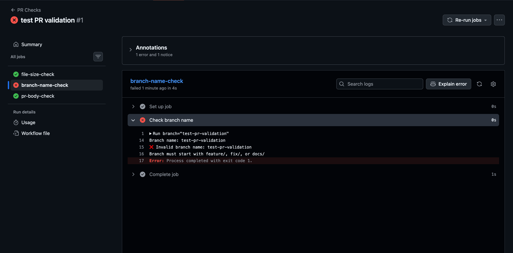
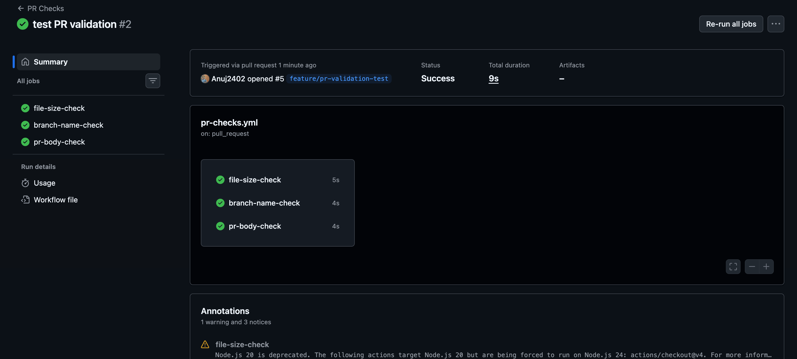

# Task 1: Pull Request Event Types

This Task is about learning the **PR lifecycle** and how GitHub Actions eacts to different PR events.

### Step 1 — Create the workflow
Create:
```
.github/workflows/pr-lifecycle.yml
```
Start with this:
```YAML 
name: PR Lifecycle

on: 
  pull_request: 
    types: 
     - opened
     - synchronize 
     - reopened
     - closed 
```
#### What do these events mean?
| Event         | When it happens                          |
| ------------- | ---------------------------------------- |
| `opened`      | A new PR is created                      |
| `synchronize` | New commits are pushed to an existing PR |
| `reopened`    | A previously closed PR is reopened       |
| `closed`      | The PR is closed or merged               |

Notice that merged PRs also generate  `closed`. GitHub doesn't have a separate `merged` activity type.

That's why later we'll check:
```YAML 
github.event.pull_request.merged == true 
```
to distinguish:
```
closed + merged = true  → PR was merged
closed + merged = false → PR was simply closed
```
### Step 2 — Add the job
Under the trigger,  we will add:
```YAML 
jobs:
  pr-info: 
    runs-on: ubuntu-latest
    
    
    steps: 
      - name: Show PR information
        run: | 
        echo "Event type: ${{ github.event.action }}
        echo "PR title: ${{ github.event.pull_request.title }}
        echo "Source branch: ${{ github.event.pull_request.head.ref }}"
        echo "Target branch: ${{ github.event.pull_request.base.ref }}"
```
so far our complete file should be : 
```YAML 
name: PR Lifecycle

on:
  pull_request:
    types:
      - opened
      - synchronize
      - reopened
      - closed

jobs:
  pr-info:
    runs-on: ubuntu-latest

    steps:
      - name: Show PR information
        run: |
          echo "Event type: ${{ github.event.action }}"
          echo "PR title: ${{ github.event.pull_request.title }}"
          echo "PR author: ${{ github.event.pull_request.user.login }}"
          echo "Source branch: ${{ github.event.pull_request.head.ref }}"
          echo "Target branch: ${{ github.event.pull_request.base.ref }}"
```

Now let's add the merged-only condition.

### Step 2 — Add this step
under our existing `Show PR information` step, add:
```YAML 
- name: PR was merged
    if: github.event.action == 'closed' && github.event.pull_request.merged == true
    run: echo "This PR was merged successfully!"
```
our complete workflow should now be:
```YAML 
name: PR Lifecycle

on:
  pull_request:
    types:
      - opened
      - synchronize
      - reopened
      - closed

jobs:
  pr-info:
    runs-on: ubuntu-latest

    steps:
      - name: Show PR information
        run: |
          echo "Event type: ${{ github.event.action }}"
          echo "PR title: ${{ github.event.pull_request.title }}"
          echo "PR author: ${{ github.event.pull_request.user.login }}"
          echo "Source branch: ${{ github.event.pull_request.head.ref }}"
          echo "Target branch: ${{ github.event.pull_request.base.ref }}"

      - name: PR was merged
        if: github.event.action == 'closed' && github.event.pull_request.merged == true
        run: echo "This PR was merged successfully!"
```
#### Understand the condition
This part: 
```YAML
if: github.event.action == 'closed'
```
means the PR must be **closed.**

And:
```YAML 
github.event.pull_request.merged == true
```
means it must have been **merged**, not simply closed.
      
So:
```
PR opened
   ↓
merged step ❌

PR updated
   ↓
merged step ❌

PR reopened
   ↓
merged step ❌

PR closed without merge
   ↓
merged step ❌

PR merged
   ↓
merged step ✅
```
#### Now commit and push the workflow
```bash 
git add .github/workflows/pr-lifecycle.yml
git commit -m "Add PR lifecycle workflow"
git push
```

### Now let's test it properly

### Step 1 — Create a test branch
```bash 
git checkout -b test-pr-lifecycle
```
Then make a small change, for example:
```bash 
echo "PR lifecycle test" >> README.md
```
Commit it:
```bash 
git add README.md
git commit -m "Test PR lifecycle"
```
Push the branch:
```bash 
git push -u origin test-pr-lifecycle
```
Important: The push itself still won't `trigger pr-lifecycle.yml`.

### Step 2 — Create a Pull Request
Go to GitHub → your repository → Pull requests → New pull request.

Select:
```
base:   main
compare: test-pr-lifecycle
```
Create the PR.
Now the `opened` event should trigger the workflow. 🟢

OUTPUT: 


Perfect! ✅ The **opened event worked exactly as expected.

our screenshot shows:
```
Event type: opened
PR title: Test PR lifecycle
PR author: Anuj2402
Source branch: test-pr-lifecycle
Target branch: main
```
And importantly:
```
PR was merged
```
was skipped ⏭️ — that's correct because the PR has only been opened, not merged.

#### Now test the next event: `synchronize`

Don't merge the PR yet.

Make another small change on our `test-pr-lifecycle` branch:

```bash 
echo "Testing synchronize event" >> README.md
git add README.md
git commit -m "Test PR synchronize"
git push
```
Because we're pushing a new commit to an existing PR, GitHub should trigger:
```
Event type: synchronize
```
OUTPUT:


Perfect! ✅ The `synchronize` event worked.

our screenshot shows:
```
Event type: synchronize
PR title: Test PR lifecycle
PR author: Anuj2402
Source branch: test-pr-lifecycle
Target branch: main
```
And the PR was merged step is correctly skipped because this PR hasn't been merged yet.

So far we've verified:
```
PR created
   ↓
opened       ✅

New commit pushed to PR
   ↓
synchronize  ✅
```

#### Next: test `closed`

Now go to the PR on GitHub and merge it.
When you merge it, the workflow should trigger again with:
```
Event type: closed
```
And because the PR was actually merged:
```
github.event.pull_request.merged == true
```
the final step should run and print:
```
This PR was merged successfully!
```
OUTPUT: 

Perfect! ✅ Task 1 is fully verified.
our final screenshot confirms the `closed` event:
```
Event type: closed
PR title: Test PR lifecycle
PR author: Anuj2402
Source branch: test-pr-lifecycle
Target branch: main
```
And most importantly:
```
PR was merged
This PR was merged successfully!
```

# Task 2: PR Validation Workflow

This task is building a real PR gate: before a PR can be merged, GitHub Actions checks file size, branch naming, and PR description.

### Step 1 — Create `pr-checks.yml`
Create:
```YAML 
.github/workflows/pr-checks.yml
```
Start with trigger 
```YAML 
name: PR Checks

on:
  pull_request:
    branches:
      - main
```
This means:-> Run this workflow for PR activity targeting `main.`

Unlike our previous `pr-lifecycle.yml`, we aren't specifying `types`, so the workflow uses the default PR activity types.

### Step 2 — Add the first job
Now add the  `file-size-check` job:

```YAML
jobs:
  file-size-check:
    runs-on: ubuntu-latest

    steps:
      - name: Checkout code
        uses: actions/checkout@v4

      - name: Check file sizes
        run: |
          for file in $(git diff --name-only ${{ github.event.pull_request.base.sha }} ${{ github.event.pull_request.head.sha }}); do
            if [ -f "$file" ]; then
              size=$(stat -c%s "$file")

              if [ "$size" -gt 1048576 ]; then
                echo "❌ File is larger than 1 MB: $file"
                exit 1
              fi

              echo "✅ File size OK: $file"
            fi
          done
```

#### What this does
First, this gets the files changed by the PR:
```bash 
git diff --name-only base-sha head-sha
```
Then: 
```bash 
stat -c%s "$file"
```
gets the file size in bytes.

And 
```
1 MB = 1,048,576 bytes
```
So: 
```bash 
if [ "$size" -gt 1048576 ]
```
Means:-> If the file is larger than 1 MB, fail the job.

The important part is:
```bash 
exit 1
```
That makes the GitHub Actions job fail.

### Step 2 — Add `branch-name-check`

Now add this below the `file-size-check` job:

```YAML 
  branch-name-check:
    runs-on: ubuntu-latest

    steps:
      - name: Check branch name
        run: |
          branch="${{ github.head_ref }}"

          echo "Branch name: $branch"

          if [[ "$branch" == feature/* || "$branch" == fix/* || "$branch" == docs/* ]]; then
            echo "✅ Branch name is valid"
          else
            echo "❌ Invalid branch name: $branch"
            echo "Branch must start with feature/, fix/, or docs/"
            exit 1
          fi
```
### What we're checking
`github.head_ref` gives us the source branch of the PR.

For example:
```
feature/login       ✅
fix/database-error  ✅
docs/readme         ✅

test-branch         ❌
my-feature          ❌
bugfix/login        ❌
```
The important condition is:
```bash 
[[ "$branch" == feature/* || "$branch" == fix/* || "$branch" == docs/* ]]
```
If none match, `exit 1` makes the PR check fail.

So our workflow now has two independent jobs:
```
PR → file-size-check   ✅/❌
  ↘ branch-name-check  ✅/❌
  ```

### Step 3 — Add pr-body-check

Add this below `branch-name-check:`
```YAML
  pr-body-check:
    runs-on: ubuntu-latest

    steps:
      - name: Check PR description
        run: |
          if [ -z "${{ github.event.pull_request.body }}" ]; then
            echo "⚠️ Warning: PR description is empty"
          else
            echo "✅ PR description is present"
          fi
```
#### Why no `exit 1`?
The task says the empty description should warn but not fail.

So:
```
PR body exists
     ↓
✅ PR description is present
```
Empty:
```
PR body empty
     ↓
⚠️ Warning
     ↓
Job still succeeds ✅
```
our complete workflow will now be
```YAML
name: PR Checks

on:
  pull_request:
    branches:
      - main

jobs:
  file-size-check:
    runs-on: ubuntu-latest

    steps:
      - name: Checkout code
        uses: actions/checkout@v4

      - name: Check file sizes
        run: |
          for file in $(git diff --name-only ${{ github.event.pull_request.base.sha }} ${{ github.event.pull_request.head.sha }}); do
            if [ -f "$file" ]; then
              size=$(stat -c%s "$file")

              if [ "$size" -gt 1048576 ]; then
                echo "❌ File is larger than 1 MB: $file"
                exit 1
              fi

              echo "✅ File size OK: $file"
            fi
          done

  branch-name-check:
    runs-on: ubuntu-latest

    steps:
      - name: Check branch name
        run: |
          branch="${{ github.head_ref }}"

          echo "Branch name: $branch"

          if [[ "$branch" == feature/* || "$branch" == fix/* || "$branch" == docs/* ]]; then
            echo "✅ Branch name is valid"
          else
            echo "❌ Invalid branch name: $branch"
            echo "Branch must start with feature/, fix/, or docs/"
            exit 1
          fi

  pr-body-check:
    runs-on: ubuntu-latest

    steps:
      - name: Check PR description
        run: |
          if [ -z "${{ github.event.pull_request.body }}" ]; then
            echo "⚠️ Warning: PR description is empty"
          else
            echo "✅ PR description is present"
          fi
```

#### Next step — test the branch-name check

We want to intentionally create a bad branch name and verify that the workflow fails.

Run these commands one at a time:
```bash 
git checkout -b test-pr-validation
```
Then make a small change, for example:
```bash 
echo "PR validation test" >> validation-test.txt
```
Then:
```bash 
git add .
git commit -m "test PR validation"
git push -u origin test-pr-validation
```
Now open a PR:
`test-pr-validation` → `main`

OUTPUT: 


Now let's test the valid branch-name case.
OUTPUT: 

