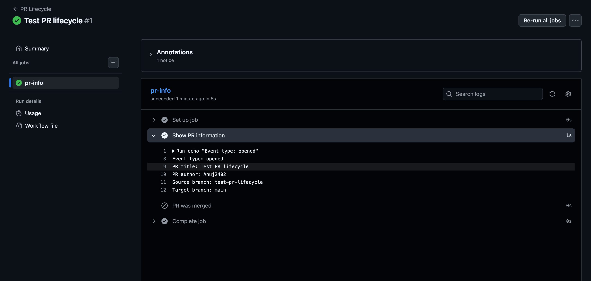
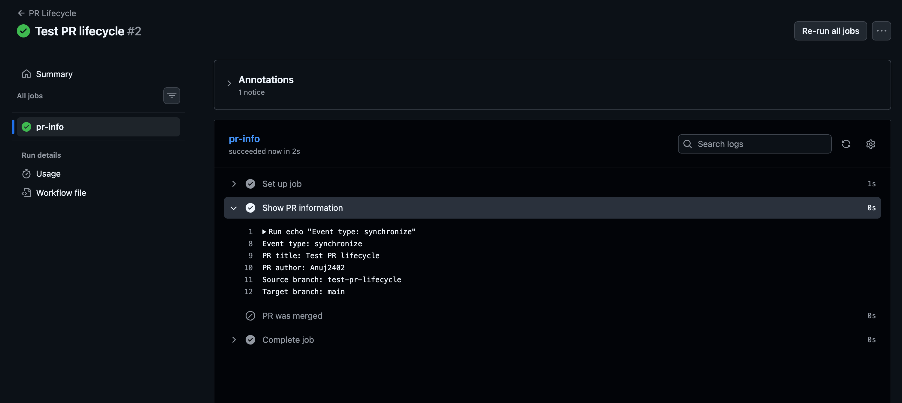
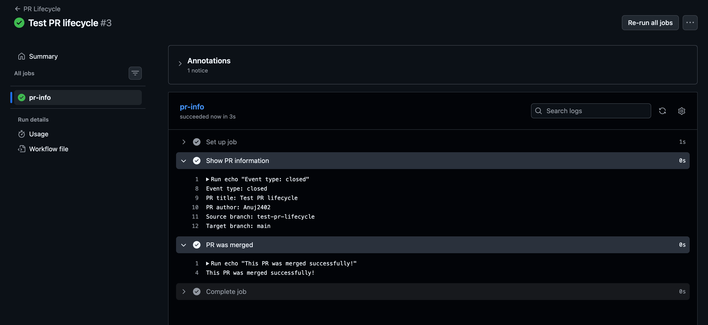
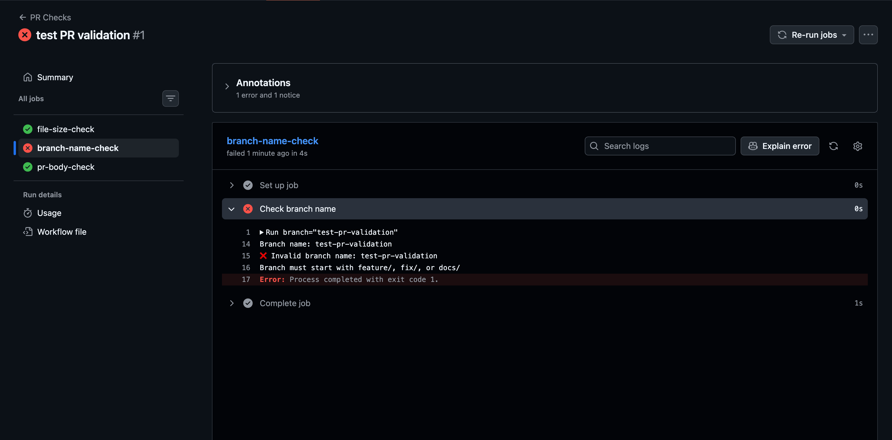
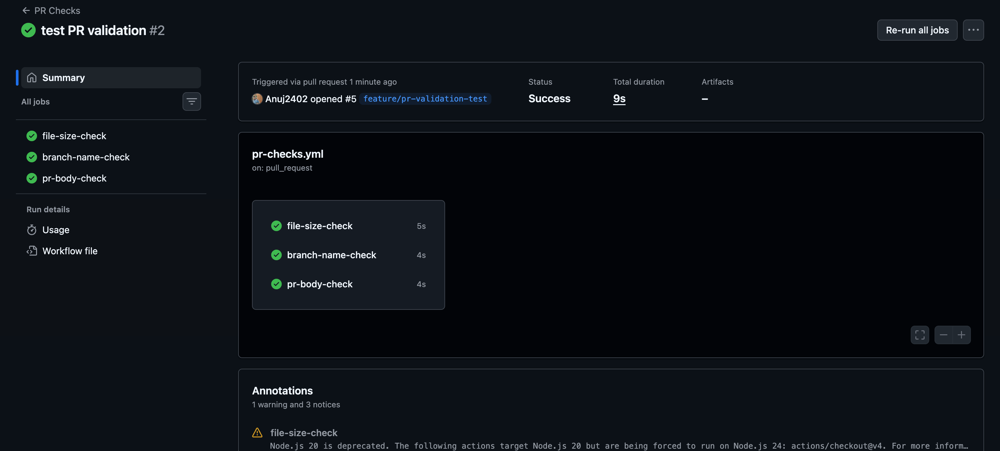
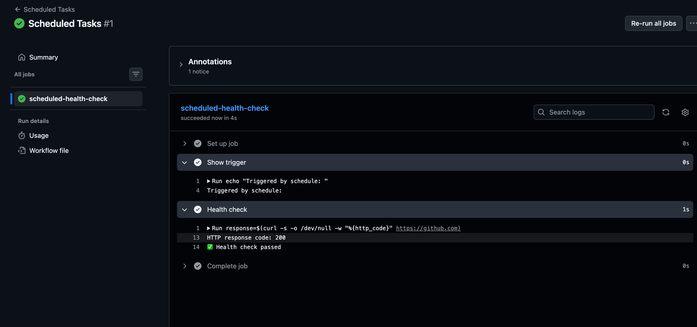
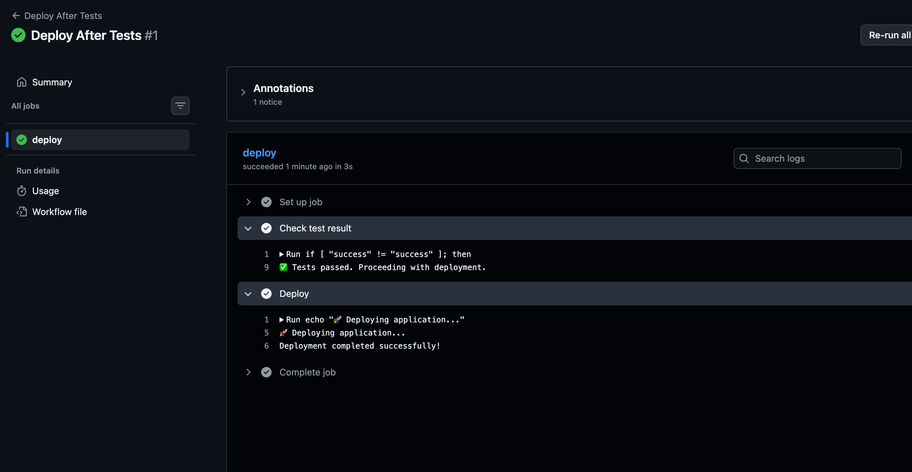
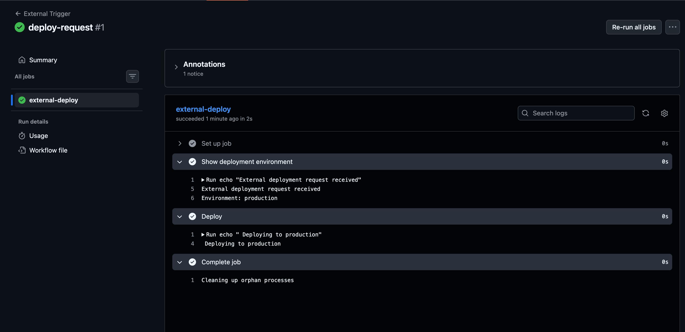

# Task 1: Pull Request Event Types

This Task is about learning the **PR lifecycle** and how GitHub Actions eacts to different PR events.

### Step 1 — Create the workflow
Create:
```
.github/workflows/pr-lifecycle.yml
```
Start with this:
```YAML 
name: PR Lifecycle

on: 
  pull_request: 
    types: 
     - opened
     - synchronize 
     - reopened
     - closed 
```
#### What do these events mean?
| Event         | When it happens                          |
| ------------- | ---------------------------------------- |
| `opened`      | A new PR is created                      |
| `synchronize` | New commits are pushed to an existing PR |
| `reopened`    | A previously closed PR is reopened       |
| `closed`      | The PR is closed or merged               |

Notice that merged PRs also generate  `closed`. GitHub doesn't have a separate `merged` activity type.

That's why later we'll check:
```YAML 
github.event.pull_request.merged == true 
```
to distinguish:
```
closed + merged = true  → PR was merged
closed + merged = false → PR was simply closed
```
### Step 2 — Add the job
Under the trigger,  we will add:
```YAML 
jobs:
  pr-info: 
    runs-on: ubuntu-latest
    
    
    steps: 
      - name: Show PR information
        run: | 
        echo "Event type: ${{ github.event.action }}
        echo "PR title: ${{ github.event.pull_request.title }}
        echo "Source branch: ${{ github.event.pull_request.head.ref }}"
        echo "Target branch: ${{ github.event.pull_request.base.ref }}"
```
so far our complete file should be : 
```YAML 
name: PR Lifecycle

on:
  pull_request:
    types:
      - opened
      - synchronize
      - reopened
      - closed

jobs:
  pr-info:
    runs-on: ubuntu-latest

    steps:
      - name: Show PR information
        run: |
          echo "Event type: ${{ github.event.action }}"
          echo "PR title: ${{ github.event.pull_request.title }}"
          echo "PR author: ${{ github.event.pull_request.user.login }}"
          echo "Source branch: ${{ github.event.pull_request.head.ref }}"
          echo "Target branch: ${{ github.event.pull_request.base.ref }}"
```

Now let's add the merged-only condition.

### Step 2 — Add this step
under our existing `Show PR information` step, add:
```YAML 
- name: PR was merged
    if: github.event.action == 'closed' && github.event.pull_request.merged == true
    run: echo "This PR was merged successfully!"
```
our complete workflow should now be:
```YAML 
name: PR Lifecycle

on:
  pull_request:
    types:
      - opened
      - synchronize
      - reopened
      - closed

jobs:
  pr-info:
    runs-on: ubuntu-latest

    steps:
      - name: Show PR information
        run: |
          echo "Event type: ${{ github.event.action }}"
          echo "PR title: ${{ github.event.pull_request.title }}"
          echo "PR author: ${{ github.event.pull_request.user.login }}"
          echo "Source branch: ${{ github.event.pull_request.head.ref }}"
          echo "Target branch: ${{ github.event.pull_request.base.ref }}"

      - name: PR was merged
        if: github.event.action == 'closed' && github.event.pull_request.merged == true
        run: echo "This PR was merged successfully!"
```
#### Understand the condition
This part: 
```YAML
if: github.event.action == 'closed'
```
means the PR must be **closed.**

And:
```YAML 
github.event.pull_request.merged == true
```
means it must have been **merged**, not simply closed.
      
So:
```
PR opened
   ↓
merged step ❌

PR updated
   ↓
merged step ❌

PR reopened
   ↓
merged step ❌

PR closed without merge
   ↓
merged step ❌

PR merged
   ↓
merged step ✅
```
#### Now commit and push the workflow
```bash 
git add .github/workflows/pr-lifecycle.yml
git commit -m "Add PR lifecycle workflow"
git push
```

### Now let's test it properly

### Step 1 — Create a test branch
```bash 
git checkout -b test-pr-lifecycle
```
Then make a small change, for example:
```bash 
echo "PR lifecycle test" >> README.md
```
Commit it:
```bash 
git add README.md
git commit -m "Test PR lifecycle"
```
Push the branch:
```bash 
git push -u origin test-pr-lifecycle
```
Important: The push itself still won't `trigger pr-lifecycle.yml`.

### Step 2 — Create a Pull Request
Go to GitHub → your repository → Pull requests → New pull request.

Select:
```
base:   main
compare: test-pr-lifecycle
```
Create the PR.
Now the `opened` event should trigger the workflow. 🟢

OUTPUT: 


Perfect! ✅ The **opened event worked exactly as expected.

our screenshot shows:
```
Event type: opened
PR title: Test PR lifecycle
PR author: Anuj2402
Source branch: test-pr-lifecycle
Target branch: main
```
And importantly:
```
PR was merged
```
was skipped ⏭️ — that's correct because the PR has only been opened, not merged.

#### Now test the next event: `synchronize`

Don't merge the PR yet.

Make another small change on our `test-pr-lifecycle` branch:

```bash 
echo "Testing synchronize event" >> README.md
git add README.md
git commit -m "Test PR synchronize"
git push
```
Because we're pushing a new commit to an existing PR, GitHub should trigger:
```
Event type: synchronize
```
OUTPUT:


Perfect! ✅ The `synchronize` event worked.

our screenshot shows:
```
Event type: synchronize
PR title: Test PR lifecycle
PR author: Anuj2402
Source branch: test-pr-lifecycle
Target branch: main
```
And the PR was merged step is correctly skipped because this PR hasn't been merged yet.

So far we've verified:
```
PR created
   ↓
opened       ✅

New commit pushed to PR
   ↓
synchronize  ✅
```

#### Next: test `closed`

Now go to the PR on GitHub and merge it.
When you merge it, the workflow should trigger again with:
```
Event type: closed
```
And because the PR was actually merged:
```
github.event.pull_request.merged == true
```
the final step should run and print:
```
This PR was merged successfully!
```
OUTPUT: 

Perfect! ✅ Task 1 is fully verified.
our final screenshot confirms the `closed` event:
```
Event type: closed
PR title: Test PR lifecycle
PR author: Anuj2402
Source branch: test-pr-lifecycle
Target branch: main
```
And most importantly:
```
PR was merged
This PR was merged successfully!
```

# Task 2: PR Validation Workflow

This task is building a real PR gate: before a PR can be merged, GitHub Actions checks file size, branch naming, and PR description.

### Step 1 — Create `pr-checks.yml`
Create:
```YAML 
.github/workflows/pr-checks.yml
```
Start with trigger 
```YAML 
name: PR Checks

on:
  pull_request:
    branches:
      - main
```
This means:-> Run this workflow for PR activity targeting `main.`

Unlike our previous `pr-lifecycle.yml`, we aren't specifying `types`, so the workflow uses the default PR activity types.

### Step 2 — Add the first job
Now add the  `file-size-check` job:

```YAML
jobs:
  file-size-check:
    runs-on: ubuntu-latest

    steps:
      - name: Checkout code
        uses: actions/checkout@v4

      - name: Check file sizes
        run: |
          for file in $(git diff --name-only ${{ github.event.pull_request.base.sha }} ${{ github.event.pull_request.head.sha }}); do
            if [ -f "$file" ]; then
              size=$(stat -c%s "$file")

              if [ "$size" -gt 1048576 ]; then
                echo "❌ File is larger than 1 MB: $file"
                exit 1
              fi

              echo "✅ File size OK: $file"
            fi
          done
```

#### What this does
First, this gets the files changed by the PR:
```bash 
git diff --name-only base-sha head-sha
```
Then: 
```bash 
stat -c%s "$file"
```
gets the file size in bytes.

And 
```
1 MB = 1,048,576 bytes
```
So: 
```bash 
if [ "$size" -gt 1048576 ]
```
Means:-> If the file is larger than 1 MB, fail the job.

The important part is:
```bash 
exit 1
```
That makes the GitHub Actions job fail.

### Step 2 — Add `branch-name-check`

Now add this below the `file-size-check` job:

```YAML 
  branch-name-check:
    runs-on: ubuntu-latest

    steps:
      - name: Check branch name
        run: |
          branch="${{ github.head_ref }}"

          echo "Branch name: $branch"

          if [[ "$branch" == feature/* || "$branch" == fix/* || "$branch" == docs/* ]]; then
            echo "✅ Branch name is valid"
          else
            echo "❌ Invalid branch name: $branch"
            echo "Branch must start with feature/, fix/, or docs/"
            exit 1
          fi
```
### What we're checking
`github.head_ref` gives us the source branch of the PR.

For example:
```
feature/login       ✅
fix/database-error  ✅
docs/readme         ✅

test-branch         ❌
my-feature          ❌
bugfix/login        ❌
```
The important condition is:
```bash 
[[ "$branch" == feature/* || "$branch" == fix/* || "$branch" == docs/* ]]
```
If none match, `exit 1` makes the PR check fail.

So our workflow now has two independent jobs:
```
PR → file-size-check   ✅/❌
  ↘ branch-name-check  ✅/❌
  ```

### Step 3 — Add pr-body-check

Add this below `branch-name-check:`
```YAML
  pr-body-check:
    runs-on: ubuntu-latest

    steps:
      - name: Check PR description
        run: |
          if [ -z "${{ github.event.pull_request.body }}" ]; then
            echo "⚠️ Warning: PR description is empty"
          else
            echo "✅ PR description is present"
          fi
```
#### Why no `exit 1`?
The task says the empty description should warn but not fail.

So:
```
PR body exists
     ↓
✅ PR description is present
```
Empty:
```
PR body empty
     ↓
⚠️ Warning
     ↓
Job still succeeds ✅
```
our complete workflow will now be
```YAML
name: PR Checks

on:
  pull_request:
    branches:
      - main

jobs:
  file-size-check:
    runs-on: ubuntu-latest

    steps:
      - name: Checkout code
        uses: actions/checkout@v4

      - name: Check file sizes
        run: |
          for file in $(git diff --name-only ${{ github.event.pull_request.base.sha }} ${{ github.event.pull_request.head.sha }}); do
            if [ -f "$file" ]; then
              size=$(stat -c%s "$file")

              if [ "$size" -gt 1048576 ]; then
                echo "❌ File is larger than 1 MB: $file"
                exit 1
              fi

              echo "✅ File size OK: $file"
            fi
          done

  branch-name-check:
    runs-on: ubuntu-latest

    steps:
      - name: Check branch name
        run: |
          branch="${{ github.head_ref }}"

          echo "Branch name: $branch"

          if [[ "$branch" == feature/* || "$branch" == fix/* || "$branch" == docs/* ]]; then
            echo "✅ Branch name is valid"
          else
            echo "❌ Invalid branch name: $branch"
            echo "Branch must start with feature/, fix/, or docs/"
            exit 1
          fi

  pr-body-check:
    runs-on: ubuntu-latest

    steps:
      - name: Check PR description
        run: |
          if [ -z "${{ github.event.pull_request.body }}" ]; then
            echo "⚠️ Warning: PR description is empty"
          else
            echo "✅ PR description is present"
          fi
```

#### Next step — test the branch-name check

We want to intentionally create a bad branch name and verify that the workflow fails.

Run these commands one at a time:
```bash 
git checkout -b test-pr-validation
```
Then make a small change, for example:
```bash 
echo "PR validation test" >> validation-test.txt
```
Then:
```bash 
git add .
git commit -m "test PR validation"
git push -u origin test-pr-validation
```
Now open a PR:
`test-pr-validation` → `main`

OUTPUT: 


Now let's test the valid branch-name case.
OUTPUT: 



# Task 3: Scheduled Workflows (Cron Deep Dive)
### Step 1 — Create the workflow
Create: 
```
.github/workflows/scheduled-tasks.yml
```
Use this YAML 
```YAML 
name: Scheduled Tasks

on:
  schedule:
    - cron: '30 2 * * 1'
    - cron: '0 */6 * * *'
  workflow_dispatch:

jobs:
  scheduled-health-check:
    runs-on: ubuntu-latest

    steps:
      - name: Show trigger
        run: |
          echo "Triggered by schedule: ${{ github.event.schedule }}"

      - name: Health check
        run: |
          response=$(curl -s -o /dev/null -w "%{http_code}" https://github.com)

          echo "HTTP response code: $response"

          if [ "$response" -ne 200 ]; then
            echo "❌ Health check failed"
            exit 1
          fi

          echo "✅ Health check passed"
```
#### What the Two CRON entries Means: 
```
* * * * *
│ │ │ │ │
│ │ │ │ └── Day of week (0-7)
│ │ │ └──── Month (1-12)
│ │ └────── Day of month (1-31)
│ └──────── Hour (0-23)
└────────── Minute (0-59)

```
```
30 2 * * 1
```
- Every **Monday at 02:30 UTC**
```
0 */6 * * *
```
- Every **6 hours:** 00:00, 06:00, 12:00, 18:00 UTC.

And 
```YAML 
workflow_dispatch: 
```
allows us to run it manually from GitHub instead of waiting for cron.

OUR NOTES: 

**Every weekday at 9:00 AM IST:**
```
30 3 * * 1-5
```
- Because IST = UTC + 5:30, so 9:00 AM IST = 3:30 AM UTC.


**First day of every month at midnight UTC:**

```
0 0 1 * *
```
GitHub notes that scheduled workflows can be delayed or skipped when repositories are inactive because scheduled workflows are intended for repositories with activity; GitHub may disable scheduled workflows in repositories with no activity for a prolonged period.

### Step 2 — Commit and push the workflow
```bash 
git add .github/workflows/scheduled-tasks.yml
git commit -m "add scheduled health check workflow"
git push
```
OUTPUT: 


# Task 4: Path & Branch Filters
This Task Ask for **two workflows** because `paths` and `paths-ignore` are different triggers rules.

### Step 1 — Create the first workflow
Create: 
```
.github/workflows/smart-triggers.yml
```
Add: 
```YAML 
name: Smart Triggers

on:
  push:
    branches:
      - main
      - 'release/*'
    paths:
      - 'src/**'
      - 'app/**'

jobs:
  smart-trigger-test:
    runs-on: ubuntu-latest

    steps:
      - name: Show trigger
        run: |
          echo "Workflow triggered!"
          echo "Branch: ${{ github.ref_name }}"
```
#### What this means:
The workflow runs only when both conditions are satisfied:

Branch:
```
main
release/*
```
AND changed files include:
```
src/**
app/**
```
For example:
| Change         | Branch         | Runs? |
| -------------- | -------------- | ----- |
| `src/app.py`   | `main`         | ✅     |
| `app/index.js` | `release/v1`   | ✅     |
| `README.md`    | `main`         | ❌     |
| `src/app.py`   | `feature/test` | ❌     |

### Step 2 — Add the second workflow
Create:
```bash 

touch .github/workflows/docs-ignore.yml
```
ADD: 
```YAML
name: Docs Ignore Test

on:
  push:
    branches:
      - main
      - 'release/*'
    paths-ignore:
      - '*.md'
      - 'docs/**'

jobs:
  docs-ignore-test:
    runs-on: ubuntu-latest

    steps:
      - name: Show trigger
        run: |
          echo "Workflow triggered!"
          echo "Branch: ${{ github.ref_name }}"

```
What `paths-ignore `means
This workflow will NOT run when the push contains only:
```
README.md
CONTRIBUTING.md
docs/setup.md
docs/guide/example.md
```
But if the same push contains:
```
README.md
src/app.py
```
the workflow will run, because there is a `non-ignored` file change.

#### our notes
Use `paths` when:-> You want the workflow to run only for specific paths.

Use `paths-ignore` when:-> You want the workflow to run normally but skip changes to specific paths, such as documentation.

Also Commit and push Both the files: 

### Step 3 — Test with a Markdown-only change
Make a small change to a `.md` file, for example:
```bash 
echo "Testing path filters" >> README.md
```
Then run:
```bash 
git add README.md
git commit -m "test markdown path filters"
git push
```
After the push, go to GitHub → Actions.
Expected result

For this push to main:

Smart Triggers →should NOT run because README.md isn't under src/ or app/.
Docs Ignore Test → should NOT run because the change is only to README.md.

# Task 5: `workflow_run` — Chain Workflows Together
### Step 1 — Create `tests.yml`

Create: 
```bash 
touch .github/workflows/tests.yml
```
Add:
```YAML 
name: Run Tests

on:
  push:

jobs:
  test:
    runs-on: ubuntu-latest

    steps:
      - name: Checkout code
        uses: actions/checkout@v4

      - name: Run tests
        run: |
          echo "Running tests..."
          echo "All tests passed!"
```
#### Important
The workflow name must be exactly 
```
Run Tests 
```
because our second workflow will look for: 
```YAML 
workflows: ["Run Tests"]
```

### Step 2 — Create deploy-after-tests.yml
Create : 
```bash 
touch .github/workflows/deploy-after-tests.yml
```
Add: 
```YAML 
name: Deploy After Tests

on:
  workflow_run:
    workflows: ["Run Tests"]
    types: [completed]

jobs:
  deploy:
    runs-on: ubuntu-latest

    steps:
      - name: Check test result
        run: |
          if [ "${{ github.event.workflow_run.conclusion }}" != "success" ]; then
            echo "⚠️ Tests failed. Deployment will not proceed."
            exit 1
          fi

          echo "✅ Tests passed. Proceeding with deployment."

      - name: Deploy
        run: |
          echo "🚀 Deploying application..."
          echo "Deployment completed successfully!"
```
#### How the chain works
```
Push
  ↓
Run Tests
  ↓
Tests complete
  ↓
Deploy After Tests
  ↓
Check conclusion
  ↓
success → Deploy
failure → Stop
```
Notice that `workflow_run` fires when Run Tests completes, regardless of success/failure. Our `if` logic then decides whether deployment can proceed.

### Step 3 — Commit and push 

```bash 
git add .github/workflows/tests.yml .github/workflows/deploy-after-tests.yml
git commit -m "add workflow run deployment chain"
git push
```
After the push, go to GitHub → Actions.
OUTPUT: 


# Task 6: repository_dispatch — External Event Triggers.
### Step 1 — Create the workflow
Create:
```bash 
touch .github/workflows/external-trigger.yml
```
ADD: 
```YAML 
name: External Trigger

on:
  repository_dispatch:
    types:
      - deploy-request

jobs:
  external-deploy:
    runs-on: ubuntu-latest

    steps:
      - name: Show deployment environment
        run: |
          echo "External deployment request received"
          echo "Environment: ${{ github.event.client_payload.environment }}"

      - name: Deploy
        run: |
          echo "🚀 Deploying to ${{ github.event.client_payload.environment }}"
```
#### What is happening?
Normally GitHub Actions starts from events like:
```
push
pull_request
schedule
```
`repository_dispatch` allows an external system to tell GitHub:
-   "Hey GitHub, start this workflow."
The external system sends:
```
event_type = deploy-request
environment = production
```
Then our workflow receives it through:
```YAML 
${{ github.event.client_payload.environment }}
```
#### Real-world examples
An external system might trigger a pipeline when:
- A monitoring system detects a recovery and wants an automated action.
- A Slack/ChatOps bot receives an approved deployment command.
- An external release-management system approves a deployment.
- Another CI/CD platform finishes a prerequisite job.


### Step 2 — Commit the file
Run these commands one at a time:
```bash 
git add .github/workflows/external-trigger.yml
git commit -m "add external repository dispatch trigger"
git push
```
### Step 3 — Send the external event
Run this command in your terminal:
```bash 
gh api repos/Anuj2402/github-actions-practice/dispatches \
  -f event_type=deploy-request \
  -f client_payload='{"environment":"production"}'

  # To send it as a JSON object 

  gh api --method POST \
  repos/Anuj2402/github-actions-practice/dispatches \
  --input - <<'EOF'
{
  "event_type": "deploy-request",
  "client_payload": {
    "environment": "production"
  }
}
EOF

  ```
- Expected result: The command should return no output if the request succeeds (usually HTTP 204 No Content).

Then open GitHub → Actions → External Trigger.
we should see a new workflow run. Open it and check whether the logs show:

```
External deployment request received
Environment: production
Deploying to production
```

OUTPUT: 
