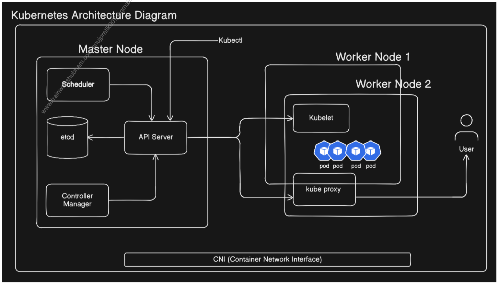

# Task 1: Recall the Kubernetes Story

#### Q1-> Why was Kubernetes created? What problem does it solve that Docker alone cannot?

Docker is excellent for building, packaging, and running containers, but Docker by itself is mainly focused on individual machines. Once you have many **containers across many machines**, you need something to handle:

- deploying multiple instances
- scheduling containers across machines
- service discovery and load balancing
- health checks and self-healing
- scaling
- rollouts and rollbacks

Kubernetes was created to solve that **large-scale container management problem**. Google's Kubernetes team explicitly described Docker as great for individual containers/machines, but not the complete solution for managing large numbers of containers across a fleet.

The official Kubernetes docs describe it as a platform for managing containerized workloads and services, with automation, scaling, failover, service discovery, load balancing, rollouts/rollbacks, and self-healing.

Interview answer:

- Docker helps us build and run containers, but when we have hundreds or thousands of containers distributed across multiple machines, we need a system to schedule, scale, monitor, heal, and expose those containers. Kubernetes provides that platform.

#### Q2-> Who created Kubernetes and what was it inspired by?

Kubernetes originated at **Google.**

It was strongly inspired by Google's internal Borg system, which Google had used for running containerized workloads at large scale. Kubernetes also incorporated ideas from Google's later **Omega** project.

The initial Kubernetes team included Joe Beda, Brendan Burns, Craig McLuckie, and others including Ville Aikas, Tim Hockin, Dawn Chen, Brian Grant, and Daniel Smith.

Kubernetes was open-sourced by Google in 2014
**Google → Borg/Omega experience → Kubernetes → open sourced in 2014**

#### Q3-> What does "Kubernetes" mean?
This one is straightforward:
**Kubernetes comes from Greek and means "helmsman" or "pilot."**

A **helmsman** is the person who steers a ship.

That's actually a nice way to remember the concept:
```
Containers = the workload
Kubernetes = the helmsman
Cluster = the ship
```
Kubernetes continuously works to move the cluster toward the desired state you declare

And K8s?
```
K + 8 letters + s
Kubernetes
   ↓
K  u b e r n e t e  s
   \____8 letters____/
 ```
Hence K8s.

our final memory version
**Docker → containers → scale problem → Kubernetes → Google → Borg/Omega → orchestration, scaling, self-healing → "helmsman"**

# Task 2: Draw the Kubernetes Architecture



#### Control Plane (Master Node):

- **API Server** — the front door to the cluster, every command goes through it
- **etcd** — the database that stores all cluster state
- **Scheduler** — decides which node a new pod should run on
- **Controller Manager** — watches the cluster and makes sure the desired state matches reality i.e Actual should be equal to Desired

#### Worker Node:

- **kubelet** — the agent on each node that talks to the API server and manages pods
- **kube-proxy** — handles networking rules so pods can communicate
Container Runtime — the engine that actually runs containers (containerd, CRI-O)

#### After drawing, verify your understanding:

Q1-> What happens when you run `kubectl apply -f pod.yaml`? Trace the request through each component.

- When I run `kubectl apply -f pod.yaml`, `kubectl` sends the request to the `API Server`. The `API Server` validates the request and persists the cluster state in `etcd`. The `Scheduler` watches for Pods that don't have a node assigned and selects a suitable` worker node`. The `API Server` records that assignment. The `kubelet` on the selected `worker node` then sees the Pod specification and instructs the container runtime to pull the image if necessary and start the container


Q2-> What happens if the API Server goes down?

- If the API Server goes down, new Kubernetes API requests such as `kubectl` commands cannot be processed. Existing Pods generally continue running because kubelet and the container runtime operate on the worker nodes. However, cluster management operations such as scheduling new Pods and normal control-plane reconciliation are affected until the API Server becomes available again.

Q3-> What happens if a worker node goes down?

Explain:
- What happens to the Pods running on that node?
- What happens to the rest of the cluster?
- How does Kubernetes recover the workload?

If a Worker Node goes down
Suppose 
```
Worker-1 ❌
   ├── Pod A
   └── Pod B

Worker-2 ✅
Worker-3 ✅
```

i. What happens to the Pods?
- The Pods running on Worker-1 become unavailable, because the node that was running them is down.

ii. What happens to the rest of the cluster?
- The control plane and other healthy worker nodes can continue operating.

- So a single worker failure does not automatically mean the entire Kubernetes cluster is down.

iii. How does Kubernetes recover?
- This depends on whether those Pods are managed by a controller such as a **Deployment/ReplicaSet.**

For example:
```
Deployment
replicas: 3

        ↓

Worker-1 goes down
        ↓
Pods on Worker-1 become unavailable
        ↓
Controller detects desired state ≠ actual state
        ↓
Replacement Pod(s) are created
        ↓
Scheduler chooses available Worker node(s)
        ↓
kubelet + container runtime start them

```

Worker node failure affects the workloads running on that node, but the control plane and other healthy nodes can continue operating. Controllers can recreate managed Pods on available nodes to restore the desired state.

# Task 3: Install kubectl
`kubectl` is the CLI tool we will use to talk to your Kubernetes cluster.

Install it:
```
# macOS
brew install kubectl

# Linux (amd64)
curl -LO "https://dl.k8s.io/release/$(curl -L -s https://dl.k8s.io/release/stable.txt)/bin/linux/amd64/kubectl"
chmod +x kubectl
sudo mv kubectl /usr/local/bin/

# Windows (with chocolatey)
choco install kubernetes-cli
```
Verify:
```bash 
kubectl version --client
```
OUTPUT: 
```
anujrai@anujrai-mn4561 90DaysOfDevOps % kubectl version --client 
Client Version: v1.34.1
Kustomize Version: v5.7.1
anujrai@anujrai-mn4561 90DaysOfDevOps % 
```

# Task 4: Set Up Your Local Cluster

Choose one of the following. Both give you a fully functional Kubernetes cluster on your machine.

#### Option A: kind (Kubernetes in Docker)

```
# Install kind
# macOS
brew install kind

# Linux
curl -Lo ./kind https://kind.sigs.k8s.io/dl/latest/kind-linux-amd64
chmod +x ./kind
sudo mv ./kind /usr/local/bin/kind

# Create a cluster
kind create cluster --name devops-cluster

# Verify
kubectl cluster-info
kubectl get nodes
```

#### Option B: minikube

```
# Install minikube
# macOS
brew install minikube

# Linux
curl -LO https://storage.googleapis.com/minikube/releases/latest/minikube-linux-amd64
sudo install minikube-linux-amd64 /usr/local/bin/minikube

# Start a cluster
minikube start

# Verify
kubectl cluster-info
kubectl get nodes
```
##### Q-> Write down: Which one did you choose and why?

- I chose **Option A: kind (Kubernetes in Docker)** because it allows me to create and manage a local Kubernetes cluster using Docker containers as nodes. It supports multiple worker nodes, making it useful for practicing Kubernetes architecture, Deployments, Services, networking, scaling, and troubleshooting. Since I already have a multi-node kind cluster running locally, I can continue practicing hands-on without setting up a separate virtual machine.

# Task 5: Explore Your Cluster
Now that your cluster is running, explore it:

```
# See cluster info
kubectl cluster-info

# List all nodes
kubectl get nodes

# Get detailed info about your node
kubectl describe node <node-name>

# List all namespaces
kubectl get namespaces

# See ALL pods running in the cluster (across all namespaces)
kubectl get pods -A
```

Look at the pods running in the `kube-system` namespace:
```bash 
kubectl get pods -n kube-system
```
OUTPUT: 
```bash 
anujrai@anujrai-mn4561 90DaysOfDevOps % kubectl get pods -n kube-system
NAME                                                         READY   STATUS    RESTARTS   AGE
coredns-7d764666f9-9n6vb                                     1/1     Running   0          12d
coredns-7d764666f9-c2fqn                                     1/1     Running   0          12d
etcd-k8s-practice-cluster-control-plane                      1/1     Running   0          12d
kindnet-94vhm                                                1/1     Running   0          12d
kindnet-mmhh8                                                1/1     Running   0          12d
kindnet-pz9zx                                                1/1     Running   0          12d
kindnet-wn9p4                                                1/1     Running   0          12d
kube-apiserver-k8s-practice-cluster-control-plane            1/1     Running   0          12d
kube-controller-manager-k8s-practice-cluster-control-plane   1/1     Running   0          12d
kube-proxy-48wwv                                             1/1     Running   0          12d
kube-proxy-dqvwh                                             1/1     Running   0          12d
kube-proxy-rn9lz                                             1/1     Running   0          12d
kube-proxy-tsvx4                                             1/1     Running   0          12d
kube-scheduler-k8s-practice-cluster-control-plane            1/1     Running   0          12d
anujrai@anujrai-mn4561 90DaysOfDevOps % 
```

we can  see pods like `etcd`, `kube-apiserver`, `kube-scheduler`, `kube-controller-manager`, `coredns`, and `kube-proxy`. These are the architecture components we drew in Task 2 — running as pods inside the cluster.

#### Verify: Can you match each running pod in kube-system to a component in your architecture diagram?


| Pod Name                    | Architecture Component         | Purpose                                                     |
| --------------------------- | ------------------------------ | ----------------------------------------------------------- |
| `kube-apiserver-*`          | API Server                     | Entry point for Kubernetes API requests                     |
| `etcd-*`                    | etcd                           | Stores Kubernetes cluster state                             |
| `kube-scheduler-*`          | Scheduler                      | Selects a suitable worker node for unscheduled Pods         |
| `kube-controller-manager-*` | Controller Manager             | Runs controllers that reconcile desired and actual state    |
| `kube-proxy-*`              | kube-proxy                     | Manages network rules for Kubernetes Services               |
| `kindnet-*`                 | CNI / Cluster Networking       | Provides networking for Pods                                |
| `coredns-*`                 | CoreDNS                        | Provides DNS and service discovery inside the cluster       |
| Not listed as a Pod         | kubelet                        | Communicates with the API Server and manages Pods on a node |
| Not listed as a Pod         | Container Runtime (containerd) | Pulls images and runs containers                            |
